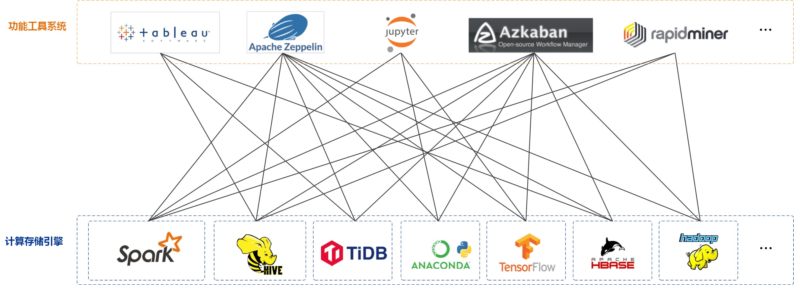
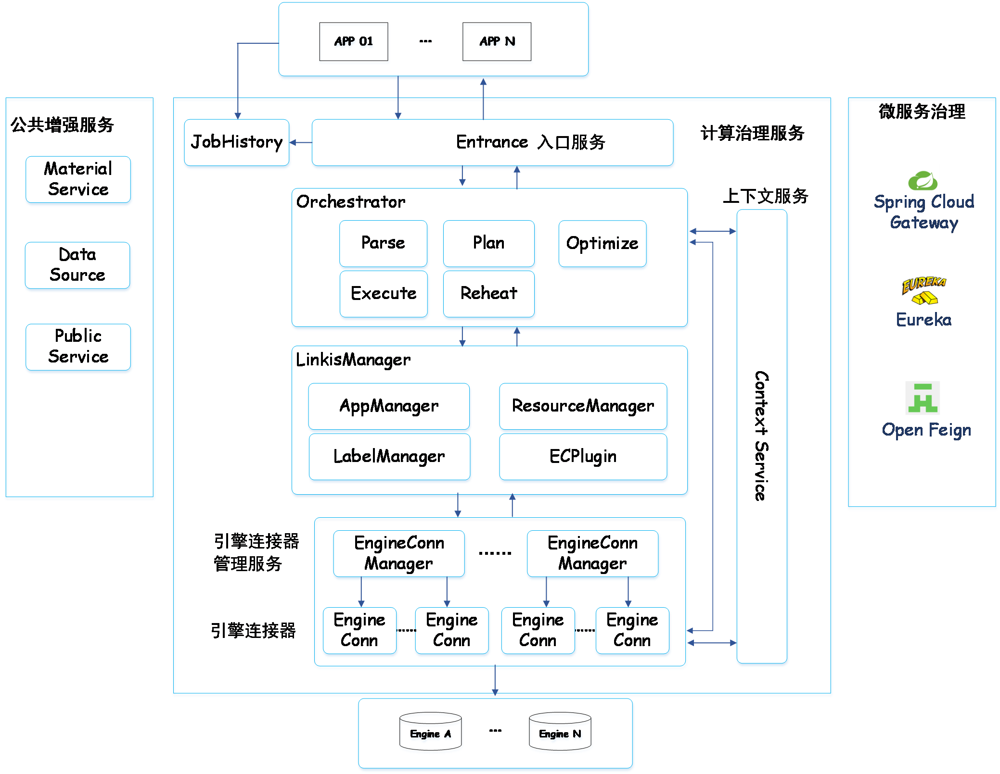

Linkis
============

[English](README.md) | 中文

# 引言：

Linkis 在上层应用和底层引擎之间构建了一层计算中间件，上层应用只需对接 Linkis 提供的 REST/WS/JDBC 等标准接口，就能连接到 MySQL/Spark/Hive/Presto/Flink 等各种底层计算存储引擎，并实现上层应用间的互通。

作为计算中间件，提供强大的连通，复用，扩展和管控能力。并通过解耦应用层和引擎层，简化复杂的网状调用关系，降低整体复杂度和开发、运维成本。

自2019年开源以来，累计试用企业近 **700** 家，沙箱试用用户 **1000+**，涉及 互联网、金融、通信等多个行业，被很多企业用作大数据平台底层计算存储引擎组件的统一入口。

没有 Linkis 之前如下：

有了 Linkis 之后如下：

 
 

基于Linkis计算中间件的架构设计理念，我们在上层构建了很多的应用系统。目前已开源的有：

- [**DataSphere Studio - 数据应用开发管理门户**](https://github.com/WeBankFinTech/DataSphereStudio)

- [**Qualitis - 数据质量工具**](https://github.com/WeBankFinTech/Qualitis)

- [**Scriptis - 数据研发IDE工具**](https://github.com/WeBankFinTech/Scriptis)

- [**Visualis - 数据可视化工具**](https://github.com/WeBankFinTech/Visualis)

- [**Schedulis - 工作流调度工具**](https://github.com/WeBankFinTech/Schedulis)

更多工具准备开源中，敬请期待！

----

# 核心特点：

- **丰富的底层计算存储引擎支持度**。

    **目前支持的计算存储引擎**有：Spark、Hive、Python、Presto、ElasticSearch、MLSQL、TiSpark、JDBC和Shell等。
    
    **正在支持中的计算存储引擎**有：Flink、Impala和Clickhouse等。

    **支持的脚本语言有**：SparkSQL、Scala、Pyspark、R、Python、JDBC、HiveQL和Shell等；

- **强大的计算治理能力**。Linkis 1.0 总体分为三大模块：公共增强服务、计算治理服务、微服务治理服务。三大模块简介如下：
    
    1. 公共增强服务为 Linkis 0.X 已经提供的物料库服务、上下文服务、数据源服务和公共服务等；
    
    2. 微服务治理服务为 Linkis 0.X 已经提供的Spring Cloud Gateway、Eureka和Open Feign，同时 Linkis1.0 还会提供对 Nacos 的支持；
    
    3. 计算治理服务是 Linkis 1.0 的核心重点，从 提交 —> 准备 —> 执行三个阶段，来全面升级Linkis 对 用户任务的执行管控能力。

- **全栈计算存储引擎架构支持**。作为计算中间件，将接收、执行和管理针对各种计算存储引擎的任务和请求，包括离线批量任务、交互式查询任务、实时流式任务和存储型任务，并提供强大的复用、预热、限流、切换、全生命周期管理等计算治理能力；

- **更强大的资源管理能力**。 ResourceManager 不仅具备 Linkis0.X 对 Yarn 和 Linkis EngineManager 的资源管理能力，还将提供基于标签的多级资源分配和回收能力，让 ResourceManager 具备跨集群、跨计算资源类型的强大资源管理能力。

- **全流程标签化**。基于多级组合标签，提供跨IDC、跨集群的计算任务路由管控能力，和EngineConnManager, EngineConn 的多租户隔离能力；

- **统一上下文服务**。统一用户和系统资源文件（JAR、ZIP、Properties等），跨用户、系统、计算引擎的参数和变量统一管理，一处设置，处处自动引用；

- **统一物料**。系统和用户级物料管理，可分享和流转，跨用户、系统共享物料，支持全生命周期自动管理；

----

# 文档列表

### Linkis1.0 常用文档

[**Linkis1.0 快速安装使用文档**](https://github.com/WeBankFinTech/Linkis/wiki/%E5%A6%82%E4%BD%95%E5%BF%AB%E9%80%9F%E5%AE%89%E8%A3%85%E4%BD%BF%E7%94%A8Linkis-1.0-RC1)

[**Linkis1.0 用户使用文档**](https://github.com/WeBankFinTech/Linkis/wiki/Linkis1.0%E7%94%A8%E6%88%B7%E4%BD%BF%E7%94%A8%E6%96%87%E6%A1%A3)

[**快速了解 Linkis1.0 全新架构**](https://github.com/WeBankFinTech/Linkis/wiki/Linkis1.0%E4%B8%8ELinkis0.X%E7%9A%84%E5%8C%BA%E5%88%AB%E7%AE%80%E8%BF%B0)

### Linkis0.X 常用文档

[Linkis0.X 快速安装使用文档](https://github.com/WeBankFinTech/Linkis/wiki/%E5%A6%82%E4%BD%95%E5%BF%AB%E9%80%9F%E5%AE%89%E8%A3%85%E4%BD%BF%E7%94%A8Linkis)

[Linkis0.X 上层前端应用的HTTP接入文档](https://github.com/WeBankFinTech/Linkis/wiki/%E4%B8%8A%E5%B1%82%E5%89%8D%E7%AB%AF%E5%BA%94%E7%94%A8HTTP%E6%8E%A5%E5%85%A5%E6%96%87%E6%A1%A3)

[Linkis0.X 上层前端应用的WebSocket接入文档](https://github.com/WeBankFinTech/Linkis/wiki/%E4%B8%8A%E5%B1%82%E5%89%8D%E7%AB%AF%E5%BA%94%E7%94%A8WebSocket%E6%8E%A5%E5%85%A5%E6%96%87%E6%A1%A3)

[Linkis0.X 架构文档](https://github.com/WeBankFinTech/Linkis/wiki/%E6%80%BB%E4%BD%93%E6%9E%B6%E6%9E%84%E8%AE%BE%E8%AE%A1%E4%BB%8B%E7%BB%8D)

**更多关于 Linkis1.0 和 Linkis0.X 的文档，请 [点我访问](https://github.com/WeBankFinTech/Linkis/wiki)**

----

# Architecture：

----

# RoadMap

### 1. 实现 Orchestrator 编排架构，提供丰富的计算策略支持

- 支持多活
- 支持主备
- 支持事务
- 支持重放
- 支持多数据源混算
- 支持多数据源异构

### 2. Linkis1.0 管理台优化

- 统一数据源模块优化
- UDF模块优化
- JobHistory优化，支持展示Orchestrator所有编排任务的详细Metrics信息。

### 3. Linkis1.0 支持Flink引擎，完成所有未适配引擎的新架构适配

- 适配 Presto 引擎
- 适配 ElasticSearch 引擎
- 适配 Impala 引擎

 

**如果您有任何需求，欢迎给我们提issue，我们将会及时给您回复。**

----

# Contributing

非常欢迎广大的社区伙伴给我们贡献新引擎和代码！

----

# Communication

如果您想得到最快的响应，请给我们提issue，或者您也可以扫码进群：

----

# License

**Linkis is under the Apache 2.0 license. See the [LICENSE](/LICENSE) file for details.**
