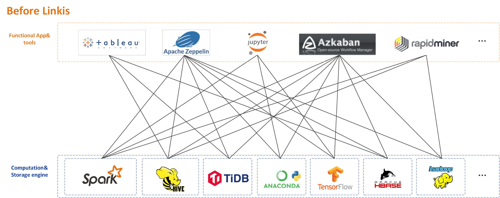
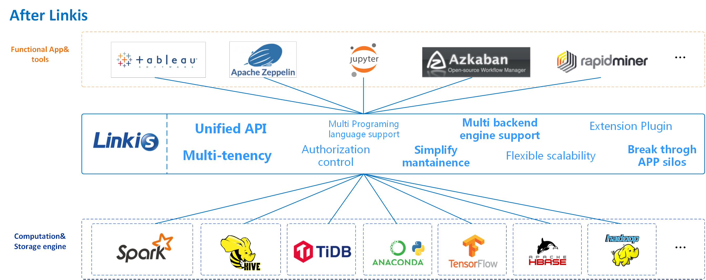
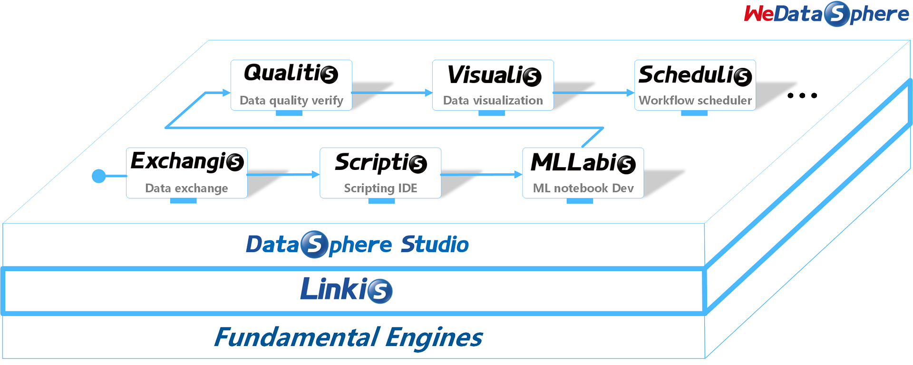

Linkis
==========

[English](README.md) | [中文](README_CN.md)

# Introduction

 Linkis builds a layer of computation middleware between upper applications and underlying engines. By using standard interfaces such as REST/WS/JDBC provided by Linkis, the upper applications can easily access the underlying engines such as MySQL/Spark/Hive/Presto/Flink, etc., and achieve the intercommunication of user resources like unified variables, scripts, UDFs, functions and resource files at the same time.

As a computation middleware, Linkis provides powerful connectivity, reuse, orchestration, expansion, and governance capabilities. By decoupling the application layer and the engine layer, it simplifies the complex network call relationship, and thus reduces the overall complexity and saves the development and maintenance costs as well.

Since the first release of Linkis in 2019, it has accumulated more than **700** trial companies and **1000+** sandbox trial users, which involving diverse industries, from finance, banking, tele-communication, to manufactory, internet companies and so on. Lots of companies have already used Linkis as a unified entrance for the underlying computation and storage engines of the big data platform.

# Features

- **Support for diverse underlying computation storage engines**.  
    Currently supported computation/storage engines: Spark, Hive, Python, Presto, ElasticSearch, MLSQL, TiSpark, JDBC, Shell, etc;      
    Computation/storage engines to be supported: Flink, Impala, etc;      
    Supported scripting languages: SparkSQL, HiveQL, Python, Shell, Pyspark, R, Scala and JDBC, etc.  
  
- **Powerful task/request governance capabilities**. With services such as Orchestrator, Label Manager and customized Spring Cloud Gateway, Linkis is able to provide multi-level labels based, cross-cluster/cross-IDC fine-grained routing, load balance, multi-tenancy, traffic control, resource control, and orchestration strategies like dual-active, active-standby, etc.  

- **Support full stack computation/storage engine**. As a computation middleware, it will receive, execute and manage tasks and requests for various computation storage engines, including batch tasks, interactive query tasks, real-time streaming tasks and storage tasks;

- **Resource management capabilities**.  ResourceManager is not only capable of managing resources for Yarn and Linkis EngineManger as in Linkis 0.X, but also able to provide label-based multi-level resource allocation and recycling, allowing itself to have powerful resource management capabilities across mutiple Yarn clusters and mutiple computation resource types;

- **Unified Context Service**. Generate Context ID for each task/request,  associate and manage user and system resource files (JAR, ZIP, Properties, etc.), result set, parameter variable, function, etc., across user, system, and computing engine. Set in one place, automatic reference everywhere;

- **Unified materials**. System and user-level unified material management, which can be shared and transferred across users and systems.

# Supported engine types

| **Engine** | **Supported Version** | **Linkis 0.X version requirement**| **Linkis 1.X version requirement** | **Description** |
|:---- |:---- |:---- |:---- |:---- |
|Flink |1.11.0|\>=dev-0.12.0, PR #703 not merged yet.|ongoing|	Flink EngineConn. Supports FlinkSQL code, and also supports Flink Jar to Linkis Manager to start a new Yarn application.|
|Impala|\>=3.2.0, CDH >=6.3.0"|\>=dev-0.12.0, PR #703 not merged yet.|ongoing|Impala EngineConn. Supports Impala SQL.|
|Presto|\>= 0.180|\>=0.11.0|ongoing|Presto EngineConn. Supports Presto SQL.|
|ElasticSearch|\>=6.0|\>=0.11.0|ongoing|ElasticSearch EngineConn. Supports SQL and DSL code.|
|Shell|Bash >=2.0|\>=0.9.3|\>=1.0.0_rc1|Shell EngineConn. Supports shell code.|
|MLSQL|\>=1.1.0|\>=0.9.1|ongoing|MLSQL EngineConn. Supports MLSQL code.|
|JDBC|MySQL >=5.0, Hive >=1.2.1|\>=0.9.0|\>=1.0.0_rc1|JDBC EngineConn. Supports MySQL and HiveQL code.|
|Spark|Apache 2.0.0~2.4.7, CDH >=5.4.0|\>=0.5.0|\>=1.0.0_rc1|Spark EngineConn. Supports SQL, Scala, Pyspark and R code.|
|Hive|Apache >=1.0.0, CDH >=5.4.0|\>=0.5.0|\>=1.0.0_rc1|Hive EngineConn. Supports HiveQL code.|
|Hadoop|Apache >=2.6.0, CDH >=5.4.0|\>=0.5.0|ongoing|Hadoop EngineConn. Supports Hadoop MR/YARN application.|
|Python|\>=2.6|\>=0.5.0|\>=1.0.0_rc1|Python EngineConn. Supports python code.|
|TiSpark|1.1|\>=0.5.0|ongoing|TiSpark EngineConn. Support querying TiDB data by SparkSQL.|

# Download

Please go to the [Linkis Releases Page](https://github.com/apache/incubator-linkis/releases) to download a compiled distribution or a source code package of Linkis.

# Compile and deploy
Please follow [Compile Guide](https://linkis.apache.org/docs/latest/development/linkis_compile_and_package) to compile Linkis from source code.  
Please refer to [Deployment Documents](https://linkis.apache.org/docs/latest/deployment/quick_deploy) to do the deployment.

# Examples and Guidance
You can find examples and guidance for how to use and manage Linkis in [User Manual](https://linkis.apache.org/docs/latest/user_guide/overview), [Engine Usage Documents](https://linkis.apache.org/docs/latest/engine_usage/overview) and [API Documents](https://linkis.apache.org/docs/latest/api/overview).

# Documentation

The documentation of linkis is in [Linkis-Website Git Repository](https://github.com/apache/incubator-linkis-website).

# Architecture
Linkis services could be divided into three categories: computation governance services, public enhancement services and microservice governance services.
- The computation governance services, support the 3 major stages of processing a task/request: submission -> preparation -> execution;
- The public enhancement services, including the material library service, context service, and data source service;
- The microservice governance services, including Spring Cloud Gateway, Eureka and Open Feign.

Below is the Linkis architecture diagram. You can find more detailed architecture docs in [Linkis-Doc/Architecture](https://linkis.apache.org/docs/latest/architecture/overview).

Based on Linkis the computation middleware, we've built a lot of applications and tools on top of it in the big data platform suite [WeDataSphere](https://github.com/WeBankFinTech/WeDataSphere). Below are the currently available open-source projects. More projects upcoming, please stay tuned.

# Contributing

Contributions are always welcomed, we need more contributors to build Linkis together. either code, or doc, or other supports that could help the community.  
For code and documentation contributions, please follow the [contribution guide](https://linkis.apache.org/community/how-to-contribute).

# Contact Us

Any questions or suggestions please kindly submit an issue.  
You can scan the QR code below to join our WeChat and QQ group to get more immediate response.

Meetup videos on [Bilibili](https://space.bilibili.com/598542776?from=search&seid=14344213924133040656).

# Who is Using Linkis

We opened [an issue](https://github.com/apache/incubator-linkis/issues/23) for users to feedback and record who is using Linkis.  
Since the first release of Linkis in 2019, it has accumulated more than **700** trial companies and **1000+** sandbox trial users, which involving diverse industries, from finance, banking, tele-communication, to manufactory, internet companies and so on.
