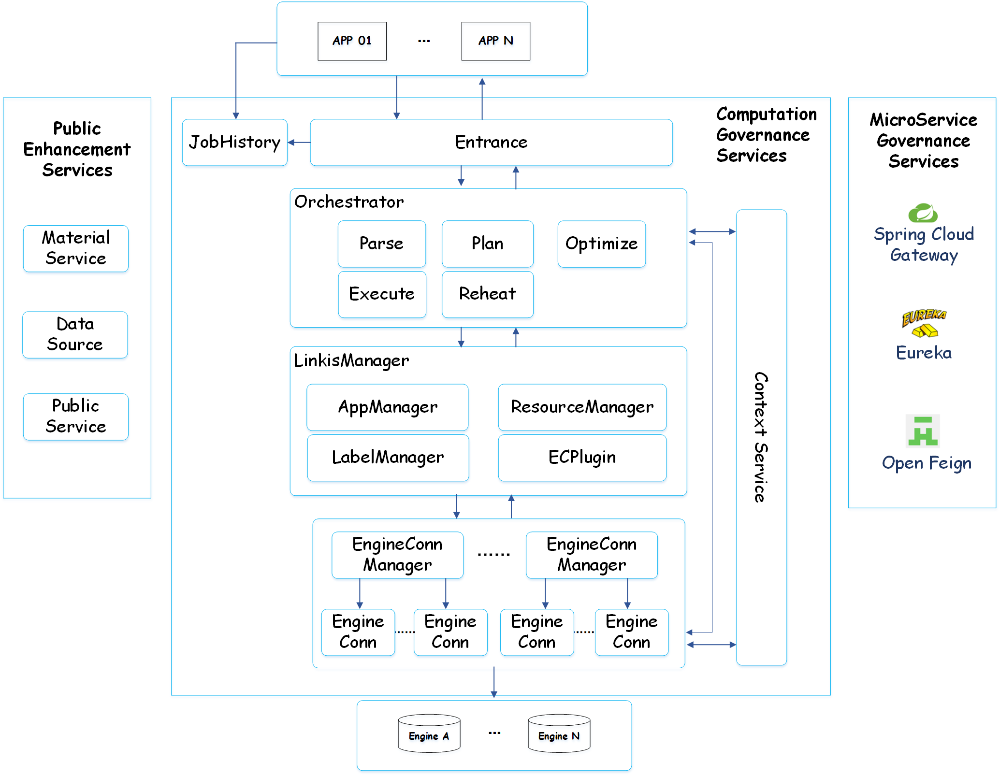

Linkis
============

English | [中文](README-ZH.md)

# Introduction

 Linkis builds a layer of computation middleware between upper applications and underlying engines. By using standard interfaces such as REST/WS/JDBC provided by Linkis, the upper applications can easily access the underlying engines such as MySQL/Spark/Hive/Presto/Flink, etc., and achieve the intercommunication of user resources like unified variables, scripts, UDFs, functions and resource files at the same time.

As a computation middleware, Linkis provides powerful connectivity, reuse, expansion, and computation governance capabilities. By decoupling the application layer and the engine layer, it simplifies the complex network call relationship, and thus reduces the overall complexity and saves the development and maintenance costs as well.

Since the first release of Linkis in 2019, it has accumulated more than **700** trial companies and **1000+** sandbox trial users, which involving diverse industries, from finance, banking, tele-communication, to manufactory, internet companies and so on. Lots of companies have already used Linkis as a unified entrance for the underlying computation and storage engines of the big data platform.

 
 

Based on Linkis the computation middleware, we've built a lot of applications and systems on top of it. The following are the currently available open-source projects: 

 - [**DataSphere Studio - Data Application Development & Management Framework**](https://github.com/WeBankFinTech/DataSphereStudio)

 - [**Qualitis - Data Quality Tool**](https://github.com/WeBankFinTech/Qualitis)

 - [**Scriptis - Data Development IDE Tool**](https://github.com/WeBankFinTech/Scriptis)

 - [**Visualis - Data Visualization Tool**](https://github.com/WeBankFinTech/Visualis)

 - [**Schedulis - Workflow Task Scheduling Tool**](https://github.com/WeBankFinTech/Schedulis)

More upcoming tools to release, please stay tuned!

# Features

- **Support for diverse underlying computation storage engines**.

    **Currently supported computation/storage engines**: Spark, Hive, Python, Presto, ElasticSearch, MLSQL, TiSpark, JDBC, Shell, etc;
    
    **Computation/storage engines to be supported**: Flink, Impala, Clickhouse, etc;
    
    **Supported script languages**: SparkSQL, Scala, Pyspark, R, Python, JDBC, HiveQL and Shell, etc.
  
- **Powerful computation governance capabilities**. Linkis 1.0 services could be divided into three categories: public enhancement services, computation governance services, and microservice governance services.
                                                    
    1. The public enhancement service including the material library service, context service, data source service and public services already provided by Linkis 0.X;
                                                    
    2. The microservice governance services including Spring Cloud Gateway, Eureka and Open Feign already provided by Linkis 0.X, with extra Nacos support which will be provided by Linkis 1.0;
                                                    
    3. The computation governance services. It could be divided into three stages: submission -> preparation -> execution, to comprehensively upgrade the ability of Linkis to execute, manage and control user tasks.

- **Support for full stack computation storage engine**. As a computation middleware, it will receive, execute and manage tasks and requests for various computation storage engines, including batch tasks, interactive query tasks, real-time streaming tasks and storage tasks, and provide powerful computation governance capabilities such as reuse, warm-up , current-limiting, engine-switching, and full life cycle management of engines;

- **More powerful resource management capabilities**.  ResourceManager is not only capable of managing resources for Yarn and Linkis EngineManger as in Linkis 0.X, but also extends its capabilities to providing tag-based multi-level resource allocation and recycling, allowing itself to have powerful resource management capabilities across mutiple Yarn clusters and mutiple computation resource types;

- **Whole-process label support**. Based on multi-level combined tags, Linkis 1.0 provides cross-IDC and cross-cluster computation task routing and control capabilities, and multi-tenant capabilities for EngineConnManager and EngineConn;

- **Unified Context Service**. Unified user and system resource files (JAR, ZIP, Properties, etc.), unified management of parameters and variables across users, systems and engines. Setting once, reference anywhere;

- **Unified materials**. System and user-level unified material management, which can be shared and transferred across users and systems, and support automatic management of the material life cycle.

# Documentations：

### Linkis 1.0 documentations

[**Linkis 1.0 Quick Deploy**](https://github.com/WeBankFinTech/Linkis/wiki/%E5%A6%82%E4%BD%95%E5%BF%AB%E9%80%9F%E5%AE%89%E8%A3%85%E4%BD%BF%E7%94%A8Linkis-1.0-RC1)

[**Linkis 1.0 User Documentation**](https://github.com/WeBankFinTech/Linkis/wiki/Linkis1.0%E7%94%A8%E6%88%B7%E4%BD%BF%E7%94%A8%E6%96%87%E6%A1%A3)

[**Quickly understand the new architecture of Linkis 1.0**](https://github.com/WeBankFinTech/Linkis/wiki/Linkis1.0%E4%B8%8ELinkis0.X%E7%9A%84%E5%8C%BA%E5%88%AB%E7%AE%80%E8%BF%B0)

### Linkis 0.X documentations

[Linkis, make big data easier](docs/en_US/ch3/Linkis_Introduction.md)

[Linkis Quick Deploy](docs/en_US/ch1/deploy.md)

[Linkis Quick Start & Java SDK documentation](docs/en_US/ch3/Linkis_Java_SDK_doc.md)

[HTTP APIs for frontend applications](docs/en_US/ch3/Linkis_HTTP_API_Doc.md)

[WebSocket APIs for frontend applications](docs/en_US/ch3/Linkis_WebSocket_API_Doc.md)

[How to adapt Linkis with a new computation or storage engine](docs/en_US/ch3/How_to_adapt_Linkis_with_a_new_computation_or_storage_engine.md)

----

# Architecture：

----

# RoadMap

### 1. Implement Orchestrator architecture and support for rich computation and orchestration strategies:

- Support multi-activation for engines and clusters
- Support active and standby
- Support transaction
- Support playback
- Support mixed computation of multiple data sources
- Support heterogeneous computation of multiple data sources

### 2. Linkis 1.0 management console optimization

- Unified data source module optimization
- UDF module optimization
- JobHistory is planned to support the display of detailed Metrics information of all orchestration tasks of one job in Orchestrator.

### 3. Linkis 1.0 supports Flink engine and completes the new architecture adaptation for all unadapted engines

- Optimize Presto engine for new architecture
- Optimize ElasticSearch engine for new architecture
- Optimize Impala engine for new architecture

 If you have any needs, please submit an issue, and we will reply to you in time.

# Contributing

 We welcome all community partners to contribute new computation storage engines and other codes to us!

# Communication

 If you desire immediate response, please kindly raise issues to us or scan the below QR code by WeChat and QQ to join our group:
 

# License

 Linkis is under the Apache 2.0 license. See the [LICENSE ](http://www.apache.org/licenses/LICENSE-2.0)file for details.
