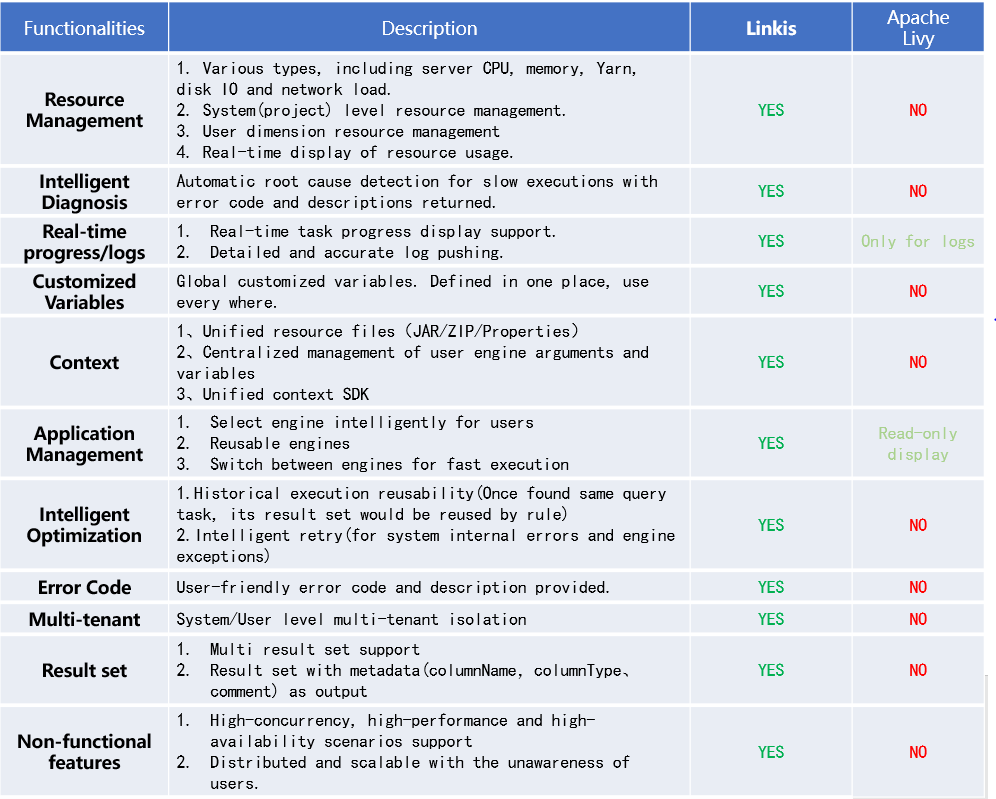
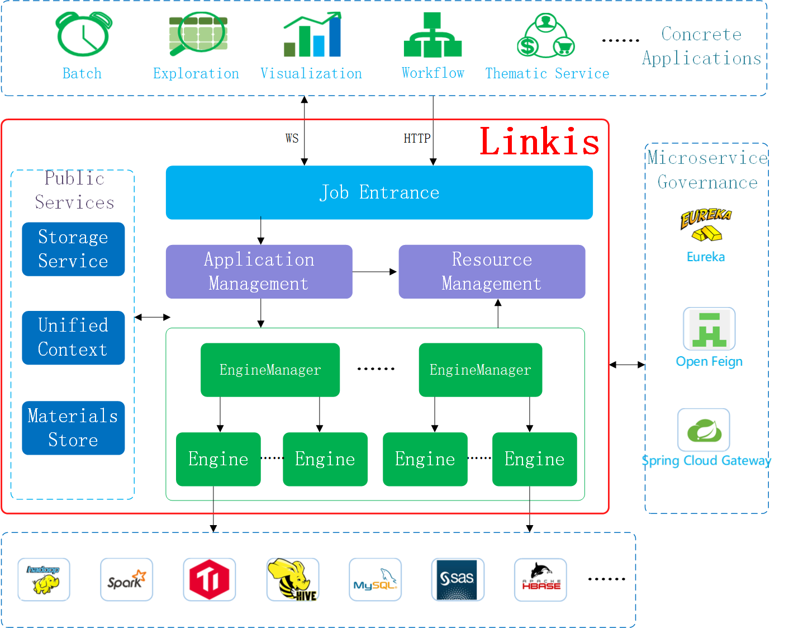

Linkis
============

English | [中文](docs/zh_CN/README.md)

## Introduction

Linkis helps easily connect to various back-end computation/storage engines(Spark, Python, TiDB...), exposes various interfaces(REST, JDBC, Java ...), with multi-tenancy, high performance, and resource control.

Linkis connects with computation/storage engines(Spark, Hive, Python and HBase), exposes REST/WS interface, and executes multi-language jobs(SQL, Pyspark, HiveQL and Scala), as a computation middleware.

Based on the microservices architecture, Linkis provides enterprise-level features of multi-tenant isolation, resource management and access control. It also offers convenient support to manage unified variables, UDFs, functions and resource files. it is also guaranteed with sophisticated task/job lifecycle management capabilities under high-concurrency, high-performance and high-availability scenarios.

 
 

Based on the concept of the computation middleware architecture of Linkis, we have built a large amount of applications and systems on top of it.Currently available open-source project: 
 - [**DataSphere Studio - Data Application Development& Management Portal**](https://github.com/WeBankFinTech/DataSphereStudio)
 - [**Qualitis - Data Quality Tool**](https://github.com/WeBankFinTech/Qualitis)
 - [**Scriptis - Data Development IDE Tool**](https://github.com/WeBankFinTech/Scriptis)
 - [**Visualis - Data Visualization Tool**](https://github.com/WeBankFinTech/Visualis)

 There will be more tools released as open-source projects, please stay tuned!

## Features

- Unified Job Execution Services: A distributed REST/WebSocket service for processing scripts execution requests from user.

  Available computation engines so far: Spark, Python, TiSpark, Hive and Shell.

  Available languages so far: SparkSQL, Spark Scala, PySpark, R, Python, HQL and Shell.

- Resource Management Services: Available for real-time control/limit of resource usage from both perspectives of amount and load for both systems and users. With dynamic charts of resource statistics, it is convenient to monitor and manage resource usage for systems and users.
  
	Available resource types so far: Yarn queue resources, server(CPU and memory), number of concurrent instances per user.

- Application Management Services: Manages global user applications, including offline batch applications, interactive query applications and real-time streaming applications. Also provides powerful reusability especially for offline and interactive applications, with complete lifecycle management which automatically releases idle applications for users.

- Unified Storage Services: The generic IO architecture can quickly integrate with various storage systems and provide a unified invokable entrance. It is also highly integrated with most common data formats and easy to use.

- Unified Context Services: Unite resources files of users and systems (JAR, ZIP, Properties). With unified management of arguments/variables for users, systems and engines, it is achieved that modification in random place will reflect in all the other places automatically.

- Material Library: System and user-level material management, capable of sharing, transferring materials and automatic lifecycle management. 

- Metadata Services: Real-time display of dataset table structure and partitions.

 **Compared with similar systems**

# Documentations：

[Linkis, make big data easier](docs/en_US/ch3/Linkis_Introduction.md)

[Linkis Quick Deploy](docs/en_US/ch1/deploy.md)

[Linkis Quick Start & Java SDK documentation](docs/en_US/ch3/Linkis_Java_SDK_doc.md)

[HTTP APIs for frontend applications](docs/en_US/ch3/Linkis_HTTP_API_Doc.md)

[WebSocket APIs for frontend applications](docs/en_US/ch3/Linkis_WebSocket_API_Doc.md)

[How to adapt Linkis with a new computation or storage engine](docs/en_US/ch3/How_to_adapt_Linkis_with_a_new_computation_or_storage_engine.md)

----

# Architecture：

----

## Communication
If you desire immediate response, please kindly raise issues to us or scan the below QR code by WeChat and QQ to join our group:
 

## License

Linkis is under the Apache 2.0 license. See the [LICENSE ](http://www.apache.org/licenses/LICENSE-2.0)file for details.

