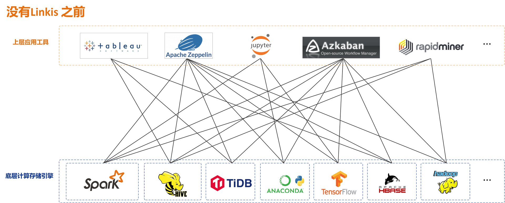
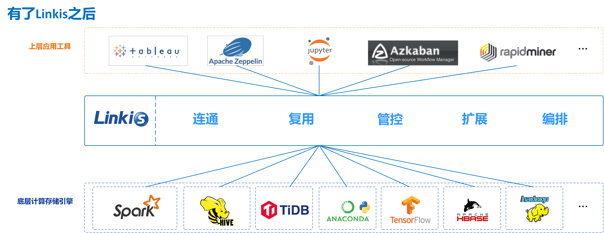

Linkis
============

[English](README.md) | [中文](README_CN.md)

# 介绍

Linkis 在上层应用程序和底层引擎之间构建了一层计算中间件。通过使用Linkis 提供的REST/WebSocket/JDBC 等标准接口，上层应用可以方便地连接访问MySQL/Spark/Hive/Presto/Flink 等底层引擎，同时实现变量、脚本、函数和资源文件等用户资源的跨上层应用互通。  
作为计算中间件，Linkis 提供了强大的连通、复用、编排、扩展和治理管控能力。通过计算中间件将应用层和引擎层解耦，简化了复杂的网络调用关系，降低了整体复杂度，同时节约了整体开发和维护成本。  
Linkis 自2019年开源发布以来，已累计积累了700多家试验企业和1000+沙盒试验用户，涉及金融、电信、制造、互联网等多个行业。许多公司已经将Linkis 作为大数据平台底层计算存储引擎的统一入口，和计算请求/任务的治理管控利器。

# 核心特点

- **丰富的底层计算存储引擎支持**。  
    **目前支持的计算存储引擎**：Spark、Hive、Python、Presto、ElasticSearch、MLSQL、TiSpark、JDBC和Shell等。  
    **正在支持中的计算存储引擎**：Flink、Impala等。  
    **支持的脚本语言**：SparkSQL, HiveQL, Python, Shell, Pyspark, R, Scala 和JDBC 等。    
- **强大的计算治理能力**。基于Orchestrator、Label Manager和定制的Spring Cloud Gateway等服务，Linkis能够提供基于多级标签的跨集群/跨IDC 细粒度路由、负载均衡、多租户、流量控制、资源控制和编排策略(如双活、主备等)支持能力。  
- **全栈计算存储引擎架构支持**。能够接收、执行和管理针对各种计算存储引擎的任务和请求，包括离线批量任务、交互式查询任务、实时流式任务和存储型任务；
- **资源管理能力**。 ResourceManager 不仅具备 Linkis0.X 对 Yarn 和 Linkis EngineManager 的资源管理能力，还将提供基于标签的多级资源分配和回收能力，让 ResourceManager 具备跨集群、跨计算资源类型的强大资源管理能力。
- **统一上下文服务**。为每个计算任务生成context id，跨用户、系统、计算引擎的关联管理用户和系统资源文件（JAR、ZIP、Properties等），结果集，参数变量，函数等，一处设置，处处自动引用；
- **统一物料**。系统和用户级物料管理，可分享和流转，跨用户、系统共享物料。

# 支持的引擎类型

| **引擎** | **引擎版本** | **Linkis 0.X 版本要求**| **Linkis 1.X 版本要求** | **说明** |
|:---- |:---- |:---- |:---- |:---- |
|Flink |1.11.0|\>=dev-0.12.0, PR #703 尚未合并|ongoing|	Flink EngineConn。支持FlinkSQL 代码，也支持以Flink Jar 形式启动一个新的Yarn 应用程序。|
|Impala|\>=3.2.0, CDH >=6.3.0"|\>=dev-0.12.0, PR #703 尚未合并|ongoing|Impala EngineConn. 支持Impala SQL 代码.|
|Presto|\>= 0.180|\>=0.11.0|ongoing|Presto EngineConn. 支持Presto SQL 代码.|
|ElasticSearch|\>=6.0|\>=0.11.0|ongoing|ElasticSearch EngineConn. 支持SQL 和DSL 代码.|
|Shell|Bash >=2.0|\>=0.9.3|\>=1.0.0_rc1|Shell EngineConn. 支持Bash shell 代码.|
|MLSQL|\>=1.1.0|\>=0.9.1|ongoing|MLSQL EngineConn. 支持MLSQL 代码.|
|JDBC|MySQL >=5.0, Hive >=1.2.1|\>=0.9.0|\>=1.0.0_rc1|JDBC EngineConn. 已支持MySQL 和HiveQL，可快速扩展支持其他有JDBC Driver 包的引擎, 如Oracle.
|Spark|Apache 2.0.0~2.4.7, CDH >=5.4.0|\>=0.5.0|\>=1.0.0_rc1|Spark EngineConn. 支持SQL, Scala, Pyspark 和R 代码.|
|Hive|Apache >=1.0.0, CDH >=5.4.0|\>=0.5.0|\>=1.0.0_rc1|Hive EngineConn. 支持HiveQL 代码.|
|Hadoop|Apache >=2.6.0, CDH >=5.4.0|\>=0.5.0|ongoing|Hadoop EngineConn. 支持Hadoop MR/YARN application.|
|Python|\>=2.6|\>=0.5.0|\>=1.0.0_rc1|Python EngineConn. 支持python 代码.|
|TiSpark|1.1|\>=0.5.0|ongoing|TiSpark EngineConn. 支持用SparkSQL 查询TiDB.|

# 下载

请前往[Linkis releases 页面](https://github.com/apache/incubator-linkis/releases) 下载Linkis 的已编译版本或源码包。

# 编译和安装部署
请参照[编译指引](https://linkis.apache.org/zh-CN/docs/latest/development/linkis_compile_and_package) 来编译Linkis 源码。  
请参考[安装部署文档](https://linkis.apache.org/zh-CN/docs/latest/deployment/quick_deploy) 来部署Linkis。

# 示例和使用指引
请到 [用户手册](https://linkis.apache.org/zh-CN/docs/latest/user_guide/overview), [各引擎使用指引](https://linkis.apache.org/zh-CN/docs/latest/engine_usage/overview) 和[API 文档](https://linkis.apache.org/zh-CN/docs/latest/api/overview) 中，查看如何使用和管理Linkis 的示例和指引。

# 文档

完整的Linkis文档代码存放在[linkis-website仓库中](https://github.com/apache/incubator-linkis-website)  

# 架构概要
Linkis 基于微服务架构开发，其服务可以分为3类:计算治理服务、公共增强服务和微服务治理服务。  
- 计算治理服务，支持计算任务/请求处理流程的3个主要阶段:提交->准备->执行;
- 公共增强服务，包括上下文服务、物料管理服务及数据源服务等;
- 微服务治理服务，包括定制化的Spring Cloud Gateway、Eureka、Open Feign。

下面是Linkis 的架构概要图. 更多详细架构文档请见 [Linkis-Doc/Architecture](https://linkis.apache.org/zh-CN/docs/latest/architecture/overview).

基于Linkis 计算中间件，我们在大数据平台套件[WeDataSphere](https://github.com/WeBankFinTech/WeDataSphere) 中构建了许多应用和工具系统。下面是目前可用的开源项目。

- [**DataSphere Studio** - 数据应用集成开发框架](https://github.com/WeBankFinTech/DataSphereStudio)

- [**Scriptis** - 数据研发IDE工具](https://github.com/WeBankFinTech/Scriptis)

- [**Visualis** - 数据可视化工具](https://github.com/WeBankFinTech/Visualis)

- [**Schedulis** - 工作流调度工具](https://github.com/WeBankFinTech/Schedulis)

- [**Qualitis** - 数据质量工具](https://github.com/WeBankFinTech/Qualitis)

- [**MLLabis** - 容器化机器学习notebook 开发环境](https://github.com/WeBankFinTech/prophecis)

更多项目开源准备中，敬请期待。

# 贡献

我们非常欢迎和期待更多的贡献者参与共建Linkis, 不论是代码、文档，或是其他能够帮助到社区的贡献形式。  
代码和文档相关的贡献请参照[贡献指引](https://linkis.apache.org/zh-CN/community/how-to-contribute).

# 联系我们

对Linkis 的任何问题和建议，敬请提交issue，以便跟踪处理和经验沉淀共享。  
您也可以扫描下面的二维码，加入我们的微信/QQ群，以获得更快速的响应。

Meetup 视频 [Bilibili](https://space.bilibili.com/598542776?from=search&seid=14344213924133040656).

# 谁在使用Linkis

我们创建了[一个 issue](https://github.com/apache/incubator-linkis/issues/23) 以便用户反馈和记录谁在使用Linkis.  
Linkis 自2019年开源发布以来，累计已有700多家试验企业和1000+沙盒试验用户，涉及金融、电信、制造、互联网等多个行业。