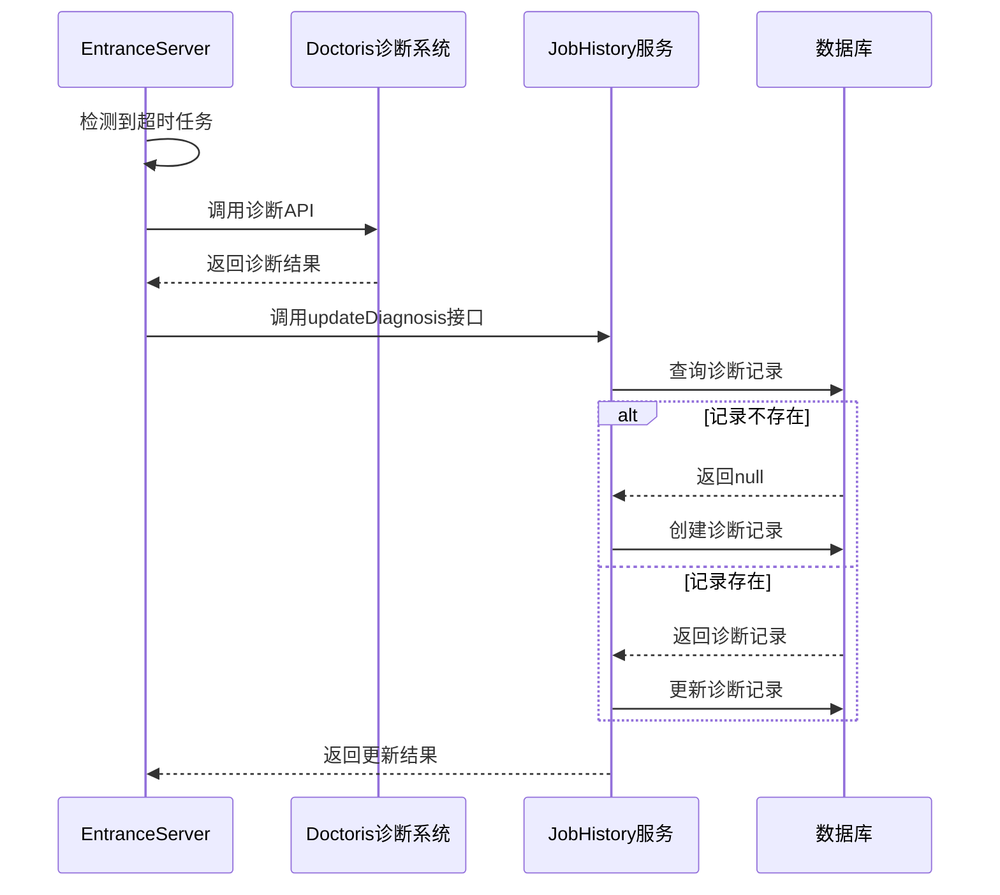
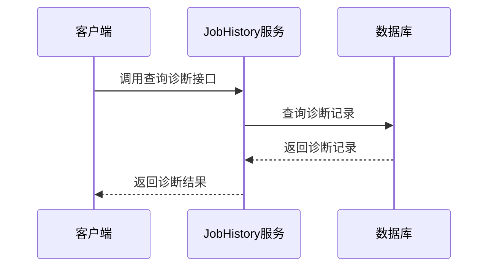

# 需求分析文档

## 1. 文档基本信息

| 项目 | 内容              |
|------|-----------------|
| 需求名称 | Spark任务诊断结果更新接口 |
| 需求类型 | 新增功能            |
| 分析日期 | 2025-12-25      |
| 状态 | 已完成             |
| 编写人 | claude-code            |

## 2. 需求背景与目标

### 2.1 需求背景
在Linkis系统中，当Spark任务运行时间超过配置的阈值时，会触发任务诊断逻辑，调用doctoris诊断系统获取诊断结果。目前，诊断结果仅存储在日志中，无法持久化存储和查询。为了方便用户查看和分析任务诊断结果，需要将诊断信息持久化到数据库中。

### 2.2 需求目标
- 实现诊断结果的持久化存储
- 提供诊断结果的查询接口
- 支持诊断结果的更新操作
- 确保诊断信息的准确性和完整性

## 3. 功能需求分析

### 3.1 核心功能

| 功能点 | 描述 | 优先级 |
|--------|------|--------|
| 诊断结果更新接口 | 提供RPC接口，用于更新任务诊断结果 | P1 |
| 诊断记录创建 | 当不存在诊断记录时，创建新的诊断记录 | P1 |
| 诊断记录更新 | 当存在诊断记录时，更新现有诊断记录 | P1 |
| 诊断记录查询 | 支持根据任务ID和诊断来源查询诊断记录 | P2 |

### 3.2 辅助功能

| 功能点 | 描述 | 优先级 |
|--------|------|--------|
| 接口异常处理 | 处理接口调用过程中的异常情况 | P1 |
| 日志记录 | 记录接口调用日志，便于问题排查 | P2 |
| 性能监控 | 监控接口响应时间和调用频率 | P3 |

## 4. 非功能需求分析

| 需求类型 | 具体要求 | 优先级 |
|----------|----------|--------|
| 性能需求 | 接口响应时间 < 500ms | P1 |
| 可用性需求 | 接口可用性 ≥ 99.9% | P1 |
| 可靠性需求 | 诊断信息不丢失，确保数据一致性 | P1 |
| 安全性需求 | 接口调用需要进行身份验证 | P2 |
| 扩展性需求 | 支持多种诊断来源，便于后续扩展 | P2 |

## 5. 业务流程分析

### 5.1 诊断结果更新流程

### 5.2 诊断记录查询流程

## 6. 数据模型分析

### 6.1 现有数据模型

**表名**: linkis_ps_job_history_diagnosis

| 字段名 | 数据类型 | 描述 | 约束 |
|--------|----------|------|------|
| id | BIGINT | 主键ID | 自增 |
| job_history_id | BIGINT | 任务历史ID | 非空 |
| diagnosis_content | TEXT | 诊断内容 | 非空 |
| created_time | DATETIME | 创建时间 | 非空 |
| updated_time | DATETIME | 更新时间 | 非空 |
| only_read | VARCHAR(1) | 是否只读 | 默认为'0' |
| diagnosis_source | VARCHAR(50) | 诊断来源 | 非空 |

### 6.2 数据字典

| 字段名 | 取值范围 | 描述 |
|--------|----------|------|
| only_read | 0/1 | 0: 可编辑, 1: 只读 |
| diagnosis_source | doctoris/其他 | 诊断系统来源 |

## 7. 接口设计

### 7.1 RPC接口定义

#### 7.1.1 JobReqDiagnosisUpdate

**功能**: 更新任务诊断结果

**参数列表**:

| 参数名 | 类型 | 描述 | 是否必填 |
|--------|------|------|----------|
| jobHistoryId | Long | 任务历史ID | 是 |
| diagnosisContent | String | 诊断内容 | 是 |
| diagnosisSource | String | 诊断来源 | 是 |

**返回结果**:

| 字段名 | 类型 | 描述 |
|--------|------|------|
| status | Int | 状态码，0: 成功, 非0: 失败 |
| msg | String | 响应消息 |

### 7.2 内部接口

#### 7.2.1 JobHistoryDiagnosisService.selectByJobId

**功能**: 根据任务ID和诊断来源查询诊断记录

**参数列表**:

| 参数名 | 类型 | 描述 | 是否必填 |
|--------|------|------|----------|
| jobId | Long | 任务ID | 是 |
| diagnosisSource | String | 诊断来源 | 是 |

**返回结果**:
- JobDiagnosis对象或null

#### 7.2.2 JobHistoryDiagnosisService.insert

**功能**: 创建诊断记录

**参数列表**:

| 参数名 | 类型 | 描述 | 是否必填 |
|--------|------|------|----------|
| jobDiagnosis | JobDiagnosis | 诊断记录对象 | 是 |

**返回结果**:
- 无

#### 7.2.3 JobHistoryDiagnosisService.update

**功能**: 更新诊断记录

**参数列表**:

| 参数名 | 类型 | 描述 | 是否必填 |
|--------|------|------|----------|
| jobDiagnosis | JobDiagnosis | 诊断记录对象 | 是 |

**返回结果**:
- 无

## 8. 依赖与约束

### 8.1 技术依赖

| 依赖项 | 版本 | 用途 |
|--------|------|------|
| Linkis RPC | 1.18.0-wds | 提供RPC通信机制 |
| Spring Boot | 2.6.3 | 提供依赖注入和事务管理 |
| MyBatis | 3.5.9 | 数据库访问框架 |
| MySQL | 8.0+ | 数据库存储 |

### 8.2 业务约束

- 诊断结果更新接口只能由EntranceServer调用
- 诊断记录的jobHistoryId必须存在于linkis_ps_job_history表中
- diagnosisSource字段目前固定为"doctoris"

## 9. 风险与应对措施

| 风险点 | 影响程度 | 可能性 | 应对措施 |
|--------|----------|--------|----------|
| 诊断结果更新失败 | 低 | 中 | 记录错误日志，不影响主流程 |
| 数据库连接异常 | 中 | 低 | 使用连接池，设置合理的超时时间 |
| 高并发调用 | 中 | 中 | 优化数据库查询，添加索引 |
| 诊断信息过大 | 低 | 低 | 使用TEXT类型存储，支持大文本 |

## 10. 验收标准

### 10.1 功能验收

| 验收项 | 验收标准 |
|--------|----------|
| 诊断记录创建 | 当调用更新接口且不存在诊断记录时，成功创建新记录 |
| 诊断记录更新 | 当调用更新接口且存在诊断记录时，成功更新现有记录 |
| 接口响应时间 | 接口响应时间 < 500ms |
| 幂等性 | 多次调用同一任务的更新接口，结果一致 |
| 错误处理 | 当参数无效时，返回明确的错误信息 |

### 10.2 非功能验收

| 验收项 | 验收标准 |
|--------|----------|
| 可用性 | 接口可用性 ≥ 99.9% |
| 可靠性 | 诊断信息不丢失，数据一致性良好 |
| 扩展性 | 支持多种诊断来源的扩展 |

## 11. 后续工作建议

1. **添加诊断结果查询接口**：提供RESTful API，方便前端查询诊断结果
2. **支持多种诊断来源**：扩展diagnosisSource字段，支持多种诊断系统
3. **添加诊断结果可视化**：在管理控制台添加诊断结果展示页面
4. **优化诊断算法**：根据诊断结果，优化任务调度和资源分配
5. **添加诊断结果告警**：当诊断结果为严重问题时，触发告警机制

## 12. 附录

### 12.1 术语定义

| 术语 | 解释 |
|------|------|
| Linkis | 基于Apache Linkis开发的大数据计算中间件 |
| doctoris | 任务诊断系统，用于分析任务运行问题 |
| RPC | 远程过程调用，用于系统间通信 |
| jobhistory | 任务历史服务，用于存储和查询任务历史信息 |
| EntranceServer | 入口服务，负责接收和处理任务请求 |

### 12.2 参考文档

- [Apache Linkis官方文档](https://linkis.apache.org/)
- [MyBatis官方文档](https://mybatis.org/mybatis-3/zh/index.html)
- [Spring Boot官方文档](https://spring.io/projects/spring-boot)

### 12.3 相关配置

| 配置项 | 默认值 | 描述 |
|--------|--------|------|
| linkis.task.diagnosis.enable | true | 任务诊断开关 |
| linkis.task.diagnosis.engine.type | spark | 任务诊断引擎类型 |
| linkis.task.diagnosis.timeout | 300000 | 任务诊断超时时间（毫秒） |
| linkis.doctor.url | 无 | Doctoris诊断系统URL |
| linkis.doctor.signature.token | 无 | Doctoris签名令牌 |