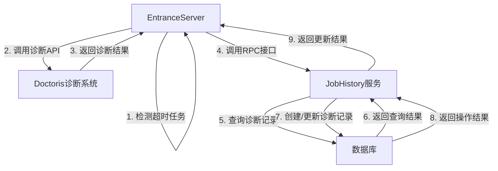

# 技术设计方案

## 1. 文档基本信息

| 项目 | 内容              |
|------|-----------------|
| 设计名称 | Spark任务诊断结果更新接口 |
| 需求类型 | 新增功能            |
| 设计日期 | 2025-12-25      |
| 状态 | 已完成             |
| 编写人 | claude-code            |

## 2. 设计背景与目标

### 2.1 设计背景
在Linkis系统中，当Spark任务运行超时后，会触发诊断逻辑，调用doctoris诊断系统获取诊断结果。为了方便用户查看和分析诊断结果，需要将诊断信息持久化到数据库中，并提供相应的查询接口。

### 2.2 设计目标
- 实现诊断结果的持久化存储
- 提供高效的诊断结果更新接口
- 确保系统的高可用性和可靠性
- 支持后续功能扩展

## 3. 架构设计

### 3.1 系统架构图



### 3.2 核心组件

| 组件 | 职责 |
|------|------|
| EntranceServer | 检测超时任务，调用诊断API，触发诊断结果更新 |
| JobHistory服务 | 提供诊断结果更新接口，处理诊断记录的创建和更新 |
| 数据库 | 存储诊断记录，提供数据持久化支持 |
| Doctoris诊断系统 | 提供任务诊断服务，返回诊断结果 |

## 4. 详细设计

### 4.1 数据模型设计

#### 4.1.1 诊断记录表（linkis_ps_job_history_diagnosis）

| 字段名 | 数据类型 | 约束 | 描述 |
|--------|----------|------|------|
| id | BIGINT | PRIMARY KEY, AUTO_INCREMENT | 主键ID |
| job_history_id | BIGINT | NOT NULL | 任务历史ID |
| diagnosis_content | TEXT | NOT NULL | 诊断内容 |
| created_time | DATETIME | NOT NULL | 创建时间 |
| updated_time | DATETIME | NOT NULL | 更新时间 |
| only_read | VARCHAR(1) | DEFAULT '0' | 是否只读 |
| diagnosis_source | VARCHAR(50) | NOT NULL | 诊断来源 |

#### 4.1.2 索引设计

| 索引名 | 索引类型 | 索引字段 | 用途 |
|--------|----------|----------|------|
| idx_job_history_id | UNIQUE | job_history_id, diagnosis_source | 唯一约束，确保同一任务同一来源只有一条诊断记录 |
| idx_job_history_id_single | NORMAL | job_history_id | 加速根据任务ID查询诊断记录 |

### 4.2 类设计

#### 4.2.1 JobReqDiagnosisUpdate

**功能**: 诊断结果更新请求协议类

**属性**:

| 属性名 | 类型 | 描述 |
|--------|------|------|
| jobHistoryId | Long | 任务历史ID |
| diagnosisContent | String | 诊断内容 |
| diagnosisSource | String | 诊断来源 |

**方法**:

| 方法名 | 参数 | 返回值 | 描述 |
|--------|------|--------|------|
| apply | jobHistoryId: Long, diagnosisContent: String, diagnosisSource: String | JobReqDiagnosisUpdate | 工厂方法，用于创建JobReqDiagnosisUpdate实例 |

#### 4.2.2 JobHistoryQueryServiceImpl

**功能**: JobHistory服务实现类，处理诊断结果更新请求

**核心方法**:

| 方法名 | 参数 | 返回值 | 描述 |
|--------|------|--------|------|
| updateDiagnosis | jobReqDiagnosisUpdate: JobReqDiagnosisUpdate | JobRespProtocol | 处理诊断结果更新请求，创建或更新诊断记录 |

**依赖注入**:

| 依赖项 | 类型 | 用途 |
|--------|------|------|
| jobHistoryDiagnosisService | JobHistoryDiagnosisService | 诊断记录服务，用于操作数据库 |

### 4.3 接口设计

#### 4.3.1 RPC接口

**接口名称**: updateDiagnosis

**请求参数**:

| 参数名 | 类型 | 描述 |
|--------|------|------|
| jobHistoryId | Long | 任务历史ID |
| diagnosisContent | String | 诊断内容 |
| diagnosisSource | String | 诊断来源 |

**返回结果**:

| 字段名 | 类型 | 描述 |
|--------|------|------|
| status | Int | 状态码，0: 成功, 非0: 失败 |
| msg | String | 响应消息 |

#### 4.3.2 内部服务接口

**JobHistoryDiagnosisService.selectByJobId**

| 参数名 | 类型 | 描述 |
|--------|------|------|
| jobId | Long | 任务ID |
| diagnosisSource | String | 诊断来源 |

| 返回值 | 类型 | 描述 |
|--------|------|------|
| 诊断记录 | JobDiagnosis | 诊断记录对象，不存在则返回null |

**JobHistoryDiagnosisService.insert**

| 参数名 | 类型 | 描述 |
|--------|------|------|
| jobDiagnosis | JobDiagnosis | 诊断记录对象 |

**JobHistoryDiagnosisService.update**

| 参数名 | 类型 | 描述 |
|--------|------|------|
| jobDiagnosis | JobDiagnosis | 诊断记录对象 |

## 5. 实现细节

### 5.1 诊断结果更新流程

```java
// 1. 接收RPC请求
@Receiver
def updateDiagnosis(jobReqDiagnosisUpdate: JobReqDiagnosisUpdate): JobRespProtocol = {
  // 2. 日志记录
  logger.info(s"Update job diagnosis: ${jobReqDiagnosisUpdate.toString}")
  
  // 3. 构造响应对象
  val jobResp = new JobRespProtocol
  
  // 4. 异常处理
  Utils.tryCatch {
    // 5. 查询诊断记录
    var jobDiagnosis = jobHistoryDiagnosisService.selectByJobId(
      jobReqDiagnosisUpdate.getJobHistoryId,
      jobReqDiagnosisUpdate.getDiagnosisSource
    )
    
    // 6. 创建或更新诊断记录
    if (jobDiagnosis == null) {
      // 创建新记录
      jobDiagnosis = new JobDiagnosis
      jobDiagnosis.setJobHistoryId(jobReqDiagnosisUpdate.getJobHistoryId)
      jobDiagnosis.setCreatedTime(new Date)
    }
    
    // 更新诊断内容和来源
    jobDiagnosis.setDiagnosisContent(jobReqDiagnosisUpdate.getDiagnosisContent)
    jobDiagnosis.setDiagnosisSource(jobReqDiagnosisUpdate.getDiagnosisSource)
    jobDiagnosis.setUpdatedDate(new Date)
    
    // 7. 保存诊断记录
    if (jobDiagnosis.getId == null) {
      jobHistoryDiagnosisService.insert(jobDiagnosis)
    } else {
      jobHistoryDiagnosisService.update(jobDiagnosis)
    }
    
    // 8. 设置成功响应
    jobResp.setStatus(0)
    jobResp.setMsg("Update diagnosis success")
  } { case exception: Exception =>
    // 9. 处理异常情况
    logger.error(
      s"Failed to update job diagnosis ${jobReqDiagnosisUpdate.toString}, should be retry",
      exception
    )
    jobResp.setStatus(2)
    jobResp.setMsg(ExceptionUtils.getRootCauseMessage(exception))
  }
  
  // 10. 返回响应结果
  jobResp
}
```

### 5.2 诊断结果触发流程

```scala
// 1. 检测到超时任务后，调用诊断API
val response = EntranceUtils.taskRealtimeDiagnose(entranceJob.getJobRequest, null)
logger.info(s"Finished to diagnose spark job ${job.getId()}, result: ${response.result}, reason: ${response.reason}")

// 2. 如果诊断成功，调用更新接口
if (response.success) {
  // 3. 构造诊断更新请求
  val diagnosisUpdate = JobReqDiagnosisUpdate(
    job.getId().toLong,
    response.result,
    "doctoris"
  )
  
  // 4. 发送RPC请求到jobhistory服务
  val sender = Sender.getSender("jobhistory")
  sender.ask(diagnosisUpdate)
  logger.info(s"Successfully updated diagnosis for job ${job.getId()}")
}
```

## 6. 配置设计

| 配置项 | 默认值 | 描述 | 所属模块 |
|--------|--------|------|----------|
| linkis.task.diagnosis.enable | true | 任务诊断开关 | entrance |
| linkis.task.diagnosis.engine.type | spark | 任务诊断引擎类型 | entrance |
| linkis.task.diagnosis.timeout | 300000 | 任务诊断超时时间（毫秒） | entrance |
| linkis.doctor.url | 无 | Doctoris诊断系统URL | entrance |
| linkis.doctor.signature.token | 无 | Doctoris签名令牌 | entrance |

## 7. 错误处理设计

### 7.1 错误码设计

| 错误码 | 错误描述 | 处理方式 |
|--------|----------|----------|
| 0 | 成功 | 正常返回 |
| 2 | 内部错误 | 记录日志，返回错误信息 |
| 1001 | 参数无效 | 检查参数，返回错误信息 |
| 1002 | 数据库异常 | 记录日志，返回错误信息 |

### 7.2 异常处理机制

1. **接口层异常处理**：在updateDiagnosis方法中，使用try-catch捕获所有异常，确保接口不会因异常而崩溃
2. **数据库层异常处理**：使用Spring的事务管理，确保数据库操作的原子性和一致性
3. **调用方异常处理**：EntranceServer在调用updateDiagnosis接口时，捕获RPC异常，记录日志但不影响主流程

## 8. 性能优化设计

### 8.1 数据库优化
- 添加唯一索引，加速查询和避免重复数据
- 使用连接池管理数据库连接，减少连接创建和销毁开销
- 优化SQL语句，减少数据库负载

### 8.2 接口优化
- 采用异步处理方式，避免阻塞主流程
- 合理设置超时时间，避免长时间等待
- 实现接口限流，防止高并发调用导致系统崩溃

### 8.3 代码优化
- 减少对象创建，使用对象池或复用对象
- 优化算法，提高代码执行效率
- 减少网络开销，合理设计接口参数

## 9. 测试设计

### 9.1 单元测试

| 测试用例 | 测试场景 | 预期结果 |
|----------|----------|----------|
| updateDiagnosis_normal | 正常更新诊断记录 | 返回成功状态码，诊断记录被更新 |
| updateDiagnosis_new | 创建新的诊断记录 | 返回成功状态码，诊断记录被创建 |
| updateDiagnosis_invalid_param | 无效参数调用 | 返回错误状态码，错误信息正确 |
| updateDiagnosis_db_exception | 数据库异常 | 返回错误状态码，错误信息正确 |

### 9.2 集成测试

| 测试用例 | 测试场景 | 预期结果 |
|----------|----------|----------|
| entrance_diagnosis_flow | 完整的诊断流程 | 诊断记录被正确创建和更新 |
| concurrent_update | 并发调用更新接口 | 诊断记录被正确更新，无数据冲突 |
| long_running_test | 长时间运行测试 | 系统稳定运行，无内存泄漏 |

## 10. 部署与运维设计

### 10.1 部署方式
- 与现有Linkis系统一同部署
- 无需额外的硬件资源
- 支持集群部署，提高系统可用性

### 10.2 监控与告警
- 监控接口调用频率和响应时间
- 监控数据库连接池状态
- 设置告警阈值，当接口响应时间超过阈值或出现异常时触发告警

### 10.3 日志管理
- 记录接口调用日志，包括请求参数、响应结果和耗时
- 记录数据库操作日志，便于问题排查
- 采用分级日志，便于日志分析和管理

## 11. 后续扩展设计

### 11.1 功能扩展
- 支持多种诊断来源
- 添加诊断结果查询接口
- 实现诊断结果可视化
- 添加诊断结果告警机制

### 11.2 性能扩展
- 支持分布式部署，提高系统吞吐量
- 实现缓存机制，减少数据库访问次数
- 采用消息队列，异步处理诊断结果更新

## 12. 风险评估与应对

| 风险点 | 影响程度 | 可能性 | 应对措施 |
|--------|----------|--------|----------|
| 数据库连接异常 | 中 | 低 | 使用连接池，设置合理的超时时间和重试机制 |
| 高并发调用 | 中 | 中 | 实现接口限流，优化数据库查询，添加缓存 |
| 诊断信息过大 | 低 | 低 | 使用TEXT类型存储，支持大文本 |
| 接口调用失败 | 低 | 中 | 记录日志，不影响主流程，提供重试机制 |

## 13. 附录

### 13.1 术语定义

| 术语 | 解释 |
|------|------|
| Linkis | 基于Apache Linkis开发的大数据计算中间件 |
| Doctoris | 任务诊断系统，用于分析任务运行问题 |
| RPC | 远程过程调用，用于系统间通信 |
| JobHistory | 任务历史服务，用于存储和查询任务历史信息 |
| EntranceServer | 入口服务，负责接收和处理任务请求 |

### 13.2 参考文档

- [Apache Linkis官方文档](https://linkis.apache.org/)
- [MyBatis官方文档](https://mybatis.org/mybatis-3/zh/index.html)
- [Spring Boot官方文档](https://spring.io/projects/spring-boot)

### 13.3 相关代码文件

| 文件名 | 路径 | 功能 |
|--------|------|------|
| JobReqDiagnosisUpdate.scala | linkis-computation-governance/linkis-computation-governance-common/src/main/scala/org/apache/linkis/governance/common/protocol/job/ | 诊断结果更新请求协议类 |
| JobHistoryQueryServiceImpl.scala | linkis-public-enhancements/linkis-jobhistory/src/main/scala/org/apache/linkis/jobhistory/service/impl/ | JobHistory服务实现类，包含updateDiagnosis方法 |
| EntranceServer.scala | linkis-computation-governance/linkis-entrance/src/main/scala/org/apache/linkis/entrance/ | Entrance服务，包含诊断触发和更新逻辑 |