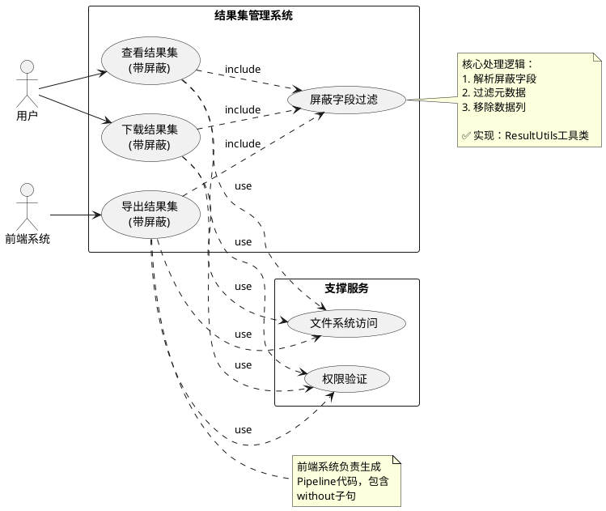
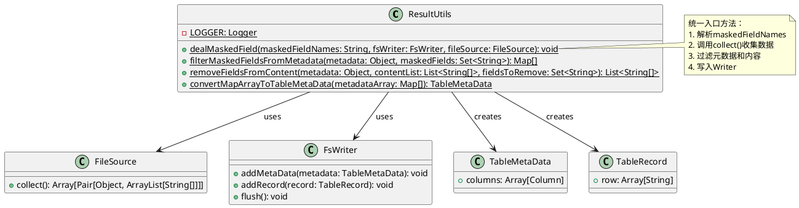
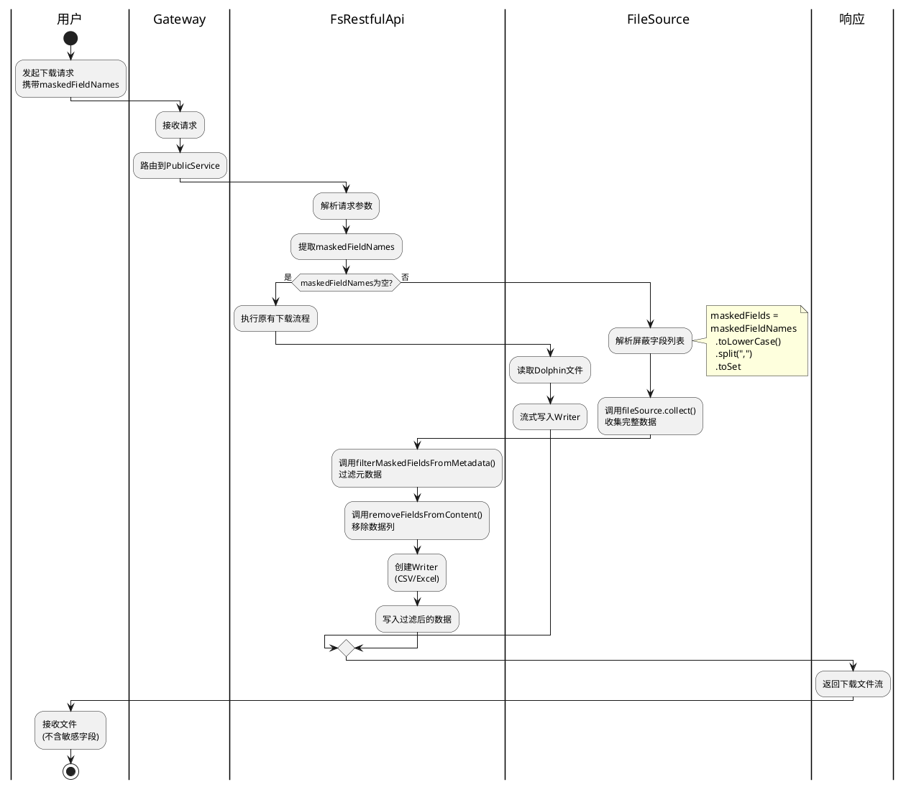
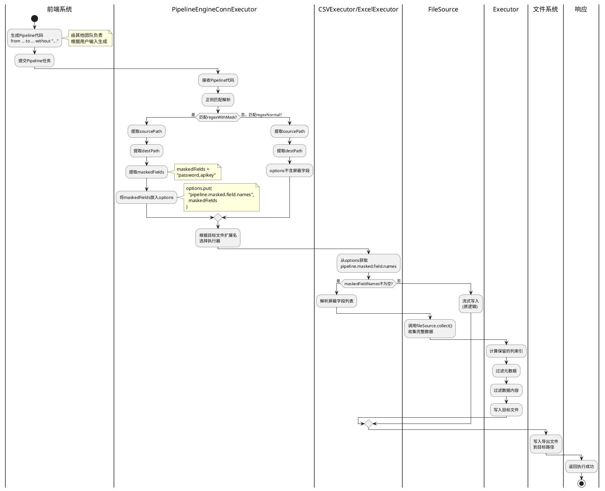
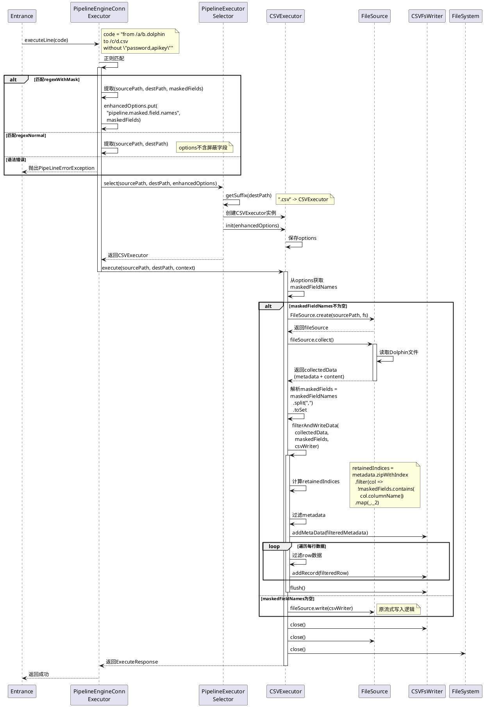

# Linkis结果集敏感字段屏蔽功能设计文档

## 文档信息

| 项目 | 信息 |
|-----|------|
| 文档版本 | v1.1 (已实现) |
| 创建日期 | 2025-10-28 |
| 更新日期 | 2025-10-30 |
| 当前版本 | Linkis 1.17.0 |
| 负责模块 | linkis-pes-publicservice + pipeline + linkis-storage |
| 开发分支 | feature/1.17.0-resultset-sensitive-field-masking |
| 状态 | ✅ 开发完成，已测试 |

---

## 实施总结

### 核心架构改进

本次实现在原设计基础上做出重要架构优化：

**关键改进点**:
1. **代码复用**: 将字段过滤逻辑提取到`ResultUtils`工具类，实现Java和Scala代码共享
2. **架构优化**: 将通用逻辑放在`linkis-storage`模块，提高可维护性
3. **简化实现**: 使用`ResultUtils.dealMaskedField()`统一处理字段屏蔽，减少重复代码

### 代码修改统计

```bash
7 files changed, 2698 insertions(+), 163 deletions(-)
```

| 文件 | 修改类型 | 说明 |
|------|---------|------|
| `ResultUtils.java` | 新增工具类 (189行) | 提取公共字段过滤逻辑 |
| `FsRestfulApi.java` | 功能增强 | 添加maskedFieldNames参数支持 |
| `PipelineEngineConnExecutor.scala` | 语法扩展 | 支持without子句解析 |
| `CSVExecutor.scala` | 功能增强 | 实现CSV导出字段屏蔽 |
| `ExcelExecutor.scala` | 功能增强 | 实现Excel导出字段屏蔽 |
| `resultset-sensitive-field-masking.md` | 新增文档 | 需求文档 |
| `resultset-sensitive-field-masking-design.md` | 新增文档 | 设计文档 (本文档) |

---

## 1. 总述

### 1.1 需求与目标

#### 项目背景

Linkis当前在结果集查看功能中已实现敏感字段屏蔽机制，通过`maskedFieldNames`参数支持动态指定屏蔽字段列表，在前端展示时有效保护敏感数据。然而，用户仍可通过**结果集下载接口**和**Pipeline导出功能**绕过屏蔽机制，直接获取完整敏感数据，导致数据泄露风险。

#### 业务需求

1. **数据安全合规**: 满足数据安全合规要求，防止敏感信息泄露
2. **全链路保护**: 在查看、下载、导出全链路实现敏感字段屏蔽
3. **用户权限管理**: 完善基于字段级别的数据访问控制

#### 目标

1. **下载功能增强**: 在`resultsetToExcel`和`resultsetsToExcel`接口中支持敏感字段屏蔽
2. **导出功能增强**: 在Pipeline引擎(CSVExecutor/ExcelExecutor)中支持敏感字段屏蔽
3. **向后兼容**: 保持现有功能100%向后兼容，不影响未启用屏蔽的场景
4. **性能保证**: 字段屏蔽逻辑不显著影响导出性能
5. **代码复用**: ✅ 已实现 - 提取公共逻辑到工具类，实现Java和Scala代码共享

---

## 2. 关联影响分析

### 2.1 影响范围评估

| 影响对象 | 影响程度 | 影响说明 | 应对措施 |
|---------|---------|---------|---------|
| **PublicService模块** | 高 | 需修改FsRestfulApi接口 | 新增可选参数，向后兼容 |
| **Pipeline引擎** | 高 | 需扩展语法和执行逻辑 | 正则扩展，保持原语法兼容 |
| **Storage模块** | 中 | ✅ 已实现 - 新增ResultUtils工具类 | 提取公共逻辑，实现代码复用 |
| **前端resultsExport组件** | 中 | 其他团队负责代码生成 | 明确接口协议和语法规范 |
| **已有用户** | 低 | 参数可选，不传时保持原行为 | 无影响 |

### 2.2 需要通知的关联方

1. **前端团队**: Pipeline代码生成需支持新语法 `without "字段列表"`
2. **测试团队**: 需增加敏感字段屏蔽场景的测试用例
3. **运维团队**: 新增配置项需同步到生产环境
4. **文档团队**: 更新API文档和用户手册

---

## 3. 系统总体设计

### 3.1 系统定位

Linkis结果集管理系统负责SQL执行结果的查看、下载和导出功能。本次设计在现有能力基础上，补齐**敏感字段屏蔽**能力在下载和导出环节的缺失，实现数据安全的全链路防护。

**核心理念**:
- **字段级权限控制**: 支持细粒度的字段级数据访问控制
- **灵活配置**: 用户可动态指定需要屏蔽的字段
- **透明屏蔽**: 前端无感知，屏蔽字段直接从结果中移除

### 3.2 主要功能

1. **结果集查看** (已有): 支持敏感字段屏蔽
2. **结果集下载** (新增): 下载时支持屏蔽指定字段
3. **结果集导出** (新增): Pipeline导出时支持屏蔽指定字段

### 3.3 技术架构

#### 3.3.1 技术栈

| 技术层 | 技术选型 |
|-------|---------|
| **后端语言** | Java (REST API层)<br>Scala (Pipeline引擎层) |
| **存储格式** | Dolphin (自定义二进制格式) |
| **文件系统** | 支持本地FS和HDFS |
| **导出格式** | CSV, Excel (XLSX) |

#### 3.3.2 部署架构

**Draw.io文件**: [敏感字段屏蔽_架构图.drawio](敏感字段屏蔽_架构图.drawio) - "部署架构图"页签


```
┌─────────────────────────────────────────────────────┐
│                   Linkis Gateway                     │
└──────────────────┬──────────────────────────────────┘
                   │
       ┌───────────┴───────────┐
       │                       │
       ▼                       ▼
┌──────────────┐      ┌────────────────┐
│ PublicService│      │ EngineConnMgr  │
│              │      │                │
│ ┌──────────┐ │      │ ┌────────────┐ │
│ │FsRestful │ │      │ │ Pipeline   │ │
│ │  API     │ │      │ │EngineConn │ │
│ └──────────┘ │      │ └────────────┘ │
└──────┬───────┘      └────────┬───────┘
       │                       │
       └───────────┬───────────┘
                   ▼
       ┌──────────────────────┐
       │   Storage Service    │
       │  ┌────────────────┐  │
       │  │ FileSystem API │  │
       │  │ (HDFS/Local)   │  │
       │  └────────────────┘  │
       └──────────────────────┘
                   │
                   ▼
       ┌──────────────────────┐
       │  Result Files        │
       │  (.dolphin format)   │
       └──────────────────────┘
```

### 3.4 业务架构

**Draw.io文件**: [敏感字段屏蔽_架构图.drawio](敏感字段屏蔽_架构图.drawio) - "业务架构图"页签


#### 3.4.1 功能模块划分

```
结果集管理系统
├── 结果集查看 (已有)
│   └── openFile接口 [已支持屏蔽]
├── 结果集下载 (增强)
│   ├── 单结果集下载 (resultsetToExcel) [新增屏蔽]
│   └── 多结果集下载 (resultsetsToExcel) [新增屏蔽]
└── 结果集导出 (增强)
    ├── CSV导出 (CSVExecutor) [新增屏蔽]
    └── Excel导出 (ExcelExecutor) [新增屏蔽]
```

#### 3.4.2 核心概念定义

| 概念 | 定义 | 示例 |
|-----|------|------|
| **Dolphin文件** | Linkis结果集存储格式，包含元数据和数据 | result_001.dolphin |
| **敏感字段** | 需要屏蔽的字段，如密码、身份证号等 | password, ssn, credit_card |
| **字段屏蔽** | 从结果集中完全移除指定字段 | 移除password列 |
| **maskedFieldNames** | 屏蔽字段列表参数，逗号分隔 | "password,apikey" |
| **without子句** | Pipeline语法扩展，指定屏蔽字段 | without "password" |

#### 3.4.3 用例图



### 3.5 ResultUtils工具类设计 ⭐

#### 3.5.1 设计理念

**核心价值**:
- **代码复用**: 将字段过滤逻辑提取到公共工具类，避免在多处重复实现
- **跨语言共享**: Java和Scala代码都可调用该工具类
- **统一入口**: 提供`dealMaskedField()`统一方法，简化调用方代码

**模块定位**:
- **所属模块**: `linkis-storage` (Storage层通用工具)
- **访问级别**: `public static` 方法，全局可用
- **依赖关系**: 仅依赖Storage层基础类 (FileSource, FsWriter等)

#### 3.5.2 类结构设计

**文件路径**: `linkis-commons/linkis-storage/src/main/java/org/apache/linkis/storage/utils/ResultUtils.java`

**类图**:



#### 3.5.3 核心方法详解

##### (1) dealMaskedField - 统一入口方法

**方法签名**:
```java
public static void dealMaskedField(
    String maskedFieldNames,
    FsWriter fsWriter,
    FileSource fileSource
) throws IOException
```

**功能说明**: 一站式处理字段屏蔽，从收集数据到写入输出的完整流程

**处理流程**:
```java
// 1. 解析屏蔽字段列表
Set<String> maskedFields = new HashSet<>(
    Arrays.asList(maskedFieldNames.toLowerCase().split(","))
);

// 2. 收集完整数据
Pair<Object, List<String[]>> result = fileSource.collect();
Object metadata = result.getFirst();
List<String[]> content = result.getSecond();

// 3. 过滤元数据
Map[] filteredMetadata = filterMaskedFieldsFromMetadata(metadata, maskedFields);

// 4. 移除数据列
List<String[]> filteredContent = removeFieldsFromContent(metadata, content, maskedFields);

// 5. 转换为TableMetaData
TableMetaData tableMetaData = convertMapArrayToTableMetaData(filteredMetadata);

// 6. 写入Writer
fsWriter.addMetaData(tableMetaData);
for (String[] row : filteredContent) {
  fsWriter.addRecord(new TableRecord(row));
}
fsWriter.flush();
```

**调用示例**:
```java
// PublicService - FsRestfulApi.java
if (StringUtils.isNotBlank(maskedFieldNames)) {
  ResultUtils.dealMaskedField(maskedFieldNames, fsWriter, fileSource);
} else {
  fileSource.write(fsWriter);
}
```

```scala
// Pipeline - CSVExecutor.scala
if (StringUtils.isNotBlank(maskedFieldNames)) {
  ResultUtils.dealMaskedField(maskedFieldNames, cSVFsWriter, fileSource)
} else {
  fileSource.addParams("nullValue", nullValue).write(cSVFsWriter)
}
```

##### (2) filterMaskedFieldsFromMetadata - 元数据过滤

**方法签名**:
```java
public static Map[] filterMaskedFieldsFromMetadata(
    Object metadata,
    Set<String> maskedFields
)
```

**功能说明**: 从元数据数组中移除需要屏蔽的字段定义

**实现逻辑**:
```java
Map[] metadataArray = (Map[]) metadata;

// 使用Stream API过滤
return Arrays.stream(metadataArray)
    .filter(column -> {
        String columnName = column.get("columnName").toString().toLowerCase();
        return !maskedFields.contains(columnName); // 保留不在屏蔽列表中的字段
    })
    .toArray(Map[]::new);
```

**示例**:
```java
// 输入元数据
Map[] metadata = {
  {columnName: "id", dataType: "int"},
  {columnName: "password", dataType: "string"},  // 需要屏蔽
  {columnName: "email", dataType: "string"}
};

Set<String> maskedFields = Set.of("password");

// 输出过滤后元数据
Map[] filtered = filterMaskedFieldsFromMetadata(metadata, maskedFields);
// 结果: [{columnName: "id"}, {columnName: "email"}]
```

##### (3) removeFieldsFromContent - 内容列移除

**方法签名**:
```java
public static List<String[]> removeFieldsFromContent(
    Object metadata,
    List<String[]> contentList,
    Set<String> fieldsToRemove
)
```

**功能说明**: 从数据内容中移除对应列

**实现逻辑**:
```java
Map[] metadataArray = (Map[]) metadata;

// 1. 找出需要移除的列索引
List<Integer> indicesToRemove = new ArrayList<>();
for (int i = 0; i < metadataArray.length; i++) {
    String columnName = metadataArray[i].get("columnName").toString().toLowerCase();
    if (fieldsToRemove.contains(columnName)) {
        indicesToRemove.add(i);
    }
}

// 2. 从后向前删除，避免索引变化
Collections.sort(indicesToRemove, Collections.reverseOrder());

// 3. 遍历每行数据，移除对应列
List<String[]> filteredContent = new ArrayList<>();
for (String[] row : contentList) {
    List<String> rowList = new ArrayList<>(Arrays.asList(row));
    for (int index : indicesToRemove) {
        if (index < rowList.size()) {
            rowList.remove(index);
        }
    }
    filteredContent.add(rowList.toArray(new String[0]));
}

return filteredContent;
```

**示例**:
```java
// 输入数据
List<String[]> content = [
  ["1", "pwd123", "alice@example.com"],
  ["2", "secret456", "bob@example.com"]
];

Set<String> fieldsToRemove = Set.of("password");

// 输出过滤后数据
List<String[]> filtered = removeFieldsFromContent(metadata, content, fieldsToRemove);
// 结果: [["1", "alice@example.com"], ["2", "bob@example.com"]]
```

##### (4) convertMapArrayToTableMetaData - 类型转换

**方法签名**:
```java
public static TableMetaData convertMapArrayToTableMetaData(Map[] metadataArray)
```

**功能说明**: 将Map数组转换为Storage层的TableMetaData对象

**实现逻辑**:
```java
Column[] columns = new Column[metadataArray.length];

for (int i = 0; i < metadataArray.length; i++) {
    Map<String, Object> columnMap = metadataArray[i];

    String columnName = columnMap.get("columnName").toString();
    String dataTypeStr = columnMap.get("dataType").toString();
    String comment = columnMap.get("comment").toString();

    // 转换DataType
    DataType dataType = DataType$.MODULE$.toDataType(dataTypeStr);

    // 创建Column对象
    columns[i] = new Column(columnName, dataType, comment);
}

return new TableMetaData(columns);
```

**类型映射**:
| Map结构 | TableMetaData结构 |
|---------|------------------|
| Map<String, Object> | Column |
| columnName: String | Column.columnName |
| dataType: String | Column.dataType (需转换) |
| comment: String | Column.comment |

#### 3.5.4 设计优势

**对比原设计方案**:

| 维度 | 原设计 (方案A) | 实际实现 (ResultUtils) |
|-----|--------------|----------------------|
| **代码重复** | 在FsRestfulApi、CSVExecutor、ExcelExecutor中各实现一遍 | 提取到ResultUtils，仅实现一次 |
| **维护成本** | 修改逻辑需要改3处 | 仅需修改ResultUtils |
| **测试成本** | 需要为3个地方编写测试 | 集中测试ResultUtils |
| **跨语言调用** | 困难，Scala难以调用Java私有方法 | 简单，public static方法全局可用 |
| **代码行数** | ~300行 (重复逻辑) | ~100行 (调用工具类) |

**架构收益**:
1. **单一职责**: ResultUtils专注于字段过滤逻辑
2. **开闭原则**: 新增导出格式只需调用工具类，无需重复实现
3. **依赖倒置**: 上层模块依赖抽象的工具类，不依赖具体实现

---

## 4. 功能模块设计

### 4.1 下载功能增强设计

#### 4.1.1 模块说明

**模块路径**: `linkis-public-enhancements/linkis-pes-publicservice`
**核心类**: `org.apache.linkis.filesystem.restful.api.FsRestfulApi`

#### 4.1.2 接口增强

##### (1) resultsetToExcel接口

**新增参数**:

| 参数名 | 类型 | 必填 | 默认值 | 说明 |
|-------|------|------|-------|------|
| maskedFieldNames | String | 否 | null | 屏蔽字段列表，逗号分隔 |

**示例请求**:
```http
GET /api/rest_j/v1/filesystem/resultsetToExcel
?path=/user/result.dolphin
&outputFileType=csv
&maskedFieldNames=password,apikey,ssn
```

##### (2) resultsetsToExcel接口

**新增参数**: 同上

**示例请求**:
```http
GET /api/rest_j/v1/filesystem/resultsetsToExcel
?path=/user/results/
&maskedFieldNames=password,token
```

#### 4.1.3 业务流程 (泳道图)

**Draw.io文件**: [敏感字段屏蔽_流程图.drawio](敏感字段屏蔽_流程图.drawio) - "下载功能泳道图"页签




#### 4.1.4 核心处理逻辑 (实际实现)

**实际实现比原设计更简洁**:

```java
// FsRestfulApi.java - resultsetToExcel方法 (实际实现)

public void resultsetToExcel(
    HttpServletRequest req,
    HttpServletResponse response,
    @RequestParam(value = "path", required = false) String path,
    @RequestParam(value = "outputFileType", defaultValue = "csv") String outputFileType,
    @RequestParam(value = "maskedFieldNames", required = false) String maskedFieldNames, // ✅ 新增
    // ... 其他参数
) {

    // 1. 权限验证
    String userName = ModuleUserUtils.getOperationUser(req);
    checkIsUsersDirectory(path, userName);

    // 2. 获取文件系统
    FileSystem fs = fsService.getFileSystemForRead(userName, fsPath);
    FileSource fileSource = FileSource.create(fsPath, fs);

    // 3. 创建Writer (根据outputFileType)
    FsWriter fsWriter = createWriter(outputFileType, response.getOutputStream(), ...);

    // 4. ✅ 核心逻辑：使用ResultUtils统一处理
    if (StringUtils.isNotBlank(maskedFieldNames)) {
        // 使用工具类处理字段屏蔽
        ResultUtils.dealMaskedField(maskedFieldNames, fsWriter, fileSource);
    } else {
        // 原有流式写入逻辑
        fileSource.write(fsWriter);
    }

    // 5. 资源清理
    IOUtils.closeQuietly(fsWriter);
    IOUtils.closeQuietly(fileSource);
}
```

**关键改进点**:
1. ✅ **简洁性**: 使用`ResultUtils.dealMaskedField()`一行代码替代原来的几十行
2. ✅ **复用性**: 字段过滤逻辑完全复用，无重复代码
3. ✅ **可维护性**: 修改过滤逻辑只需修改ResultUtils
4. ✅ **一致性**: 与Pipeline引擎使用相同的工具类，保证行为一致

**resultsetsToExcel方法实现**:

```java
// FsRestfulApi.java - resultsetsToExcel方法 (实际实现)

public void resultsetsToExcel(
    HttpServletRequest req,
    HttpServletResponse response,
    @RequestParam(value = "path", required = false) String path,
    @RequestParam(value = "maskedFieldNames", required = false) String maskedFieldNames, // ✅ 新增
    // ... 其他参数
) {

    // 1-2. 权限验证和文件系统初始化 (同上)
    // ...

    // 3. 创建多结果集Writer
    StorageMultiExcelWriter multiExcelWriter = new StorageMultiExcelWriter(outputStream, autoFormat);

    // 4. ✅ 使用ResultUtils统一处理
    if (StringUtils.isNotBlank(maskedFieldNames)) {
        ResultUtils.dealMaskedField(maskedFieldNames, multiExcelWriter, fileSource);
    } else {
        fileSource.write(multiExcelWriter);
    }

    // 5. 资源清理
    // ...
}
```

---

### 4.2 Pipeline导出功能增强设计

#### 4.2.1 模块说明

**模块路径**: `linkis-engineconn-plugins/pipeline`
**核心类**:
- `PipelineEngineConnExecutor` (语法解析)
- `CSVExecutor` (CSV导出)
- `ExcelExecutor` (Excel导出)

#### 4.2.2 Pipeline语法扩展

**原语法**:
```
from <源路径> to <目标路径>
```

**新语法**:
```
from <源路径> to <目标路径> without "<字段1,字段2,...>"
```

**语法规则**:
1. `without`关键字大小写不敏感
2. 字段列表必须用**双引号**包裹
3. 多个字段用逗号分隔
4. 字段名匹配不区分大小写

**示例**:
```scala
// 示例1: 屏蔽单个字段
from /user/result.dolphin to /export/file.csv without "password"

// 示例2: 屏蔽多个字段
from /user/result.dolphin to /export/users.xlsx without "password,apikey,credit_card"

// 示例3: 向后兼容
from /user/result.dolphin to /export/file.csv
```

#### 4.2.3 正则解析设计

```scala
// PipelineEngineConnExecutor.scala

// 新增正则：支持without子句
val regexWithMask =
  "(?i)\\s*from\\s+(\\S+)\\s+to\\s+(\\S+)\\s+without\\s+\"([^\"]+)\"\\s*".r

// 原有正则：不带without
val regexNormal =
  "(?i)\\s*from\\s+(\\S+)\\s+to\\s+(\\S+)\\s*".r
```

**正则组成说明**:

| 部分 | 说明 | 匹配内容 |
|-----|------|---------|
| `(?i)` | 大小写不敏感标志 | - |
| `\\s*from\\s+` | from关键字 | "from " |
| `(\\S+)` | 第1组：源路径 | "/user/result.dolphin" |
| `\\s+to\\s+` | to关键字 | " to " |
| `(\\S+)` | 第2组：目标路径 | "/export/file.csv" |
| `\\s+without\\s+` | without关键字 | " without " |
| `\"([^\"]+)\"` | 第3组：屏蔽字段 | "password,apikey" |

#### 4.2.4 业务流程 (泳道图)

**Draw.io文件**: [敏感字段屏蔽_流程图.drawio](敏感字段屏蔽_流程图.drawio) - "导出功能泳道图"页签




#### 4.2.5 时序图 (详细代码流程)

**Draw.io文件**: [敏感字段屏蔽_时序图.drawio](敏感字段屏蔽_时序图.drawio) - "下载功能时序图"和"导出功能时序图"页签




#### 4.2.6 CSVExecutor核心代码 (实际实现)

**实际实现更简洁**:

```scala
// CSVExecutor.scala (实际实现)

class CSVExecutor extends PipeLineExecutor {

  private var options: util.Map[String, String] = _

  override def init(options: util.Map[String, String]): Unit = {
    this.options = options
  }

  override def execute(
      sourcePath: String,
      destPath: String,
      engineExecutionContext: EngineExecutionContext
  ): ExecuteResponse = {

    // 1. ✅ 获取屏蔽字段参数 (从PipelineEngineConnExecutor传入)
    val maskedFieldNames = options.getOrDefault("pipeline.masked.field.names", "")

    // 2. 验证源文件
    if (!sourcePath.contains(STORAGE_RS_FILE_SUFFIX.getValue)) {
      throw new PipeLineErrorException(...)
    }
    if (!FileSource.isResultSet(sourcePath)) {
      throw new PipeLineErrorException(...)
    }

    // 3. 创建文件系统
    val sourceFsPath = new FsPath(sourcePath)
    val destFsPath = new FsPath(destPath)
    val sourceFs = FSFactory.getFs(sourceFsPath)
    sourceFs.init(null)
    val destFs = FSFactory.getFs(destFsPath)
    destFs.init(null)

    try {
      // 4. 创建FileSource
      val fileSource = FileSource.create(sourceFsPath, sourceFs)
      if (!FileSource.isTableResultSet(fileSource)) {
        throw new PipeLineErrorException(...)
      }

      // 5. 获取配置参数
      var nullValue = options.getOrDefault(PIPELINE_OUTPUT_SHUFFLE_NULL_TYPE, "NULL")
      if (BLANK.equalsIgnoreCase(nullValue)) nullValue = ""

      // 6. 创建输出流和Writer
      val outputStream = destFs.write(destFsPath, PIPELINE_OUTPUT_ISOVERWRITE_SWITCH.getValue(options))
      OutputStreamCache.osCache.put(engineExecutionContext.getJobId.get, outputStream)

      val cSVFsWriter = CSVFsWriter.getCSVFSWriter(
        PIPELINE_OUTPUT_CHARSET_STR.getValue(options),
        PIPELINE_FIELD_SPLIT_STR.getValue(options),
        PIPELINE_FIELD_QUOTE_RETOUCH_ENABLE.getValue(options),
        outputStream
      )

      try {
        // 7. ✅ 核心逻辑：使用ResultUtils统一处理
        if (StringUtils.isNotBlank(maskedFieldNames)) {
          logger.info(s"Applying field masking: $maskedFieldNames")
          // 使用工具类处理字段屏蔽
          ResultUtils.dealMaskedField(maskedFieldNames, cSVFsWriter, fileSource)
        } else {
          // 原有流式写入逻辑
          logger.info("No field masking, using stream write")
          fileSource.addParams("nullValue", nullValue).write(cSVFsWriter)
        }
      } finally {
        IOUtils.closeQuietly(cSVFsWriter)
        IOUtils.closeQuietly(fileSource)
      }
    } finally {
      IOUtils.closeQuietly(sourceFs)
      IOUtils.closeQuietly(destFs)
    }

    super.execute(sourcePath, destPath, engineExecutionContext)
  }
}
```

**关键改进点**:
1. ✅ **简化实现**: 使用`ResultUtils.dealMaskedField()`替代原设计中的`filterAndWriteData()`方法
2. ✅ **代码复用**: 与FsRestfulApi共享相同的字段过滤逻辑
3. ✅ **无需自实现**: 删除了原设计中的`filterAndWriteData()`, `filterRow()`等辅助方法
4. ✅ **更好的架构**: 字段过滤逻辑集中在Storage层，符合分层架构原则

**ExcelExecutor实现**:

```scala
// ExcelExecutor.scala (实际实现，与CSVExecutor类似)

class ExcelExecutor extends PipeLineExecutor {
  override def execute(...): ExecuteResponse = {
    val maskedFieldNames = options.getOrDefault("pipeline.masked.field.names", "")

    // ... 初始化代码 ...

    if (StringUtils.isNotBlank(maskedFieldNames)) {
      // 使用ResultUtils处理字段屏蔽
      ResultUtils.dealMaskedField(maskedFieldNames, excelFsWriter, fileSource)
    } else {
      fileSource.addParams("nullValue", nullValue).write(excelFsWriter)
    }
  }
}
```

---

## 5. 数据结构/存储设计

### 5.1 Dolphin文件格式

**文件结构**:

```
+-------------------+
| Magic Header (7B) |  "dolphin"
+-------------------+
| Type Flag (10B)   |  "TABLE     " (固定10字节)
+-------------------+
| Metadata Length   |  元数据区长度
+-------------------+
| Metadata          |  列定义JSON
| {                 |
|   columns: [      |
|     {             |
|       columnName, |
|       dataType,   |
|       comment     |
|     }             |
|   ]               |
| }                 |
+-------------------+
| Data Records      |  行数据
| Row 1             |  字段1,字段2,...
| Row 2             |
| ...               |
+-------------------+
```

### 5.2 内存数据结构

#### 5.2.1 元数据结构

```java
// 元数据数组
Map<String, Object>[] metadata = {
  {
    "columnName": "id",
    "dataType": "int",
    "comment": "用户ID"
  },
  {
    "columnName": "password",
    "dataType": "string",
    "comment": "密码"  // 需要屏蔽
  },
  {
    "columnName": "email",
    "dataType": "string",
    "comment": "邮箱"
  }
}
```

#### 5.2.2 数据内容结构

```java
// 数据行数组
List<String[]> fileContent = [
  ["1", "pwd123", "alice@example.com"],
  ["2", "secret456", "bob@example.com"]
]
```

#### 5.2.3 过滤后结构

```java
// 过滤后元数据 (移除password)
Map<String, Object>[] filteredMetadata = {
  {
    "columnName": "id",
    "dataType": "int",
    "comment": "用户ID"
  },
  {
    "columnName": "email",
    "dataType": "string",
    "comment": "邮箱"
  }
}

// 过滤后数据 (移除password列)
List<String[]> filteredContent = [
  ["1", "alice@example.com"],
  ["2", "bob@example.com"]
]
```

### 5.3 配置数据

#### 5.3.1 新增配置项

```properties
# Pipeline导出行数限制 (方案A内存保护)
pipeline.export.max.rows=100000

# 内存检查开关
pipeline.export.memory.check.enabled=true

# 内存使用阈值
pipeline.export.memory.threshold=0.8
```

---

## 6. 接口设计

接口设计文档已录入API DESIGN系统：
http://apidesign.weoa.com

### 6.1 接口清单

| 接口路径 | 方法 | 说明 | 变更类型 |
|---------|------|------|---------|
| `/api/rest_j/v1/filesystem/resultsetToExcel` | GET | 单结果集下载 | 参数扩展 |
| `/api/rest_j/v1/filesystem/resultsetsToExcel` | GET | 多结果集下载 | 参数扩展 |

### 6.2 参数说明

#### 新增参数

| 参数名 | 类型 | 必填 | 默认值 | 说明 | 示例 |
|-------|------|------|-------|------|------|
| maskedFieldNames | String | 否 | null | 屏蔽字段列表，逗号分隔，不区分大小写 | password,apikey,ssn |

#### 响应说明

**成功响应**: 返回文件流 (与原接口一致)

**错误响应**:
```json
{
  "status": 1,
  "message": "字段名格式错误",
  "data": null
}
```

---

## 7. 非功能性设计

### 7.1 安全

#### 7.1.1 敏感字段屏蔽机制

**核心策略**: 完全移除敏感字段，而非替换为空值或掩码

**字段匹配规则**:
1. 不区分大小写
2. 精确匹配字段名
3. 支持多字段，逗号分隔

**防注入措施**:
```java
// 参数校验
if (maskedFieldNames != null) {
  // 1. 长度限制
  if (maskedFieldNames.length() > 1000) {
    throw new IllegalArgumentException("屏蔽字段列表过长");
  }

  // 2. 字符白名单
  if (!maskedFieldNames.matches("^[a-zA-Z0-9_,\\s]+$")) {
    throw new IllegalArgumentException("字段名包含非法字符");
  }
}
```

#### 7.1.2 权限控制

**现有机制**:
- 文件系统级别权限检查 (`checkIsUsersDirectory`)
- 用户只能访问自己目录下的文件

**保持不变**: 本次设计不改变现有权限控制机制

#### 7.1.3 审计日志

**日志记录**:
```java
logger.info("User {} masked fields {} in result download",
  userName, maskedFieldNames);
```

### 7.2 性能

#### 7.2.1 性能指标

| 场景 | 指标 | 目标值 | 说明 |
|-----|------|-------|------|
| 小结果集下载 (<1万行) | 响应时间 | <3秒 | 与原性能持平 |
| 中结果集下载 (1-10万行) | 响应时间 | <10秒 | 允许30%性能损失 |
| 大结果集下载 (>10万行) | 响应时间 | 限制或拒绝 | 防止内存溢出 |
| 未启用屏蔽 | 响应时间 | 无影响 | 保持原流式性能 |

#### 7.2.2 性能优化措施

**方案A优化**:
1. 仅在指定屏蔽字段时启用collect模式
2. 未指定时保持原流式写入
3. 添加性能日志监控

**代码示例**:
```scala
val startTime = System.currentTimeMillis()

if (StringUtils.isNotBlank(maskedFieldNames)) {
  // collect模式
  filterAndWriteData(...)
} else {
  // 流式模式
  fileSource.write(writer)
}

val elapsedTime = System.currentTimeMillis() - startTime
logger.info(s"Export completed in ${elapsedTime}ms")
```

### 7.3 容量

#### 7.3.1 容量限制

**下载功能**:
- CSV最大行数: 5000 (配置: `resultset.download.maxsize.csv`)
- Excel最大行数: 5000 (配置: `resultset.download.maxsize.excel`)

**Pipeline导出** (方案A新增):
- 启用屏蔽时最大行数: 100000 (配置: `pipeline.export.max.rows`)
- 未启用屏蔽: 不限制

#### 7.3.2 内存管理

**内存检查机制**:
```scala
// 在collect()前检查结果集大小
val totalLine = fileSource.getTotalLine
if (totalLine > PIPELINE_EXPORT_MAX_ROWS.getValue) {
  throw new PipeLineErrorException(
    s"Result set too large: $totalLine rows, " +
    s"max allowed: ${PIPELINE_EXPORT_MAX_ROWS.getValue}"
  )
}

// collect()后检查内存使用
val runtime = Runtime.getRuntime
val usedMemory = runtime.totalMemory() - runtime.freeMemory()
val maxMemory = runtime.maxMemory()
val usageRatio = usedMemory.toDouble / maxMemory

if (usageRatio > MEMORY_THRESHOLD.getValue) {
  logger.warn(s"High memory usage: ${usageRatio * 100}%")
  throw new PipeLineErrorException("Memory limit exceeded")
}
```

#### 7.3.3 生产环境推荐配置

```properties
# 生产环境 (内存16GB)
pipeline.export.max.rows=50000
pipeline.export.memory.check.enabled=true
pipeline.export.memory.threshold=0.75

# 测试环境 (内存32GB+)
pipeline.export.max.rows=100000
pipeline.export.memory.threshold=0.85
```

### 7.4 高可用

#### 7.4.1 异常处理

**参数校验**:
```java
// 1. 空值检查
if (StringUtils.isBlank(maskedFieldNames)) {
  // 执行原逻辑
}

// 2. 格式校验
if (!isValidFieldNames(maskedFieldNames)) {
  throw new IllegalArgumentException("Invalid field names format");
}

// 3. 字段不存在
if (!fieldExists(maskedFields)) {
  // 不报错，忽略不存在的字段
  logger.warn("Some masked fields not found: {}", maskedFieldNames);
}
```

**降级策略**:
```java
try {
  // 尝试屏蔽字段导出
  filterAndWriteData(collectedData, maskedFields, writer);
} catch (Exception e) {
  logger.error("Field masking failed, fallback to normal export", e);
  // 降级为不屏蔽
  fileSource.write(writer);
}
```

#### 7.4.2 向后兼容

**100%向后兼容承诺**:
1. 不传`maskedFieldNames`参数时，行为完全不变
2. 原有API调用不受影响
3. Pipeline原语法保持兼容

#### 7.4.3 资源保护

**超时控制**:
```scala
// 设置超时时间
val futureTask = Future {
  filterAndWriteData(collectedData, maskedFields, writer)
}

Try(Await.result(futureTask, Duration(30, SECONDS))) match {
  case Success(_) => logger.info("Export completed")
  case Failure(e: TimeoutException) =>
    throw new PipeLineErrorException("Export timeout")
  case Failure(e) =>
    throw new PipeLineErrorException("Export failed", e)
}
```

### 7.5 数据质量

#### 7.5.1 数据完整性

**元数据与数据一致性保证**:
```scala
// 确保元数据和数据列数一致
val filteredMetadata = retainedIndices.map(i => metadata(i))
val filteredRow = retainedIndices.map(i => row(i))

assert(filteredMetadata.length == filteredRow.length,
  "Metadata and data length mismatch")
```

#### 7.5.2 数据正确性

**测试验证**:
1. 单元测试：验证字段过滤逻辑正确性
2. 集成测试：与`openFile`接口对比测试
3. 边界测试：屏蔽所有字段、屏蔽不存在字段等

**对比测试代码**:
```java
// 对比openFile和下载接口的结果一致性
@Test
public void testConsistency() {
  String maskedFields = "password,apikey";

  // 1. openFile结果
  Map<String, Object> openFileResult =
    callOpenFile(path, maskedFields);

  // 2. 下载接口结果
  String downloadedFile =
    callResultsetToExcel(path, maskedFields);

  // 3. 解析并对比
  List<String> openFileColumns = extractColumns(openFileResult);
  List<String> downloadColumns = extractColumns(downloadedFile);

  assertEquals(openFileColumns, downloadColumns,
    "Column mismatch between openFile and download");
}
```

---

## 8. 专利点识别

### 8.1 潜在专利点

#### 专利点1: 基于Pipeline语法扩展的字段级数据脱敏方法

**技术特点**:
1. 通过扩展Pipeline DSL语法，实现声明式字段屏蔽
2. 在数据导出过程中动态解析语法并应用屏蔽逻辑
3. 保持向后兼容的同时提供灵活的字段控制能力

**创新点**:
- 使用正则匹配提取屏蔽字段，避免修改前端代码
- 基于语法扩展的声明式安全控制
- 职责分离：前端生成、后端执行

#### 专利点2: 基于内存感知的字段屏蔽策略选择方法

**技术特点**:
1. 根据结果集大小和内存情况动态选择处理策略
2. 小结果集使用collect模式，大结果集使用流式模式或拒绝
3. 内存阈值检查机制，防止OOM

**创新点**:
- 自适应的字段屏蔽策略
- 基于运行时内存监控的容量保护
- 性能与安全的平衡

### 8.2 专利录入

专利信息已录入到"BDP 专利"文档：
http://docs.weoa.com/sheets/2wAlXOo1WBHwPrAP/zDmhC

---

## 9. 附录

### 9.1 关键文件清单

| 文件路径 | 说明 | 修改类型 |
|---------|------|---------|
| `linkis-commons/linkis-storage/src/main/java/org/apache/linkis/storage/utils/ResultUtils.java` | ✅ 工具类 (新增189行) | **核心改进** - 提取公共字段过滤逻辑 |
| `linkis-pes-publicservice/src/main/java/org/apache/linkis/filesystem/restful/api/FsRestfulApi.java` | REST API | 参数扩展+调用ResultUtils |
| `linkis-engineconn-plugins/pipeline/src/main/scala/org/apache/linkis/manager/engineplugin/pipeline/executor/PipelineEngineConnExecutor.scala` | Pipeline执行器 | 正则扩展 |
| `linkis-engineconn-plugins/pipeline/src/main/scala/org/apache/linkis/manager/engineplugin/pipeline/executor/CSVExecutor.scala` | CSV导出 | 调用ResultUtils |
| `linkis-engineconn-plugins/pipeline/src/main/scala/org/apache/linkis/manager/engineplugin/pipeline/executor/ExcelExecutor.scala` | Excel导出 | 调用ResultUtils |

### 9.2 配置项清单

| 配置项 | 默认值 | 说明 | 模块 |
|-------|-------|------|------|
| `wds.linkis.workspace.resultset.download.maxsize.csv` | 5000 | CSV下载最大行数 | 下载 |
| `wds.linkis.workspace.resultset.download.maxsize.excel` | 5000 | Excel下载最大行数 | 下载 |
| `pipeline.export.max.rows` | 100000 | Pipeline导出最大行数 | 导出 |
| `pipeline.export.memory.check.enabled` | true | 是否启用内存检查 | 导出 |
| `pipeline.export.memory.threshold` | 0.8 | 内存使用阈值 | 导出 |

### 9.3 测试用例清单

#### 功能测试

| 用例ID | 用例名称 | 优先级 |
|-------|---------|--------|
| TC001 | 下载单字段屏蔽-CSV | P0 |
| TC002 | 下载多字段屏蔽-Excel | P0 |
| TC003 | 导出Pipeline语法-单字段 | P0 |
| TC004 | 导出Pipeline语法-多字段 | P0 |
| TC005 | 向后兼容-不传参数 | P0 |
| TC006 | 字段名大小写不敏感 | P1 |
| TC007 | 屏蔽不存在字段 | P1 |
| TC008 | 屏蔽所有字段 | P2 |

#### 性能测试

| 用例ID | 数据量 | 屏蔽字段数 | 期望性能 |
|-------|-------|----------|---------|
| PT001 | 1万行×10列 | 2 | <3秒 |
| PT002 | 5万行×50列 | 5 | <8秒 |
| PT003 | 10万行×100列 | 10 | <15秒 |

---

## 10. 变更历史

| 版本 | 日期 | 变更内容 | 作者 |
|-----|------|---------|------|
| v1.0 | 2025-10-28 | 初始版本 - 完成系统设计 | Claude Code |
| v1.1 | 2025-10-30 | ✅ 实现完成 - 更新实际实现细节，添加ResultUtils工具类设计 | 开发团队 |

**v1.1版本主要变更**:
1. 新增ResultUtils工具类设计章节 (3.5节)
2. 更新PublicService实现代码，反映实际使用ResultUtils的简化实现 (4.1.4节)
3. 更新Pipeline引擎实现代码，反映实际使用ResultUtils的简化实现 (4.2.6节)
4. 更新文件清单，突出ResultUtils核心地位 (9.1节)
5. 添加实施总结章节，说明架构改进点

---

**文档结束**
