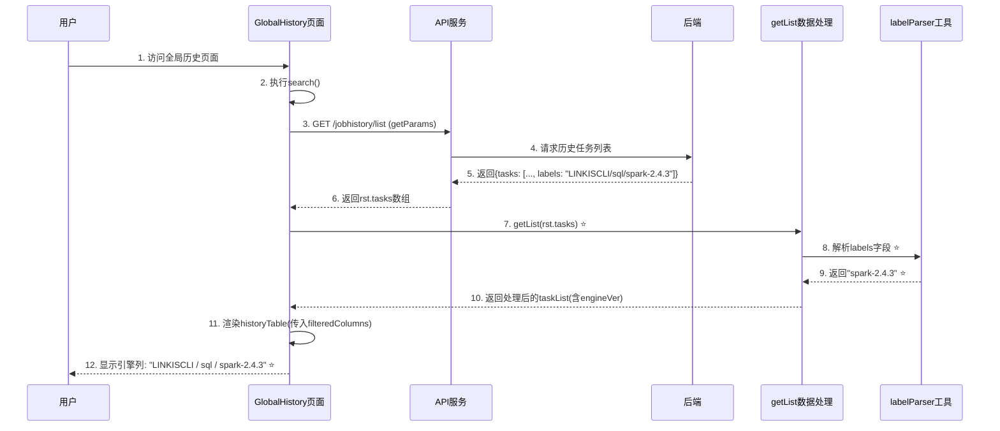
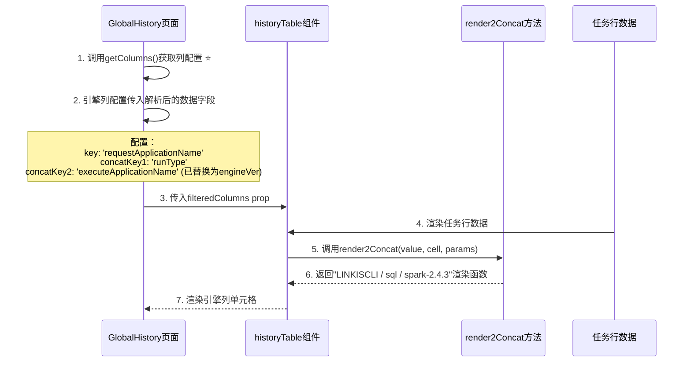

# 全局历史页面引擎版本展示增强 设计文档

## 文档信息
- **文档版本**: v1.0
- **最后更新**: 2026-03-17
- **维护人**: AI设计生成
- **文档状态**: 草稿 | 评审中 | 已批准
- **需求类型**: ENHANCE（功能增强）
- **需求文档**: [global-history-engine-version_需求.md](../requirements/global-history-engine-version_需求.md)

---

## 执行摘要

### 设计目标

| 目标 | 描述 | 优先级 |
|-----|------|-------|
| 引擎列显示完整版本信息 | 在全局历史页面引擎列显示应用/任务类型/引擎版本的完整格式 | P0 |
| 向后兼容 | 不影响现有功能和API，仅前端展示层增强 | P0 |
| 用户体验优化 | 确保列宽度适配，避免内容截断 | P1 |

### 核心设计决策

| 决策点 | 选择方案 | 决策理由 | 替代方案 |
|-------|---------|---------|---------|
| 数据来源解析 | 在getList()方法中解析labels字段 | labels字段已在后端返回，数据处理集中管理 | 修改表格组件render函数 |
| 解析逻辑实现 | 创建或复用labelParser工具 | 可复用、易测试、职责单一 | 直接在组件中处理 |
| 引擎列改造 | 保留multiConcat渲染器，传入解析后的数据 | 最小化修改，保持现有架构 | 新增自定义渲染器 |

### 架构概览图

```
┌─────────────────────────────────────────────────────────────┐
│                    全局历史页面                            │
├─────────────────────────────────────────────────────────────┤
│  ┌──────────────┐      ┌──────────────┐      ┌────────────┐ │
│  │  SearchBar   │ ───> │ API Service  │ ───> │  Backend   │ │
│  └──────────────┘      └──────────────┘      └────────────┘ │
│                              │                             │
│                              ↓                             │
│                     ┌────────────────┐                    │
│                     │   getList()    │ ⭐ 新增解析逻辑    │
│                     │   解析labels   │                    │
│                     └────────────────┘                    │
│                              │                             │
│                              ↓                             │
│                     ┌────────────────┐                    │
│                     │  taskList数据  │                     │
│                     │  (含engineVer) │ ⭐                │
│                     └────────────────┘                    │
│                              │                             │
│                              ↓                             │
│                     ┌────────────────┐                    │
│                     │  historyTable  │ ⭐ 使用解析后数据  │
│                     │  虚拟表格组件  │                     │
│                     └────────────────┘                    │
└─────────────────────────────────────────────────────────────┘
```

### 关键风险与缓解

| 风险 | 等级 | 缓解措施 |
|-----|------|---------|
| labels字段格式变化 | 中 | 添加格式校验，异常情况显示"未知" |
| 列宽度不足 | 低 | 调整列宽度或启用ellipsis+tooltip |
| 性能影响 | 低 | 仅客户端解析，无额外API调用 |

### 核心指标

| 指标 | 目标值 | 说明 |
|-----|-------|------|
| 列加载渲染时间 | < 100ms | 初始加载时引擎列渲染时间 |
| 版本解析成功率 | 100% | 所有历史任务都应包含版本信息 |
| 向后兼容性 | 100% | 现有功能不受影响 |

### 章节导航

| 关注点 | 推荐章节 |
|-------|---------|
| 想了解整体架构 | [1.1 系统架构设计](#11-系统架构设计) |
| 想了解核心流程 | [1.2 核心流程设计](#12-核心流程设计) |
| 想了解兼容性设计 | [1.3 兼容性设计](#13-兼容性设计) |
| 想了解代码变更 | [3.1 关键代码变更](#31-关键代码变更) |

---

# Part 1: 核心设计

> 🎯 **本层目标**：阐述架构决策、核心流程、关键接口，完整详细展开。
>
> **预计阅读时间**：10-15分钟

## 1.1 系统架构设计

### 1.1.1 架构模式选择

**采用模式**：单页应用组件化架构（Vue.js）

**选择理由**：
- 现有已基于Vue+iview UI构建，遵循现有架构
- 组件化设计便于职责分离和复用
- 数据处理与视图渲染分离，符合MVVM模式

**架构图**：

```mermaid
graph TB
    subgraph 表现层
        A[GlobalHistory/index.vue<br/>全局历史页面组件]
        B[historyTable.vue<br/>虚拟表格组件]
    end

    subgraph 数据处理层
        C[getList()<br/>数据处理方法]
        D[parseLabels()<br/>标签解析函数] ⭐
    end

    subgraph 服务层
        E[/jobhistory/list<br/>历史查询API]
        F[labelParser.js<br/>标签解析工具]
    end

    subgraph 后端
        G[(后端服务)]
    end

    A --> E
    E --> G
    G --> E
    E --> C
    C --> D
    D --> F
    C --> A
    A --> B
```

### 1.1.2 模块划分

| 模块 | 职责 | 对外接口 | 依赖 |
|-----|------|---------|------|
| GlobalHistory/index.vue | 全局历史页面容器，处理搜索、分页、API调用 | getParams(), getList(), getColumns() | iview UI, API服务 |
| historyTable.vue | 虚拟表格渲染器，支持多种cell渲染类型 | columns prop, data prop | iview组件 |
| labelParser.js | 标签解析工具库 | parseEngineVersion(), formatVersion() | 无 |

### 1.1.3 技术选型

| 层级 | 技术 | 版本 | 选型理由 |
|-----|------|------|---------|
| 前端框架 | Vue.js | 2.x | 现有技术栈，成熟稳定 |
| UI组件库 | iView | 2.x | 现有技术栈，提供丰富组件 |
| 虚拟滚动 | historyTable | 自定义 | 项目自研虚拟表格组件 |
| 日期处理 | moment.js | 现有依赖 | 现有技术栈 |

---

## 1.2 核心流程设计

### 1.2.1 历史列表加载与引擎版本解析流程



#### 关键节点说明

| 节点 | 处理逻辑 | 输入/输出 | 异常处理 |
|-----|---------|----------|---------|
| 1. 访问页面 | 用户访问全局历史管理页面，触发created/mounted生命周期 | **输入**: 无<br>**输出**: 初始化页面状态 | 无 |
| 3. 请求列表 | 调用API获取历史任务数据 | **输入**: getParams()返回的查询参数<br>**输出**: Promise<{tasks: [...]}> | API异常时list=[]，isLoading=false |
| 5. 后端返回 | 后端返回历史任务列表，每条包含labels字段 | **输入**: 查询参数<br>**输出**: {tasks: [..., labels: "字符串"]}| 无 |
| 7 getList处理 | 映射每条任务数据，解析labels提取引擎版本 ⭐ | **输入**: rst.tasks数组<br>**输出**: 处理后的taskList(含engineVer字段) | labels为空时，engineVer设为'未知' |
| 8. 解析labels | 将labels层级字符串解析出引擎版本 ⭐ | **输入**: labels字符串<br>**输出**: 引擎版本字符串 | 格式不符时返回'未知' |
| 12 显示引擎列 | historyTable使用multiConcat渲染器显示完整格式 ⭐ | **输入**: taskList<br>**输出**: 渲染表格 | 无异常 |

#### 技术难点与解决方案

| 难点 | 问题描述 | 解决方案 | 决策理由 |
|-----|---------|---------|---------|
| 标签格式解析 | labels字段格式为层级字符串而非数组，现有labelParser工具不适配 | 在getList方法中直接使用字符串split()解析 | 简单高效，无需修改现有工具，不影响其他功能 |
| 数据流设计 | 需在不修改API和表格组件的情况下添加版本信息 | 在数据处理的getList方法中添加engineVer字段 | 职责清晰，数据处理集中，易于维护 |
| 兼容性保证 | 确保现有multiConcat渲染器能正确使用新数据 | 将解析后的版本值赋给executeApplicationName字段 | 最小化修改，复用现有渲染逻辑 |

#### 边界与约束

- **前置条件**：后端API返回的任务数据必须包含labels字段
- **后置保证**：所有任务对象的engineVer字段都有值（成功解析或'未知'）
- **并发约束**：页面加载为单次操作，无并发问题
- **性能约束**：解析操作在客户端执行，单页50条记录解析时间应<50ms

---

### 1.2.2 引擎列数据渲染流程



#### 关键节点说明

| 节点 | 处理逻辑 | 输入/输出 | 异常处理 |
|-----|---------|----------|---------|
| 1. getColumns | 返回列配置数组，包含引擎列定义 ⭐ | **输入**: 无<br>**输出**: column数组 | 无 |
| 5. render2Concat | 虚拟表格组件的渲染函数，拼接三个字段 | **输入**: value(主字段)、cell(整行数据)、params<br>**输出**: 拼接后的span渲染函数 | 无异常，字段不存在时显示undefined |

#### 技术难点与解决方案

| 难点 | 问题描述 | 解决方案 | 决策理由 |
|-----|---------|---------|---------|
| 数据字段映射 | 原executeApplicationName字段需要替换为解析后的引擎版本 | 在getList方法中将engineVer赋给executeApplicationName字段 | 利用现有multiConcat渲染器，无需新增渲染类型 |
| 列宽度适配 | 增加版本信息后内容变长，可能超出列宽 | 调整引擎列width从130px调整为160px，保持ellipsis: true | 简单直接，利用现成的截断显示机制 |
| 格式统一 | 确保所有历史任务都有版本信息显示 | 在getList中确保engineVer都有默认值 | 避免空值导致UI异常 |

#### 边界与约束

- **前置条件**：taskList已完成数据处理，executeApplicationName字段已替换为引擎版本
- **后置保证**：引擎列显示格式统一为"应用 / 任务类型 / 引擎版本"
- **兼容性保证**：现有multiConcat渲染器无需修改，复用现有逻辑

---

## 1.3 兼容性设计

### 1.3.1 接口兼容性

**现有API不受影响**：
- 调用的API端点：`GET /jobhistory/list`
- 请求参数：无变化
- 响应格式：无变化（labels字段已存在于响应中）

**前端接口变更**：

| 改动点 | 变更类型 | 说明 |
|-------|:--------:|------|
| getList()方法 | 修改 | 新增解析逻辑，提取engineVer并复用executeApplicationName字段 |
| getColumns()方法 | 修改 | 调整引擎列width以适配更长的显示内容 |
| engineType请求参数 | 无影响 | 仍用于筛选，但不影响引擎列展示 |

---

### 1.3.2 数据兼容性

**数据库变更**：无

**数据模型变更**：

```javascript
// ===== BEFORE（现有数据结构）=====
{
  taskID: 123,
  requestApplicationName: "LINKISCLI",
  runType: "sql",
  executeApplicationName: "spark",  // 原字段：仅引擎类型
  labels: "LINKISCLI/sql/spark-2.4.3"  // 未被使用
}

// ===== AFTER（处理后数据结构）=====
{
  taskID: 123,
  requestApplicationName: "LINKISCLI",
  runType: "sql",
  executeApplicationName: "spark-2.4.3",  // ⭐ 替换为：引擎版本
  engineVer: "spark-2.4.3"  // ⭐ 新增字段（可选）
  labels: "LINKISCLI/sql/spark-2.4.3"  // 保留原始值
}
```

---

### 1.3.3 组件兼容性

**虚拟表格组件(historyTable.vue)**：无变化，复用现有的`multiConcat`渲染器

**渲染器兼容**：

```javascript
// 现有的multiConcat渲染器逻辑（无需修改）
render2Concat(value, cell, params) {
  return (h) => {
    return h('span', {}, `${value} / ${cell[params.concatKey1]} / ${cell[params.concatKey2]}`);
  };
}

// 使用示例（修改执行数据，无需修改渲染器）
// 调用前：value="LINKISCLI", cell.runType="sql", cell.executeApplicationName="spark"
// 调用后：value="LINKISCLI", cell.runType="sql", cell.executeApplicationName="spark-2.4.3"
// 结果显示：LINKISCLI / sql / spark-2.4.3
```

---

## 1.4 设计决策记录 (ADR)

### ADR-001: 选择在getList方法中解析labels而非修改渲染器

- **状态**：已采纳
- **背景**：需要在引擎列显示完整版本信息，有两个实现方向：1）在数据层解析；2）在渲染层解析
- **决策**：在getList方法中解析labels字段，将引擎版本赋给executeApplicationName
- **选项对比**：

| 选项 | 优点 | 缺点 | 适用场景 |
|-----|------|------|---------|
| 数据层解析（采用） | 职责清晰、易于测试、复用现有渲染器 | 修改现有字段赋值逻辑 | 本场景 |
| 渲染层解析 | 不修改数据层逻辑 | 需新增自定义渲染器、增加复杂度 | 需要特殊渲染效果时 |

- **结论**：数据层解析更符合MVVM思想，数据处理在ViewModel层，视图层只负责渲染
- **影响**：需要修改index.vue中的getList方法，不影响其他组件

---

### ADR-002: 选择直接修改executeApplicationName字段而非新增

- **状态**：已采纳
- **背景**：可以使用两种方式传递版本信息：1）新增engineVer字段并修改列配置；2）复用executeApplicationName字段
- **决策**：复用executeApplicationName字段，将解析后的版本赋给它
- **选项对比**：

| 选项 | 优点 | 缺点 | 适用场景 |
|-----|------|------|---------|
| 复用现有字段（采用） | 最小化修改，无需调整列配置 | 字段语义变化 | 本场景 |
| 新增独立字段 | 语义清晰，保留原始值 | 需修改列配置key | 需要保留原始值时 |

- **结论**：executeApplicationName在列表展示中仅用于显示，修改为引擎版不影响其他功能，且最小化代码变更
- **影响**：index.vue中getList方法字段映射变更

---

# Part 2: 支撑设计

> 📐 **本层目标**：数据模型、API规范、配置策略的结构化摘要。
>
> **预计阅读时间**：5-10分钟

## 2.1 数据模型设计

### 2.1.1 前端数据模型变更

**Task对象结构变更**：

| 字段名 | 类型 | 变更类型 | 说明 | 来源 |
|-------|------|:--------:|------|------|
| taskID | Number | 无 | 任务ID | 后端 |
| requestApplicationName | String | 无 | 应用名称 | 后端 |
| runType | String | 无 | 任务类型 | 后端 |
| **executeApplicationName** | String | **修改** | ⭐ 从引擎类型改为引擎版本 | 前端解析 |
| engineVer | String | 新增 ⭐ | 引擎版本（可选字段） | 前端解析 |
| labels | String | 无 | 原始标签层级字符串 | 后端 |

---

### 2.1.2 数据处理摘要

**getList()方法变更**：

```javascript
// ===== BEFORE（现有代码）=====
getList(list) {
  return list.map(item => {
    return {
      requestApplicationName: item.requestApplicationName,
      runType: item.runType,
      executeApplicationName: item.executeApplicationName,  // 原始值：引擎类型
      // ... 其他字段
    }
  })
}

// ===== AFTER（增强后）=====
getList(list) {
  return list.map(item => {
    const engineVer = this.parseEngineVersion(item.labels);  // ⭐ 新增解析逻辑
    return {
      requestApplicationName: item.requestApplicationName,
      runType: item.runType,
      executeApplicationName: engineVer,  // ⭐ 替换为解析后的引擎版本
      labels: item.labels,  // 保留原始值
      // ... 其他字段
    }
  })
}

// ⭐ 新增解析方法
parseEngineVersion(labels) {
  if (!labels || typeof labels !== 'string') {
    return '未知';
  }
  const parts = labels.split('/');
  if (parts.length >= 3) {
    return parts[2];  // 返回第三段：引擎版本
  }
  return '未知';
}
```

---

## 2.2 API规范设计

### 2.2.1 API端点变更

| 端点 | 变更类型 | 说明 |
|-----|:--------:|------|
| GET /jobhistory/list | 无变更 | 现有API，无需修改 |

### 2.2.2 响应摘要

**现有响应格式**（无变化）：

```json
{
  "tasks": [
    {
      "taskID": 123,
      "requestApplicationName": "LINKISCLI",
      "runType": "sql",
      "executeApplicationName": "spark",
      "labels": "LINKISCLI/sql/spark-2.4.3"
    }
  ]
}
```

---

## 2.3 组件配置变更

### 2.3.1 引擎列配置变更

| 配置项 | 变更前 | 变更后 | 说明 |
|-------|--------|--------|------|
| key | 'requestApplicationName' | 'requestApplicationName' | 无变化 |
| width | 130 | 160 ⭐ | 增加宽度以容纳版本信息 |
| renderType | 'multiConcat' | 'multiConcat' | 无变化 |
| concatKey1 | 'runType' | 'runType' | 无变化 |
| concatKey2 | 'executeApplicationName' | 'executeApplicationName' | 无变化 |

---

## 2.4 测试策略

### 2.4.1 测试范围

| 测试类型 | 覆盖范围 | 优先级 |
|---------|---------|-------|
| 单元测试 | parseEngineVersion()函数 | P0 |
| 集成测试 | getList()方法数据处理 | P0 |
| UI测试 | 引擎列显示完整性 | P1 |
| 回归测试 | 现有功能（筛选、分页、详情等） | P0 |

### 2.4.2 关键测试场景

| 场景 | 输入 | 预期输出 | 优先级 |
|-----|------|----------|:----:|
| labels解析成功 | "LINKISCLI/sql/spark-2.4.3" | executeApplicationName: "spark-2.4.3" | P0 |
| labels为空 | null | executeApplicationName: "未知" | P0 |
| labels格式不符 | "invalid-format" | executeApplicationName: "未知" | P0 |
| 不同引擎版本 | "LINKISCLI/sql/spark-3.4.4" | executeApplicationName: "spark-3.4.4" | P1 |
| 列显示完整 | 处理后数据 | "LINKISCLI / sql / spark-2.4.3" | P1 |

---

## 2.5 外部依赖接口设计

> ⚠️ **适用性**：本节适用于涉及外部系统或第三方服务调用的需求。如需求文档中"外部依赖"章节标注为"无外部系统依赖"，则本章节可标注"N/A"。

### 2.5.1 外部服务契约状态总览

| 外部服务 | 契约状态 | 对接进度 | 影响功能 |
|---------|:--------:|---------|---------|
| N/A - 前端纯展示增强 | N/A | 前端自实现，无外部依赖 | E1 |

---

# Part 3: 参考资料

> 📎 **本层目标**：完整代码、脚本、配置，按需查阅。
>
> **使用方式**：点击展开查看详细内容

## 3.1 关键代码变更

### 3.1.1 index.vue getList方法增强

<details>
<summary>📄 linkis-web/src/apps/linkis/module/globalHistoryManagement/index.vue - getList方法增强</summary>

```javascript
// ===== BEFORE（行681-730）=====
getList(list) {
  const getFailedReason = item => {
    return item.errCode && item.errDesc
      ? item.errCode + item.errDesc
      : item.errCode || item.errDesc || ''
  }
  if (!this.isAdminModel) {
    return list.map(item => {
      return {
        disabled: ['Submitted', 'Inited', 'Scheduled', 'Running'].indexOf(item.status) === -1,
        taskID: item.taskID,
        strongerExecId: item.strongerExecId,
        source: item.sourceTailor,
        executionCode: item.executionCode,
        status: item.status,
        costTime: item.costTime,
        requestApplicationName: item.requestApplicationName,
        executeApplicationName: item.executeApplicationName,  // 原始值
        createdTime: item.createdTime,
        progress: item.progress,
        failedReason: getFailedReason(item),
        runType: item.runType,
        instance: item.instance,
        engineInstance: item.engineInstance,
        isReuse: item.isReuse === null
          ? ''
          : item.isReuse
            ? this.$t('message.linkis.yes')
            : this.$t('message.linkis.no'),
        requestSpendTime: item.requestSpendTime,
        requestStartTime: item.requestStartTime,
        requestEndTime: item.requestEndTime,
        metrics: item.metrics
      }
    })
  }
  return list.map(item => {
    return Object.assign(item, {
      disabled:
          ['Submitted', 'Inited', 'Scheduled', 'Running'].indexOf(item.status) === -1,
      failedReason: getFailedReason(item),
      source: item.sourceTailor,
      isReuse: item.isReuse === null
        ? ''
        : item.isReuse
          ? this.$t('message.linkis.yes')
          : this.$t('message.linkis.no'),
    })
  })
},

// ===== AFTER（增强后）=====
getList(list) {
  const getFailedReason = item => {
    return item.errCode && item.errDesc
      ? item.errCode + item.errDesc
      : item.errCode || item.errDesc || ''
  }

  // ⭐ 新增：引擎版本解析方法
  parseEngineVersion(labels) {
    if (!labels || typeof labels !== 'string') {
      return '未知';
    }
    const parts = labels.split('/');
    if (parts.length >= 3) {
      return parts[2];  // 返回第三段：引擎版本
    }
    return '未知';
  }

  if (!this.isAdminModel) {
    return list.map(item => {
      const engineVer = this.parseEngineVersion(item.labels);  // ⭐ 解析引擎版本
      return {
        disabled: ['Submitted', 'Inited', 'Scheduled', 'Running'].indexOf(item.status) === -1,
        taskID: item.taskID,
        strongerExecId: item.strongerExecId,
        source: item.sourceTailor,
        executionCode: item.executionCode,
        status: item.status,
        costTime: item.costTime,
        requestApplicationName: item.requestApplicationName,
        executeApplicationName: engineVer,  // ⭐ 替换为引擎版本
        labels: item.labels,  // ⭐ 保留原始值
        createdTime: item.createdTime,
        progress: item.progress,
        failedReason: getFailedReason(item),
        runType: item.runType,
        instance: item.instance,
        engineInstance: item.engineInstance,
        isReuse: item.isReuse === null
          ? ''
          : item.isReuse
            ? this.$t('message.linkis.yes')
            : this.$t('message.linkis.no'),
        requestSpendTime: item.requestSpendTime,
        requestStartTime: item.requestStartTime,
        requestEndTime: item.requestEndTime,
        metrics: item.metrics
      }
    })
  }
  return list.map(item => {
    const engineVer = this.parseEngineVersion(item.labels);  // ⭐ Admin模式也解析
    return Object.assign(item, {
      disabled:
          ['Submitted', 'Inited', 'Scheduled', 'Running'].indexOf(item.status) === -1,
      failedReason: getFailedReason(item),
      source: item.sourceTailor,
      executeApplicationName: engineVer,  // ⭐ 替换为引擎版本
      isReuse: item.isReuse === null
        ? ''
        : item.isReuse
          ? this.$t('message.linkis.yes')
          : this.$t('message.linkis.no'),
    })
  })
},
```

</details>

---

### 3.1.2 index.vue 引擎列配置调整

<details>
<summary>📄 linkis-web/src/apps/linkis/module/globalHistoryManagement/index.vue - 引擎列配置</summary>

```javascript
// ===== BEFORE（行857-867）=====
{
  title: this.$t('message.linkis.tableColumns.requestApplicationName') + ' / ' +  this.$t('message.linkis.tableColumns.runType') + ' / ' + this.$t('message.linkis.tableColumns.executeApplicationName'),
  key: 'requestApplicationName',
  align: 'center',
  width: 130,
  renderType: 'multiConcat',
  renderParams: {
    concatKey1: 'runType',
    concatKey2: 'executeApplicationName'
  }

},

// ===== AFTER（增强后）=====
{
  title: this.$t('message.linkis.tableColumns.requestApplicationName') + ' / ' +  this.$t('message.linkis.tableColumns.runType') + ' / ' + this.$t('message.linkis.tableColumns.executeApplicationName'),
  key: 'requestApplicationName',
  align: 'center',
  width: 160,  // ⭐ 调整列宽度：130 -> 160
  renderType: 'multiConcat',
  renderParams: {
    concatKey1: 'runType',
    concatKey2: 'executeApplicationName'  // ⭐ 现在指向解析后的引擎版本
  }
},
```

</details>

---

## 3.2 完整代码示例

### 3.2.1 labelParser工具类（可选增强）

如果需要将解析逻辑抽取为独立工具，可参考以下实现：

<details>
<summary>📄 linkis-web/src/utils/labelParser.js - 标签解析工具增强</summary>

```javascript
/**
 * 标签解析工具类
 * 用于从labels数组或层级字符串中提取引擎版本信息
 */

/**
 * 从层级字符串中解析引擎版本
 * @param {string} labels - 层级字符串，格式："应用/任务类型/引擎版本"
 * @returns {string} 引擎版本，如果没有则返回'未知'
 */
export const parseEngineVersionFromString = (labels) => {
  if (!labels || typeof labels !== 'string') {
    return '未知';
  }

  const parts = labels.split('/');
  if (parts.length >= 3) {
    return parts[2];  // 返回第三段：引擎版本
  }

  return '未知';
};

/**
 * 获取完整引擎标签
 * @param {string} requestApplicationName - 应用名称
 * @param {string} runType - 任务类型
 * @param {string} engineVersion - 引擎版本
 * @returns {string} 格式化后的引擎标签："应用 / 任务类型 / 引擎版本"
 */
export const formatEngineLabel = (requestApplicationName, runType, engineVersion) => {
  return `${requestApplicationName} / ${runType} / ${engineVersion}`;
};

/**
 * 检查是否包含有效的引擎版本
 * @param {string} engineVersion - 引擎版本字符串
 * @returns {boolean} 是否有效
 */
export const isValidEngineVersion = (engineVersion) => {
  return engineVersion && engineVersion !== '未知';
};
```

</details>

---

## 附录

### A. 相关文档

- [需求文档](../requirements/global-history-engine-version_需求.md)
- [Feature文件](../features/global-history-engine-version.feature)
- [现有代码](linkis-web/src/apps/linkis/module/globalHistoryManagement/index.vue)

### B. 审批记录

| 审批人 | 角色 | 时间 | 状态 |
|--------|------|------|------|
| - | - | - | 待审批 |

### C. 更新日志

| 版本 | 时间 | 作者 | 变更说明 |
|------|------|------|---------|
| v1.0 | 2026-03-17 | AI设计生成 | 初版创建 |