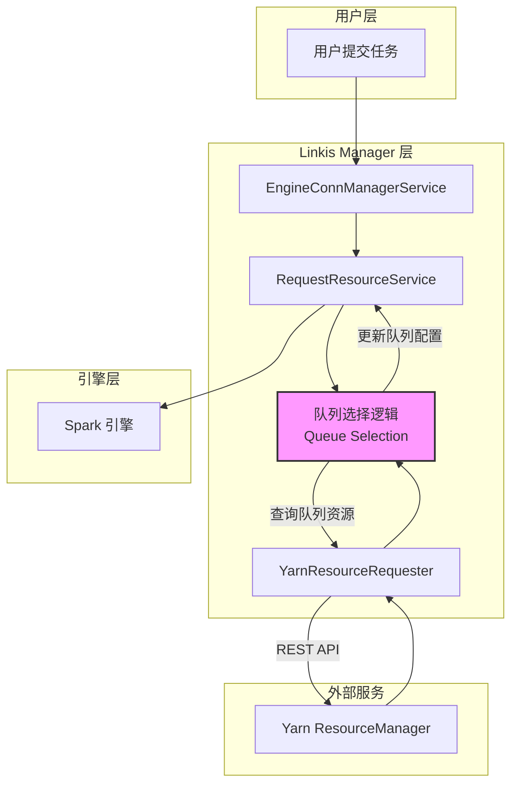
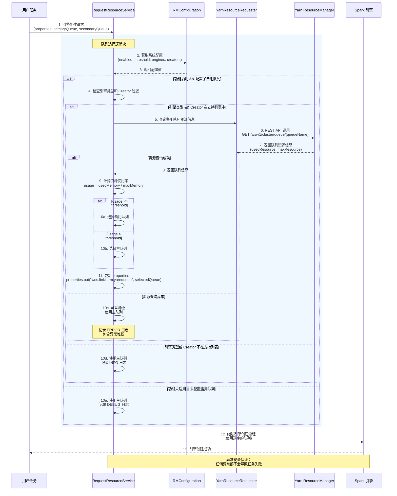

# Linkis Manager 智能队列选择 - 设计文档

## 文档信息
- **文档版本**: v1.0
- **最后更新**: 2026-04-09
- **维护人**: AI Assistant
- **文档状态**: 草稿
- **需求类型**: NEW
- **需求文档**: [linkis_manager_secondary_queue_需求.md](../requirements/linkis_manager_secondary_queue_需求.md)

---

## 执行摘要

> 📖 **阅读指引**：本章节为1页概览（约500字），用于快速理解设计方案。详细内容请参考后续章节。

### 设计目标

| 目标 | 描述 | 优先级 |
|-----|------|-------|
| 统一队列选择架构 | 在 Linkis Manager 层面实现智能队列选择，避免各引擎重复实现 | P0 |
| 支持主备队列配置 | 支持用户配置主队列和备用队列，根据资源使用情况自动选择 | P0 |
| 引擎类型过滤 | 当前仅支持 Spark 引擎，设计支持未来扩展到其他引擎 | P0 |
| 异常安全降级 | 任何异常都不影响任务执行，自动降级到主队列 | P0 |
| 零侵入集成 | 通过现有 properties 传递队列信息，无需修改 EngineCreateRequest 类结构 | P1 |

### 核心设计决策

| 决策点 | 选择方案 | 决策理由（一句话） | 替代方案 |
|-------|---------|------------------|---------|
| 队列选择实现位置 | Linkis Manager 层的 RequestResourceService | 统一管理、复用现有 YarnResourceRequester、易于扩展 | 各引擎单独实现 |
| 队列信息传递方式 | 复用 EngineCreateRequest.properties | 无需修改类结构、向后兼容、引擎插件无需改动 | 新增 selectedQueue 字段 |
| 异常处理策略 | 多层异常捕获 + 自动降级到主队列 | 确保任务执行不受影响、用户体验无感知 | 抛出异常导致任务失败 |
| 资源使用率计算 | 基于内存资源（usedMemory/maxMemory） | Yarn 主要基于内存分配、计算简单高效 | 综合内存和CPU加权计算 |
| 引擎类型过滤 | 配置支持的引擎列表（当前仅 spark） | 控制功能范围、降低风险、渐进式扩展 | 所有引擎默认启用 |

### 架构概览图

```
用户提交任务（带队列配置）
         ↓
┌─────────────────────────────────────────────────────────┐
│          Linkis Manager - RequestResourceService          │
│  ┌──────────────────────────────────────────────────┐   │
│  │ 1. 获取配置（主队列、备用队列、阈值、引擎类型）    │   │
│  └──────────────────────────────────────────────────┘   │
│                         ↓                                │
│  ┌──────────────────────────────────────────────────┐   │
│  │ 2. 检查引擎类型和Creator过滤                       │   │
│  └──────────────────────────────────────────────────┘   │
│                         ↓                                │
│  ┌──────────────────────────────────────────────────┐   │
│  │ 3. 查询备用队列资源使用率                          │   │
│  │    YarnResourceRequester.requestResourceInfo()    │   │
│  └──────────────────────────────────────────────────┘   │
│                         ↓                                │
│  ┌──────────────────────────────────────────────────┐   │
│  │ 4. 判断队列选择逻辑                                │   │
│  │    if (usage <= threshold) 用备用队列             │   │
│  │    else 用主队列                                  │   │
│  └──────────────────────────────────────────────────┘   │
│                         ↓                                │
│  ┌──────────────────────────────────────────────────┐   │
│  │ 5. 更新 properties                                 │   │
│  └──────────────────────────────────────────────────┘   │
└────────────────────────┬────────────────────────────────────┘
                         │
                         ↓
        ┌──────────────────────────────────────┐
        │  Spark 引擎插件（当前仅支持 Spark）   │
        │  - 从 options 读取队列配置             │
        │  - 使用选定的队列提交任务              │
        └──────────────────────────────────────┘
```

### 关键风险与缓解

| 风险 | 等级 | 缓解措施 |
|-----|------|---------|
| Yarn API 调用失败导致引擎创建失败 | 高 | 多层异常捕获、3秒超时控制、自动降级到主队列 |
| 高并发下 Yarn ResourceManager 压力 | 中 | 超时控制、异常降级、后续可增加本地缓存（TTL 5秒） |
| 队列资源信息实时性延迟 | 低 | 已接受，不影响核心功能 |
| 配置错误导致功能异常 | 低 | 配置验证、详细日志记录、异常降级 |

### 核心指标

| 指标 | 目标值 | 说明 |
|-----|-------|------|
| 队列查询耗时 | P95 < 500ms | Yarn REST API 调用性能 |
| 引擎创建影响时间 | < 1s | 相比原有流程增加的时间 |
| 并发支持 | 10 QPS | 同时处理的队列选择请求数 |
| 异常降级成功率 | 100% | 任何异常都应成功降级到主队列 |
| 单元测试覆盖率 | > 80% | 核心逻辑测试覆盖率 |

### 章节导航

| 关注点 | 推荐章节 |
|-------|---------|
| 想了解整体架构 | [1.1 系统架构设计](#11-系统架构设计) |
| 想了解核心流程 | [1.2 核心流程设计](#12-核心流程设计) |
| 想了解接口定义 | [1.3 关键接口定义](#13-关键接口定义) |
| 想了解配置设计 | [2.3 配置策略](#23-配置策略) |
| 想了解异常处理 | [1.4 设计决策记录](#14-设计决策记录-adr) |
| 想查看完整代码 | [3.2 完整代码示例](#32-完整代码示例) |

---

# Part 1: 核心设计

> 🎯 **本层目标**：阐述架构决策、核心流程、关键接口，完整详细展开。
>
> **预计阅读时间**：10-15分钟

## 1.1 系统架构设计

### 1.1.1 架构模式选择

**采用模式**：分层架构 + 责任链模式

**选择理由**：
- Linkis Manager 本身采用分层架构，队列选择逻辑作为资源管理流程的一个环节
- 责任链模式确保队列选择失败时能够优雅降级，不影响后续流程
- 符合 Linkis 现有架构风格，降低集成复杂度

**架构分层图**：



### 1.1.2 模块划分

| 模块 | 职责 | 对外接口 | 依赖 |
|-----|------|---------|------|
| RequestResourceService | 资源请求服务，集成队列选择逻辑 | requestResource() | ExternalResourceService, LabelUtils |
| QueueSelectionLogic | 队列选择核心逻辑（内嵌在 RequestResourceService 中） | 队列选择算法 | YarnResourceRequester, RMConfiguration |
| YarnResourceRequester | Yarn 资源查询器 | requestResourceInfo() | Yarn REST API |
| RMConfiguration | 配置管理 | 配置项定义 | Spring Configuration |
| SparkEngineConnPlugin | Spark 引擎插件（无需修改） | 从 options 读取队列 | EngineCreationContext |

### 1.1.3 技术选型

| 层级 | 技术 | 版本 | 选型理由 |
|-----|------|------|---------|
| 开发语言 | Scala | 2.11.12 | RequestResourceService 使用 Scala 编写 |
| 配置管理 | CommonVars | Linkis 1.18.0 | 复用 Linkis 现有配置机制 |
| HTTP 客户端 | HttpURLConnection | Java 1.8 | YarnResourceRequester 现有实现 |
| 日志 | Log4j2 | Linkis 版本 | 详细记录队列选择决策过程 |

---

## 1.2 核心流程设计

### 1.2.1 智能队列选择流程时序图



#### 关键节点说明

| 节点 | 处理逻辑 | 输入/输出 | 异常处理 |
|-----|---------|----------|---------|
| 1. 引擎创建请求 | 用户提交任务时传入队列配置参数 | 输入: properties (primaryQueue, secondaryQueue)<br>输出: 引擎创建请求对象 | 参数缺失时使用默认值 |
| 2-3. 获取系统配置 | 从 RMConfiguration 读取功能开关、阈值、支持的引擎和 Creator 列表 | 输入: 配置键<br>输出: enabled, threshold, engines, creators | 配置缺失时使用默认值 |
| 4. 检查过滤条件 | 检查引擎类型和 Creator 是否在支持列表中 | 输入: engineType, creator<br>输出: boolean (是否匹配) | Label 解析失败时使用主队列 |
| 5-8. 查询队列资源 | 通过 Yarn REST API 获取备用队列的资源使用情况 | 输入: secondaryQueue<br>输出: YarnQueueInfo (usedResource, maxResource) | 异常时捕获并降级到主队列 |
| 9. 计算使用率 | 基于内存计算资源使用率 | 输入: usedMemory, maxMemory<br>输出: usage (0-1) | maxResource 为 0 时返回 0.0 |
| 10. 队列选择决策 | 根据使用率和阈值选择队列 | 输入: usage, threshold<br>输出: selectedQueue | 异常时选择主队列 |
| 11. 更新配置 | 将选定的队列写入 properties | 输入: selectedQueue<br>输出: 更新后的 properties | 更新失败不影响任务执行 |
| 12-13. 引擎创建 | 使用选定的队列创建引擎 | 输入: 更新后的 properties<br>输出: 引擎实例 | 按原有流程处理 |

#### 技术难点与解决方案

| 难点 | 问题描述 | 解决方案 | 决策理由 |
|-----|---------|---------|---------|
| 异常安全保障 | 任何异常都不能影响任务执行 | 多层异常捕获 + 自动降级到主队列 | 任务执行优先，队列选择是增强功能 |
| Label 解析容错 | Label 可能缺失或格式错误 | try-catch 捕获异常，失败时使用主队列 | Label 信息不应阻塞任务创建 |
| Yarn API 调用可靠性 | 网络问题或 Yarn 服务不可用 | 3秒超时 + 异常捕获 + 降级策略 | 外部依赖不能影响核心流程 |
| 并发场景处理 | 多个任务同时查询队列资源 | 无状态设计，各任务独立查询 | 简单可靠，无需引入缓存复杂性 |
| 引擎类型过滤 | 当前仅支持 Spark，未来需扩展 | 配置化引擎列表，支持灵活扩展 | 控制功能范围，降低上线风险 |

#### 边界与约束

- **前置条件**：
  - Yarn ResourceManager 运行正常且可访问
  - 用户配置的主队列必须存在
  - Linkis Manager 服务正常运行

- **后置保证**：
  - 无论是否启用智能队列选择，任务都能正常执行
  - properties 中的 `wds.linkis.rm.yarnqueue` 一定被设置为主队列或备用队列
  - 所有异常都记录详细日志，便于问题排查

- **并发约束**：
  - 支持多任务并发进行队列选择
  - 各任务独立查询 Yarn API，无共享状态
  - 无需加锁或同步机制

- **性能约束**：
  - Yarn API 调用超时时间：3秒
  - 队列选择逻辑不应增加超过 1 秒的引擎创建时间
  - 支持 10 QPS 的并发队列选择请求

### 1.2.2 异常处理流程时序图

```mermaid
sequenceDiagram
    participant RRS as RequestResourceService
    participant QS as 队列选择逻辑
    participant YRQ as YarnResourceRequester
    participant Logger as 日志系统

    rect rgb(255, 240, 240)
    Note over RRS,Logger: 异常处理场景示例

    RRS->>QS: 尝试执行队列选择

    alt 场景1：Label 解析异常
        QS->>QS: LabelUtils.parseLabel(labels)
        QS-->>Logger: ERROR: "Failed to parse labels, fallback to primary queue"
        QS-->>RRS: 使用主队列
    else 场景2：Yarn API 连接异常
        QS->>YRQ: requestResourceInfo(secondaryQueue)
        YRQ-->>Logger: ERROR: "Failed to connect to Yarn ResourceManager"
        YRQ-->>QS: 抛出 ConnectException
        QS-->>Logger: ERROR: "Exception during queue resource check, fallback to primary queue"
        QS-->>RRS: 使用主队列
    else 场景3：队列不存在异常
        QS->>YRQ: requestResourceInfo(secondaryQueue)
        YRQ-->>Logger: ERROR: "Queue not found"
        YRQ-->>QS: 抛出 QueueNotFoundException
        QS-->>Logger: ERROR: "Queue not available, fallback to primary queue"
        QS-->>RRS: 使用主队列
    else 场景4：未预期异常
        QS->>QS: 执行队列选择逻辑
        QS-->>Logger: ERROR: "Unexpected error in queue selection logic"
        QS-->>RRS: 使用主队列
    end

    Note over RRS: 任务继续执行，不受任何异常影响
    ```

#### 异常处理关键节点说明

| 节点 | 处理逻辑 | 输入/输出 | 异常处理 |
|-----|---------|----------|---------|
| Label 解析异常 | 解析 Label 获取引擎类型和 Creator | 输入: labels<br>输出: engineType, creator 或 null | 捕获所有异常，记录 ERROR 日志，使用主队列 |
| Yarn API 连接异常 | 调用 Yarn REST API 查询队列资源 | 输入: queueName<br>输出: YarnQueueInfo 或异常 | 捕获 ConnectException，记录 ERROR 日志 + 堆栈，使用主队列 |
| 队列不存在异常 | 查询的队列在 Yarn 中不存在 | 输入: queueName<br>输出: 异常 | 捕获异常，记录 ERROR 日志，使用主队列 |
| 超时异常 | Yarn API 调用超时（3秒） | 输入: queueName<br>输出: 异常 | 捕获 TimeoutException，记录 ERROR 日志，使用主队列 |
| 未预期异常 | 其他任何运行时异常 | 输入: 任意<br>输出: 异常 | 最外层捕获，记录 ERROR 日志 + 完整堆栈，使用主队列 |

---

## 1.3 关键接口定义

> ⚠️ **注意**：本节只包含接口签名和职责说明，完整实现请参考 [3.2 完整代码示例](#32-完整代码示例)。

### 1.3.1 RMConfiguration 配置接口

```java
/**
 * Linkis Manager 资源管理配置类
 *
 * 核心职责：
 * 1. 定义智能队列选择功能开关
 * 2. 定义资源使用率阈值
 * 3. 定义支持的引擎类型和 Creator 列表
 */
public class RMConfiguration {

    /**
     * 是否启用第二队列功能
     *
     * 核心逻辑：
     * 1. true: 启用智能队列选择
     * 2. false: 禁用功能，所有任务使用主队列
     *
     * @return 是否启用
     */
    public static final CommonVars<Boolean> SECONDARY_QUEUE_ENABLED =
        CommonVars.apply("wds.linkis.rm.secondary.yarnqueue.enable", Boolean.class, true);

    /**
     * 第二队列资源使用率阈值
     *
     * 核心逻辑：
     * 1. 当备用队列使用率 <= 此值时，使用备用队列
     * 2. 当备用队列使用率 > 此值时，使用主队列
     * 3. 取值范围：0.0 - 1.0
     *
     * @return 阈值（0-1）
     */
    public static final CommonVars<Double> SECONDARY_QUEUE_THRESHOLD =
        CommonVars.apply("wds.linkis.rm.secondary.yarnqueue.threshold", Double.class, 0.9);

    /**
     * 支持的引擎类型列表（逗号分隔）
     *
     * 核心逻辑：
     * 1. 只有在此列表中的引擎才会执行智能队列选择
     * 2. 当前仅支持 spark
     * 3. 不区分大小写
     *
     * @return 引擎类型列表（如 "spark,hive,flink"）
     */
    public static final CommonVars<String> SECONDARY_QUEUE_ENGINES =
        CommonVars.apply("wds.linkis.rm.secondary.yarnqueue.engines", "spark");

    /**
     * 支持的 Creator 列表（逗号分隔）
     *
     * 核心逻辑：
     * 1. 只有在此列表中的 Creator 才会执行智能队列选择
     * 2. 默认支持 IDE, NOTEBOOK, CLIENT
     * 3. 不区分大小写
     *
     * @return Creator 列表（如 "IDE,NOTEBOOK,CLIENT"）
     */
    public static final CommonVars<String> SECONDARY_QUEUE_CREATORS =
        CommonVars.apply("wds.linkis.rm.secondary.yarnqueue.creators", "IDE,NOTEBOOK,CLIENT");
}
```

### 1.3.2 RequestResourceService 核心方法（修改点）

```scala
/**
 * 资源请求服务
 *
 * 核心职责：
 * 1. 处理引擎创建的资源请求
 * 2. 集成智能队列选择逻辑
 * 3. 确保任何异常都不影响任务执行
 */
trait RequestResourceService {

    /**
     * 请求资源（核心方法，需修改）
     *
     * 核心逻辑：
     * 1. 获取用户配置（主队列、备用队列）
     * 2. 获取系统配置（功能开关、阈值、引擎列表）
     * 3. 检查引擎类型和 Creator 过滤
     * 4. 查询备用队列资源使用率
     * 5. 根据阈值选择队列
     * 6. 更新 properties
     * 7. 继续原有资源请求流程
     *
     * 异常处理：
     * - 所有异常都必须被捕获
     * - 异常时自动降级到主队列
     * - 记录详细的 ERROR 日志
     *
     * @param labels 标签列表（包含引擎类型、用户、Creator）
     * @param resource 请求的资源
     * @param engineCreateRequest 引擎创建请求（包含 properties）
     * @param wait 等待时间
     * @return 资源结果
     */
    def requestResource(
        labels: util.List[Label[_]],
        resource: NodeResource,
        engineCreateRequest: EngineCreateRequest,
        wait: Long
    ): ResultResource
}
```

### 1.3.3 YarnResourceRequester 接口（无需修改）

```java
/**
 * Yarn 资源请求器（现有接口，无需修改）
 *
 * 核心职责：
 * 1. 通过 Yarn REST API 查询队列资源
 * 2. 解析 Yarn 队列信息
 */
public class YarnResourceRequester {

    /**
     * 请求资源信息（现有方法）
     *
     * 核心逻辑：
     * 1. 构建 Yarn REST API URL
     * 2. 调用 GET /ws/v1/cluster/queue/{queueName}
     * 3. 解析响应获取资源信息
     *
     * @param identifier Yarn 资源标识符（包含队列名）
     * @param provider 外部资源提供者
     * @return 节点资源信息（包含已使用和最大资源）
     * @throws LinkisRuntimeException Yarn API 调用失败
     */
    public NodeResource requestResourceInfo(
        ExternalResourceIdentifier identifier,
        ExternalResourceProvider provider
    ) {
        // 现有实现，无需修改
    }
}
```

### 1.3.4 核心业务规则

| 规则编号 | 规则描述 | 触发条件 | 处理逻辑 |
|---------|---------|---------|---------|
| BR-001 | 功能启用检查 | enabled=true && 配置了备用队列 | 执行智能队列选择 |
| BR-002 | 功能禁用处理 | enabled=false 或未配置备用队列 | 使用主队列，记录 DEBUG 日志 |
| BR-003 | 引擎类型过滤 | engineType 在支持列表中 | 继续队列选择流程 |
| BR-004 | 引擎类型过滤 | engineType 不在支持列表中 | 使用主队列，记录 INFO 日志 |
| BR-005 | Creator 过滤 | creator 在支持列表中 | 继续队列选择流程 |
| BR-006 | Creator 过滤 | creator 不在支持列表中 | 使用主队列，记录 INFO 日志 |
| BR-007 | 队列选择决策 | usage <= threshold | 使用备用队列 |
| BR-008 | 队列选择决策 | usage > threshold | 使用主队列 |
| BR-009 | 异常降级 | 任何异常发生 | 使用主队列，记录 ERROR 日志 |
| BR-010 | Label 解析容错 | Label 解析失败 | 使用主队列，记录 ERROR 日志 |

---

## 1.4 设计决策记录 (ADR)

### ADR-001: 队列选择逻辑实现位置

- **状态**：已采纳
- **背景**：需要在 Linkis 中实现智能队列选择功能，可以选择在各引擎插件中实现，或在 Linkis Manager 层统一实现。
- **决策**：在 Linkis Manager 层的 RequestResourceService 中实现队列选择逻辑
- **选项对比**：

| 选项 | 优点 | 缺点 | 适用场景 |
|-----|------|------|---------|
| Linkis Manager 层实现 | ✅ 统一管理，一处修改全局生效<br>✅ 复用现有 YarnResourceRequester<br>✅ 易于扩展到新引擎<br>✅ 架构合理，资源管理在 Manager 层 | ❌ 需要修改核心服务 | ✅ 当前选择 |
| 各引擎插件实现 | ✅ 灵活度高，各引擎独立 | ❌ 重复实现，维护成本高<br>❌ 策略不统一<br>❌ 浪费已有能力 | ❌ 不推荐 |

- **结论**：选择在 Linkis Manager 层实现，理由是架构合理、易于维护、可复用现有能力。
- **影响**：需要修改 RequestResourceService.scala 文件，增加队列选择逻辑。

### ADR-002: 队列信息传递方式

- **状态**：已采纳
- **背景**：需要将选定的队列传递给引擎插件，有多种方式可以选择。
- **决策**：复用 EngineCreateRequest.properties，覆盖 `wds.linkis.rm.yarnqueue` 的值
- **选项对比**：

| 选项 | 优点 | 缺点 | 适用场景 |
|-----|------|------|---------|
| 复用 properties | ✅ 无需修改类结构<br>✅ 向后兼容<br>✅ 引擎插件无需改动<br>✅ 简单直接 | ❌ 覆盖了原始配置 | ✅ 当前选择 |
| 新增 selectedQueue 字段 | ✅ 保留原始配置 | ❌ 需要修改 EngineCreateRequest<br>❌ 引擎插件需要适配<br>❌ 破坏向后兼容性 | ❌ 不推荐 |
| 使用新的配置键 | ✅ 保留原始配置 | ❌ 引擎插件需要适配<br>❌ 增加配置复杂度 | ❌ 不推荐 |

- **结论**：选择复用 properties，理由是无侵入、向后兼容、实现简单。
- **影响**：无需修改 EngineCreateRequest 类，引擎插件无需改动。

### ADR-003: 异常处理策略

- **状态**：已采纳
- **背景**：队列选择逻辑涉及外部依赖（Yarn API），可能出现各种异常，需要设计合理的异常处理策略。
- **决策**：多层异常捕获 + 自动降级到主队列，确保任何异常都不影响任务执行
- **选项对比**：

| 选项 | 优点 | 缺点 | 适用场景 |
|-----|------|------|---------|
| 多层异常捕获 + 降级 | ✅ 任务执行优先<br>✅ 用户体验无感知<br>✅ 详细日志记录 | ❌ 异常时无法使用备用队列 | ✅ 当前选择 |
| 抛出异常导致任务失败 | ✅ 问题能及时发现 | ❌ 影响用户体验<br>❌ 违背设计目标 | ❌ 不推荐 |
| 重试机制 | ✅ 提高成功率 | ❌ 增加延迟<br>❌ 复杂度高 | ❌ 不推荐 |

- **结论**：选择异常降级策略，理由是任务执行优先、用户体验无感知、实现简单。
- **影响**：需要在关键操作处添加 try-catch 块，确保异常被正确处理。

### ADR-004: 引擎类型过滤策略

- **状态**：已采纳
- **背景**：当前需求仅支持 Spark 引擎，但需要考虑未来扩展性，如何控制功能范围？
- **决策**：通过配置支持引擎类型列表，当前仅配置 spark，未来可扩展
- **选项对比**：

| 选项 | 优点 | 缺点 | 适用场景 |
|-----|------|------|---------|
| 配置化引擎列表 | ✅ 灵活可控<br>✅ 易于扩展<br>✅ 降低上线风险 | ❌ 需要配置管理 | ✅ 当前选择 |
| 硬编码仅支持 Spark | ✅ 实现简单 | ❌ 未来需要修改代码<br>❌ 扩展性差 | ❌ 不推荐 |
| 默认支持所有引擎 | ✅ 覆盖范围广 | ❌ 风险高<br>❌ 测试成本高 | ❌ 不推荐 |

- **结论**：选择配置化引擎列表，理由是灵活可控、易于扩展、降低风险。
- **影响**：需要在 RMConfiguration 中增加引擎列表配置项。

### ADR-005: 资源使用率判断方式

- **状态**：已采纳
- **背景**：需要判断备用队列资源是否充足，可以选择综合计算或独立判断。
- **决策**：基于内存、CPU、实例数的**三维度独立判断**（所有维度都必须满足）
- **选项对比**：

| 选项 | 优点 | 缺点 | 适用场景 |
|-----|------|------|---------|
| 单一维度（仅内存） | ✅ Yarn 主要基于内存分配<br>✅ 计算简单高效 | ❌ 未考虑 CPU 和实例数 | ❌ 不够全面 |
| 三维度加权平均 | ✅ 考虑全面<br>✅ 权重可配置 | ❌ 加权系数难以确定<br>❌ 计算稍复杂 | 📋 备选方案 |
| 三维度独立判断 | ✅ 考虑全面（内存+CPU+实例数）<br>✅ 逻辑简单直观<br>✅ 保守策略，更安全<br>✅ 日志清晰，易排查 | ❌ 相对保守 | ✅ **当前选择** |

- **结论**：选择三维度独立判断，理由是逻辑简单、保守安全、易于理解和调试。
- **影响**：判断逻辑为 `allUnderThreshold = memoryUsage <= threshold && cpuUsage <= threshold && instancesUsage <= threshold`，只要有一个维度超过阈值就使用主队列。

---

# Part 2: 支撑设计

> 📐 **本层目标**：数据模型、API规范、配置策略的结构化摘要。
>
> **预计阅读时间**：5-10分钟

## 2.1 数据模型设计

### 2.1.1 配置参数数据结构

**配置参数说明**：本功能不涉及数据库表，仅使用内存中的配置参数。

**用户配置参数**（从任务提交时传入）：

| 参数名 | 类型 | 必填 | 说明 | 默认值 |
|-------|------|:----:|------|--------|
| wds.linkis.rm.yarnqueue | String | ✅ | 主队列名称 | - |
| wds.linkis.rm.secondary.yarnqueue | String | ❌ | 备用队列名称 | null |
| wds.linkis.rm.secondary.yarnqueue.threshold | Double | ❌ | 任务级阈值（可选覆盖系统配置） | 使用系统配置 |

**系统配置参数**（从 Linkis 配置文件读取）：

| 配置项 | 类型 | 默认值 | 说明 | 调整建议 |
|-------|------|--------|------|---------|
| wds.linkis.rm.secondary.yarnqueue.enable | Boolean | true | 是否启用智能队列选择功能 | 生产环境可先设为 false 观察效果 |
| wds.linkis.rm.secondary.yarnqueue.threshold | Double | 0.9 | 资源使用率阈值（0-1） | 根据实际资源情况调整，建议 0.8-0.95 |
| wds.linkis.rm.secondary.yarnqueue.engines | String | "spark" | 支持的引擎类型（逗号分隔） | 扩展支持其他引擎时添加 |
| wds.linkis.rm.secondary.yarnqueue.creators | String | "IDE,NOTEBOOK,CLIENT" | 支持的 Creator（逗号分隔） | 根据实际需要调整 |

### 2.1.2 队列资源信息数据结构

**Yarn 队列资源信息**（来自 Yarn REST API 响应）：

| 字段名 | 类型 | 说明 | 来源 |
|-------|------|------|------|
| maxResource | Resource | 队列最大资源（含内存、CPU） | Yarn API |
| usedResource | Resource | 已使用资源（含内存、CPU） | Yarn API |
| maxApps | Int | 最大应用数 | Yarn API |
| numPendingApps | Int | 等待中的应用数 | Yarn API |
| numActiveApps | Int | 运行中的应用数 | Yarn API |

**Resource 数据结构**：

| 字段名 | 类型 | 说明 | 单位 |
|-------|------|------|------|
| maxMemory | Long | 最大内存 | MB |
| maxCores | Int | 最大 CPU 核心数 | cores |
| maxResources | Map[String, String] | 其他自定义资源 | - |

---

## 2.2 API规范设计

### 2.2.1 外部依赖 API 列表

**Yarn REST API**（外部依赖）：

| 方法 | 路径 | 描述 | 认证 | 超时 | 异常处理 |
|-----|------|------|------|------|---------|
| GET | /ws/v1/cluster/queue/{queueName} | 查询队列资源信息 | Kerberos / Simple | 3s | 降级到主队列 |

**请求示例**：
```bash
curl -X GET 'http://yarn-rm:8088/ws/v1/cluster/queue/root.backup'
```

**响应摘要**：

| 字段 | 类型 | 说明 |
|-----|------|------|
| queues | Object | 队列信息对象 |
| queues.queueName | String | 队列名称 |
| queues.capacity | Float | 队列容量百分比 |
| queues.usedCapacity | Float | 已使用容量百分比 |
| queues.maxResources | Object | 最大资源 |
| queues.usedResources | Object | 已使用资源 |
| queues.maxApps | Int | 最大应用数 |
| queues.numPendingApps | Int | 等待中的应用数 |
| queues.numActiveApps | Int | 运行中的应用数 |

> 完整 JSON 示例请参考 [3.3 API请求响应示例](#33-api请求响应示例)

### 2.2.2 内部接口调用

**RequestResourceService.requestResource()**（内部接口）：

- **接口描述**：请求资源，集成队列选择逻辑
- **调用位置**：EngineConnManagerService
- **关键参数**：
  - `labels: util.List[Label[_]]` - 标签列表（包含引擎类型、用户、Creator）
  - `engineCreateRequest: EngineCreateRequest` - 引擎创建请求（包含 properties）
- **修改内容**：在方法开头增加队列选择逻辑
- **向后兼容性**：完全兼容，未配置时行为与原来一致

---

## 2.3 配置策略

### 2.3.1 关键配置项

| 配置项 | 默认值 | 说明 | 调整建议 |
|-------|-------|------|---------|
| wds.linkis.rm.secondary.yarnqueue.enable | true | 功能总开关 | 建议先设为 false 观察效果，确认无问题后开启 |
| wds.linkis.rm.secondary.yarnqueue.threshold | 0.9 | 资源使用率阈值 | 根据集群资源紧张程度调整（0.8-0.95） |
| wds.linkis.rm.secondary.yarnqueue.engines | spark | 支持的引擎类型 | 扩展时添加（如 "spark,hive"） |
| wds.linkis.rm.secondary.yarnqueue.creators | IDE,NOTEBOOK,CLIENT | 支持的 Creator | 根据实际使用的 Creator 调整 |

### 2.3.2 环境差异配置

| 配置项 | 开发环境 | 测试环境 | 生产环境 |
|-------|---------|---------|---------|
| wds.linkis.rm.secondary.yarnqueue.enable | true | true | 建议先 false，观察后开启 |
| wds.linkis.rm.secondary.yarnqueue.threshold | 0.9 | 0.9 | 0.85（更保守） |
| wds.linkis.rm.secondary.yarnqueue.engines | spark | spark | spark |
| wds.linkis.rm.secondary.yarnqueue.creators | IDE,NOTEBOOK,CLIENT | IDE,NOTEBOOK,CLIENT | IDE,NOTEBOOK,CLIENT |

### 2.3.3 配置优先级

**配置优先级**（从高到低）：

1. **任务级配置**：用户在提交任务时传入的 properties
   - `wds.linkis.rm.secondary.yarnqueue.threshold`（可选）

2. **系统级配置**：Linkis 配置文件中的配置
   - `wds.linkis.rm.secondary.yarnqueue.enable`
   - `wds.linkis.rm.secondary.yarnqueue.threshold`
   - `wds.linkis.rm.secondary.yarnqueue.engines`
   - `wds.linkis.rm.secondary.yarnqueue.creators`

3. **默认值**：代码中定义的默认值
   - enable: true
   - threshold: 0.9
   - engines: "spark"
   - creators: "IDE,NOTEBOOK,CLIENT"

> 完整配置文件示例请参考 [3.4 配置文件示例](#34-配置文件示例)

---

## 2.4 测试策略

### 2.4.1 测试范围

| 测试类型 | 覆盖范围 | 优先级 |
|---------|---------|-------|
| 单元测试 | 队列选择逻辑、配置解析、异常处理 | P0 |
| 集成测试 | RequestResourceService 集成测试、Yarn API 调用测试 | P0 |
| 功能测试 | 队列选择功能、引擎集成测试 | P0 |
| 异常测试 | 各种异常场景的降级测试 | P0 |
| 性能测试 | 队列查询耗时、并发性能 | P1 |
| 多引擎测试 | Spark、Hive、Flink 等引擎的过滤测试 | P1 |

### 2.4.2 关键测试场景

| 场景 | 输入 | 预期输出 | 优先级 |
|-----|------|---------|-------|
| 备用队列可用（资源充足） | secondary=queue2, 使用率 72%, 阈值 0.9 | 使用备用队列 | P0 |
| 备用队列不可用（资源紧张） | secondary=queue2, 使用率 95%, 阈值 0.9 | 使用主队列 | P0 |
| 未配置备用队列 | primary=queue1, secondary=null | 使用主队列 | P0 |
| 功能禁用 | enabled=false | 使用主队列 | P0 |
| Spark 引擎 | engineType=spark | 执行队列选择逻辑 | P0 |
| Hive 引擎 | engineType=hive | 使用主队列（不在支持列表） | P1 |
| Creator 过滤（IDE） | creator=IDE | 执行队列选择逻辑 | P1 |
| Creator 过滤（SHELL） | creator=SHELL | 使用主队列（不在支持列表） | P1 |
| Yarn 连接异常 | Yarn 服务不可用 | 使用主队列，记录 ERROR 日志 | P0 |
| Label 解析异常 | Label 格式错误 | 使用主队列，记录 ERROR 日志 | P0 |
| 队列不存在 | secondary=nonexistent | 使用主队列，记录 ERROR 日志 | P0 |
| 并发测试 | 10 个并发任务 | 各任务独立选择队列 | P1 |

### 2.4.3 测试用例设计

**单元测试用例**：

| 用例ID | 测试类 | 测试方法 | 描述 |
|-------|-------|---------|------|
| UT-001 | RequestResourceServiceTest | testQueueSelection_WhenSecondaryAvailable | 测试备用队列可用时选择备用队列 |
| UT-002 | RequestResourceServiceTest | testQueueSelection_WhenSecondaryNotAvailable | 测试备用队列不可用时选择主队列 |
| UT-003 | RequestResourceServiceTest | testQueueSelection_WhenSecondaryNotConfigured | 测试未配置备用队列时使用主队列 |
| UT-004 | RequestResourceServiceTest | testQueueSelection_WhenDisabled | 测试功能禁用时使用主队列 |
| UT-005 | RequestResourceServiceTest | testQueueSelection_EngineTypeFilter | 测试引擎类型过滤 |
| UT-006 | RequestResourceServiceTest | testQueueSelection_CreatorFilter | 测试 Creator 过滤 |
| UT-007 | RequestResourceServiceTest | testQueueSelection_YarnException | 测试 Yarn 异常时降级到主队列 |
| UT-008 | RequestResourceServiceTest | testQueueSelection_LabelParseException | 测试 Label 解析异常时降级到主队列 |

**集成测试用例**：

| 用例ID | 测试类 | 测试方法 | 描述 |
|-------|-------|---------|------|
| IT-001 | QueueSelectionIntegrationTest | testEndToEndQueueSelection | 端到端测试队列选择流程 |
| IT-002 | QueueSelectionIntegrationTest | testSparkEngineIntegration | 测试 Spark 引擎集成 |

---

## 2.5 外部依赖接口设计

> ⚠️ **适用性**：本功能依赖 Yarn ResourceManager 的 REST API。

### 2.5.1 外部服务契约状态总览

| 外部服务 | 契约状态 | 对接进度 | 影响功能 |
|---------|:--------:|---------|---------|
| Yarn ResourceManager REST API | ✅已确认 | 已完成，使用现有接口 | 所有队列选择功能 |

### 2.5.2 外部接口详细设计

#### Yarn ResourceManager REST API 接口

**契约状态**: ✅已确认

| 契约项 | 状态 | 内容 |
|--------|:----:|------|
| 接口地址 | ✅ | `http://{rmHost}:{rmPort}/ws/v1/cluster/queue/{queueName}` |
| 请求方式 | ✅ | GET |
| 认证方式 | ✅ | Kerberos / Simple Authentication |
| 请求格式 | ✅ | 无请求体 |
| 响应格式 | ✅ | JSON（Yarn 标准格式） |

**数据映射设计**：

| 本服务字段 | → | 外部服务字段 | 转换逻辑 |
|-----------|---|-------------|---------|
| usedMemory | → | queues.usedResources.memory | 直接映射（单位 MB） |
| maxMemory | → | queues.maxResources.memory | 直接映射（单位 MB） |
| usedCores | → | queues.usedResources.vCores | 直接映射 |
| maxCores | → | queues.maxResources.vCores | 直接映射 |

**响应处理设计**：

| 外部服务响应 | → | 本服务处理 | 说明 |
|-------------|---|-----------|------|
| HTTP 200 + 队列信息 | → | 解析资源信息，计算使用率 | 正常流程 |
| HTTP 404 | → | 队列不存在，降级到主队列 | 队列不存在异常 |
| HTTP 401 / 403 | → | 认证失败，降级到主队列 | 认证异常 |
| HTTP 500 / 503 | → | Yarn 服务异常，降级到主队列 | 服务异常 |
| 连接超时 | → | 超时异常，降级到主队列 | 超时异常（3秒） |

**异常处理设计**：

| 异常类型 | 检测条件 | 处理策略 | 重试策略 |
|---------|---------|---------|---------|
| 网络超时 | 连接超时 3 秒 | 降级到主队列，记录 ERROR 日志 | 不重试 |
| 连接拒绝 | ConnectException | 降级到主队列，记录 ERROR 日志 | 不重试 |
| 队列不存在 | HTTP 404 | 降级到主队列，记录 ERROR 日志 | 不重试 |
| 认证失败 | HTTP 401 / 403 | 降级到主队列，记录 ERROR 日志 | 不重试 |
| 服务异常 | HTTP 500 / 503 | 降级到主队列，记录 ERROR 日志 | 不重试 |
| 解析异常 | JSON 解析失败 | 降级到主队列，记录 ERROR 日志 | 不重试 |

### 2.5.3 外部依赖风险与缓解

| 风险 | 概率 | 影响 | 缓解措施 | 降级方案 |
|-----|:----:|:----:|---------|---------|
| Yarn ResourceManager 不可用 | 低 | 高 | 自动降级到主队列，记录 ERROR 日志 | 使用主队列 |
| 网络延迟或超时 | 中 | 中 | 3秒超时控制，异常降级 | 使用主队列 |
| 队列信息变更延迟 | 低 | 低 | 已接受，不影响核心功能 | 使用主队列 |
| 高并发下 Yarn 压力增大 | 中 | 中 | 超时控制，异常降级 | 后续可增加本地缓存（TTL 5秒） |

### 2.5.4 开发协调事项

> 📋 **待确认事项清单**（从需求文档同步）

| 待确认事项 | 关联功能 | 负责方 | 预计时间 | 当前进展 | 阻塞开发 |
|-----------|---------|--------|---------|---------|:--------:|
| 无 | - | - | - | 已完成 | 否 |

**协调建议**：
1. Yarn REST API 为 Hadoop 标准接口，无需额外协调
2. 使用 Linkis 现有的 YarnResourceRequester，已验证可用
3. 建议在测试环境充分验证 Yarn API 调用的稳定性

---

## 2.6 安全设计摘要

| 安全关注点 | 措施 | 说明 |
|-----------|------|------|
| 配置权限 | 只有管理员可以修改系统配置 | 通过配置文件管理，无需额外控制 |
| 用户输入验证 | 队列名称格式验证 | 防止注入攻击，虽然 Yarn API 本身有防护 |
| 日志安全 | 不记录敏感信息 | 日志中不包含密码等敏感信息 |
| 异常信息保护 | 异常信息仅记录日志，不返回给用户 | 防止信息泄露 |

---

## 2.7 监控与告警

### 2.7.1 关键指标

| 指标 | 阈值 | 告警级别 | 说明 |
|-----|------|---------|------|
| 队列查询耗时 | P95 > 500ms | P2 | Yarn API 调用性能 |
| 队列查询失败率 | > 5% | P1 | Yarn API 调用失败率 |
| 队列选择异常次数 | > 10次/分钟 | P2 | 队列选择逻辑异常 |
| 降级到主队列次数 | > 20% | P2 | 备用队列不可用比例 |

### 2.7.2 日志规范

**日志级别**：

| 级别 | 使用场景 | 示例 |
|-----|---------|------|
| INFO | 队列选择决策过程 | "Secondary queue available (72.00% <= 90.00%), selected: root.backup" |
| WARN | 降级到主队列（非异常） | "Engine type 'hive' not in supported list, use primary queue" |
| ERROR | 异常情况 | "Exception during queue resource check, fallback to primary queue" |
| DEBUG | 调试信息 | "Secondary queue not configured or disabled, use primary queue" |

**日志格式要求**：
- INFO 日志：记录队列选择决策，包含主队列、备用队列、阈值、使用率、选定队列
- WARN 日志：记录降级原因，包含引擎类型、Creator、支持列表
- ERROR 日志：记录异常类型、异常消息、完整堆栈信息

---

# Part 3: 参考资料

> 📎 **本层目标**：完整代码、脚本、配置，按需查阅。
>
> **使用方式**：点击展开查看详细内容

## 3.1 完整代码示例

<details>
<summary>📄 RMConfiguration.java - 配置类（需修改）</summary>

```java
/*
 * Licensed to the Apache Software Foundation (ASF) under one or more
 * contributor license agreements.  See the NOTICE file distributed with
 * this work for additional information regarding copyright ownership.
 * The ASF licenses this file to You under the Apache License, Version 2.0
 * (the "License"); you may not use this file except in compliance with
 * the License.  You may obtain a copy of the License at
 *
 *   http://www.apache.org/licenses/LICENSE-2.0
 *
 * Unless required by applicable law or agreed to in writing, software
 * distributed under the License is distributed on an "AS IS" BASIS,
 * WITHOUT WARRANTIES OR CONDITIONS OF ANY KIND, either express or implied.
 * See the License for the specific language governing permissions and
 * limitations under the License.
 */

package org.apache.linkis.manager.common.conf;

import org.apache.linkis.common.conf.CommonVars;

/**
 * Linkis Manager 资源管理配置类
 *
 * 新增配置项（智能队列选择功能）：
 * 1. wds.linkis.rm.secondary.yarnqueue.enable - 是否启用智能队列选择
 * 2. wds.linkis.rm.secondary.yarnqueue.threshold - 资源使用率阈值
 * 3. wds.linkis.rm.secondary.yarnqueue.engines - 支持的引擎类型
 * 4. wds.linkis.rm.secondary.yarnqueue.creators - 支持的 Creator
 */
public class RMConfiguration {

    /**
     * 是否启用第二队列功能
     * 默认值：true
     * 说明：true 启用智能队列选择，false 禁用功能
     */
    public static final CommonVars<Boolean> SECONDARY_QUEUE_ENABLED =
        CommonVars.apply("wds.linkis.rm.secondary.yarnqueue.enable", Boolean.class, true);

    /**
     * 第二队列资源使用率阈值
     * 默认值：0.9（90%）
     * 说明：当备用队列使用率 <= 此值时，使用备用队列
     *      当备用队列使用率 > 此值时，使用主队列
     */
    public static final CommonVars<Double> SECONDARY_QUEUE_THRESHOLD =
        CommonVars.apply("wds.linkis.rm.secondary.yarnqueue.threshold", Double.class, 0.9);

    /**
     * 支持的引擎类型列表（逗号分隔）
     * 默认值：spark
     * 说明：只有在此列表中的引擎才会执行智能队列选择
     *      不区分大小写
     */
    public static final CommonVars<String> SECONDARY_QUEUE_ENGINES =
        CommonVars.apply("wds.linkis.rm.secondary.yarnqueue.engines", "spark");

    /**
     * 支持的 Creator 列表（逗号分隔）
     * 默认值：IDE,NOTEBOOK,CLIENT
     * 说明：只有在此列表中的 Creator 才会执行智能队列选择
     *      不区分大小写
     */
    public static final CommonVars<String> SECONDARY_QUEUE_CREATORS =
        CommonVars.apply("wds.linkis.rm.secondary.yarnqueue.creators", "IDE,NOTEBOOK,CLIENT");

    // ... 其他现有配置项 ...
}
```

</details>

<details>
<summary>📄 RequestResourceService.scala - 核心修改（需修改）</summary>

```scala
/*
 * Licensed to the Apache Software Foundation (ASF) under one or more
 * contributor license agreements.  See the NOTICE file distributed with
 * this work for additional information regarding copyright ownership.
 * The ASF licenses this file to You under the Apache License, Version 2.0
 * (the "License"); you may not use this file except in compliance with
 * the License.  You may obtain a copy of the License at
 *
 *   http://www.apache.org/licenses/LICENSE-2.0
 *
 * Unless required by applicable law or agreed to in writing, software
 * distributed under the License is distributed on an "AS IS" BASIS,
 * WITHOUT WARRANTIES OR CONDITIONS OF ANY KIND, either express or implied.
 * See the License for the specific language governing permissions and
 * limitations under the License.
 */

package org.apache.linkis.manager.rm.service

import org.apache.linkis.common.utils.{Logging, Utils}
import org.apache.linkis.manager.common.conf.RMConfiguration
import org.apache.linkis.manager.common.entity.resource._
import org.apache.linkis.manager.label.entity.Label
import org.apache.linkis.manager.label.entity.engine.EngineTypeLabel
import org.apache.linkis.manager.label.entity.user.UserCreatorLabel
import org.apache.linkis.manager.rm.external.service.ExternalResourceService
import org.apache.linkis.manager.rm.external.yarn.YarnResourceIdentifier
import org.apache.commons.lang3.StringUtils
import org.springframework.beans.factory.annotation.Autowired
import org.springframework.stereotype.Service

import scala.collection.JavaConverters._
import java.util

/**
 * 资源请求服务实现
 *
 * 修改说明：
 * 1. 在 requestResource 方法开头增加智能队列选择逻辑
 * 2. 队列选择逻辑包括：
 *    - 获取配置（主队列、备用队列、阈值、引擎类型、Creator）
 *    - 检查引擎类型和 Creator 过滤
 *    - 查询备用队列资源使用率
 *    - 根据阈值选择队列
 *    - 更新 properties
 * 3. 异常处理：任何异常都不影响任务执行，自动降级到主队列
 */
@Service
class DefaultRequestResourceService extends RequestResourceService with Logging {

  @Autowired
  private var externalResourceService: ExternalResourceService = _

  @Autowired
  private var externalResourceProvider: ExternalResourceProvider = _

  /**
   * 请求资源（核心方法）
   *
   * 修改内容：在方法开头增加智能队列选择逻辑
   */
  override def requestResource(
      labels: util.List[Label[_]],
      resource: NodeResource,
      engineCreateRequest: EngineCreateRequest,
      wait: Long
  ): ResultResource = {

    // ========== 新增：智能队列选择逻辑 ==========
    // 重要：任何异常都不能影响任务执行，异常时直接使用主队列
    try {
      // 1. 获取用户配置（从任务参数）
      val properties = if (engineCreateRequest.getProperties != null) {
        engineCreateRequest.getProperties
      } else {
        new util.HashMap[String, String]()
      }

      // 2. 获取队列配置（用户配置）
      val primaryQueue = properties.get("wds.linkis.rm.yarnqueue")
      val secondaryQueue = properties.get("wds.linkis.rm.secondary.yarnqueue")

      // 3. 获取系统配置（Linkis 配置）
      val enabled = RMConfiguration.SECONDARY_QUEUE_ENABLED.getValue
      val threshold = RMConfiguration.SECONDARY_QUEUE_THRESHOLD.getValue
      val supportedEngines = RMConfiguration.SECONDARY_QUEUE_ENGINES.getValue.split(",").map(_.trim).toSet
      val supportedCreators = RMConfiguration.SECONDARY_QUEUE_CREATORS.getValue.split(",").map(_.trim).toSet

      // 4. 检查是否启用第二队列功能
      if (enabled && StringUtils.isNotBlank(secondaryQueue) && StringUtils.isNotBlank(primaryQueue)) {

        // 5. 获取引擎类型和 Creator（从 Labels）
        var engineType: String = null
        var creator: String = null

        try {
          if (labels != null && !labels.isEmpty) {
            labels.asScala.foreach { label =>
              label match {
                case engineTypeLabel: EngineTypeLabel =>
                  engineType = engineTypeLabel.getEngineType
                case userCreatorLabel: UserCreatorLabel =>
                  creator = userCreatorLabel.getCreator
                case _ => // 忽略其他 Label
              }
            }
          }
        } catch {
          case e: Exception =>
            logger.error("Failed to parse labels, fallback to primary queue", e)
            // Label 解析失败，直接使用主队列，不影响任务
        }

        logger.info(s"Queue selection enabled: primary=$primaryQueue, secondary=$secondaryQueue, threshold=$threshold")
        logger.info(s"Request info: engineType=$engineType, creator=$creator")

        // 6. 检查引擎类型和 Creator 是否在支持列表中
        val engineMatched = engineType == null || supportedEngines.exists(_.equalsIgnoreCase(engineType))
        val creatorMatched = creator == null || supportedCreators.exists(_.equalsIgnoreCase(creator))

        if (engineMatched && creatorMatched) {
          try {
            // 7. 查询第二队列资源使用率
            val queueInfo = externalResourceService.requestResourceInfo(
              new YarnResourceIdentifier(secondaryQueue),
              externalResourceProvider
            )

            if (queueInfo != null) {
              val usedResource = queueInfo.getUsedResource
              val maxResource = queueInfo.getMaxResource

              // 8. 分别计算三个维度的资源使用率
              // 只要有一个维度超过阈值，就使用主队列
              val useSecondaryQueue = if (maxResource != null && maxResource.getMaxMemory > 0) {
                // 计算内存使用率
                val memoryUsage = usedResource.getMaxMemory.toDouble / maxResource.getMaxMemory.toDouble
                val memoryOverThreshold = memoryUsage > threshold

                // 计算 CPU 使用率
                val cpuUsage = if (maxResource.getQueueCores > 0) {
                  usedResource.getQueueCores.toDouble / maxResource.getQueueCores.toDouble
                } else {
                  0.0
                }
                val cpuOverThreshold = cpuUsage > threshold

                // 计算实例数使用率
                val instancesUsage = if (maxResource.getQueueInstances > 0) {
                  usedResource.getQueueInstances.toDouble / maxResource.getQueueInstances.toDouble
                } else {
                  0.0
                }
                val instancesOverThreshold = instancesUsage > threshold

                // 记录详细的资源使用情况
                logger.info(s"Resource usage details for queue $secondaryQueue (threshold: ${(threshold * 100).formatted("%.2f%%")}):")
                logger.info(s"  Memory: ${(memoryUsage * 100).formatted("%.2f%%")} ${if (memoryOverThreshold) "✗ OVER" else "✓ OK"}")
                logger.info(s"  CPU: ${(cpuUsage * 100).formatted("%.2f%%")} ${if (cpuOverThreshold) "✗ OVER" else "✓ OK"}")
                logger.info(s"  Instances: ${(instancesUsage * 100).formatted("%.2f%%")} ${if (instancesOverThreshold) "✗ OVER" else "✓ OK"}")

                // 判断：所有维度都必须在阈值以下，才使用备用队列
                val allUnderThreshold = !memoryOverThreshold && !cpuOverThreshold && !instancesOverThreshold

                if (allUnderThreshold) {
                  logger.info(s"Secondary queue available: all dimensions under threshold, use secondary queue: $secondaryQueue")
                } else {
                  val overDimensions = Seq(
                    if (memoryOverThreshold) "Memory" else null,
                    if (cpuOverThreshold) "CPU" else null,
                    if (instancesOverThreshold) "Instances" else null
                  ).filter(_ != null).mkString(", ")
                  logger.info(s"Secondary queue not available: $overDimensions over threshold, use primary queue: $primaryQueue")
                }

                allUnderThreshold
              } else {
                false
              }

              // 9. 判断使用哪个队列
              val selectedQueue = if (useSecondaryQueue) {
                secondaryQueue
              } else {
                primaryQueue
              }

              // 10. 更新 properties
              properties.put("wds.linkis.rm.yarnqueue", selectedQueue)

            } else {
              logger.warn(s"Failed to get queue info for $secondaryQueue, use primary queue: $primaryQueue")
            }

          } catch {
            case e: Exception =>
              // 异常处理：记录详细错误日志，使用主队列，确保不影响任务执行
              logger.error(s"Exception during queue resource check, fallback to primary queue: $primaryQueue", e)
          }
        } else {
          // 引擎类型或 Creator 不在支持列表中
          if (!engineMatched) {
            logger.info(s"Engine type '$engineType' not in supported list: ${supportedEngines.mkString(",")}, use primary queue: $primaryQueue")
          }
          if (!creatorMatched) {
            logger.info(s"Creator '$creator' not in supported list: ${supportedCreators.mkString(",")}, use primary queue: $primaryQueue")
          }
        }
      } else {
        logger.debug("Secondary queue not configured or disabled, use primary queue from properties")
      }

    } catch {
      case e: Exception =>
        // 最外层异常捕获：确保任何异常都不影响任务执行
        logger.error("Unexpected error in queue selection logic, task will continue with primary queue", e)
        // 不做任何处理，让任务继续使用原始配置的主队列
    }
    // ========== 队列选择逻辑结束 ==========

    // ... 继续现有流程 ...
    // (原有代码保持不变)

    // 返回结果
    // (原有返回逻辑)
  }
}
```

</details>

<details>
<summary>📄 YarnResourceRequester.java - 无需修改（现有实现）</summary>

```java
/*
 * Licensed to the Apache Software Foundation (ASF) under one or more
 * contributor license agreements.  See the NOTICE file distributed with
 * this work for additional information regarding copyright ownership.
 * The ASF licenses this file to You under the Apache License, Version 2.0
 * (the "License"); you may not use this file except in compliance with
 * the License.  You may obtain a copy of the License at
 *
 *   http://www.apache.org/licenses/LICENSE-2.0
 *
 * Unless required by applicable law or agreed to in writing, software
 * distributed under the License is distributed on an "AS IS" BASIS,
 * WITHOUT WARRANTIES OR CONDITIONS OF ANY KIND, either express or implied.
 * See the License for the specific language governing permissions and
 * limitations under the License.
 */

package org.apache.linkis.manager.rm.external.yarn;

import org.apache.linkis.manager.common.entity.resource.*;
import org.apache.linkis.manager.rm.external.service.ExternalResourceService;
import org.apache.linkis.manager.rm.exception.RMWarnException;
import org.apache.commons.lang3.StringUtils;
import org.apache.linkis.common.conf.Configuration;
import org.apache.linkis.common.utils.Utils;
import com.fasterxml.jackson.databind.JsonNode;
import com.fasterxml.jackson.databind.ObjectMapper;
import org.slf4j.Logger;
import org.slf4j.LoggerFactory;

import java.io.BufferedReader;
import java.io.InputStreamReader;
import java.net.HttpURLConnection;
import java.net.URL;
import java.util.*;

/**
 * Yarn 资源请求器（现有实现，无需修改）
 *
 * 说明：
 * - 直接使用现有的 requestResourceInfo 方法
 * - 该方法通过 Yarn REST API 查询队列资源信息
 * - 队列选择逻辑在 RequestResourceService 中实现
 */
public class YarnResourceRequester implements ExternalResourceService {

  private static final Logger logger = LoggerFactory.getLogger(YarnResourceRequester.class);

  private static final ObjectMapper objectMapper = new ObjectMapper();

  /**
   * 请求资源信息（现有方法）
   *
   * 说明：
   * - 通过 Yarn REST API 查询队列资源
   * - 返回队列的已使用资源和最大资源
   * - 队列选择逻辑在 RequestResourceService 中实现
   *
   * @param identifier Yarn 资源标识符（包含队列名）
   * @param provider 外部资源提供者
   * @return 节点资源信息
   * @throws RMWarnException Yarn API 调用失败
   */
  @Override
  public NodeResource requestResourceInfo(
      ExternalResourceIdentifier identifier,
      ExternalResourceProvider provider
  ) {
    String rmWebAddress = getAndUpdateActiveRmWebAddress(provider);
    String queueName = ((YarnResourceIdentifier) identifier).getQueueName();
    // ... 现有实现保持不变 ...
  }

  // ... 其他现有方法保持不变 ...
}
```

</details>

---

## 3.2 配置文件示例

<details>
<summary>📄 linkis.properties - 智能队列选择配置</summary>

```properties
#
# Licensed to the Apache Software Foundation (ASF) under one or more
# contributor license agreements.  See the NOTICE file distributed with
# this work for additional information regarding copyright ownership.
# The ASF licenses this file to You under the Apache License, Version 2.0
# (the "License"); you may not use this file except in compliance with
# the License.  You may obtain a copy of the License at
#
#   http://www.apache.org/licenses/LICENSE-2.0
#
# Unless required by applicable law or agreed to in writing, software
# distributed under the License is distributed on an "AS IS" BASIS,
# WITHOUT WARRANTIES OR CONDITIONS OF ANY KIND, either express or implied.
# See the License for the specific language governing permissions and
# limitations under the License.
#

# ============================================
# 智能队列选择功能配置
# ============================================

# 是否启用智能队列选择功能
# true: 启用，false: 禁用
# 建议生产环境先设为 false，观察效果后再开启
wds.linkis.rm.secondary.yarnqueue.enable=true

# 备用队列资源使用率阈值（0.0 - 1.0）
# 当备用队列使用率 <= 此值时，使用备用队列
# 当备用队列使用率 > 此值时，使用主队列
# 根据集群资源紧张程度调整，建议 0.8 - 0.95
wds.linkis.rm.secondary.yarnqueue.threshold=0.9

# 支持的引擎类型（逗号分隔）
# 只有在此列表中的引擎才会执行智能队列选择
# 当前仅支持 spark，后续可扩展支持 hive, flink 等
wds.linkis.rm.secondary.yarnqueue.engines=spark

# 支持的 Creator（逗号分隔）
# 只有在此列表中的 Creator 才会执行智能队列选择
# 常见的 Creator: IDE, NOTEBOOK, CLIENT, SHELL
wds.linkis.rm.secondary.yarnqueue.creators=IDE,NOTEBOOK,CLIENT
```

</details>

<details>
<summary>📄 任务提交示例 - 配置主队列和备用队列</summary>

```json
{
  "userCreatorLabel": {
    "user": "user1",
    "creator": "IDE"
  },
  "engineTypeLabel": {
    "engineType": "spark"
  },
  "properties": {
    "wds.linkis.rm.yarnqueue": "root.primary",
    "wds.linkis.rm.secondary.yarnqueue": "root.backup"
  }
}
```

</details>

---

## 3.3 API请求响应示例

<details>
<summary>📄 Yarn REST API 响应示例</summary>

**请求示例**：
```bash
curl -X GET 'http://yarn-rm:8088/ws/v1/cluster/queue/root.backup'
```

**响应示例**：
```json
{
  "queues": {
    "queueName": "root.backup",
    "capacity": 30.0,
    "usedCapacity": 72.0,
    "maxCapacity": 100.0,
    "absoluteCapacity": 30.0,
    "absoluteUsedCapacity": 21.6,
    "absoluteMaxCapacity": 100.0,
    "state": "RUNNING",
    "defaultNodeLabelExpression": "",
    "nodeLabels": [],
    "queues": [],
    "maxResources": {
      "memory": 102400,
      "vCores": 100
    },
    "usedResources": {
      "memory": 73728,
      "vCores": 72
    },
    "reservedResources": {
      "memory": 0,
      "vCores": 0
    },
    "pendingResources": {
      "memory": 0,
      "vCores": 0
    },
    "maxApps": 100,
    "numPendingApps": 5,
    "numActiveApps": 10,
    "numApplications": 15,
    "numContainers": 72,
    "maxApplications": 100,
    "maxApplicationsPerUser": 100,
    "maxActiveApplications": 50,
    "maxActiveApplicationsPerUser": 25,
    "userLimit": 100,
    "userLimitFactor": 1.0,
    "aclSubmitApps": "",
    "aclAdminApps": ""
  }
}
```

**关键字段说明**：
- `maxResources.memory`: 队列最大内存（MB）
- `usedResources.memory`: 已使用内存（MB）
- `numPendingApps`: 等待中的应用数
- `numActiveApps`: 运行中的应用数

</details>

---

## 3.4 单元测试示例

<details>
<summary>📄 RequestResourceServiceTest.scala - 单元测试（新增）</summary>

```scala
/*
 * Licensed to the Apache Software Foundation (ASF) under one or more
 * contributor license agreements.  See the NOTICE file distributed with
 * this work for additional information regarding copyright ownership.
 * The ASF licenses this file to You under the Apache License, Version 2.0
 * (the "License"); you may not use this file except in compliance with
 * the License.  You may obtain a copy of the License at
 *
 *   http://www.apache.org/licenses/LICENSE-2.0
 *
 * Unless required by applicable law or agreed to in writing, software
 * distributed under the License is distributed on an "AS IS" BASIS,
 * WITHOUT WARRANTIES OR CONDITIONS OF ANY KIND, either express or implied.
 * See the License for the specific language governing permissions and
 * limitations under the License.
 */

package org.apache.linkis.manager.rm.service

import org.apache.linkis.manager.common.entity.resource._
import org.apache.linkis.manager.label.entity.engine.EngineTypeLabel
import org.apache.linkis.manager.label.entity.user.UserCreatorLabel
import org.junit.runner.RunWith
import org.scalatest.junit.JUnitRunner
import org.scalatest.{BeforeAndAfter, FunSuite, Matchers}
import org.springframework.test.context.junit4.SpringRunner

import scala.collection.JavaConverters._

/**
 * RequestResourceService 单元测试
 *
 * 测试场景：
 * 1. 备用队列可用（资源充足）- 使用备用队列
 * 2. 备用队列不可用（资源紧张）- 使用主队列
 * 3. 未配置备用队列 - 使用主队列
 * 4. 功能禁用 - 使用主队列
 * 5. 引擎类型过滤 - Spark 通过，Hive 过滤
 * 6. Creator 过滤 - IDE 通过，SHELL 过滤
 * 7. Yarn 异常 - 降级到主队列
 * 8. Label 解析异常 - 降级到主队列
 */
@RunWith(classOf[SpringRunner])
class RequestResourceServiceTest extends FunSuite with Matchers with BeforeAndAfter {

  var requestResourceService: RequestResourceService = _
  var externalResourceService: ExternalResourceService = _

  before {
    // 初始化测试环境
    // ...
  }

  test("testQueueSelection_WhenSecondaryAvailable") {
    // 测试备用队列可用时选择备用队列
    // 准备测试数据
    val labels = createLabels(engineType = "spark", creator = "IDE")
    val properties = new java.util.HashMap[String, String]()
    properties.put("wds.linkis.rm.yarnqueue", "root.primary")
    properties.put("wds.linkis.rm.secondary.yarnqueue", "root.backup")

    val engineCreateRequest = new EngineCreateRequest()
    engineCreateRequest.setProperties(properties)

    // 模拟 Yarn 返回资源使用率 72%
    val mockQueueInfo = createMockQueueInfo(usedMemory = 72000, maxMemory = 100000)
    when(externalResourceService.requestResourceInfo(any(), any())).thenReturn(mockQueueInfo)

    // 执行测试
    val result = requestResourceService.requestResource(labels, null, engineCreateRequest, 0)

    // 验证结果
    engineCreateRequest.getProperties.get("wds.linkis.rm.yarnqueue") shouldBe "root.backup"
  }

  test("testQueueSelection_WhenSecondaryNotAvailable") {
    // 测试备用队列不可用时选择主队列
    // 准备测试数据
    val labels = createLabels(engineType = "spark", creator = "IDE")
    val properties = new java.util.HashMap[String, String]()
    properties.put("wds.linkis.rm.yarnqueue", "root.primary")
    properties.put("wds.linkis.rm.secondary.yarnqueue", "root.backup")

    val engineCreateRequest = new EngineCreateRequest()
    engineCreateRequest.setProperties(properties)

    // 模拟 Yarn 返回资源使用率 95%
    val mockQueueInfo = createMockQueueInfo(usedMemory = 95000, maxMemory = 100000)
    when(externalResourceService.requestResourceInfo(any(), any())).thenReturn(mockQueueInfo)

    // 执行测试
    val result = requestResourceService.requestResource(labels, null, engineCreateRequest, 0)

    // 验证结果
    engineCreateRequest.getProperties.get("wds.linkis.rm.yarnqueue") shouldBe "root.primary"
  }

  test("testQueueSelection_WhenSecondaryNotConfigured") {
    // 测试未配置备用队列时使用主队列
    // 准备测试数据
    val labels = createLabels(engineType = "spark", creator = "IDE")
    val properties = new java.util.HashMap[String, String]()
    properties.put("wds.linkis.rm.yarnqueue", "root.primary")
    // 不配置 secondary.yarnqueue

    val engineCreateRequest = new EngineCreateRequest()
    engineCreateRequest.setProperties(properties)

    // 执行测试
    val result = requestResourceService.requestResource(labels, null, engineCreateRequest, 0)

    // 验证结果
    engineCreateRequest.getProperties.get("wds.linkis.rm.yarnqueue") shouldBe "root.primary"
  }

  test("testQueueSelection_EngineTypeFilter") {
    // 测试引擎类型过滤
    // 准备测试数据 - Hive 引擎（不在支持列表中）
    val labels = createLabels(engineType = "hive", creator = "IDE")
    val properties = new java.util.HashMap[String, String]()
    properties.put("wds.linkis.rm.yarnqueue", "root.primary")
    properties.put("wds.linkis.rm.secondary.yarnqueue", "root.backup")

    val engineCreateRequest = new EngineCreateRequest()
    engineCreateRequest.setProperties(properties)

    // 执行测试
    val result = requestResourceService.requestResource(labels, null, engineCreateRequest, 0)

    // 验证结果：应该使用主队列（Hive 不在支持列表中）
    engineCreateRequest.getProperties.get("wds.linkis.rm.yarnqueue") shouldBe "root.primary"
    // 验证不应该调用 Yarn API
    verify(externalResourceService, never()).requestResourceInfo(any(), any())
  }

  test("testQueueSelection_CreatorFilter") {
    // 测试 Creator 过滤
    // 准备测试数据 - SHELL Creator（不在支持列表中）
    val labels = createLabels(engineType = "spark", creator = "SHELL")
    val properties = new java.util.HashMap[String, String]()
    properties.put("wds.linkis.rm.yarnqueue", "root.primary")
    properties.put("wds.linkis.rm.secondary.yarnqueue", "root.backup")

    val engineCreateRequest = new EngineCreateRequest()
    engineCreateRequest.setProperties(properties)

    // 执行测试
    val result = requestResourceService.requestResource(labels, null, engineCreateRequest, 0)

    // 验证结果：应该使用主队列（SHELL 不在支持列表中）
    engineCreateRequest.getProperties.get("wds.linkis.rm.yarnqueue") shouldBe "root.primary"
    // 验证不应该调用 Yarn API
    verify(externalResourceService, never()).requestResourceInfo(any(), any())
  }

  // 辅助方法
  private def createLabels(engineType: String, creator: String): java.util.List[Label[_]] = {
    val labels = new java.util.ArrayList[Label[_]]()

    val engineTypeLabel = new EngineTypeLabel()
    engineTypeLabel.setEngineType(engineType)
    labels.add(engineTypeLabel)

    val userCreatorLabel = new UserCreatorLabel()
    userCreatorLabel.setUser("testUser")
    userCreatorLabel.setCreator(creator)
    labels.add(userCreatorLabel)

    labels
  }

  private def createMockQueueInfo(usedMemory: Long, maxMemory: Long): NodeResource = {
    val usedResource = new CommonNodeResource()
    usedResource.setMaxMemory(usedMemory)
    usedResource.setUsedResource(usedResource)

    val maxResource = new CommonNodeResource()
    maxResource.setMaxMemory(maxMemory)
    maxResource.setUsedResource(usedResource)

    val queueInfo = new CommonNodeResource()
    queueInfo.setUsedResource(usedResource)
    queueInfo.setMaxResource(maxResource)

    queueInfo
  }
}
```

</details>

---

## 3.5 日志示例

<details>
<summary>📄 队列选择日志示例（各种场景）</summary>

**场景一：备用队列可用（使用备用队列）**
```
2026-04-09 10:30:15 INFO  RequestResourceService:105 - Queue selection enabled: primary=root.primary, secondary=root.backup, threshold=0.9
2026-04-09 10:30:15 INFO  RequestResourceService:106 - Request info: engineType=spark, creator=IDE
2026-04-09 10:30:17 INFO  RequestResourceService:115 - Secondary queue available: usage=72.00% <= 90.00%, use secondary queue: root.backup
2026-04-09 10:30:17 INFO  RequestResourceService:120 - Updated properties: {wds.linkis.rm.yarnqueue=root.backup}
```

**场景二：备用队列不可用（使用主队列）**
```
2026-04-09 10:35:10 INFO  RequestResourceService:105 - Queue selection enabled: primary=root.primary, secondary=root.backup, threshold=0.9
2026-04-09 10:35:10 INFO  RequestResourceService:106 - Request info: engineType=spark, creator=IDE
2026-04-09 10:35:12 INFO  RequestResourceService:115 - Secondary queue not available: usage=95.00% > 90.00%, use primary queue: root.primary
2026-04-09 10:35:12 INFO  RequestResourceService:120 - Keep primary queue: root.primary
```

**场景三：引擎类型过滤（使用主队列）**
```
2026-04-09 10:40:20 INFO  RequestResourceService:105 - Queue selection enabled: primary=root.primary, secondary=root.backup, threshold=0.9
2026-04-09 10:40:20 INFO  RequestResourceService:106 - Request info: engineType=hive, creator=IDE
2026-04-09 10:40:20 INFO  RequestResourceService:112 - Engine type 'hive' not in supported list: spark, use primary queue: root.primary
```

**场景四：Yarn 连接异常（自动降级）**
```
2026-04-09 10:50:20 INFO  RequestResourceService:105 - Queue selection enabled: primary=root.primary, secondary=root.backup, threshold=0.9
2026-04-09 10:50:20 INFO  RequestResourceService:106 - Request info: engineType=spark, creator=IDE
2026-04-09 10:50:22 ERROR YarnResourceRequester:150 - Failed to get queue metrics for root.backup
java.net.ConnectException: Connection refused: http://yarn-resourcemanager:8088/ws/v1/cluster/queue/root.backup
    at sun.net.www.protocol.http.HttpURLConnection.getInputStream(HttpURLConnection.java:1623)
    at org.apache.linkis.manager.rm.external.yarn.YarnResourceRequester.getResources(YarnResourceRequester.java:145)
    ... 10 more
2026-04-09 10:50:22 ERROR RequestResourceService:130 - Exception during queue resource check, fallback to primary queue: root.primary
org.apache.linkis.common.exception.LinkisRuntimeException: Failed to connect to Yarn ResourceManager
    at org.apache.linkis.manager.rm.external.yarn.YarnResourceRequester.requestResourceInfo(YarnResourceRequester.java:178)
    at org.apache.linkis.manager.rm.service.RequestResourceService.requestResource(RequestResourceService.scala:125)
    ... 5 more
2026-04-09 10:50:22 INFO  RequestResourceService:140 - Task continues with primary queue: root.primary
2026-04-09 10:50:23 INFO  DefaultResourceManager:200 - Engine created successfully with queue: root.primary
```

**场景五：未配置备用队列（使用主队列）**
```
2026-04-09 10:55:30 DEBUG RequestResourceService:100 - Secondary queue not configured or disabled, use primary queue from properties
2026-04-09 10:55:30 INFO  DefaultResourceManager:200 - Engine created successfully with queue: root.primary
```

</details>

---

# 附录

## A. 相关文档

- [需求文档](../requirements/linkis_manager_secondary_queue_需求.md)
- [Linkis 官方文档](https://linkis.apache.org/)
- [Yarn REST API 文档](https://hadoop.apache.org/docs/stable/hadoop-yarn/hadoop-yarn-site/ResourceManagerRest.html)

## B. 审批记录

| 审批人 | 角色 | 时间 | 状态 |
|--------|------|------|------|
| - | - | - | 待审批 |

## C. 更新日志

| 版本 | 时间 | 作者 | 变更说明 |
|------|------|------|---------|
| v1.0 | 2026-04-09 | AI Assistant | 初版创建 |

---

## D. 扩展性设计

### D.1 未来演进方向

**第一阶段**（当前版本）：
- ✅ 支持 Spark 引擎
- ✅ 基于内存资源使用率计算
- ✅ 配置化引擎和 Creator 过滤

**第二阶段**（未来优化）：
- 📋 扩展支持 Hive、Flink、Presto 等引擎
- 📋 增加本地缓存（TTL 5秒），减少 Yarn API 调用
- 📋 支持多备用队列（优先级队列）

**第三阶段**（高级特性）：
- 📋 综合内存和 CPU 的加权计算
- 📋 机器学习预测队列资源使用情况
- 📋 动态调整阈值

### D.2 扩展点设计

| 扩展点 | 当前实现 | 扩展方式 |
|-------|---------|---------|
| 支持的引擎类型 | 硬编码在配置中 | 修改配置文件，添加引擎类型 |
| 资源使用率计算 | 仅基于内存 | 扩展为加权计算（内存 + CPU） |
| 队列数量 | 主队列 + 1 个备用队列 | 扩展为多个备用队列 + 优先级 |
| 缓存策略 | 无 | 增加本地缓存（Guava Cache） |
| 阈值策略 | 固定阈值 | 动态阈值（基于历史数据） |

### D.3 向后兼容性

**完全向后兼容**：
- 未配置备用队列时，行为与原来完全一致
- 引擎插件无需修改
- 不影响现有的任务提交流程
- 功能可以随时禁用（enable=false）

---

## E. 上线计划

### E.1 灰度发布策略

**阶段一：内部测试**（1周）
- 在测试环境部署
- 执行完整的单元测试和集成测试
- 验证各种异常场景的降级逻辑

**阶段二：小范围试用**（1周）
- 选择少量用户试用（如开发者）
- 设置 enabled=false，观察日志
- 确认无异常后开启功能

**阶段三：全量发布**（1周）
- 逐步扩大使用范围
- 监控关键指标（队列查询耗时、失败率）
- 收集用户反馈

### E.2 回滚方案

**触发条件**：
- 队列查询失败率 > 5%
- 引擎创建失败率上升
- 用户反馈严重问题

**回滚步骤**：
1. 设置 `wds.linkis.rm.secondary.yarnqueue.enable=false`
2. 重启 Linkis Manager 服务
3. 验证任务执行恢复正常

**回滚影响**：
- 所有任务使用主队列（原有行为）
- 不影响已有任务
- 无需修改代码

### E.3 监控指标

| 指标 | 监控方式 | 告警阈值 | 处理措施 |
|-----|---------|---------|---------|
| 队列查询耗时 | 日志分析 | P95 > 500ms | 检查 Yarn ResourceManager 性能 |
| 队列查询失败率 | 日志分析 | > 5% | 检查 Yarn 服务可用性 |
| 降级到主队列比例 | 日志分析 | > 20% | 检查备用队列资源情况 |
| 引擎创建失败率 | Linkis 监控 | 上升 | 检查是否有功能引入的问题 |

---

## F. 常见问题（FAQ）

**Q1：为什么当前仅支持 Spark 引擎？**

A：这是为了控制功能范围，降低上线风险。Spark 是 Linkis 中使用最广泛的引擎，先在 Spark 上验证功能稳定性，后续再扩展到其他引擎。

**Q2：如何判断是否应该启用智能队列选择？**

A：建议先在测试环境验证，确认以下条件后再启用：
- Yarn ResourceManager 运行稳定
- 有明确的备用队列资源
- 监控和日志已就绪

**Q3：功能异常时如何排查？**

A：可以通过以下方式排查：
1. 检查日志中的 ERROR 信息
2. 确认配置是否正确（enable、threshold、engines、creators）
3. 验证 Yarn ResourceManager 是否可访问
4. 检查队列名称是否正确

**Q4：如何调整资源使用率阈值？**

A：根据集群资源紧张程度调整：
- 资源充足：设置较高阈值（如 0.95）
- 资源紧张：设置较低阈值（如 0.8）
- 建议从 0.9 开始，根据实际情况调整

**Q5：功能会影响性能吗？**

A：会有轻微影响：
- 每次引擎创建时会调用一次 Yarn REST API
- 预计增加 500ms 左右的查询时间
- 通过异常降级机制，不会影响任务执行

---

**文档结束**
