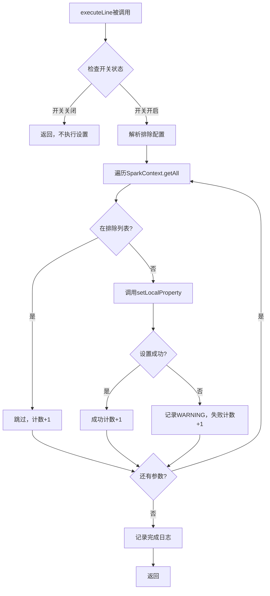
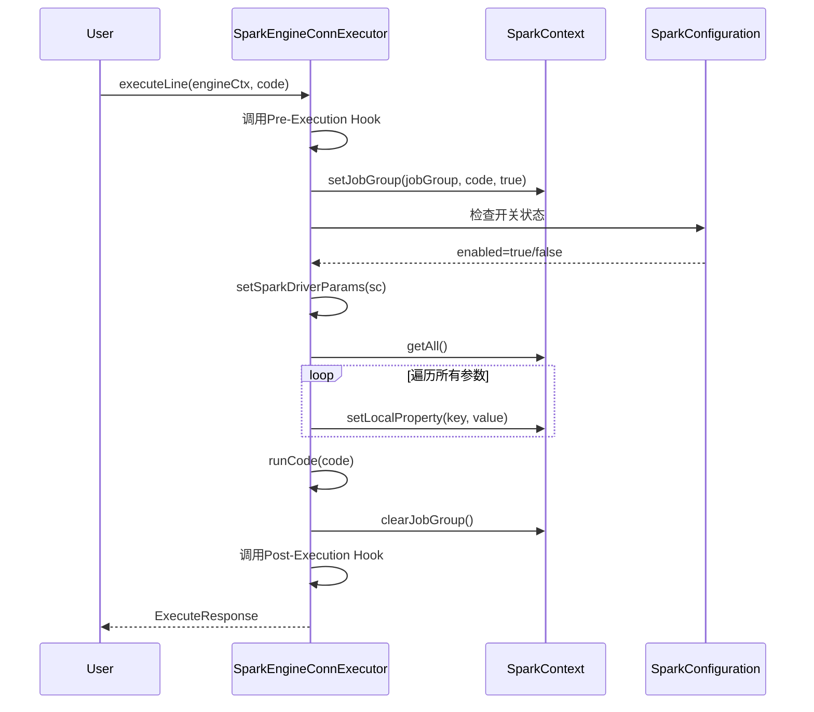

# Spark引擎支持设置executor参数 - 设计文档

## 文档信息

| 项目 | 内容 |
|------|------|
| 需求ID | LINKIS-ENHANCE-SPARK-001 |
| 设计版本 | v1.0 |
| 需求类型 | 功能增强（ENHANCE） |
| 基础模块 | Spark引擎 |
| 当前版本 | dev-1.18.0-webank |
| 创建时间 | 2026-03-12 |
| 文档状态 | 待评审 |

---

# 📋 执行摘要

## 设计目标

为Linkis Spark Engine增加executor端参数设置能力，通过`sc.setLocalProperty`方法将Spark运行时参数动态设置到executor端，实现时区配置、SQL行为调优等场景的参数传递。

## 核心决策

| 决策项 | 选择方案 | 理由 |
|--------|---------|------|
| 集成位置 | executeLine方法中sc.setJobGroup之后 | SparkContext已初始化，确保参数设置生效 |
| 配置方式 | linkis-engineconn.properties | 与现有Spark配置保持一致 |
| 默认策略 | 功能关闭（false） | 向后兼容，避免影响现有功能 |
| 异常处理 | 跳过失败参数，记录WARNING日志 | 容错设计，不影响整体功能 |
| 日志策略 | 仅记录参数总数，不记录详细值 | 安全考虑，避免敏感信息泄露 |

## 兼容性策略

- **默认关闭**：功能开关默认为false，不启用时与现有行为完全一致
- **无侵入性**：新增代码独立封装，不修改现有逻辑
- **可配置排除**：支持通过配置排除特定参数，防止意外修改关键配置
- **异常隔离**：单个参数失败不影响其他参数设置和作业执行

## 关键风险

| 风险 | 级别 | 缓解措施 |
|------|------|---------|
| 某些参数设置导致Spark不稳定 | 高 | 默认关闭+异常捕获+WARNING日志 |
| 排除配置填写错误 | 中 | 提供配置示例和注释 |
| 性能影响 | 低 | 使用高效的遍历和过滤操作 |

---

# 🎯 Part 1: 核心设计

## 1.1 兼容性设计

### 1.1.1 向后兼容性保证

**策略**: 通过默认关闭和独立封装确保向后兼容

### 1.1.2 无侵入性集成

**集成点选择**

| 集成点 | 文件 | 方法 | 位置 |
|--------|------|------|------|
| 参数设置调用 | SparkEngineConnExecutor.scala | executeLine | sc.setJobGroup() 之后 |

**设计理由**:
- `sc.setJobGroup(jobGroup, _code, true)`在所有Spark作业中都会执行
- 执行时SparkContext已完全初始化
- 不影响现有的Pre/Post Execution Hook

### 1.1.3 配置隔离设计

**新增配置项**:
```scala
// SparkConfiguration.scala
val SPARK_DRIVER_PARAMS_ENABLED = CommonVars[Boolean](
  "wds.linkis.spark.executor.params.enabled",
  false,  // 默认关闭，保证向后兼容
  "Enable spark executor params setting to executor side"
)

val SPARK_DRIVER_PARAMS_EXCLUDE = CommonVars[String](
  "wds.linkis.spark.executor.params.exclude",
  "",  // 默认空，不排除任何参数
  "Exclude params from setting to executor side, split by comma"
)
```

---

## 1.2 变更影响分析

### 1.2.1 代码变更范围

| 模块 | 文件 | 变更类型 | 影响程度 |
|------|------|---------|---------|
| spark-engineconn | SparkEngineConnExecutor.scala | 增强 | 低（新增方法，不修改现有逻辑） |
| spark-config | SparkConfiguration.scala | 增强 | 低（新增2个配置项） |

### 1.2.2 影响范围评估

| 影响项 | 范围 | 说明 |
|--------|------|------|
| 现有功能 | 无影响 | 新增代码仅在开关开启时执行 |
| 性能影响 | <100ms | 遍历Spark参数设置操作轻量级 |
| 配置文件 | 无破坏性 | 新增配置项，不修改现有配置 |
| API接口 | 无变化 | 无对外API变动 |

### 1.2.3 风险评估

| 风险ID | 风险描述 | 影响等级 | 缓解措施 |
|--------|---------|---------|---------|
| R-001 | 参数设置影响Spark稳定性 | 高 | 默认关闭+异常捕获+WARNING日志 |
| R-002 | 性能退化 | 低 | 性能预算控制在100ms内 |
| R-003 | 配置错误导致意外行为 | 中 | 提供配置示例和文档 |

---

## 1.3 核心流程设计

### 1.3.1 参数设置流程



### 1.3.2 executeLine集成流程



---

## 1.4 接口变更定义

### 1.4.1 新增方法

**位置**: `SparkEngineConnExecutor.scala`

```scala
/**
 * 新增方法：setSparkDriverParams
 * 作用：设置Spark参数到executor端
 * 访问级别：private
 */
private def setSparkDriverParams(sc: SparkContext): Unit
```

### 1.4.2 新增配置

| 类名 | 字段名 | 类型 | 默认值 | 说明 |
|------|--------|------|--------|------|
| SparkConfiguration | SPARK_DRIVER_PARAMS_ENABLED | CommonVars[Boolean] | false | 功能开关 |
| SparkConfiguration | SPARK_DRIVER_PARAMS_EXCLUDE | CommonVars[String] | "" | 排除参数列表 |

---

## 1.5 关键技术难点及解决方案

### 1.5.1 难点1：参数设置时机选择

**问题**: SparkContext的生命周期中，何时设置参数才能确保生效？

**解决方案**:
- 在`executeLine`方法中`sc.setJobGroup`之后执行
- 此时SparkContext已完全初始化
- 确保参数在每个作业执行前都有效设置

### 1.5.2 难点2：异常处理的容错设计

**问题**: 某些参数设置可能失败，如何处理？

**解决方案**:
- 使用`Utils.tryCatch`捕获单个参数的设置异常
- 记录WARNING日志，包含参数key和异常信息
- 继续设置下一个参数，不中断整体流程
- 最后统计并记录成功/失败/跳过的数量

### 1.5.3 难点3：安全性考虑

**问题**: 日志记录可能泄露敏感信息

**解决方案**:
- 仅记录参数总数，不记录参数key和value
- 提供排除配置，可排除敏感参数
- 日志级别为INFO/WARNING，不记录DEBUG详细信息

---

## 1.6 设计决策记录(ADR)

| ADR编号 | 决策 | 理由 |
|---------|------|------|
| ADR-001 | 功能默认关闭 | 向后兼容，避免影响现有用户 |
| ADR-002 | 集成在executeLine中 | 覆盖所有Spark作业场景 |
| ADR-003 | 异常时跳过而非中断 | 容错设计，保证作业正常执行 |
| ADR-004 | 排除配置使用逗号分隔 | 简洁易用，符合Apache配置习惯 |

---

# 📐 Part 2: 支撑设计

## 2.1 数据模型变更

**本功能不涉及数据库变更**

| 变更类型 | 数量 | 说明 |
|---------|------|------|
| 新增表 | 0 | - |
| 修改表 | 0 | - |
| 删除表 | 0 | - |

---

## 2.2 API接口变更

**本功能不涉及REST API变更**

| 变更类型 | 数量 | 说明 |
|---------|------|------|
| 新增接口 | 0 | - |
| 修改接口 | 0 | - |
| 废弃接口 | 0 | - |

---

## 2.3 配置文件变更

### 2.3.1 linkis-engineconn.properties 新增配置

| 配置项 | 类型 | 默认值 | 说明 |
|--------|------|--------|------|
| wds.linkis.spark.executor.params.enabled | Boolean | false | 启用executor端参数设置 |
| wds.linkis.spark.executor.params.exclude | String | "" | 排除参数列表（逗号分隔） |

### 2.3.2 配置示例

```properties
# 启用executor端参数设置
wds.linkis.spark.executor.params.enabled=true

# 排除不需要设置的参数
wds.linkis.spark.executor.params.exclude=spark.sql.shuffle.partitions,spark.dynamicAllocation.maxExecutors,spark.executor.instances
```

---

## 2.4 回滚方案

**回滚策略**: 通过配置关闭功能实现无代码回滚

| 场景 | 回滚方法 | 影响范围 |
|------|---------|---------|
| 功能异常 | 设置 enabled=false | 立即生效，无残留影响 |
| 配置错误 | 清空exclude配置 | 立即生效 |
| 需要代码回滚 | 移除新增方法和调用 | 需重启Engine |

---

## 2.5 测试策略

### 2.5.1 单元测试

| 测试场景 | 验证点 |
|---------|--------|
| 开关关闭 | 不执行参数设置 |
| 开关开启 | 正确设置参数 |
| 排除配置 | 排除参数不被设置 |
| 参数设置失败 | 记录WARNING，继续执行 |

### 2.5.2 集成测试

| 测试场景 | 验证点 |
|---------|--------|
| 完整executeLine流程 | 参数设置在setJobGroup后执行 |
| 异常隔离 | 单个参数失败不影响整体 |
| 兼容性测试 | 默认关闭时与现有行为一致 |

### 2.5.3 性能测试

| 测试场景 | 指标 |
|---------|------|
| 100个参数 | 设置时间 < 100ms |

---

# 📎 Part 3: 参考资料

## 3.1 代码变更清单

### 3.1.1 修改文件列表

| 文件路径 | 变更类型 | 说明 |
|---------|---------|------|
| linkis-engineconn-plugins/spark/src/main/scala/org/apache/linkis/engineplugin/spark/executor/SparkEngineConnExecutor.scala | 增强 | 新增setSparkDriverParams方法，在executeLine中调用 |
| linkis-engineconn-plugins/spark/src/main/scala/org/apache/linkis/engineplugin/spark/config/SparkConfiguration.scala | 增强 | 新增2个配置项 |

### 3.1.2 SparkEngineConnExecutor.scala 变更

**变更位置**: executeLine方法，第203行之后

**变更代码**:
```scala
// 现有代码
sc.setJobGroup(jobGroup, _code, true)

// 新增代码：设置executor参数
Utils.tryAndWarn(setSparkDriverParams(sc))
```

**新增方法**:
```scala
/**
 * Set spark params to executor side via setLocalProperty
 *
 * @param sc SparkContext
 */
private def setSparkDriverParams(sc: SparkContext): Unit = {
  if (!SparkConfiguration.SPARK_DRIVER_PARAMS_ENABLED.getValue) {
    logger.info("Spark executor params setting is disabled")
    return
  }

  val excludeParams = SparkConfiguration.SPARK_DRIVER_PARAMS_EXCLUDE.getValue
    .split(",")
    .map(_.trim)
    .filter(_.nonEmpty)
    .toSet

  var totalParams = 0
  var skippedParams = 0
  var successCount = 0
  var failCount = 0

  sc.getAll.foreach { case (key, value) =>
    totalParams += 1
    if (excludeParams.contains(key)) {
      skippedParams += 1
    } else {
      Utils.tryCatch {
        sc.setLocalProperty(key, value)
        successCount += 1
      } {
        case e: Exception =>
          logger.warn(s"Failed to set spark param: $key, error: ${e.getMessage}", e)
          failCount += 1
      }
    }
  }

  logger.info(s"Spark executor params setting completed - total: $totalParams, " +
    s"skipped: $skippedParams, success: $successCount, failed: $failCount")
}
```

### 3.1.3 SparkConfiguration.scala 变更

**变更位置**: 新增配置定义（可选择合适位置添加）

**新增代码**:
```scala
  val SPARK_DRIVER_PARAMS_ENABLED = CommonVars[Boolean](
    "wds.linkis.spark.executor.params.enabled",
    false,
    "Enable spark executor params setting to executor side（启用Spark executor参数设置）"
  )

  val SPARK_DRIVER_PARAMS_EXCLUDE = CommonVars[String](
    "wds.linkis.spark.executor.params.exclude",
    "",
    "Exclude params from setting to executor side, split by comma（排除的executor参数，逗号分隔）"
  )
```

---

## 3.2 配置文件示例

### 3.2.1 linkis-engineconn.properties

```properties
# =============================================
# Spark executor Params Configuration
# =============================================

# Enable/disable spark executor params setting to executor side
# Default: false (disabled for backward compatibility)
# 设置executor端参数的功能开关
wds.linkis.spark.executor.params.enabled=false

# Exclude params from setting to executor side, split by comma
# Example: spark.sql.shuffle.partitions,spark.dynamicAllocation.maxExecutors
# 排除的executor参数，逗号分隔
wds.linkis.spark.executor.params.exclude=
```

---

## 3.3 相关文档

1. 需求文档: `docs/dev-1.18.0-webank/requirements/spark_executor_params_需求.md`
2. Feature文件: `docs/dev-1.18.0-webank/features/spark_executor_params.feature`
3. Spark API文档: https://spark.apache.org/docs/latest/api/scala/org/apache/spark/SparkContext.html

---

## 3.4 技术引用

| 引用 | 说明 |
|------|------|
| SparkContext.setLocalProperty | Spark API文档 |
| SparkConf.getAll | Spark API文档 |
| Linkis Utils.tryCatch | Linkis工具类 |

---

## 变更历史

| 版本 | 日期 | 作者 | 变更说明 |
|------|------|------|---------|
| v1.0 | 2026-03-12 | Claude Code | 初始设计文档 |

---
