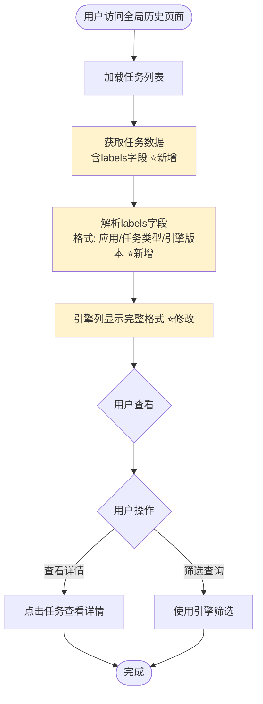

# 全局历史页面引擎版本展示增强 需求文档

**需求类型**: ENHANCE（功能增强）
**基础模块**: 全局历史管理页面（GlobalHistory）
**文档版本**: v1.0
**创建日期**: 2026-03-17

---

## 📋 需求速览

| 维度 | 内容 |
|-----|------|
| **一句话描述** | 在全局历史页面引擎列显示完整的引擎版本信息 |
| **基础模块** | 全局历史管理组件（linkis-web/src/apps/linkis/module/globalHistoryManagement） |
| **增强目的** | 解决用户无法区分不同spark引擎版本的问题，提升信息透明度 |
| **功能范围** | P0: 1个 · P1: 0个 · P2: 0个 |
| **兼容性要求** | 无需后端修改，仅前端展示层增强 |
| **涉及模块** | linkis-web前端模块 |

---

## 1. 需求概述

### 1.1 业务背景

当前全局历史页面的"引擎列"显示格式不完整，仅显示应用名称和任务类型，缺失引擎版本信息。由于系统存在多个spark引擎版本（spark-2.4.3和spark-3.4.4），用户无法通过界面区分具体使用的引擎版本，导致版本相关问题排查困难。

### 1.2 核心目标

引擎列显示完整格式：应用/任务类型/引擎版本，例如：`LINKISCLI/sql/spark-2.4.3`

### 1.3 基础模块分析

**基础模块**: 全局历史管理组件（GlobalHistory）

**现有功能**:
- 全局历史任务列表展示
- 多维度筛选查询（任务ID、用户名、时间范围、创建人、引擎类型、状态等）
- 任务执行详情查看
- 任务日志、结果集查看

**现有引擎列展示**:
- 当前标题：`requestApplicationName / runType / executeApplicationName`
- 当前数据：`LINKISCLI / sql`（引擎版本缺失）

**增强动机**:
- 用户需要了解具体任务的引擎版本信息
- 版本差异可能导致不同的行为或问题，需要有清晰的展示
- 后端已提供完整的labels字段，前端仅需解析展示

---

## 2. 现有功能分析

### 2.1 【核心】现有页面组件

**文件位置**: `linkis-web/src/apps/linkis/module/globalHistoryManagement/index.vue`

**当前引擎列配置** (行847-867):

```javascript
{
  title: this.$t('message.linkis.tableColumns.requestApplicationName') + ' / '
       + this.$t('message.linkis.tableColumns.runType') + ' / '
       + this.$t('message.linkis.tableColumns.executeApplicationName'),
  key: 'requestApplicationName',
  align: 'center',
  width: 130,
  renderType: 'multiConcat',
  renderParams: {
    concatKey1: 'runType',
    concatKey2: 'executeApplicationName'
  }
}
```

**当前数据流**:
- 后端API: `/jobhistory/list`
- 返回字段: `requestApplicationName`, `runType`, `executeApplicationName`
- 前端处理: 使用`multiConcat`渲染器拼接展示

### 2.2 【核心】现有标签字段

**数据来源**: 任务对象的`labels`字段

**数据格式**: 层级字符串，例如：
- `LINKISCLI/sql/spark-2.4.3`
- `LINKISCLI/sql/spark-3.4.4`

**现有读取位置**:
- `getList()`方法处理接口返回数据 (行681-730)
- 当前未处理labels字段用于引擎列展示

---

## 3. 增强需求

### 3.1 功能总览

| ID | 增强点 | 优先级 | 状态 | 一句话描述 |
|----|-------|:------:|:----:|----------|
| E1 | 引擎列显示完整版本信息 | P0 | ✅ 已确认 | 从labels字段解析引擎版本，显示完整格式 |

### 3.2 增强点1：引擎列显示完整版本信息 `P0` `已确认`

#### 业务规则

| 规则ID | 规则描述 |
|--------|---------|
| R1.1 | 引擎列显示格式为：应用/任务类型/引擎版本 |
| R1.2 | 数据来源为任务对象的labels字段，格式为层级字符串 |
| R1.3 | 所有历史任务记录都包含完整的版本信息，无需处理缺失情况 |

#### 验收标准（三段式）

| 验证阶段 | 验收条件 |
|:--------:|---------|
| 【输入验证】 | AC1.1: 后端返回的任务数据包含labels字段，且格式为层级字符串 |
| 【处理验证】 | AC1.2: 前端正确解析labels字段，提取完整的引擎版本信息 |
| 【输出验证】 | AC1.3: 引擎列显示完整格式：应用/任务类型/引擎版本，用户可区分spark-2.4.3和spark-3.4.4 |

#### 输入变化

| 输入项 | 变化类型 | 说明 | 约束 |
|-------|:--------:|------|------|
| labels字段 | 已存在 | 后端已返回，格式为层级字符串 | 必须存在，格式为`应用/任务类型/引擎版本` |

#### 输出变化

| 输出项 | 变化类型 | 说明 |
|-------|:--------:|------|
| 引擎列展示 | 修改 | 从`LINKISCLI / sql`增强为`LINKISCLI / sql / spark-2.4.3` |

#### 用户交互流程

**现有流程**：
1. 用户访问全局历史页面
2. 查看任务列表中引擎列显示：`LINKISCLI / sql`
3. 用户无法区分具体引擎版本

**增强后流程**：
1. 用户访问全局历史页面
2. 查看任务列表中引擎列显示：`LINKISCLI / sql / spark-2.4.3` ⭐修改
3. 用户可以清晰区分不同引擎版本

**流程图**：



---

## 4. 兼容性分析

### 4.1 接口兼容性

- ✅ **现有接口不受影响**：使用现有的`/jobhistory/list`接口
- ✅ **新增字段使用现有数据**：labels字段已在接口返回中
- ✅ **无需API变更**：完全前端展示层改造

### 4.2 数据兼容性

- ✅ **无需数据库迁移**：仅修改前端展示逻辑
- ✅ **无需数据修改**：labels字段已包含完整版本信息
- ✅ **无数据风险**：不涉及数据结构变更

### 4.3 行为兼容性

- ✅ **现有业务流程不受影响**：仅引擎列展示内容变化
- ⚠️ **列宽度可能调整**：由于显示内容变长，可能需要调整引擎列宽度
- ✅ **无需配置开关**：修改为默认行为，向后兼容

---

## 5. 涉及文件清单

### 5.1 需要修改的文件

| 文件路径 | 修改内容 |
|---------|---------|
| `linkis-web/src/apps/linkis/module/globalHistoryManagement/index.vue` | 修改引擎列配置，使用labels字段数据 |

### 5.2 需要新增的文件

无

---

## 6. 非功能需求

### 6.1 性能需求

- 对现有功能的性能影响：无影响，仅展示层修改
- 新增功能的性能要求：无特殊要求

### 6.2 安全需求

- 无新增安全需求，使用现有用户权限控制

### 6.3 用户体验需求

- 引擎列展示内容完整，用户可清晰识别版本
- 列宽度适配，避免内容截断
- 与现有UI风格保持一致

---

## 7. 验收标准

### 增强点1验收标准

- [x] AC1.1: 后端返回的任务数据包含labels字段，且格式为层级字符串
- [x] AC1.2: 前端正确解析labels字段，提取完整的引擎版本信息
- [x] AC1.3: 引擎列显示完整格式：应用/任务类型/引擎版本，用户可区分spark-2.4.3和spark-3.4.4

### 兼容性验收标准

- [ ] 现有功能测试用例全部通过
- [ ] 现有其他表格列展示正常
- [ ] 筛选、分页等功能正常

---

## 8. 风险识别

### 8.1 兼容性风险

| 风险项 | 风险描述 | 应对措施 | 风险等级 |
|-------|---------|---------|:--------:|
| 列宽度不足 | 增加版本信息后，列宽度可能不够 | 适当调整列宽度或启用文字截断+tooltip | 🟢 轻微 |

### 8.2 技术风险

| 风险项 | 风险描述 | 应对措施 | 风险等级 |
|-------|---------|---------|:--------:|
| 无 | 简单展示层改造，无明显技术风险 | - | - |

### 8.3 业务风险

| 风险项 | 风险描述 | 应对措施 | 风险等级 |
|-------|---------|---------|:--------:|
| 无 | 纯增强性需求，无业务风险 | - | - |

---

## 9. 关联影响分析

根据配置规则进行关联影响分析：

### 9.1 功能模块影响

| 影响维度 | 分析结果 |
|---------|---------|
| 影响程度 | 🟢 轻微影响 |
| 影响范围 | 仅全局历史管理页面的引擎列展示 |
| 影响说明 | 修改引擎列的展示内容，不改变业务逻辑、调用关系 |

### 9.2 数据模型影响

| 影响维度 | 分析结果 |
|---------|---------|
| 影响程度 | 🟢 无影响 |
| 影响说明 | 无需修改表结构，labels字段已存在且包含所需数据 |

### 9.3 安全与权限影响

| 影响维度 | 分析结果 |
|---------|---------|
| 影响程度 | 🟢 无影响 |
| 影响说明 | 不涉及新权限点或数据访问控制变更 |

### 9.4 用户体验与文案影响

| 影响维度 | 分析结果 |
|---------|---------|
| 影响程度 | 🟡 重要影响 |
| 影响说明 | 引擎列展示内容变长，可能需要调整列宽度和排版 |

### 9.5 上下游与三方依赖影响

| 影响维度 | 分析结果 |
|---------|---------|
| 影响程度 | 🟢 无影响 |
| 影响说明 | 不涉及上下游系统或第三方服务 |

### 综合影响评估

**影响等级**: 🟢 **轻微影响**

无需特殊用户确认操作，继续执行后续工作。

---

## 附录

### A. 术语表

| 术语 | 说明 |
|-----|------|
| 全局历史页面 | Linkis系统中展示所有历史任务记录的页面 |
| 引擎列 | 任务列表中显示任务引擎信息的表格列 |
| 引擎版本 | 计算引擎的具体版本号，如spark-2.4.3 |
| labels字段 | 后端返回的任务标签字段，包含层级结构信息 |

### B. 参考文档

- 项目前端代码：`linkis-web/src/apps/linkis/module/globalHistoryManagement/`
- 澄清结果：`dev/active/global-history-engine-version/clarification_result.json`
