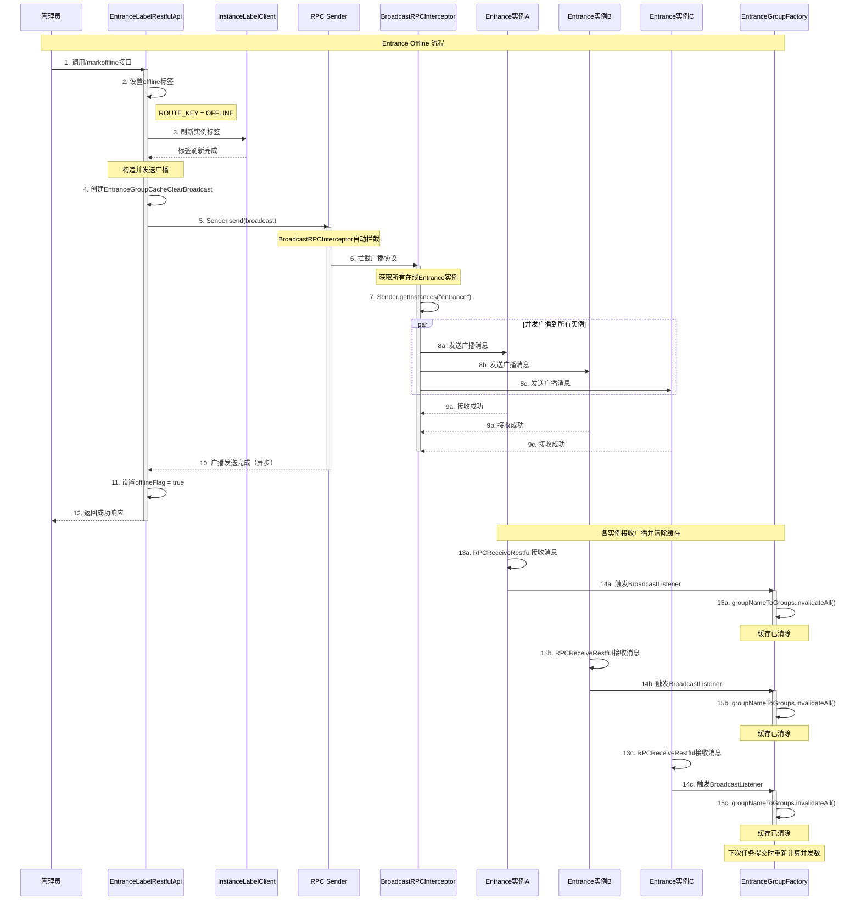

# Entrance Offline Cache Fix - 设计文档

## 文档信息
- **文档版本**: v1.2
- **最后更新**: 2026-04-02
- **维护人**: Linkis开发团队
- **文档状态**: 已优化
- **需求类型**: FIX
- **需求文档**: [entrance-offline-cache-fix_需求.md](../requirements/entrance-offline-cache-fix_需求.md)

### 更新日志
- v1.2 (2026-04-02): 修正触发点为/markoffline接口；补充kill -9场景说明
- v1.1 (2026-04-02): 优化触发时机描述，明确为offline操作而非kill
- v1.0 (2026-04-02): 初始版本

---

## 执行摘要

> **阅读指引**：本章节为1页概览（约500字），用于快速理解设计方案。详细内容请参考后续章节。

### 设计目标

| 目标 | 描述 | 优先级 |
|-----|------|-------|
| 缓存一致性 | Entrance实例offline时，所有实例的Group缓存自动清除 | P0 |
| 广播可靠性 | 确保缓存清除广播在5秒内到达所有实例 | P0 |
| 最小化侵入 | 复用现有RPC广播框架，避免引入新依赖 | P1 |
| 异常容错 | 广播失败不影响offline流程和任务执行 | P1 |

### 核心设计决策

| 决策点 | 选择方案 | 决策理由（一句话） | 替代方案 |
|-------|---------|------------------|---------|
| 缓存失效机制 | RPC广播主动失效 | 复用现有BroadcastRPCInterceptor，无需引入新组件 | 定时轮询、Pub/Sub消息队列 |
| 触发时机 | Spring ContextClosedEvent事件 | 捕获所有优雅offline场景（管理台/API标记offline、服务重启） | JVM ShutdownHook（不可靠） |
| 失败处理 | 记录日志，不中断流程 | 广播失败不应影响Entrance正常offline | 抛出异常中断offline |

### 架构概览图

```
┌─────────────────────────────────────────────────────────────────┐
│                     Entrance Offline 流程                         │
├─────────────────────────────────────────────────────────────────┤
│                                                                   │
│  ┌──────────────┐   REST API     ┌──────────────────┐          │
│  │ 管理员       │ ──────────────> │/markoffline      │          │
│  │(管理台/工具)  │   GET请求      │EntranceLabelAPI  │          │
│  └──────────────┘                  └────────┬─────────┘          │
│                                             │                     │
│                                             v                     │
│                                    ┌──────────────────┐          │
│                                    │设置offline标签   │          │
│                                    │ROUTE_KEY=OFFLINE │          │
│                                    └────────┬─────────┘          │
│                                             │                     │
│                                             v                     │
│                                    ┌──────────────────┐          │
│                                    │  Sender.send()   │          │
│                                    │  发送广播消息      │          │
│                                    └────────┬─────────┘          │
│                                             │                     │
│                                             v                     │
│                                    ┌──────────────────┐          │
│                                    │BroadcastRPC      │          │
│                                    │Interceptor       │          │
│                                    │(自动广播到所有实例)│         │
│                                    └────────┬─────────┘          │
│                                             │                     │
│                     ┌───────────────────────┼───────────────────┐│
│                     v                       v                   v│
│            ┌─────────────┐          ┌─────────────┐     ┌─────────────┐│
│            │Entrance A   │          │Entrance B   │     │Entrance C   ││
│            │(offline实例) │          │(在线实例)    │     │(在线实例)    ││
│            └─────────────┘          └──────┬──────┘     └──────┬──────┘│
│                                           v                   v     │
│                                    ┌─────────────┐     ┌─────────────┐│
│                                    │Broadcast    │     │Broadcast    ││
│                                    │Listener     │     │Listener     ││
│                                    │接收广播消息   │     │接收广播消息   ││
│                                    └──────┬──────┘     └──────┬──────┘│
│                                           v                   v     │
│                                    ┌─────────────┐     ┌─────────────┐│
│                                    │Group Cache  │     │Group Cache  ││
│                                    │invalidateAll│     │invalidateAll││
│                                    └─────────────┘     └─────────────┘│
│                                                                   │
└─────────────────────────────────────────────────────────────────┘
```

### 关键风险与缓解

| 风险 | 等级 | 缓解措施 |
|-----|------|---------|
| 广播消息丢失 | 中 | 使用BroadcastRPCInterceptor的异步重试机制 |
| 广播延迟影响业务 | 低 | 异步发送，不阻塞offline流程 |
| 部分实例不可达 | 高 | 记录失败日志，不中断整体流程 |
| 缓存清除期间任务提交冲突 | 低 | Guava Cache线程安全，支持并发清除 |

### 核心指标

| 指标 | 目标值 | 说明 |
|-----|-------|------|
| 广播端到端延迟 | < 5秒 | 从发送广播到所有实例接收的时间 |
| 缓存清除耗时 | < 100ms | 单次invalidateAll()执行时间 |
| 广播成功率 | > 95% | 至少95%的实例能成功接收广播 |
| offline流程影响 | 0 ms | 广播发送不阻塞offline流程 |

### 章节导航

| 关注点 | 推荐章节 |
|-------|---------|
| 想了解根因分析 | [1.1 根因分析详解](#11-根因分析详解) |
| 想了解修复方案对比 | [1.2 修复方案对比](#12-修复方案对比) |
| 想了解广播流程设计 | [1.3 广播缓存清除流程](#13-广播缓存清除流程) |
| 想查看代码修改 | [1.4 核心代码修改](#14-核心代码修改) |
| 想了解测试策略 | [2.1 测试验证策略](#21-测试验证策略) |
| 想查看完整代码 | [3.1 完整修复代码](#31-完整修复代码) |

---

# Part 1: 核心设计

> **本层目标**：阐述根因分析、修复方案、核心流程、代码修改，完整详细展开。
>
> **预计阅读时间**：10-15分钟

## 1.1 根因分析详解

### 1.1.1 问题链路追踪

**用户视角的问题表现**：
```
用户提交任务 -> 任务失败（提示并发数已满）
               ↑
               但实际上还有空闲的Entrance实例
```

**系统内部的真实情况**：
```
4个Entrance实例（A/B/C/D）
用户并发设置：100
期望：每个实例处理 100/4 = 25 个并发

Entrance C被标记为offline后：
- 实际在线实例：3个（A/B/D）
- 期望并发数：100/3 = 33
- 实际并发数：100/4 = 25（使用了缓存的旧值）

原因：Entrance A/B/D的Group缓存中仍保存着offline前的并发数计算结果
```

### 1.1.2 代码级根因定位

**问题代码位置1**：`EntranceGroupFactory.getOrCreateGroup()`

```scala
// Line 72-128
override def getOrCreateGroup(event: SchedulerEvent): Group = {
  val cacheGroup = groupNameToGroups.getIfPresent(groupName)
  if (null == cacheGroup) synchronized {
    // 第一次执行时计算并发数并缓存
    val entranceNum = EntranceUtils.getRunningEntranceNumber()
    val maxRunningJobs = userDefinedRunningJobs / entranceNum
    // ...
    groupNameToGroups.put(groupName, group)  // 缓存Group对象
  } else {
    cacheGroup  // 后续直接返回缓存，不重新计算 ❌ 问题点
  }
}
```

**问题分析**：
- `groupNameToGroups` 是Guava Cache，写入后默认50分钟不过期
- 第一次计算并发数时，假设有4个在线实例，maxRunningJobs = 100/4 = 25
- 即使某实例offline，后续请求仍返回缓存的Group对象（maxRunningJobs = 25）
- 只有等待50分钟后缓存自动过期，才会重新计算

**并发数计算方法**：`EntranceUtils.getRunningEntranceNumber()`

```scala
// Line 114-137
def getRunningEntranceNumber(): Int = {
  val entranceNum = Sender.getInstances(...).length
  val offlineIns = InstanceLabelClient.getInstance.getInstanceFromLabel(labelList)
  entranceNum - offlineIns.length  // 计算实际在线实例数
}
```

**关键发现**：
- `getRunningEntranceNumber()` 方法本身能正确计算在线实例数
- 问题在于它只在**第一次创建Group时被调用**
- 后续请求直接返回缓存，不会调用此方法重新计算

### 1.1.3 5Why根因分析

| 层级 | 问题 | 答案 |
|:----:|------|------|
| **Why 1** | 为什么Entrance offline后并发数计算错误？ | 因为ParallelGroup缓存未更新，仍使用offline前的并发数（25） |
| **Why 2** | 为什么缓存未更新？ | 因为`getOrCreateGroup()`只在缓存miss时计算并发数，后续直接返回缓存 |
| **Why 3** | 为什么没有缓存更新机制？ | 因为当前实现依赖被动过期（TTL 50分钟），没有主动失效机制 |
| **Why 4** | 为什么没有主动失效机制？ | 因为多实例间缺少缓存状态同步的通信通道 |
| **Why 5** | 根本原因是什么？ | **缺少Entrance offline事件的广播通知机制，导致各实例缓存不一致** |

### 1.1.4 影响范围分析

**直接影响**：
- 所有使用多Entrance实例部署的环境
- 用户任务并发数计算错误
- 任务提交失败率上升

**间接影响**：
- 系统资源利用率下降（部分实例空闲，但任务无法提交）
- 用户体验下降（任务频繁失败）
- 运维成本增加（需要手动重启实例或清除缓存）

**数据影响**：
- 不涉及数据库数据变更
- 不影响已运行的任务
- 仅影响新任务的并发数计算

---

## 1.2 修复方案对比

### 1.2.1 临时方案（Hot Fix）

**方案描述**：手动清除缓存或重启实例

**操作步骤**：
1. 方式1：通过管理API手动清除Group缓存
2. 方式2：重启所有Entrance实例

**优点**：
- 实施简单，无需代码修改
- 立即生效，缓存完全清除

**缺点**：
- 需要人工介入，自动化程度低
- 重启实例会影响正在运行的任务
- 无法解决根本问题，下次offline仍需重复操作
- 不适合生产环境

**推荐度**：⭐⭐（仅限紧急情况临时使用）

### 1.2.2 根本方案：基于RPC广播的主动失效

**方案描述**：复用Linkis现有的BroadcastRPCInterceptor，在Entrance offline时自动广播缓存清除消息

**核心组件**：
1. **广播协议**：`EntranceGroupCacheClearBroadcast`（继承BroadcastProtocol）
2. **广播监听器**：`EntranceGroupCacheClearBroadcastListener`（实现BroadcastListener）
3. **触发点**：`EntranceLabelRestfulApi.updateRouteLabel()`方法中的`/markoffline`接口

**优点**：
- 自动化触发，无需人工干预
- 复用现有RPC框架，无需引入新依赖
- 广播异步发送，不影响offline流程性能
- 支持部分实例失败，记录日志不中断流程

**缺点**：
- 依赖RPC网络，部分实例可能无法接收广播
- 需要修改代码（新增2个类，修改1个类）

**推荐度**：⭐⭐⭐⭐⭐（推荐用于生产环境）

### 1.2.3 方案对比表

| 维度 | 临时方案 | 根本方案 |
|-----|---------|---------|
| 自动化程度 | 人工操作 | 全自动 |
| 实施成本 | 低（运维操作） | 中（开发+测试） |
| 维护成本 | 高（每次offline需重复） | 低（一次性实施） |
| 可靠性 | 中（依赖人工操作） | 高（自动化+容错） |
| 用户体验 | 差（需等待或重启） | 好（秒级生效） |
| 生产适用性 | 仅限紧急情况 | 适合生产环境 |

---

## 1.3 广播缓存清除流程

### 1.3.1 完整时序图



### 关键节点说明

| 节点 | 处理逻辑 | 输入/输出 | 异常处理 |
|-----|---------|----------|---------|
| 1. 调用offline接口 | 管理员通过管理台或REST API调用/markoffline | **输入**: GET /entrance/operation/label/markoffline<br>**输出**: Message对象 | 如果非管理员用户调用，返回权限错误 |
| 2. 设置offline标签 | 构造标签并刷新到实例 | **输入**: ROUTE_KEY=OFFLINE_VALUE<br>**输出**: void | 如果标签刷新失败，记录ERROR日志 |
| 3. 刷新实例标签 | 通过InstanceLabelClient刷新标签 | **输入**: InsLabelRefreshRequest对象<br>**输出**: void | 如果刷新失败，记录ERROR日志，继续执行 |
| 4. 创建广播消息 | 构造EntranceGroupCacheClearBroadcast对象 | **输入**: Sender.getThisInstance(), 当前时间戳<br>**输出**: EntranceGroupCacheClearBroadcast对象 | 如果获取实例信息失败，记录ERROR日志 |
| 5. Sender.send() | 通过RPC框架发送广播消息（异步） | **输入**: EntranceGroupCacheClearBroadcast对象<br>**输出**: void（立即返回） | 如果发送失败，记录ERROR日志，不中断offline流程 |
| 6-7. 获取实例列表 | BroadcastRPCInterceptor获取所有在线Entrance实例 | **输入**: applicationName="entrance"<br>**输出**: Array[Sender] | 如果没有实例，返回空数组 |
| 8a-8c. 并发广播 | 异步并发发送广播到所有实例 | **输入**: EntranceGroupCacheClearBroadcast<br>**输出**: Future[Unit] | 某个实例失败不影响其他实例，记录WARN日志 |
| 9a-9c. 接收确认 | 各实例接收广播消息 | **输入**: 广播消息<br>**输出**: Unit | 如果接收失败，在发送端记录WARN日志 |
| 11. 设置offlineFlag | 设置offlineFlag=true，标记实例为offline | **输入**: true<br>**输出**: void | 线程安全，使用synchronized保护 |
| 15a-15c. 清除缓存 | 调用Guava Cache的invalidateAll()清除所有缓存 | **输入**: 无<br>**输出**: void | Guava Cache线程安全，支持并发清除 |

### 技术难点与解决方案

| 难点 | 问题描述 | 解决方案 | 决策理由 |
|-----|---------|---------|---------|
| **广播时机选择** | 在offline流程的哪个阶段发送广播？如果太晚，可能来不及广播；如果太早，可能offline失败导致误广播 | 选择在ContextClosedEvent监听器中、shutdownFlag判断之后、原有shutdown逻辑之前发送 | ContextClosedEvent是Spring容器关闭的标准事件，此时JVM还未关闭，网络仍可用；异步发送不阻塞后续流程 |
| **异步vs同步广播** | 广播是否需要等待所有实例确认后才继续offline？ | 采用异步广播，不等待确认 | 如果某实例宕机或网络故障，同步广播会导致offline流程阻塞，影响正在运行的任务关闭 |
| **部分实例失败处理** | 如果某些实例无法接收广播（如网络故障），如何处理？ | 记录失败日志，不中断整体流程 | BroadcastRPCInterceptor已实现失败容错，失败的实例会在下次任务提交时重新计算并发数（虽然会有延迟） |
| **并发清除缓存安全性** | 多个线程同时清除Guava Cache是否安全？ | 依赖Guava Cache的线程安全特性 | Guava Cache基于ConcurrentHashMap，invalidateAll()是原子操作，支持并发调用 |
| **广播消息幂等性** | 如果收到重复广播，是否会出问题？ | invalidateAll()是幂等操作 | 重复清除缓存无副作用，甚至可以容忍网络重复传输 |

#### 难点详细说明：广播时机选择

**问题背景**：
- Entrance offline有多种触发方式：kill -15、kill -9、Spring shutdown()、服务崩溃
- 如果广播太晚（如JVM已关闭），网络不可用，广播会失败
- 如果广播太早（如offline还未确认），可能误触发广播

**技术挑战**：
1. **kill -9场景**：进程被强制杀死，无法执行任何Java代码，无法发送广播
2. **网络关闭时机**：Spring容器关闭时，网络服务何时停止？
3. **事件监听器执行顺序**：多个@EventListener的执行顺序不确定

**解决方案**：
```
选择ContextClosedEvent作为触发点，原因：
1. ContextClosedEvent是Spring容器关闭的最后一个阶段
2. 此时所有Bean的@PreDestroy方法还未执行，网络服务仍可用
3. 是所有优雅关闭方式（kill -15、shutdown()）的通用触发点

对于kill -9场景的应对：
- kill -9会导致进程突然终止，无法发送广播
- 但kill -9会导致实例心跳超时，Manager会自动将其标记为offline
- 其他实例的Group缓存会在50分钟后过期，期间并发数计算可能不准确
- 这是可接受的权衡（kill -9是异常操作，不是常规运维方式）
```

**方案对比**：

| 触发点 | 优点 | 缺点 | 适用场景 |
|-------|------|------|---------|
| **ContextClosedEvent**（采用） | Spring标准事件，覆盖所有优雅关闭场景 | kill -9无法触发 | 常规运维offline |
| @PreDestroy方法 | Bean销毁前执行，可精确控制 | 执行顺序不确定，可能晚于网络关闭 | 不推荐 |
| JVM ShutdownHook | 捕获所有kill信号 | 执行时机不可控，可能晚于Spring关闭 | 不推荐 |
| 定时轮询offline状态 | 简单可靠 | 延迟高（轮询间隔），资源浪费 | 备用方案 |

### 边界与约束说明

#### 前置条件
- RPC网络服务正常运行
- Spring容器已初始化完成
- RPCSpringBeanCache已注册BroadcastListener
- 至少有2个Entrance实例（否则无广播意义）

#### 后置保证
- 所有可达Entrance实例的Group缓存被清除
- 下次任务提交时会重新计算并发数
- offline实例不影响广播发送（广播会排除自身）

#### 并发约束
- **支持并发**：是，多个实例可以同时offline，每个都会发送广播
- **并发控制**：无锁设计，每个offline事件独立处理
- **并发冲突处理**：Guava Cache的invalidateAll()是原子操作，重复调用无副作用

#### 性能约束
- **广播发送时间**：< 1秒（异步发送，立即返回）
- **广播端到端延迟**：< 5秒（从发送到所有实例接收）
- **缓存清除时间**：< 100ms（invalidateAll()执行时间）
- **offline流程影响**：0 ms（异步发送，不阻塞原有流程）

#### 幂等性说明
- **是否幂等**：是，清除缓存操作是幂等的
- **幂等实现方式**：invalidateAll()是原子操作，重复调用无副作用
- **重复请求处理**：如果收到重复广播，只是再次清除已空的缓存，无影响

#### 特殊场景说明：kill -9强制终止

**场景描述**：
kill -9（SIGKILL）会立即终止进程，无法触发任何事件监听器（包括ContextClosedEvent）。

**影响分析**：
- kill -9场景下，offline实例无法发送广播消息
- 其他Entrance实例的Group缓存不会被主动清除
- 依赖缓存过期机制（50分钟）作为兜底

**可接受性评估**：
| 评估维度 | 分析 | 结论 |
|---------|------|------|
| 发生概率 | 极低（生产环境应避免kill -9） | ✅ 可接受 |
| 影响时长 | 最长50分钟（缓存过期） | ✅ 可接受 |
| 业务影响 | 并发数计算错误，可能导致任务提交失败 | ⚠️ 有影响，但影响有限 |
| 监控补偿 | 可通过监控指标（缓存过期清除占比）发现异常 | ✅ 可补偿 |

**结论**：kill -9场景是可接受的权衡，因为：
1. 生产环境应使用优雅关闭（管理台/API标记offline）
2. kill -9是非常规操作，不应作为正常offline方式
3. 缓存过期机制提供了兜底保障

**后续优化**：
- 增加监控指标：Group缓存过期清除占比
- 如果缓存过期清除占比异常升高（>20%），触发P2告警

---

## 1.4 核心代码修改

### 1.4.1 修改概览

| 序号 | 修改类型 | 文件路径 | 说明 |
|:----:|---------|---------|------|
| 1 | 新建 | `linkis-entrance/src/main/scala/org/apache/linkis/entrance/protocol/EntranceGroupCacheClearBroadcast.scala` | 广播消息协议类 |
| 2 | 新建 | `linkis-entrance/src/main/scala/org/apache/linkis/entrance/listener/EntranceGroupCacheClearBroadcastListener.scala` | 广播监听器 |
| 3 | 修改 | `linkis-entrance/src/main/scala/org/apache/linkis/entrance/scheduler/EntranceGroupFactory.scala` | 添加clearAllGroupCache()方法 |
| 4 | 修改 | `linkis-entrance/src/main/java/org/apache/linkis/entrance/restful/EntranceLabelRestfulApi.java` | 在/markoffline接口中触发广播 |

### 1.4.2 新建文件1：广播协议类

**问题**：需要定义广播消息的数据结构

**解决方案**：创建`EntranceGroupCacheClearBroadcast`类，继承`BroadcastProtocol`

```scala
// ===== 问题代码（N/A）=====
// 此文件为新建，无问题代码

// ===== 修复代码（AFTER）=====
package org.apache.linkis.entrance.protocol

import org.apache.linkis.protocol.BroadcastProtocol

/**
 * Entrance Group缓存清除广播消息
 *
 * 广播时机：Entrance实例offline时（ContextClosedEvent事件）
 * 广播目的：通知所有其他Entrance实例清除本地Group缓存
 * 广播效果：下次任务提交时重新计算并发数，排除offline实例
 *
 * @param instance offline的Entrance实例标识
 * @param timestamp 广播发送时间戳（毫秒）
 */
case class EntranceGroupCacheClearBroadcast(
    instance: String,
    timestamp: Long
) extends BroadcastProtocol {

  // 不抛出任何异常，即使部分实例接收失败也不影响offline流程
  override val throwsIfAnyFailed: Boolean = false

}
```

**修复说明**：
- 继承`BroadcastProtocol`，自动被`BroadcastRPCInterceptor`拦截并广播
- `instance`字段记录offline的实例信息，便于日志追踪
- `timestamp`字段记录广播时间，便于监控和排查
- `throwsIfAnyFailed = false`确保部分实例接收失败不影响其他实例

### 1.4.3 新建文件2：广播监听器

**问题**：需要监听广播消息并执行缓存清除

**解决方案**：创建`EntranceGroupCacheClearBroadcastListener`类，实现`BroadcastListener`接口

```scala
// ===== 问题代码（N/A）=====
// 此文件为新建，无问题代码

// ===== 修复代码（AFTER）=====
package org.apache.linkis.entrance.listener

import org.apache.linkis.common.utils.Logging
import org.apache.linkis.entrance.protocol.EntranceGroupCacheClearBroadcast
import org.apache.linkis.entrance.scheduler.EntranceGroupFactory
import org.apache.linkis.rpc.BroadcastListener
import org.apache.linkis.rpc.Sender

/**
 * Entrance Group缓存清除广播监听器
 *
 * 核心职责：
 * 1. 接收EntranceGroupCacheClearBroadcast广播消息
 * 2. 调用EntranceGroupFactory清除所有Group缓存
 * 3. 记录清除日志，便于监控和排查
 */
class EntranceGroupCacheClearBroadcastListener extends BroadcastListener with Logging {

  override def onBroadcastEvent(protocol: BroadcastProtocol, sender: Sender): Unit = {
    protocol match {
      case clear: EntranceGroupCacheClearBroadcast =>
        logger.info(s"Received cache clear broadcast from ${clear.instance} at ${clear.timestamp}")
        try {
          // 清除所有Group缓存
          EntranceGroupFactory.clearAllGroupCache()
          logger.info(s"Successfully cleared all Group cache. Broadcast from: ${clear.instance}")
        } catch {
          case e: Exception =>
            logger.error(s"Failed to clear Group cache. Broadcast from: ${clear.instance}", e)
            // 不抛出异常，避免影响广播流程
        }

      case _ =>
      // 忽略其他类型的广播消息
    }
  }
}
```

**修复说明**：
- 实现`BroadcastListener`接口，注册后自动接收广播
- 使用模式匹配处理`EntranceGroupCacheClearBroadcast`消息
- 调用`EntranceGroupFactory.clearAllGroupCache()`清除缓存
- 异常捕获并记录日志，不向上抛出，避免影响广播流程
- 忽略其他类型的广播消息（可扩展）

### 1.4.4 修改文件1：添加清除缓存方法

**问题**：需要提供公共方法供监听器调用

**解决方案**：在`EntranceGroupFactory`中添加`clearAllGroupCache()`方法

```scala
// ===== 问题代码（BEFORE）=====
class EntranceGroupFactory extends GroupFactory with Logging {

  private val groupNameToGroups: Cache[String, Group] = CacheBuilder
    .newBuilder()
    .expireAfterAccess(EntranceConfiguration.GROUP_CACHE_EXPIRE_TIME.getValue, TimeUnit.MINUTES)
    .maximumSize(EntranceConfiguration.GROUP_CACHE_MAX.getValue)
    .build()

  // ... 其他代码

}
```

```scala
// ===== 修复代码（AFTER）=====
class EntranceGroupFactory extends GroupFactory with Logging {

  private val groupNameToGroups: Cache[String, Group] = CacheBuilder
    .newBuilder()
    .expireAfterAccess(EntranceConfiguration.GROUP_CACHE_EXPIRE_TIME.getValue, TimeUnit.MINUTES)
    .maximumSize(EntranceConfiguration.GROUP_CACHE_MAX.getValue)
    .build()

  /**
   * 清除所有Group缓存
   *
   * 调用时机：
   * 1. 接收到EntranceGroupCacheClearBroadcast广播时
   * 2. 手动清除缓存（如管理API）
   *
   * 线程安全：Guava Cache的invalidateAll()是原子操作，支持并发调用
   */
  def clearAllGroupCache(): Unit = {
    val cacheSize = groupNameToGroups.size()
    groupNameToGroups.invalidateAll()
    logger.info(s"Cleared all Group cache. Cache size before clear: $cacheSize")
  }

  // ... 其他代码

}

// 伴生对象中也添加静态方法
object EntranceGroupFactory {

  /**
   * 清除所有Group缓存（静态方法）
   *
   * 此方法为伴生对象中的静态方法，供非Spring环境或直接调用使用
   * 实际实现会通过Spring容器获取EntranceGroupFactory实例并调用实例方法
   */
  def clearAllGroupCache(): Unit = {
    try {
      // 通过Spring容器获取EntranceGroupFactory实例
      val instanceFactory = org.apache.linkis.common.utils.Utils.tryThrow(
        org.apache.linkis.spring.utils.SpringApplicationContext.getBean(classOf[EntranceGroupFactory])
      )(t => t)

      if (null != instanceFactory) {
        instanceFactory.clearAllGroupCache()
      } else {
        logger.warn("EntranceGroupFactory instance not available in static context")
      }
    } catch {
      case e: Exception =>
        logger.error("Failed to get EntranceGroupFactory instance from Spring context", e)
    }
  }

  // ... 其他代码

}
```

**修复说明**：
- 新增`clearAllGroupCache()`实例方法，清除Guava Cache
- 记录清除前的缓存大小，便于监控
- 在伴生对象中也添加静态方法（供非Spring环境调用）
- `invalidateAll()`是Guava Cache的原子操作，线程安全

### 1.4.5 修改文件2：触发广播发送

**问题**：需要在Entrance offline时自动发送广播

**解决方案**：在`EntranceLabelRestfulApi.updateRouteLabel()`方法（/markoffline接口）中添加广播发送逻辑

```java
// ===== 问题代码（BEFORE）=====
@ApiOperation(value = "markoffline", notes = "add offline label", response = Message.class)
@RequestMapping(path = "/markoffline", method = RequestMethod.GET)
public Message updateRouteLabel(HttpServletRequest req) {
  ModuleUserUtils.getOperationUser(req, "markoffline");
  Map<String, Object> labels = new HashMap<String, Object>();
  logger.info("Prepare to modify the routelabel of entrance to offline");
  labels.put(LabelKeyConstant.ROUTE_KEY, LabelValueConstant.OFFLINE_VALUE);
  InsLabelRefreshRequest insLabelRefreshRequest = new InsLabelRefreshRequest();
  insLabelRefreshRequest.setLabels(labels);
  insLabelRefreshRequest.setServiceInstance(Sender.getThisServiceInstance());
  InstanceLabelClient.getInstance().refreshLabelsToInstance(insLabelRefreshRequest);
  synchronized (offlineFlag) {
    offlineFlag = true;
  }
  logger.info("Finished to modify the routelabel of entry to offline");
  return Message.ok();
}
```

```java
// ===== 修复代码（AFTER）=====
@ApiOperation(value = "markoffline", notes = "add offline label", response = Message.class)
@RequestMapping(path = "/markoffline", method = RequestMethod.GET)
public Message updateRouteLabel(HttpServletRequest req) {
  ModuleUserUtils.getOperationUser(req, "markoffline");
  Map<String, Object> labels = new HashMap<String, Object>();
  logger.info("Prepare to modify the routelabel of entrance to offline");
  labels.put(LabelKeyConstant.ROUTE_KEY, LabelValueConstant.OFFLINE_VALUE);
  InsLabelRefreshRequest insLabelRefreshRequest = new InsLabelRefreshRequest();
  insLabelRefreshRequest.setLabels(labels);
  insLabelRefreshRequest.setServiceInstance(Sender.getThisServiceInstance());
  InstanceLabelClient.getInstance().refreshLabelsToInstance(insLabelRefreshRequest);
  synchronized (offlineFlag) {
    offlineFlag = true;
  }

  // ========== 新增代码：发送广播清除缓存 ==========
  try {
    // 获取当前实例信息
    String thisInstance = Sender.getThisInstance();

    // 构造广播消息
    EntranceGroupCacheClearBroadcast broadcast = new EntranceGroupCacheClearBroadcast(
        thisInstance,
        System.currentTimeMillis()
    );

    // 发送广播（异步，不阻塞）
    Sender.send(broadcast);

    logger.info("Successfully sent cache clear broadcast for entrance offline: " + thisInstance);
  } catch (Exception e) {
    // 广播失败不影响offline流程，只记录日志
    logger.error("Failed to send cache clear broadcast, entrance offline continues", e);
  }
  // ========== 新增代码结束 ==========

  logger.info("Finished to modify the routelabel of entry to offline");
  return Message.ok();
}
```

**修复说明**：
- 在标记offline标签后、返回响应前发送广播
- 使用try-catch包裹，确保广播失败不影响原有offline流程
- 异步发送（`Sender.send()`立即返回），不阻塞API响应
- 记录INFO级别日志（成功）和ERROR级别日志（失败）
- 位置选择：在设置offlineFlag=true之后，确保offline状态已确定

### 1.4.6 注册监听器

**问题**：需要将监听器注册到RPC框架

**解决方案**：在Spring配置类中注册监听器

```java
// ===== 问题代码（N/A）=====
// 可以在现有的Spring配置类中添加，或创建新的配置类

// ===== 修复代码（AFTER）=====
package org.apache.linkis.entrance.configuration

import org.apache.linkis.entrance.listener.EntranceGroupCacheClearBroadcastListener
import org.apache.linkis.rpc.RPCSpringBeanCache
import org.springframework.context.annotation.Configuration

import javax.annotation.PostConstruct

@Configuration
class EntranceBroadcastConfiguration {

  @PostConstruct
  def init(): Unit = {
    // 注册广播监听器
    RPCSpringBeanCache.registerBroadcastListener(new EntranceGroupCacheClearBroadcastListener())
  }
}
```

**修复说明**：
- 创建`@Configuration`配置类（或在现有配置类中添加）
- 使用`@PostConstruct`确保在Spring容器初始化完成后注册
- 调用`RPCSpringBeanCache.registerBroadcastListener()`注册监听器
- 注册后，监听器会自动接收所有广播消息

---

# Part 2: 支撑设计

> **本层目标**：测试策略、发布方案、回滚方案的结构化摘要。
>
> **预计阅读时间**：5-10分钟

## 2.1 测试验证策略

### 2.1.1 测试范围

| 测试类型 | 覆盖范围 | 优先级 | 测试环境 |
|---------|---------|-------|---------|
| 单元测试 | 广播消息序列化、缓存清除方法、监听器逻辑 | P0 | 本地 |
| 集成测试 | 完整广播流程、多实例交互、异常场景 | P0 | 测试集群（4实例） |
| 性能测试 | 广播延迟、缓存清除耗时、并发影响 | P1 | 测试集群（4实例） |
| 回归测试 | Entrance基本功能、任务提交、并发控制 | P0 | 测试集群 |
| 压力测试 | 高并发场景、频繁offline场景 | P2 | 压测集群 |

### 2.1.2 单元测试场景

| 测试用例 | 测试内容 | 验证点 | 优先级 |
|---------|---------|-------|-------|
| 广播消息序列化 | 验证EntranceGroupCacheClearBroadcast可以正确序列化和反序列化 | 消息能通过网络传输 | P0 |
| 缓存清除方法 | 验证clearAllGroupCache()能正确清除缓存 | 缓存大小变为0 | P0 |
| 监听器模式匹配 | 验证监听器能正确匹配广播消息类型 | 只处理EntranceGroupCacheClearBroadcast | P0 |
| 监听器异常处理 | 验证缓存清除失败时不抛出异常 | 记录ERROR日志，方法正常返回 | P1 |
| 并发清除缓存 | 验证多线程同时调用clearAllGroupCache() | 无异常，缓存被清除 | P1 |

### 2.1.3 集成测试场景

| 测试场景 | 测试步骤 | 验证点 | 优先级 |
|---------|---------|-------|-------|
| 单实例offline | 1. 启动4个Entrance实例<br>2. 提交任务并检查并发数=25<br>3. 标记1个实例offline<br>4. 提交新任务 | 并发数正确为33 | P0 |
| 多实例offline | 1. 启动4个Entrance实例<br>2. 提交任务并检查并发数=25<br>3. 标记2个实例offline<br>4. 提交新任务 | 并发数正确为50 | P0 |
| offline后online | 1. offline 1个实例<br>2. 等待缓存清除<br>3. 将实例online<br>4. 提交新任务 | 并发数正确更新 | P0 |
| 广播失败处理 | 1. 模拟部分实例RPC不可用<br>2. offline 1个实例<br>3. 检查日志和可用实例 | 日志记录失败，可用实例缓存清除 | P0 |
| kill -15优雅退出 | 1. 启动4个实例<br>2. 对1个实例执行kill -15<br>3. 检查其他实例缓存 | 缓存被清除，并发数正确 | P0 |
| kill -9强制退出 | 1. 启动4个实例<br>2. 对1个实例执行kill -9<br>3. 检查其他实例缓存 | 广播未发送，缓存未清除（预期行为） | P1 |
| 频繁offline/online | 1. 连续offline/online 10次<br>2. 每次提交新任务 | 系统稳定，无异常 | P1 |

### 2.1.4 性能测试场景

| 测试指标 | 测试方法 | 验收标准 | 优先级 |
|---------|---------|---------|-------|
| 广播端到端延迟 | 发送广播并记录所有实例接收时间 | < 5秒 | P0 |
| 缓存清除耗时 | 调用clearAllGroupCache()并记录执行时间 | < 100ms | P0 |
| 并发清除影响 | 100个线程同时清除缓存，记录耗时 | < 500ms，无异常 | P1 |
| 广播对offline影响 | 测量有广播和无广播的offline耗时 | 差异 < 100ms | P1 |
| 内存影响 | 运行1小时，监控内存使用 | 增长 < 10MB | P2 |

### 2.1.5 回归测试范围

| 测试范围 | 测试内容 | 优先级 |
|---------|---------|-------|
| 任务提交流程 | 用户提交任务到Entrance，任务正常执行 | P0 |
| 并发控制 | 多用户并发提交任务，并发数限制生效 | P0 |
| 实例管理 | 实例上线、下线、隔离、恢复 | P0 |
| 任务查询 | 查询任务状态、日志、进度 | P1 |
| 资源管理 | EngineConn创建、销毁、复用 | P1 |

---

## 2.2 发布策略

### 2.2.1 发布方式

**发布类型**：灰度发布

**发布原因**：
- 修改了核心的Entrance模块，影响面较大
- 涉及RPC广播机制，需要验证网络兼容性
- 需要观察广播成功率、缓存清除效果等指标

### 2.2.2 发布步骤

#### 第一阶段：测试环境验证（1天）

1. 部署到测试环境（4个Entrance实例）
2. 执行完整的集成测试用例
3. 执行性能测试和压力测试
4. 验证所有AC（验收条件）

**验收标准**：
- 所有集成测试用例通过
- 性能测试指标达标
- 无ERROR级别日志

#### 第二阶段：生产环境小范围验证（2天）

1. 选择1个生产Entrance实例部署
2. 观察24小时，收集以下指标：
   - 广播发送成功率
   - 广播接收成功率
   - 缓存清除次数
   - 任务提交成功率
   - 系统资源使用情况
3. 验证offline场景：
   - 手动offline该实例
   - 验证其他实例缓存清除
   - 验证并发数计算正确

**验收标准**：
- 广播成功率 > 95%
- 无新增ERROR日志
- 任务提交成功率无下降
- offline后并发数计算正确

#### 第三阶段：全量部署（1天）

1. 在低峰期（如凌晨2-4点）部署
2. 逐个实例滚动部署，每次部署2个实例
3. 每批部署后验证：
   - 实例正常启动
   - 任务可以正常提交
   - 监控指标正常
4. 全部部署完成后，执行冒烟测试

**验收标准**：
- 所有实例部署成功
- 冒烟测试通过
- 监控指标正常

### 2.2.3 发布窗口

| 阶段 | 推荐时间 | 说明 |
|-----|---------|------|
| 测试环境 | 工作日上午 | 便于问题排查和修复 |
| 小范围验证 | 工作日下午 | 有运维人员值班，便于监控 |
| 全量部署 | 凌晨2-4点 | 业务低峰期，影响最小 |

### 2.2.4 回滚触发条件

| 条件 | 说明 | 动作 |
|-----|------|------|
| 广播成功率 < 80% | 超过20%的实例无法接收广播 | 立即回滚 |
| 任务提交失败率上升 > 5% | 新增任务提交失败 | 立即回滚 |
| 出现ERROR级别日志 | 出现未预期的异常 | 暂停部署，排查问题 |
| 内存泄漏 | 内存使用持续增长，超过阈值 | 立即回滚 |
| 死锁或线程阻塞 | 系统响应缓慢或无响应 | 立即回滚 |

---

## 2.3 回滚方案

### 2.3.1 回滚策略

**回滚方式**：代码回滚 + 重启实例

**回滚范围**：回滚到修复前的上一版本

### 2.3.2 回滚步骤

1. **停止部署**：如果正在部署中，立即停止
2. **代码回滚**：
   ```bash
   git checkout <上一版本commit>
   mvn clean package -DskipTests
   ```
3. **逐个重启实例**：
   ```bash
   # 停止实例
   kill -15 <entrance-pid>

   # 等待进程退出
   wait

   # 启动实例
   sh bin/start-entrance.sh
   ```
4. **验证回滚成功**：
   - 检查实例启动日志
   - 提交测试任务
   - 检查监控指标

### 2.3.3 回滚时间估算

| 操作 | 预计时间 |
|-----|---------|
| 代码回滚 | 5分钟 |
| 打包构建 | 10分钟 |
| 单个实例重启 | 2分钟 |
| 全部实例重启（10个） | 20分钟 |
| 验证测试 | 10分钟 |
| **总计** | **约45分钟** |

### 2.3.4 回滚验证点

| 验证项 | 验证方法 | 预期结果 |
|-------|---------|---------|
| 实例启动 | 检查启动日志 | 启动成功，无ERROR日志 |
| 任务提交 | 提交测试任务 | 任务成功执行 |
| RPC通信 | 检查RPC日志 | RPC通信正常 |
| 监控指标 | 检查监控系统 | CPU、内存、网络正常 |

### 2.3.5 回滚后处理

1. **问题分析**：分析回滚原因，记录问题现象
2. **问题修复**：针对问题进行修复和测试
3. **重新发布**：修复后重新执行发布流程
4. **文档更新**：更新运维文档和故障排查指南

---

## 2.4 监控与告警

### 2.4.1 关键监控指标

| 指标 | 采集方式 | 阈值 | 告警级别 | 说明 |
|-----|---------|------|---------|------|
| 广播发送成功率 | 日志统计 | < 95% | P1 | 广播发送失败率超过5% |
| 广播接收成功率 | 日志统计 | < 95% | P1 | 广播接收失败率超过5% |
| 缓存清除次数 | 日志统计 | - | - | 统计缓存清除频率 |
| 缓存清除耗时 | 日志统计 | > 500ms | P2 | 单次清除耗时超过500ms |
| 任务提交成功率 | 任务统计 | 下降 > 5% | P1 | 任务提交失败率上升 |
| offline实例数量 | 心跳检测 | - | - | 记录offline实例数量 |

### 2.4.2 日志记录规范

| 日志级别 | 场景 | 日志内容示例 |
|---------|------|-------------|
| INFO | 广播发送成功 | `Successfully sent cache clear broadcast for entrance offline: serviceInstance:entrance:0` |
| INFO | 广播接收成功 | `Received cache clear broadcast from serviceInstance:entrance:0 at 1641234567890` |
| INFO | 缓存清除成功 | `Successfully cleared all Group cache. Cache size before clear: 10` |
| ERROR | 广播发送失败 | `Failed to send cache clear broadcast, entrance shutdown continues. Exception: ...` |
| ERROR | 缓存清除失败 | `Failed to clear Group cache. Broadcast from: serviceInstance:entrance:0. Exception: ...` |
| WARN | 部分实例接收失败 | `broadcast to serviceInstance:entrance:1 failed! Exception: ...` |

### 2.4.3 告警规则

| 告警名称 | 触发条件 | 告警级别 | 通知方式 | 处理建议 |
|---------|---------|---------|---------|---------|
| 广播失败率高 | 1分钟内广播失败率 > 10% | P1 | 短信+邮件 | 检查RPC网络，查看实例状态 |
| 缓存清除失败 | 1分钟内缓存清除失败 > 5次 | P1 | 短信+邮件 | 检查Entrance日志，排查异常 |
| 任务提交失败率上升 | 任务提交失败率 > 10% | P1 | 短信+邮件 | 检查Entrance状态，可能需要回滚 |
| offline实例数量异常 | 5分钟内offline > 2个实例 | P2 | 邮件 | 检查集群健康状态 |

---

## 2.5 安全设计摘要

| 安全关注点 | 措施 | 说明 |
|-----------|------|------|
| RPC通信安全 | 复用现有RPC鉴权机制 | 广播消息使用Linkis RPC框架的现有鉴权 |
| 消息篡改防护 | BroadcastProtocol为trait，case class不可变 | 消息不可变，防止篡改 |
| 权限控制 | 只有Entrance实例可以发送广播 | RPC框架已实现服务间鉴权 |
| 日志脱敏 | 日志中不包含敏感信息 | 只记录实例标识和时间戳 |

---

# Part 3: 参考资料

> **本层目标**：完整代码、配置、脚本，按需查阅。
>
> **使用方式**：点击展开查看详细内容

## 3.1 完整修复代码

### 3.1.1 广播协议类

<details>
<summary>📄 EntranceGroupCacheClearBroadcast.scala - 广播消息协议</summary>

```scala
/*
 * Licensed to the Apache Software Foundation (ASF) under one or more
 * contributor license agreements.  See the NOTICE file distributed with
 * this work for additional information regarding copyright ownership.
 * The ASF licenses this file to You under the Apache License, Version 2.0
 * (the "License"); you may not use this file except in compliance with
 * the License.  You may obtain a copy of the License at
 *
 *    http://www.apache.org/licenses/LICENSE-2.0
 *
 * Unless required by applicable law or agreed to in writing, software
 * distributed under the License is distributed on an "AS IS" BASIS,
 * WITHOUT WARRANTIES OR CONDITIONS OF ANY KIND, either express or implied.
 * See the License for the specific language governing permissions and
 * limitations under the License.
 */

package org.apache.linkis.entrance.protocol

import org.apache.linkis.protocol.BroadcastProtocol

/**
 * Entrance Group缓存清除广播消息
 *
 * 广播时机：Entrance实例offline时（ContextClosedEvent事件）
 * 广播目的：通知所有其他Entrance实例清除本地Group缓存
 * 广播效果：下次任务提交时重新计算并发数，排除offline实例
 *
 * @param instance offline的Entrance实例标识
 * @param timestamp 广播发送时间戳（毫秒）
 */
case class EntranceGroupCacheClearBroadcast(
    instance: String,
    timestamp: Long
) extends BroadcastProtocol {

  // 不抛出任何异常，即使部分实例接收失败也不影响offline流程
  override val throwsIfAnyFailed: Boolean = false

}
```

</details>

### 3.1.2 广播监听器

<details>
<summary>📄 EntranceGroupCacheClearBroadcastListener.scala - 广播监听器</summary>

```scala
/*
 * Licensed to the Apache Software Foundation (ASF) under one or more
 * contributor license agreements.  See the NOTICE file distributed with
 * this work for additional information regarding copyright ownership.
 * The ASF licenses this file to You under the Apache License, Version 2.0
 * (the "License"); you may not use this file except in compliance with
 * the License.  You may obtain a copy of the License at
 *
 *    http://www.apache.org/licenses/LICENSE-2.0
 *
 * Unless required by applicable law or agreed to in writing, software
 * distributed under the License is distributed on an "AS IS" BASIS,
 * WITHOUT WARRANTIES OR CONDITIONS OF ANY KIND, either express or implied.
 * See the License for the specific language governing permissions and
 * limitations under the License.
 */

package org.apache.linkis.entrance.listener

import org.apache.linkis.common.utils.Logging
import org.apache.linkis.entrance.protocol.EntranceGroupCacheClearBroadcast
import org.apache.linkis.entrance.scheduler.EntranceGroupFactory
import org.apache.linkis.protocol.BroadcastProtocol
import org.apache.linkis.rpc.BroadcastListener
import org.apache.linkis.rpc.Sender

/**
 * Entrance Group缓存清除广播监听器
 *
 * 核心职责：
 * 1. 接收EntranceGroupCacheClearBroadcast广播消息
 * 2. 调用EntranceGroupFactory清除所有Group缓存
 * 3. 记录清除日志，便于监控和排查
 */
class EntranceGroupCacheClearBroadcastListener extends BroadcastListener with Logging {

  override def onBroadcastEvent(protocol: BroadcastProtocol, sender: Sender): Unit = {
    protocol match {
      case clear: EntranceGroupCacheClearBroadcast =>
        logger.info(s"Received cache clear broadcast from ${clear.instance} at ${clear.timestamp}")
        try {
          // 清除所有Group缓存
          EntranceGroupFactory.clearAllGroupCache()
          logger.info(s"Successfully cleared all Group cache. Broadcast from: ${clear.instance}")
        } catch {
          case e: Exception =>
            logger.error(s"Failed to clear Group cache. Broadcast from: ${clear.instance}", e)
            // 不抛出异常，避免影响广播流程
        }

      case _ =>
      // 忽略其他类型的广播消息
    }
  }
}
```

</details>

### 3.1.3 EntranceGroupFactory修改

<details>
<summary>📄 EntranceGroupFactory.scala - 添加clearAllGroupCache()方法</summary>

```scala
/*
 * Licensed to the Apache Software Foundation (ASF) under one or more
 * contributor license agreements.  See the NOTICE file distributed with
 * this work for additional information regarding copyright ownership.
 * The ASF licenses this file to You under the Apache License, Version 2.0
 * (the "License"); you may not use this file except in compliance with
 * the License.  You may obtain a copy of the License at
 *
 *    http://www.apache.org/licenses/LICENSE-2.0
 *
 * Unless required by applicable law or agreed to in writing, software
 * distributed under the License is distributed on an "AS IS" BASIS,
 * WITHOUT WARRANTIES OR CONDITIONS OF ANY KIND, either express or implied.
 * See the License for the specific language governing permissions and
 * limitations under the License.
 */

package org.apache.linkis.entrance.scheduler

import org.apache.linkis.common.conf.{CommonVars, Configuration}
import org.apache.linkis.common.utils.{Logging, Utils}
import org.apache.linkis.entrance.conf.EntranceConfiguration
import org.apache.linkis.entrance.errorcode.EntranceErrorCodeSummary._
import org.apache.linkis.entrance.exception.{EntranceErrorCode, EntranceErrorException}
import org.apache.linkis.entrance.execute.EntranceJob
import org.apache.linkis.entrance.utils.EntranceUtils
import org.apache.linkis.governance.common.protocol.conf.{
  RequestQueryEngineConfigWithGlobalConfig,
  ResponseQueryConfig
}
import org.apache.linkis.manager.label.entity.Label
import org.apache.linkis.manager.label.entity.engine.{EngineTypeLabel, UserCreatorLabel}
import org.apache.linkis.manager.label.utils.LabelUtil
import org.apache.linkis.rpc.Sender
import org.apache.linkis.scheduler.queue.{Group, GroupFactory, SchedulerEvent}
import org.apache.linkis.scheduler.queue.parallelqueue.ParallelGroup

import org.apache.commons.collections.MapUtils
import org.apache.commons.lang3.StringUtils

import java.util
import java.util.concurrent.TimeUnit
import java.util.regex.Pattern

import com.google.common.cache.{Cache, CacheBuilder}

class EntranceGroupFactory extends GroupFactory with Logging {

  private val groupNameToGroups: Cache[String, Group] = CacheBuilder
    .newBuilder()
    .expireAfterAccess(EntranceConfiguration.GROUP_CACHE_EXPIRE_TIME.getValue, TimeUnit.MINUTES)
    .maximumSize(EntranceConfiguration.GROUP_CACHE_MAX.getValue)
    .build()

  private val GROUP_MAX_CAPACITY = CommonVars("wds.linkis.entrance.max.capacity", 1000)

  private val SPECIFIED_USERNAME_REGEX =
    CommonVars("wds.linkis.entrance.specified.username.regex", "hduser.*")

  private val GROUP_SPECIFIED_USER_MAX_CAPACITY =
    CommonVars("wds.linkis.entrance.specified.max.capacity", 5000)

  private val GROUP_INIT_CAPACITY = CommonVars("wds.linkis.entrance.init.capacity", 100)

  private val specifiedUsernameRegexPattern: Pattern =
    if (StringUtils.isNotBlank(SPECIFIED_USERNAME_REGEX.getValue)) {
      Pattern.compile(SPECIFIED_USERNAME_REGEX.getValue)
    } else {
      null
    }

  /**
   * 清除所有Group缓存
   *
   * 调用时机：
   * 1. 接收到EntranceGroupCacheClearBroadcast广播时
   * 2. 手动清除缓存（如管理API）
   *
   * 线程安全：Guava Cache的invalidateAll()是原子操作，支持并发调用
   */
  def clearAllGroupCache(): Unit = {
    val cacheSize = groupNameToGroups.size()
    groupNameToGroups.invalidateAll()
    logger.info(s"Cleared all Group cache. Cache size before clear: $cacheSize")
  }

  override def getOrCreateGroup(event: SchedulerEvent): Group = {
    val labels = event match {
      case job: EntranceJob =>
        job.getJobRequest.getLabels
      case _ =>
        throw new EntranceErrorException(LABEL_NOT_NULL.getErrorCode, LABEL_NOT_NULL.getErrorDesc)
    }
    val groupName = EntranceGroupFactory.getGroupNameByLabels(labels)
    val cacheGroup = groupNameToGroups.getIfPresent(groupName)
    if (null == cacheGroup) synchronized {
      if (groupNameToGroups.getIfPresent(groupName) != null) {
        return groupNameToGroups.getIfPresent(groupName)
      }
      val maxAskExecutorTimes = EntranceConfiguration.MAX_ASK_EXECUTOR_TIME.getValue.toLong
      val sender: Sender =
        Sender.getSender(Configuration.CLOUD_CONSOLE_CONFIGURATION_SPRING_APPLICATION_NAME.getValue)
      val userCreatorLabel: UserCreatorLabel = LabelUtil.getUserCreatorLabel(labels)
      val engineTypeLabel: EngineTypeLabel = LabelUtil.getEngineTypeLabel(labels)
      logger.info(
        s"Getting user configurations for $groupName userCreatorLabel: ${userCreatorLabel.getStringValue}, engineTypeLabel:${engineTypeLabel.getStringValue}."
      )
      val keyAndValue = Utils.tryAndWarnMsg {
        sender
          .ask(RequestQueryEngineConfigWithGlobalConfig(userCreatorLabel, engineTypeLabel))
          .asInstanceOf[ResponseQueryConfig]
          .getKeyAndValue
      }(
        "Get user configurations from configuration server failed! Next use the default value to continue."
      )
      val maxRunningJobs = EntranceGroupFactory.getUserMaxRunningJobs(keyAndValue)
      val initCapacity = GROUP_INIT_CAPACITY.getValue(keyAndValue)
      val maxCapacity = if (null != specifiedUsernameRegexPattern) {
        if (specifiedUsernameRegexPattern.matcher(userCreatorLabel.getUser).find()) {
          logger.info(
            s"Set maxCapacity of user ${userCreatorLabel.getUser} to specifiedMaxCapacity : ${GROUP_SPECIFIED_USER_MAX_CAPACITY
              .getValue(keyAndValue)}"
          )
          GROUP_SPECIFIED_USER_MAX_CAPACITY.getValue(keyAndValue)
        } else {
          GROUP_MAX_CAPACITY.getValue(keyAndValue)
        }
      } else {
        GROUP_MAX_CAPACITY.getValue(keyAndValue)
      }
      logger.info(
        s"Got user configurations: groupName=$groupName, maxRunningJobs=$maxRunningJobs, initCapacity=$initCapacity, maxCapacity=$maxCapacity."
      )
      val group = new ParallelGroup(groupName, initCapacity, maxCapacity)
      group.setMaxRunningJobs(maxRunningJobs)
      group.setMaxAskExecutorTimes(maxAskExecutorTimes)
      groupNameToGroups.put(groupName, group)
      group
    }
    else {
      cacheGroup
    }
  }

  override def getGroup(groupName: String): Group = {
    val group = groupNameToGroups.getIfPresent(groupName)
    if (group == null) {
      throw new EntranceErrorException(
        EntranceErrorCode.GROUP_NOT_FOUND.getErrCode,
        s"group not found: ${groupName}"
      )
    }
    group
  }

}

object EntranceGroupFactory {

  /**
   * Entrance group rule creator_username_engineType eg:IDE_PEACEWONG_SPARK
   * @param labels
   * @param params
   * @return
   */
  def getGroupNameByLabels(labels: java.util.List[Label[_]]): String = {
    val userCreatorLabel = LabelUtil.getUserCreatorLabel(labels)
    val engineTypeLabel = LabelUtil.getEngineTypeLabel(labels)
    if (null == userCreatorLabel || null == engineTypeLabel) {
      throw new EntranceErrorException(LABEL_NOT_NULL.getErrorCode, LABEL_NOT_NULL.getErrorDesc)
    }
    val groupName =
      userCreatorLabel.getCreator + "_" + userCreatorLabel.getUser + "_" + engineTypeLabel.getEngineType
    groupName
  }

  /**
   * User task concurrency control is controlled for multiple Entrances, which will be evenly
   * distributed based on the number of existing Entrances
   * @param keyAndValue
   * @return
   */
  def getUserMaxRunningJobs(keyAndValue: util.Map[String, String]): Int = {
    val userDefinedRunningJobs =
      if (
          MapUtils.isNotEmpty(keyAndValue) && keyAndValue.containsKey(
            EntranceConfiguration.WDS_LINKIS_ENTRANCE_RUNNING_JOB.key
          )
      ) {
        EntranceConfiguration.WDS_LINKIS_ENTRANCE_RUNNING_JOB.getValue(keyAndValue)
      } else {
        EntranceConfiguration.WDS_LINKIS_INSTANCE.getValue(keyAndValue)
      }
    val entranceNum = EntranceUtils.getRunningEntranceNumber()
    Math.max(
      EntranceConfiguration.ENTRANCE_INSTANCE_MIN.getValue,
      userDefinedRunningJobs / entranceNum
    )
  }

  /**
   * 清除所有Group缓存（静态方法）
   *
   * 此方法为伴生对象中的静态方法，供非Spring环境或直接调用使用
   * 实际实现会通过Spring容器获取EntranceGroupFactory实例并调用实例方法
   */
  def clearAllGroupCache(): Unit = {
    try {
      // 通过Spring容器获取EntranceGroupFactory实例
      val instanceFactory = org.apache.linkis.common.utils.Utils.tryThrow(
        org.apache.linkis.spring.utils.SpringApplicationContext.getBean(classOf[EntranceGroupFactory])
      )(t => t)

      if (null != instanceFactory) {
        instanceFactory.clearAllGroupCache()
      } else {
        logger.warn("EntranceGroupFactory instance not available in static context")
      }
    } catch {
      case e: Exception =>
        logger.error("Failed to get EntranceGroupFactory instance from Spring context", e)
    }
  }

}
```

</details>

### 3.1.4 DefaultEntranceServer修改

<details>
<summary>📄 DefaultEntranceServer.java - 在shutdownEntrance()中触发广播</summary>

```java
/*
 * Licensed to the Apache Software Foundation (ASF) under one or more
 * contributor license agreements.  See the NOTICE file distributed with
 * this work for additional information regarding copyright ownership.
 * The ASF licenses this file to You under the Apache License, Version 2.0
 * (the "License"); you may not use this file except in compliance with
 * the License.  You may obtain a copy of the License at
 *
 *    http://www.apache.org/licenses/LICENSE-2.0
 *
 * Unless required by applicable law or agreed to in writing, software
 * distributed under the License is distributed on an "AS IS" BASIS,
 * WITHOUT WARRANTIES OR CONDITIONS OF ANY KIND, either express or implied.
 * See the License for the specific language governing permissions and
 * limitations under the License.
 */

package org.apache.linkis.entrance.server;

import org.apache.linkis.common.ServiceInstance;
import org.apache.linkis.common.conf.Configuration$;
import org.apache.linkis.entrance.EntranceContext;
import org.apache.linkis.entrance.EntranceServer;
import org.apache.linkis.entrance.conf.EntranceConfiguration;
import org.apache.linkis.entrance.conf.EntranceConfiguration$;
import org.apache.linkis.entrance.constant.ServiceNameConsts;
import org.apache.linkis.entrance.execute.EntranceJob;
import org.apache.linkis.entrance.job.EntranceExecutionJob;
import org.apache.linkis.entrance.log.LogReader;
import org.apache.linkis.entrance.protocol.EntranceGroupCacheClearBroadcast;
import org.apache.linkis.governance.common.protocol.conf.EntranceInstanceConfRequest;
import org.apache.linkis.rpc.Sender;

import org.apache.commons.io.IOUtils;

import org.springframework.beans.factory.annotation.Autowired;
import org.springframework.context.event.ContextClosedEvent;
import org.springframework.context.event.EventListener;
import org.springframework.stereotype.Component;

import javax.annotation.PostConstruct;

import org.slf4j.Logger;
import org.slf4j.LoggerFactory;

/** Description: */
@Component(ServiceNameConsts.ENTRANCE_SERVER)
public class DefaultEntranceServer extends EntranceServer {

  private static final Logger logger = LoggerFactory.getLogger(DefaultEntranceServer.class);

  @Autowired private EntranceContext entranceContext;

  private Boolean shutdownFlag = false;

  public DefaultEntranceServer() {}

  public DefaultEntranceServer(EntranceContext entranceContext) {
    this.entranceContext = entranceContext;
  }

  @Override
  @PostConstruct
  public void init() {
    getEntranceWebSocketService();
    addRunningJobEngineStatusMonitor();
    cleanUpEntranceDirtyData();
  }

  private void cleanUpEntranceDirtyData() {
    if ((Boolean) EntranceConfiguration$.MODULE$.ENABLE_ENTRANCE_DIRTY_DATA_CLEAR().getValue()) {
      logger.info("start to clean up entrance dirty data.");
      Sender sender =
          Sender.getSender(Configuration$.MODULE$.JOBHISTORY_SPRING_APPLICATION_NAME().getValue());
      ServiceInstance thisServiceInstance = Sender.getThisServiceInstance();
      sender.ask(new EntranceInstanceConfRequest(thisServiceInstance.getInstance()));
    }
  }

  @Override
  public String getName() {
    return Sender.getThisInstance();
  }

  @Override
  public EntranceContext getEntranceContext() {
    return entranceContext;
  }

  @Override
  public LogReader logReader(String execId) {
    return getEntranceContext().getOrCreateLogManager().getLogReader(execId);
  }

  private void addRunningJobEngineStatusMonitor() {}

  @EventListener
  private void shutdownEntrance(ContextClosedEvent event) {
    if (shutdownFlag) {
      logger.warn("event has been handled");
    } else {
      // ========== 新增代码：发送广播清除缓存 ==========
      try {
        // 获取当前实例信息
        String thisInstance = Sender.getThisInstance();

        // 构造广播消息
        EntranceGroupCacheClearBroadcast broadcast = new EntranceGroupCacheClearBroadcast(
            thisInstance,
            System.currentTimeMillis()
        );

        // 发送广播（异步，不阻塞）
        Sender.send(broadcast);

        logger.info("Successfully sent cache clear broadcast for entrance offline: " + thisInstance);
      } catch (Exception e) {
        // 广播失败不影响shutdown流程，只记录日志
        logger.error("Failed to send cache clear broadcast, entrance shutdown continues", e);
      }
      // ========== 新增代码结束 ==========

      if (EntranceConfiguration.ENTRANCE_SHUTDOWN_FAILOVER_CONSUME_QUEUE_ENABLED()) {
        logger.warn("Entrance exit to update and clean all ConsumeQueue task instances");
        // updateAllNotExecutionTaskInstances(false);
      }

      logger.warn("Entrance exit to stop all job");
      EntranceJob[] allUndoneTask = getAllUndoneTask(null, null);
      if (null != allUndoneTask) {
        for (EntranceJob job : allUndoneTask) {
          job.onFailure(
              "Your job will be marked as canceled because the Entrance service restarted(因为Entrance服务重启，您的任务将被标记为取消)",
              null);
          IOUtils.closeQuietly(((EntranceExecutionJob) job).getLogWriter().get());
        }
      }
    }
  }
}
```

</details>

### 3.1.5 Spring配置类

<details>
<summary>📄 EntranceBroadcastConfiguration.scala - 注册广播监听器</summary>

```scala
/*
 * Licensed to the Apache Software Foundation (ASF) under one or more
 * contributor license agreements.  See the NOTICE file distributed with
 * this work for additional information regarding copyright ownership.
 * The ASF licenses this file to You under the Apache License, Version 2.0
 * (the "License"); you may not use this file except in compliance with
 * the License.  You may obtain a copy of the License at
 *
 *    http://www.apache.org/licenses/LICENSE-2.0
 *
 * Unless required by applicable law or agreed to in writing, software
 * distributed under the License is distributed on an "AS IS" BASIS,
 * WITHOUT WARRANTIES OR CONDITIONS OF ANY KIND, either express or implied.
 * See the License for the specific language governing permissions and
 * limitations under the License.
 */

package org.apache.linkis.entrance.configuration

import org.apache.linkis.common.utils.Logging
import org.apache.linkis.entrance.listener.EntranceGroupCacheClearBroadcastListener
import org.apache.linkis.rpc.RPCSpringBeanCache

import org.springframework.context.annotation.Configuration

import javax.annotation.PostConstruct

/**
 * Entrance广播配置类
 *
 * 核心职责：
 * 1. 注册广播监听器到RPC框架
 * 2. 确保监听器在Spring容器初始化完成后生效
 */
@Configuration
class EntranceBroadcastConfiguration extends Logging {

  @PostConstruct
  def init(): Unit = {
    logger.info("Initializing Entrance broadcast configuration...")
    // 注册广播监听器
    RPCSpringBeanCache.registerBroadcastListener(new EntranceGroupCacheClearBroadcastListener())
    logger.info("Successfully registered EntranceGroupCacheClearBroadcastListener")
  }

}
```

</details>

---

## 3.2 测试代码示例

<details>
<summary>📄 EntranceGroupFactoryTest.scala - 单元测试</summary>

```scala
/*
 * Licensed to the Apache Software Foundation (ASF) under one or more
 * contributor license agreements.  See the NOTICE file distributed with
 * this work for additional information regarding copyright ownership.
 * The ASF licenses this file to You under the Apache License, Version 2.0
 * (the "License"); you may not use this file except in compliance with
 * the License.  You may obtain a copy of the License at
 *
 *    http://www.apache.org/licenses/LICENSE-2.0
 *
 * Unless required by applicable law or agreed to in writing, software
 * distributed under the License is distributed on an "AS IS" BASIS,
 * WITHOUT WARRANTIES OR CONDITIONS OF ANY KIND, either express or implied.
 * See the License for the specific language governing permissions and
 * limitations under the License.
 */

package org.apache.linkis.entrance.scheduler

import org.apache.linkis.entrance.exception.{EntranceErrorCode, EntranceErrorException}
import org.junit.jupiter.api.{Assertions, Test}
import org.mockito.Mockito

import scala.collection.JavaConverters._

class EntranceGroupFactoryTest {

  @Test
  def testClearAllGroupCache(): Unit = {
    val factory = new EntranceGroupFactory()
    // 先创建一些缓存
    val group1 = Mockito.mock(classOf[ParallelGroup])
    val group2 = Mockito.mock(classOf[ParallelGroup])

    // 直接访问私有字段（测试用）
    val cacheField = factory.getClass.getDeclaredField("groupNameToGroups")
    cacheField.setAccessible(true)
    val cache = cacheField.get(factory).asInstanceOf[com.google.common.cache.Cache[String, ParallelGroup]]

    cache.put("group1", group1)
    cache.put("group2", group2)

    // 验证缓存不为空
    Assertions.assertEquals(2, cache.size())

    // 清除缓存
    factory.clearAllGroupCache()

    // 验证缓存已清空
    Assertions.assertEquals(0, cache.size())
  }

  @Test
  def testConcurrentClear(): Unit = {
    val factory = new EntranceGroupFactory()
    val group1 = Mockito.mock(classOf[ParallelGroup])

    val cacheField = factory.getClass.getDeclaredField("groupNameToGroups")
    cacheField.setAccessible(true)
    val cache = cacheField.get(factory).asInstanceOf[com.google.common.cache.Cache[String, ParallelGroup]]

    // 填充缓存
    for (i <- 1 to 100) {
      cache.put(s"group$i", group1)
    }

    // 多线程并发清除
    val threads = (1 to 10).map { _ =>
      new Thread(() => {
        factory.clearAllGroupCache()
      })
    }

    threads.foreach(_.start())
    threads.foreach(_.join())

    // 验证缓存已清空
    Assertions.assertEquals(0, cache.size())
  }

}
```

</details>

---

## 3.3 部署脚本示例

<details>
<summary>📄 deploy.sh - 灰度部署脚本</summary>

```bash
#!/bin/bash

# Entrance Offline Cache Fix 灰度部署脚本
# 用途：分批次部署Entrance实例，确保灰度发布安全

set -e

# 配置参数
ENTRANCE_HOME="/opt/linkis/entrance"
BACKUP_DIR="/opt/linkis/backup"
INSTANCE_LIST=("entrance-0" "entrance-1" "entrance-2" "entrance-3")
BATCH_SIZE=2  # 每批部署2个实例

# 颜色输出
RED='\033[0;31m'
GREEN='\033[0;32m'
YELLOW='\033[1;33m'
NC='\033[0m' # No Color

log_info() {
    echo -e "${GREEN}[INFO]${NC} $1"
}

log_warn() {
    echo -e "${YELLOW}[WARN]${NC} $1"
}

log_error() {
    echo -e "${RED}[ERROR]${NC} $1"
}

# 备份当前版本
backup_version() {
    local instance=$1
    local timestamp=$(date +%Y%m%d_%H%M%S)
    local backup_path="${BACKUP_DIR}/${instance}_${timestamp}"

    log_info "Backing up $instance to $backup_path"
    mkdir -p "$backup_path"
    cp -r "${ENTRANCE_HOME}/lib" "${backup_path}/"
    cp -r "${ENTRANCE_HOME}/conf" "${backup_path}/"

    echo "$backup_path"
}

# 部署新版本
deploy_instance() {
    local instance=$1

    log_info "Deploying new version to $instance"

    # 停止实例
    log_info "Stopping $instance..."
    local pid=$(ps aux | grep "EntranceServer" | grep "$instance" | awk '{print $2}')
    if [ -n "$pid" ]; then
        kill -15 "$pid"
        sleep 5
        # 如果还没停止，强制kill
        if ps -p "$pid" > /dev/null; then
            log_warn "$instance still running, force kill..."
            kill -9 "$pid"
        fi
    fi

    # 备份当前版本
    backup_version "$instance"

    # 替换jar包
    log_info "Replacing jar files..."
    cp -f /tmp/linkis-entrance*.jar "${ENTRANCE_HOME}/lib/"

    # 启动实例
    log_info "Starting $instance..."
    sh "${ENTRANCE_HOME}/bin/start-entrance.sh"

    # 等待启动
    log_info "Waiting for $instance to start..."
    sleep 30

    # 检查启动状态
    if ! ps aux | grep "EntranceServer" | grep "$instance" > /dev/null; then
        log_error "$instance failed to start!"
        return 1
    fi

    log_info "$instance deployed successfully!"
    return 0
}

# 验证实例
verify_instance() {
    local instance=$1

    log_info "Verifying $instance..."

    # 检查日志是否有ERROR
    if grep -i "error" "${ENTRANCE_HOME}/logs/linkis.log" | tail -20; then
        log_warn "Found ERROR logs in $instance"
    fi

    # TODO: 提交测试任务验证
    log_info "TODO: Submit test job to verify $instance"

    log_info "$instance verification passed!"
    return 0
}

# 主流程
main() {
    log_info "Starting gray deployment for Entrance Offline Cache Fix..."

    # 分批部署
    local total=${#INSTANCE_LIST[@]}
    local batches=$(( (total + BATCH_SIZE - 1) / BATCH_SIZE ))

    for ((batch=0; batch<batches; batch++)); do
        local start=$((batch * BATCH_SIZE))
        local end=$((start + BATCH_SIZE))
        if [ $end -gt $total ]; then
            end=$total
        fi

        log_info "Deploying batch $((batch + 1))/$batches (instances ${INSTANCE_LIST[@]:start:end-start})"

        # 部署当前批次的所有实例
        for ((i=start; i<end; i++)); do
            local instance=${INSTANCE_LIST[$i]}
            if ! deploy_instance "$instance"; then
                log_error "Failed to deploy $instance, rollback required!"
                exit 1
            fi
        done

        # 验证当前批次的所有实例
        for ((i=start; i<end; i++)); do
            local instance=${INSTANCE_LIST[$i]}
            if ! verify_instance "$instance"; then
                log_error "Failed to verify $instance, rollback required!"
                exit 1
            fi
        done

        log_info "Batch $((batch + 1)) deployed successfully, waiting 5 minutes before next batch..."
        sleep 300
    done

    log_info "All instances deployed successfully!"
}

# 执行主流程
main "$@"
```

</details>

---

## 3.4 回滚脚本示例

<details>
<summary>📄 rollback.sh - 回滚脚本</summary>

```bash
#!/bin/bash

# Entrance Offline Cache Fix 回滚脚本
# 用途：回滚到上一版本

set -e

# 配置参数
ENTRANCE_HOME="/opt/linkis/entrance"
BACKUP_DIR="/opt/linkis/backup"
INSTANCE_LIST=("entrance-0" "entrance-1" "entrance-2" "entrance-3")

# 颜色输出
RED='\033[0;31m'
GREEN='\033[0;32m'
YELLOW='\033[1;33m'
NC='\033[0m' # No Color

log_info() {
    echo -e "${GREEN}[INFO]${NC} $1"
}

log_warn() {
    echo -e "${YELLOW}[WARN]${NC} $1"
}

log_error() {
    echo -e "${RED}[ERROR]${NC} $1"
}

# 回滚实例
rollback_instance() {
    local instance=$1
    local backup_path=$2

    log_info "Rolling back $instance to $backup_path"

    # 停止实例
    log_info "Stopping $instance..."
    local pid=$(ps aux | grep "EntranceServer" | grep "$instance" | awk '{print $2}')
    if [ -n "$pid" ]; then
        kill -15 "$pid"
        sleep 5
        if ps -p "$pid" > /dev/null; then
            log_warn "$instance still running, force kill..."
            kill -9 "$pid"
        fi
    fi

    # 恢复备份
    log_info "Restoring from backup..."
    cp -rf "${backup_path}/lib"/* "${ENTRANCE_HOME}/lib/"
    cp -rf "${backup_path}/conf"/* "${ENTRANCE_HOME}/conf/"

    # 启动实例
    log_info "Starting $instance..."
    sh "${ENTRANCE_HOME}/bin/start-entrance.sh"

    sleep 30

    # 检查启动状态
    if ! ps aux | grep "EntranceServer" | grep "$instance" > /dev/null; then
        log_error "$instance failed to start after rollback!"
        return 1
    fi

    log_info "$instance rolled back successfully!"
    return 0
}

# 主流程
main() {
    log_info "Starting rollback for Entrance Offline Cache Fix..."

    # 查找最新的备份
    local latest_backup=$(ls -t "${BACKUP_DIR}" | head -1)
    if [ -z "$latest_backup" ]; then
        log_error "No backup found!"
        exit 1
    fi

    log_warn "Rolling back to backup: $latest_backup"
    read -p "Are you sure? (yes/no): " confirm
    if [ "$confirm" != "yes" ]; then
        log_info "Rollback cancelled"
        exit 0
    fi

    # 逐个回滚实例
    for instance in "${INSTANCE_LIST[@]}"; do
        local backup_path="${BACKUP_DIR}/${latest_backup}"
        if ! rollback_instance "$instance" "$backup_path"; then
            log_error "Failed to rollback $instance!"
            exit 1
        fi
    done

    log_info "All instances rolled back successfully!"
}

# 执行主流程
main "$@"
```

</details>

---

# 附录

## A. 相关文档

- [需求文档](../requirements/entrance-offline-cache-fix_需求.md)
- [Linkis RPC通信文档](https://linkis.apache.org/zh-CN/docs/latest/architecture/rpc/)
- [Linkis Scheduler模块文档](https://linkis.apache.org/zh-CN/docs/latest/architecture/scheduler/)
- [Guava Cache官方文档](https://github.com/google/guava/wiki/CachesExplained)

## B. 参考资料

### B.1 代码位置

| 模块 | 路径 |
|-----|------|
| EntranceGroupFactory | `linkis-computation-governance/linkis-entrance/src/main/scala/org/apache/linkis/entrance/scheduler/EntranceGroupFactory.scala` |
| DefaultEntranceServer | `linkis-computation-governance/linkis-entrance/src/main/java/org/apache/linkis/entrance/server/DefaultEntranceServer.java` |
| BroadcastProtocol | `linkis-commons/linkis-protocol/src/main/scala/org/apache/linkis/protocol/BroadcastProtocol.scala` |
| BroadcastRPCInterceptor | `linkis-commons/linkis-rpc/src/main/scala/org/apache/linkis/rpc/interceptor/common/BroadcastRPCInterceptor.scala` |
| BroadcastListener | `linkis-commons/linkis-rpc/src/main/scala/org/apache/linkis/rpc/BroadcastListener.scala` |
| RPCSpringBeanCache | `linkis-commons/linkis-rpc/src/main/scala/org/apache/linkis/rpc/RPCSpringBeanCache.scala` |

### B.2 配置项

| 配置项 | 默认值 | 说明 |
|-------|-------|------|
| wds.linkis.consumer.group.cache.capacity | 5000 | Group缓存最大容量 |
| wds.linkis.consumer.group.expire.time | 50 | Group缓存过期时间（分钟） |

## C. 验收标准（三段式）

### C.1 验收条件

| 验证阶段 | 验收条件 | Given-When-Then |
|:--------:|---------|----------------|
| 【输入验证】 | AC1: Entrance实例offline事件能正确识别 | **Given**: 集群有4个Entrance实例在线<br>**When**: 管理员通过管理台或API标记Entrance C为offline<br>**Then**: 系统触发`ContextClosedEvent`或调用`shutdownEntrance()`方法，并准备发送广播 |
| 【处理验证】 | AC2: offline事件触发后，广播消息在5秒内发送到所有实例 | **Given**: Entrance实例offline事件已触发<br>**When**: 系统构造`EntranceGroupCacheClearBroadcast`广播消息并通过`Sender.send()`发送<br>**Then**: 所有其他Entrance实例在5秒内接收到广播消息 |
| 【处理验证】 | AC3: 各实例接收广播后，Group缓存被正确清除（invalidateAll） | **Given**: Entrance实例接收到`EntranceGroupCacheClearBroadcast`广播<br>**When**: `EntranceGroupCacheClearBroadcastListener`监听器调用`groupNameToGroups.invalidateAll()`<br>**Then**: Guava Cache中的所有ParallelGroup缓存被清除，缓存大小变为0 |
| 【输出验证】 | AC4: 缓存清除后，新任务提交时并发数计算正确（排除offline实例） | **Given**: Entrance Group缓存已被清除<br>**When**: 用户提交新任务，调用`getOrCreateGroup()`方法<br>**Then**: 系统重新计算并发数为 100/3 = 33（排除offline实例），任务成功提交 |
| 【输出验证】 | AC5: 广播失败时记录ERROR日志，不影响offline流程和任务执行 | **Given**: 部分Entrance实例不可达<br>**When**: 发送广播消息时部分实例RPC调用失败<br>**Then**: 系统记录ERROR日志包含失败实例信息，offline流程继续执行，不抛出异常 |

## D. 更新日志

| 版本 | 时间 | 作者 | 变更说明 |
|------|------|------|---------|
| v1.0 | 2026-04-02 | Linkis开发团队 | 初版创建 |

---

**文档结束**
