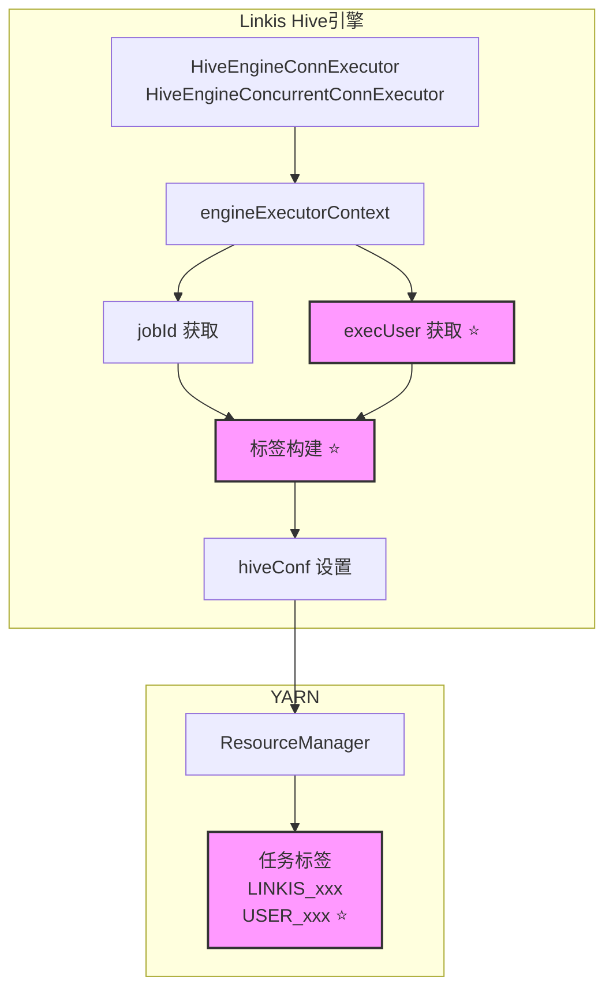
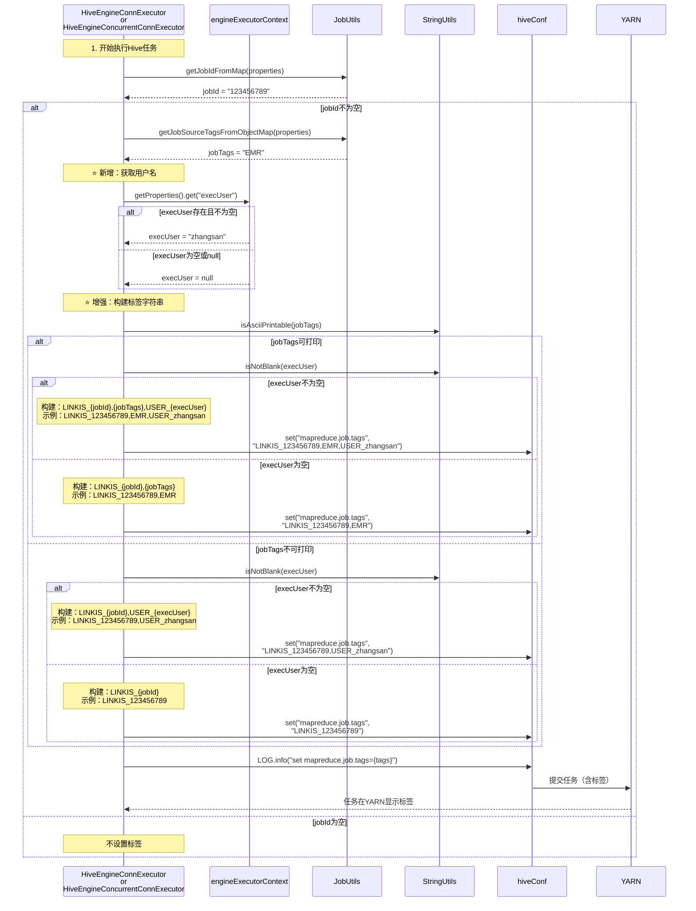

# Hive YARN Tag 用户名增强 - 设计文档

## 文档信息
- **文档版本**: v1.0
- **最后更新**: 2026-03-27
- **维护人**: 待定
- **文档状态**: 草稿
- **需求类型**: ENHANCE（功能增强）
- **需求文档**: [hive_yarn_tag_username_需求.md](../requirements/hive_yarn_tag_username_需求.md)

---

## 执行摘要

> 📖 **阅读指引**：本章节为1页概览（约500字），用于快速理解设计方案。详细内容请参考后续章节。

### 设计目标

| 目标 | 描述 | 优先级 |
|-----|------|-------|
| 增强YARN任务可追溯性 | 在YARN任务标签中增加用户名信息，便于运维人员快速定位任务来源 | P0 |
| 保持向后兼容性 | 确保现有功能不受影响，用户名获取失败时保持原有标签格式 | P0 |
| 支持特殊字符用户名 | 用户名中的特殊字符保持原样，不进行转义或过滤 | P1 |
| 增强日志可观测性 | 在日志中输出用户名信息，便于问题排查 | P1 |

### 核心设计决策

| 决策点 | 选择方案 | 决策理由（一句话） | 替代方案 |
|-------|---------|------------------|---------|
| 标签格式 | `LINKIS_{jobId},USER_{username}` | 使用逗号分隔符合YARN标签规范，前缀清晰标识 | 使用其他分隔符如分号、空格 |
| 用户名来源 | `engineExecutorContext.getProperties.get("execUser")` | Linkis标准用户获取方式，已在项目中广泛使用 | 从UGI获取（作为备选方案） |
| 容错机制 | 用户名为空时保持原格式 `LINKIS_{jobId}` | 确保不影响现有任务执行，向后兼容 | 抛出异常、使用默认用户名 |
| 特殊字符处理 | 保持原样，不进行转义 | YARN标签本身支持特殊字符，保持原始格式便于识别 | 过滤特殊字符、URL编码 |

### 架构概览图

```
┌─────────────────────────────────────────────────────────┐
│                    Linkis Hive引擎                        │
├─────────────────────────────────────────────────────────┤
│                                                           │
│  ┌─────────────────────────────────────────────────┐    │
│  │  HiveEngineConnExecutor /                        │    │
│  │  HiveEngineConcurrentConnExecutor                 │    │
│  │                                                   │    │
│  │  1. 获取 jobId (已有逻辑)                          │    │
│  │  2. 获取 execUser (新增逻辑) ⭐                     │    │
│  │  3. 构建标签字符串 (增强逻辑) ⭐                     │    │
│  │     - LINKIS_{jobId},USER_{execUser}              │    │
│  │  4. 设置 hiveConf.set("mapreduce.job.tags", tags)  │    │
│  └─────────────────────────────────────────────────┘    │
│                          │                                │
│                          ▼                                │
│  ┌─────────────────────────────────────────────────┐    │
│  │              YARN ResourceManager                 │    │
│  │                                                   │    │
│  │  任务标签显示:                                    │    │
│  │  - LINKIS_123456789                              │    │
│  │  - USER_zhangsan  ⭐ 新增                         │    │
│  └─────────────────────────────────────────────────┘    │
│                                                           │
└─────────────────────────────────────────────────────────┘
```

### 关键风险与缓解

| 风险 | 等级 | 缓解措施 |
|-----|------|---------|
| 用户名获取失败导致标签格式异常 | 低 | 用户名为空时保持原有格式 `LINKIS_{jobId}` |
| 特殊字符导致YARN标签解析失败 | 低 | YARN标签支持特殊字符，保持原样即可 |
| 并发场景下用户名混乱 | 低 | 用户名从engineExecutorContext获取，天然线程隔离 |
| 性能影响 | 低 | 仅增加一次属性获取和字符串拼接，性能影响可忽略 |

### 核心指标

| 指标 | 目标值 | 说明 |
|-----|-------|------|
| 运维定位任务时间 | 从5分钟降低到10秒 | 通过YARN标签直接识别用户 |
| 任务识别准确率 | 100% | 所有任务标签包含正确的用户名 |
| 向后兼容性 | 100% | 现有任务标签格式不受影响 |
| 性能影响 | <1ms | 标签构建时间增加不超过1毫秒 |

### 章节导航

| 关注点 | 推荐章节 |
|-------|---------|
| 想了解整体架构 | [1.1 系统架构设计](#11-系统架构设计) |
| 想了解核心流程 | [1.2 核心流程设计](#12-核心流程设计) |
| 想了解代码变更 | [1.3 代码变更定义](#13-代码变更定义) |
| 想了解兼容性保证 | [1.4 兼容性设计](#14-兼容性设计) |
| 想查看完整代码 | [3.2 完整代码示例](#32-完整代码示例) |

---

# Part 1: 核心设计

> 🎯 **本层目标**：阐述架构决策、核心流程、关键接口，完整详细展开。
>
> **预计阅读时间**：10-15分钟

## 1.1 系统架构设计

### 1.1.1 架构模式选择

**采用模式**：增强式扩展（Enhancement Pattern）

**选择理由**：
- 本需求是在现有Hive引擎基础上的增强，不改变整体架构
- 修改点明确且独立，仅在标签设置逻辑中添加用户名获取
- 保持现有架构稳定性，最小化变更范围

**架构图**：



### 1.1.2 模块划分

| 模块 | 职责 | 对外接口 | 依赖 |
|-----|------|---------|------|
| **HiveEngineConnExecutor** | Hive引擎单连接执行器 | execute(line: String): Unit | engineExecutorContext, hiveConf |
| **HiveEngineConcurrentConnExecutor** | Hive引擎并发执行器 | execute(line: String): Unit | engineExecutorContext, hiveConf |
| **JobUtils** | 任务工具类 | getJobIdFromMap, getJobSourceTagsFromObjectMap | engineExecutorContext.getProperties |
| **StringUtils** | 字符串工具类 | isNotBlank, isAsciiPrintable | Apache Commons Lang3 |

### 1.1.3 技术选型

| 层级 | 技术 | 版本 | 选型理由 |
|-----|------|------|---------|
| 开发语言 | Scala | 2.11.12 / 2.12.17 | Hive引擎现有实现语言 |
| 字符串工具 | Apache Commons Lang3 | 已存在 | 项目已依赖，提供StringUtils工具类 |
| 日志框架 | SLF4J + Logback | 已存在 | 项目标准日志框架 |
| Hadoop配置 | Hadoop Configuration | 3.3.4 | hiveConf的类型，用于设置YARN参数 |

---

## 1.2 核心流程设计

### 1.2.1 YARN标签设置流程（增强版）时序图



#### 关键节点说明

| 节点 | 处理逻辑 | 输入/输出 | 异常处理 |
|-----|---------|----------|---------|
| 1. 获取jobId | 从engineExecutorContext的properties中获取任务ID | 输入：properties<br>输出：jobId字符串或null | jobId为空时不设置标签 |
| 2. 获取jobTags | 从properties中获取任务源标签（如EMR） | 输入：properties<br>输出：jobTags字符串 | jobTags可为null |
| 3. 获取execUser ⭐ | 从properties中获取执行用户名 | 输入：properties<br>输出：execUser字符串或null | execUser为空时保持原格式 |
| 4. 构建标签 ⭐ | 根据jobId、jobTags、execUser构建标签字符串 | 输入：jobId、jobTags、execUser<br>输出：逗号分隔的标签字符串 | 使用嵌套if确保兼容性 |
| 5. 设置标签 | 将标签设置到hiveConf中 | 输入：标签字符串<br>输出：配置已更新的hiveConf | 无异常，直接设置 |
| 6. 提交到YARN | Hive向YARN提交任务 | 输入：包含标签的hiveConf<br>输出：YARN任务 | YARM解析标签并展示 |

#### 技术难点与解决方案

| 难点 | 问题描述 | 解决方案 | 决策理由 |
|-----|---------|---------|---------|
| **用户名获取失败的处理** | execUser可能为null或空字符串，需要确保不影响现有功能 | 使用嵌套if判断，execUser为空时保持原有格式 | 向后兼容优先，确保现有任务不受影响 |
| **标签格式一致性** | 需要支持4种组合场景（有/无jobTags × 有/无execUser） | 使用嵌套if分别处理4种场景 | 确保所有场景都有明确的标签格式 |
| **特殊字符处理** | 用户名可能包含@、.等特殊字符 | 保持原样，不进行转义或过滤 | YARN标签本身支持特殊字符，保持原始格式便于识别 |
| **线程安全性** | 并发场景下多个任务同时执行，需要确保用户名不混乱 | execUser从engineExecutorContext获取，天然线程隔离 | engineExecutorContext是任务级别的上下文对象 |

#### 边界与约束

- **前置条件**：
  1. engineExecutorContext已正确初始化
  2. jobId已通过JobUtils正确设置
  3. HiveConf已正确配置

- **后置保证**：
  1. mapreduce.job.tags参数已正确设置到hiveConf
  2. 日志中已输出标签设置信息
  3. 现有任务标签格式不受影响

- **并发约束**：
  1. 多个任务并发执行时，各任务的标签互不影响
  2. execUser从任务级别的context获取，天然线程隔离

- **性能约束**：
  1. 标签构建时间增加不超过1毫秒
  2. 不影响Hive任务的正常执行时间

---

## 1.3 代码变更定义

> ⚠️ **注意**：本节展示代码变更的Before/After对比，完整实现请参考 [3.2 完整代码示例](#32-完整代码示例)

### 1.3.1 HiveEngineConnExecutor.scala 变更

**文件路径**：
```
linkis-engineconn-plugins/hive/src/main/scala/org/apache/linkis/engineplugin/hive/executor/HiveEngineConnExecutor.scala
```

**变更位置**：第165-176行

#### BEFORE（现有代码）

```scala
val jobId = JobUtils.getJobIdFromMap(engineExecutorContext.getProperties)

if (StringUtils.isNotBlank(jobId)) {
  val jobTags = JobUtils.getJobSourceTagsFromObjectMap(engineExecutorContext.getProperties)
  val tags = if (StringUtils.isAsciiPrintable(jobTags)) {
    s"LINKIS_$jobId,$jobTags"
  } else {
    s"LINKIS_$jobId"
  }
  LOG.info(s"set mapreduce.job.tags=$tags")
  hiveConf.set("mapreduce.job.tags", tags)
}
```

#### AFTER（增强后代码）⭐

```scala
val jobId = JobUtils.getJobIdFromMap(engineExecutorContext.getProperties)

if (StringUtils.isNotBlank(jobId)) {
  val jobTags = JobUtils.getJobSourceTagsFromObjectMap(engineExecutorContext.getProperties)

  // ===== 变更点1：获取用户名 =====
  val execUser = if (engineExecutorContext.getProperties != null) {
    engineExecutorContext.getProperties.get("execUser") match {
      case user: String => user
      case _ => null
    }
  } else null

  // ===== 变更点2：构建标签，包含用户名信息 =====
  val tags = if (StringUtils.isAsciiPrintable(jobTags)) {
    if (StringUtils.isNotBlank(execUser)) {
      s"LINKIS_$jobId,$jobTags,USER_$execUser"  // ⭐ 新增：USER标签
    } else {
      s"LINKIS_$jobId,$jobTags"
    }
  } else {
    if (StringUtils.isNotBlank(execUser)) {
      s"LINKIS_$jobId,USER_$execUser"  // ⭐ 新增：USER标签
    } else {
      s"LINKIS_$jobId"
    }
  }

  // ===== 变更点3：增强日志输出 =====
  LOG.info(s"set mapreduce.job.tags=$tags")
  hiveConf.set("mapreduce.job.tags", tags)
}
```

**变更说明**：
1. **变更点1**：新增execUser获取逻辑，从engineExecutorContext的properties中获取
2. **变更点2**：增强标签构建逻辑，根据execUser是否为空决定是否添加USER标签
3. **变更点3**：日志输出已自动包含用户名信息（通过tags变量）

### 1.3.2 HiveEngineConcurrentConnExecutor.scala 变更

**文件路径**：
```
linkis-engineconn-plugins/hive/src/main/scala/org/apache/linkis/engineplugin/hive/executor/HiveEngineConcurrentConnExecutor.scala
```

**变更位置**：第144-148行

#### BEFORE（现有代码）

```scala
val jobId = JobUtils.getJobIdFromMap(engineExecutorContext.getProperties)
if (StringUtils.isNotBlank(jobId)) {
  LOG.info(s"set mapreduce.job.tags=LINKIS_$jobId")
  hiveConf.set("mapreduce.job.tags", s"LINKIS_$jobId")
}
```

#### AFTER（增强后代码）⭐

```scala
val jobId = JobUtils.getJobIdFromMap(engineExecutorContext.getProperties)
if (StringUtils.isNotBlank(jobId)) {
  // ===== 变更点1：获取用户名 =====
  val execUser = if (engineExecutorContext.getProperties != null) {
    engineExecutorContext.getProperties.get("execUser") match {
      case user: String => user
      case _ => null
    }
  } else null

  // ===== 变更点2：构建标签，包含用户名信息 =====
  val tags = if (StringUtils.isNotBlank(execUser)) {
    s"LINKIS_$jobId,USER_$execUser"  // ⭐ 新增：USER标签
  } else {
    s"LINKIS_$jobId"
  }

  // ===== 变更点3：增强日志输出 =====
  LOG.info(s"set mapreduce.job.tags=$tags")
  hiveConf.set("mapreduce.job.tags", tags)
}
```

**变更说明**：
1. **变更点1**：新增execUser获取逻辑
2. **变更点2**：增强标签构建逻辑，支持USER标签
3. **变更点3**：日志输出使用tags变量，自动包含用户名信息

---

## 1.4 兼容性设计

### 1.4.1 现有功能影响分析

| 现有功能 | 影响评估 | 兼容性措施 |
|---------|---------|-----------|
| **LINKIS_{jobId}标签** | ✅ 无影响 | 保持不变，仅在其后追加USER标签 |
| **jobTags支持** | ✅ 无影响 | 保持不变，USER标签追加到jobTags之后 |
| **空jobId处理** | ✅ 无影响 | 空jobId时不设置标签的逻辑保持不变 |
| **日志输出** | ✅ 增强 | 日志中自动包含用户名信息 |
| **YARN任务提交** | ✅ 无影响 | 仅修改标签内容，不影响任务提交逻辑 |

### 1.4.2 标签格式兼容性矩阵

| 场景 | 现有标签格式 | 新标签格式 | 兼容性 |
|-----|------------|-----------|-------|
| 无jobTags，无execUser | `LINKIS_123` | `LINKIS_123` | ✅ 完全兼容 |
| 有jobTags，无execUser | `LINKIS_123,EMR` | `LINKIS_123,EMR` | ✅ 完全兼容 |
| 无jobTags，有execUser | `LINKIS_123` | `LINKIS_123,USER_zhangsan` | ✅ 向后兼容 |
| 有jobTags，有execUser | `LINKIS_123,EMR` | `LINKIS_123,EMR,USER_zhangsan` | ✅ 向后兼容 |

### 1.4.3 边界条件处理

| 边界条件 | 处理方式 | 示例 |
|---------|---------|------|
| **execUser为空字符串** | 保持原有格式 | `LINKIS_123` |
| **execUser为null** | 保持原有格式 | `LINKIS_123` |
| **execUser不存在于properties** | 保持原有格式 | `LINKIS_123` |
| **jobId为空** | 不设置标签 | 无标签 |
| **特殊字符用户名** | 保持原样 | `USER_user@example.com` |
| **域用户（未来支持）** | 保持原样 | `USER_domain\\username` |

### 1.4.4 回滚方案

**触发条件**：
1. 发现YARN标签解析异常
2. 发现Hive任务执行异常
3. 发现性能问题

**回滚步骤**：
1. 恢复原始代码（删除execUser获取和USER标签构建逻辑）
2. 重新编译：`mvn clean package -pl linkis-engineconn-plugins/hive`
3. 重新部署Hive引擎插件
4. 重启Hive引擎服务

**回滚验证**：
1. 检查日志中标签输出恢复为原格式
2. 检查YARN界面标签显示正常
3. 检查Hive任务执行正常

---

## 1.5 设计决策记录 (ADR)

### ADR-001: 用户名标签前缀选择

- **状态**：已采纳
- **背景**：需要在YARN标签中标识用户名，需要选择合适的前缀以便识别
- **决策**：使用 `USER_` 作为用户名标签前缀
- **选项对比**：

| 选项 | 优点 | 缺点 | 适用场景 |
|-----|------|------|---------|
| `USER_` | 清晰易懂，符合直观认知 | 长度较长4字符 | 推荐 ✅ |
| `U_` | 简洁，长度较短 | 不够直观，可能与其他缩写冲突 | 不推荐 |
| `USERNAME_` | 非常清晰 | 长度过长9字符 | 不推荐 |
| `OWNER_` | 表达任务归属 | 与用户概念略有差异 | 不推荐 |

- **结论**：选择 `USER_` 前缀，兼顾清晰度和简洁性
- **影响**：标签格式为 `USER_zhangsan`，易于运维人员识别

### ADR-002: 标签顺序设计

- **状态**：已采纳
- **背景**：需要确定多个标签的排序顺序
- **决策**：固定顺序为 `LINKIS_{jobId},{jobTags},USER_{username}`
- **选项对比**：

| 选项 | 优点 | 缺点 | 适用场景 |
|-----|------|------|---------|
| `LINKIS,jobTags,USER` | 符合添加顺序，易于理解 | USER标签在最后可能被截断 | 可接受 ✅ |
| `USER,LINKIS,jobTags` | 用户名优先展示 | 与现有格式差异大 | 不推荐 |
| `LINKIS,USER,jobTags` | USER标签在中间，不易被截断 | 与添加顺序不一致 | 备选 |

- **结论**：选择 `LINKIS,jobTags,USER` 顺序，保持与现有标签格式的一致性
- **影响**：YARN界面显示时，USER标签位于最后

### ADR-003: 用户名获取失败的处理策略

- **状态**：已采纳
- **背景**：execUser可能为null或空，需要决定如何处理
- **决策**：保持原有标签格式，不添加USER标签
- **选项对比**：

| 选项 | 优点 | 缺点 | 适用场景 |
|-----|------|------|---------|
| **保持原格式** | 向后兼容，不影响现有功能 | 用户名信息缺失 | 推荐 ✅ |
| **使用默认用户名** | 确保USER标签存在 | 信息不准确，可能误导 | 不推荐 |
| **抛出异常** | 强制要求用户名 | 影响任务执行 | 不推荐 |

- **结论**：选择保持原格式策略，确保向后兼容
- **影响**：部分任务可能没有USER标签，但不影响现有功能

### ADR-004: 是否需要存储用户名标签

- **状态**：已采纳
- **背景**：考虑是否需要将用户名标签持久化到数据库
- **决策**：不存储，仅在YARN标签中使用
- **选项对比**：

| 选项 | 优点 | 缺点 | 适用场景 |
|-----|------|------|---------|
| **不存储** | 实现简单，无存储开销 | 历史任务无法追溯用户名 | 推荐 ✅ |
| **存储到任务历史表** | 支持历史追溯 | 需要数据库变更，增加复杂度 | 不推荐 |

- **结论**：选择不存储策略，仅在YARN标签中使用
- **影响**：历史任务的标签信息仅在YARN保留期内可查

---

# Part 2: 支撑设计

> 📐 **本层目标**：数据模型、API规范、配置策略的结构化摘要。
>
> **预计阅读时间**：5-10分钟

## 2.1 数据模型设计

### 2.1.1 无数据库变更

**说明**：本增强功能不涉及数据库变更，无需修改数据模型。

### 2.1.2 内存数据结构变更

**engineExecutorContext.getProperties 扩展**：

| 字段名 | 类型 | 说明 | 约束 | 示例值 |
|-------|------|------|------|--------|
| execUser | String | 执行用户名 | 可选，可能为null | "zhangsan" |

---

## 2.2 API规范设计

### 2.2.1 无REST API变更

**说明**：本增强功能不涉及REST API变更。

### 2.2.2 内部接口变更

**engineExecutorContext.getProperties 扩展**：

```scala
// 现有接口（无变更）
def getProperties: java.util.Map[String, Object]

// 使用方式（不变）
val execUser = engineExecutorContext.getProperties.get("execUser") match {
  case user: String => user
  case _ => null
}
```

---

## 2.3 配置策略

### 2.3.1 无新增配置项

**说明**：本增强功能无需新增配置项。

### 2.3.2 现有相关配置

| 配置项 | 默认值 | 说明 | 调整建议 |
|-------|-------|------|---------|
| mapreduce.job.tags | 动态设置 | YARN任务标签 | 无需调整 |

---

## 2.4 测试策略

### 2.4.1 测试范围

| 测试类型 | 覆盖范围 | 优先级 |
|---------|---------|-------|
| **单元测试** | execUser获取逻辑、标签构建逻辑 | P0 |
| **集成测试** | Hive任务提交到YARN，验证标签显示 | P0 |
| **兼容性测试** | 现有任务标签格式不受影响 | P0 |
| **边界测试** | execUser为空、null、特殊字符等场景 | P1 |

### 2.4.2 关键测试场景

| 场景编号 | 测试场景 | 输入条件 | 预期标签格式 | 优先级 |
|---------|---------|----------|-------------|-------|
| TC001 | 正常用户名 + 无jobTags | execUser="zhangsan", jobId="123" | `LINKIS_123,USER_zhangsan` | P0 |
| TC002 | 正常用户名 + 有jobTags | execUser="zhangsan", jobId="123", jobTags="EMR" | `LINKIS_123,EMR,USER_zhangsan` | P0 |
| TC003 | 用户名为空字符串 | execUser="", jobId="123" | `LINKIS_123` | P0 |
| TC004 | 用户名为null | execUser=null, jobId="123" | `LINKIS_123` | P0 |
| TC005 | jobId为空 | jobId="" | 不设置标签 | P1 |
| TC006 | 特殊字符用户名 | execUser="user@example.com", jobId="123" | `LINKIS_123,USER_user@example.com` | P1 |
| TC007 | 域用户（未来） | execUser="domain\\user", jobId="123" | `LINKIS_123,USER_domain\\user` | P2 |

### 2.4.3 测试验证方式

**日志验证**：
```bash
# 查看Linkis日志
grep "set mapreduce.job.tags" /path/to/linkis/logs/linkis-hive-engine.log

# 预期输出
set mapreduce.job.tags=LINKIS_123456789,USER_zhangsan
```

**YARN界面验证**：
1. 登录YARN ResourceManager Web UI
2. 查看正在运行的Hive任务
3. 确认任务标签包含用户名信息

---

## 2.5 外部依赖接口设计

> ⚠️ **适用性**：本增强功能不涉及外部系统依赖，本章节标记为 N/A。

**N/A - 本增强功能无新增外部系统依赖**

---

## 2.6 安全设计摘要

| 安全关注点 | 措施 | 说明 |
|-----------|------|------|
| 用户名隐私 | 用户名已在YARN中暴露，无新增风险 | execUser从现有context获取，未新增泄露点 |
| 权限控制 | 无变更 | 标签设置无额外权限要求 |
| 数据安全 | 无变更 | 仅修改标签内容，不涉及数据处理 |

---

## 2.7 监控与告警

### 2.7.1 关键指标

| 指标 | 阈值 | 告警级别 | 说明 |
|-----|------|---------|------|
| 标签构建时间 | <1ms | P1 | 标签构建耗时监控 |
| execUser为空率 | <5% | P2 | execUser为空的任务占比，异常升高告警 |
| YARN标签解析失败 | 0次/天 | P1 | YARN无法解析标签的情况 |

### 2.7.2 日志监控

**关键日志**：
```scala
LOG.info(s"set mapreduce.job.tags=$tags")
```

**监控建议**：
1. 统计包含USER标签的任务数量
2. 统计不包含USER标签的任务数量（识别异常）

---

# Part 3: 参考资料

> 📎 **本层目标**：完整代码、脚本、配置，按需查阅。
>
> **使用方式**：点击展开查看详细内容

## 3.1 完整DDL脚本

<details>
<summary>📄 点击展开完整DDL脚本</summary>

**N/A - 本增强功能无数据库变更**

</details>

---

## 3.2 完整代码示例

<details>
<summary>📄 HiveEngineConnExecutor.scala - 完整变更代码</summary>

```scala
// 文件路径：linkis-engineconn-plugins/hive/src/main/scala/org/apache/linkis/engineplugin/hive/executor/HiveEngineConnExecutor.scala
// 变更位置：第165-176行

// ===== 原始代码 =====
val jobId = JobUtils.getJobIdFromMap(engineExecutorContext.getProperties)

if (StringUtils.isNotBlank(jobId)) {
  val jobTags = JobUtils.getJobSourceTagsFromObjectMap(engineExecutorContext.getProperties)
  val tags = if (StringUtils.isAsciiPrintable(jobTags)) {
    s"LINKIS_$jobId,$jobTags"
  } else {
    s"LINKIS_$jobId"
  }
  LOG.info(s"set mapreduce.job.tags=$tags")
  hiveConf.set("mapreduce.job.tags", tags)
}

// ===== 增强后代码 =====
val jobId = JobUtils.getJobIdFromMap(engineExecutorContext.getProperties)

if (StringUtils.isNotBlank(jobId)) {
  val jobTags = JobUtils.getJobSourceTagsFromObjectMap(engineExecutorContext.getProperties)

  // 获取用户名
  val execUser = if (engineExecutorContext.getProperties != null) {
    engineExecutorContext.getProperties.get("execUser") match {
      case user: String => user
      case _ => null
    }
  } else null

  // 构建标签，包含用户名信息
  val tags = if (StringUtils.isAsciiPrintable(jobTags)) {
    if (StringUtils.isNotBlank(execUser)) {
      s"LINKIS_$jobId,$jobTags,USER_$execUser"
    } else {
      s"LINKIS_$jobId,$jobTags"
    }
  } else {
    if (StringUtils.isNotBlank(execUser)) {
      s"LINKIS_$jobId,USER_$execUser"
    } else {
      s"LINKIS_$jobId"
    }
  }

  LOG.info(s"set mapreduce.job.tags=$tags")
  hiveConf.set("mapreduce.job.tags", tags)
}
```

</details>

<details>
<summary>📄 HiveEngineConcurrentConnExecutor.scala - 完整变更代码</summary>

```scala
// 文件路径：linkis-engineconn-plugins/hive/src/main/scala/org/apache/linkis/engineplugin/hive/executor/HiveEngineConcurrentConnExecutor.scala
// 变更位置：第144-148行

// ===== 原始代码 =====
val jobId = JobUtils.getJobIdFromMap(engineExecutorContext.getProperties)
if (StringUtils.isNotBlank(jobId)) {
  LOG.info(s"set mapreduce.job.tags=LINKIS_$jobId")
  hiveConf.set("mapreduce.job.tags", s"LINKIS_$jobId")
}

// ===== 增强后代码 =====
val jobId = JobUtils.getJobIdFromMap(engineExecutorContext.getProperties)
if (StringUtils.isNotBlank(jobId)) {
  // 获取用户名
  val execUser = if (engineExecutorContext.getProperties != null) {
    engineExecutorContext.getProperties.get("execUser") match {
      case user: String => user
      case _ => null
    }
  } else null

  // 构建标签，包含用户名信息
  val tags = if (StringUtils.isNotBlank(execUser)) {
    s"LINKIS_$jobId,USER_$execUser"
  } else {
    s"LINKIS_$jobId"
  }

  LOG.info(s"set mapreduce.job.tags=$tags")
  hiveConf.set("mapreduce.job.tags", tags)
}
```

</details>

---

## 3.3 API请求响应示例

<details>
<summary>📄 点击展开API请求响应示例</summary>

**N/A - 本增强功能不涉及REST API**

</details>

---

## 3.4 配置文件示例

<details>
<summary>📄 点击展开配置文件示例</summary>

**N/A - 本增强功能无需新增配置**

</details>

---

## 3.5 数据迁移脚本

<details>
<summary>📄 点击展开数据迁移脚本</summary>

**N/A - 本增强功能无数据库变更**

</details>

---

# 附录

## A. 相关文档

- [需求文档](../requirements/hive_yarn_tag_username_需求.md)
- [Feature文件](../features/hive_yarn_tag_username.feature)

## B. 审批记录

| 审批人 | 角色 | 时间 | 状态 |
|--------|------|------|------|
| 待定 | 技术负责人 | 待定 | 待审批 |
| 待定 | Hive引擎负责人 | 待定 | 待审批 |

## C. 更新日志

| 版本 | 时间 | 作者 | 变更说明 |
|------|------|------|---------|
| v1.0 | 2026-03-27 | AI助手 | 初版创建 |

---

**文档结束**
