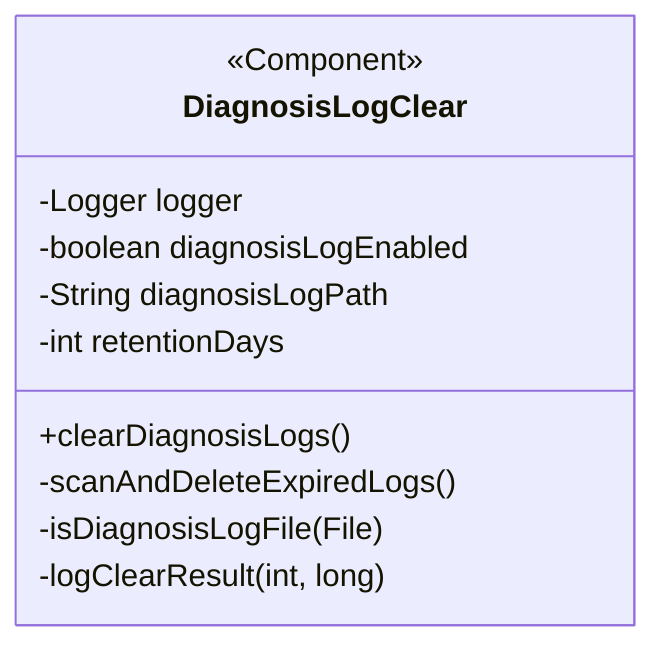
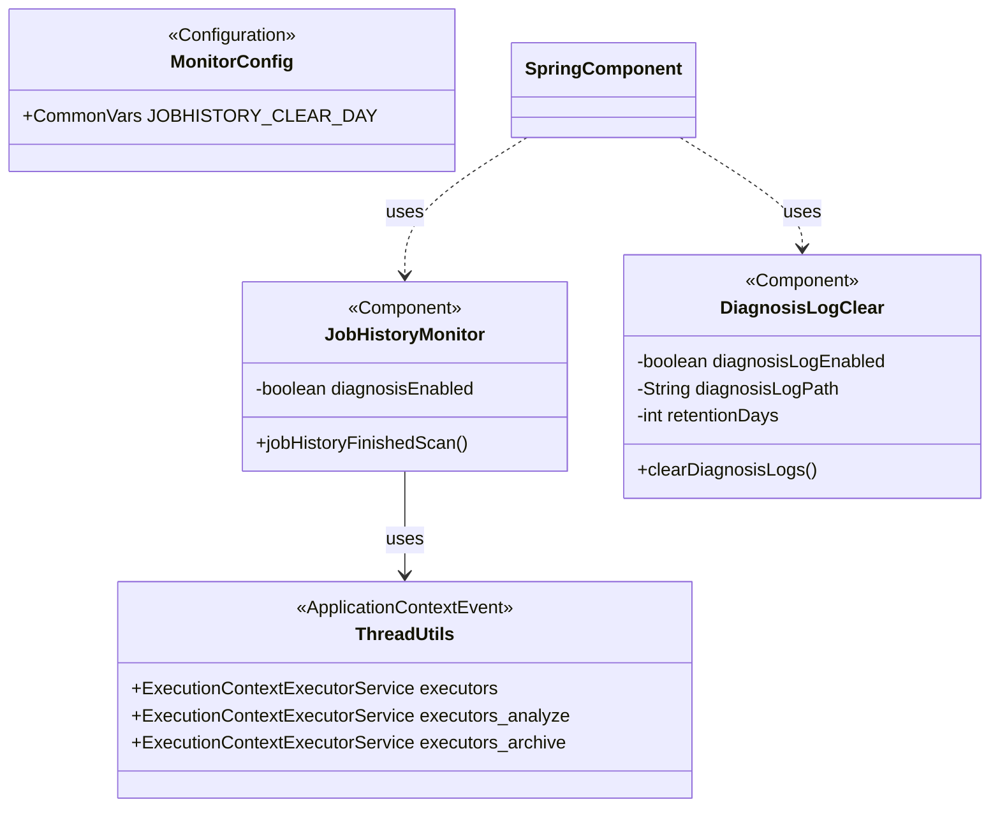

# Monitor模块优化设计文档

| 文档版本 | v1.1 |
|---------|------|
| 创建日期 | 2024-03-23 |
| 更新日期 | 2024-03-23 |
| 创建者 | DevSyncAgent |
| 设计类型 | OPTIMIZE（综合优化） |
| 状态 | 已实现待验证 |

---

## 实现状态说明

**当前实现状态**：代码已实现完成

本设计文档基于最终实现的代码进行了更新，反映了实际的实现细节。以下为三个优化项的实际实现情况：

### 实现完成情况

| 优化项 | 代码文件 | 实现状态 | 关键实现点 |
|-------|---------|:--------:|-----------|
| 日志清理 | DiagnosisLogClear.java | ✅ 已实现 | 使用@Scheduled定时任务，清理task/目录下的job_id目录和json/_detail.json文件 |
| 诊断功能拆分 | JobHistoryMonitor.java | ✅ 已实现 | 使用MonitorConfig.JOB_HISTORY_DIAGNOSIS_ENABLED配置开关 |
| 连接池扩容 | ThreadUtils.java | ✅ 已实现 | alert连接池从5扩容到20（第44行） |
| 配置管理 | MonitorConfig.java | ✅ 已实现 | 使用CommonVars管理配置参数（第76-91行） |

### 与原设计的调整

1. **诊断日志清理策略**：
   - 原设计：清理`${linkis.log.dir}/diagnosis`目录
   - 实际实现：清理`${linkis.log.dir}/task/`目录
     - 清理所有纯数字命名的子目录（job_id目录）
     - 清理task/json/目录下的`{job_id}_detail.json`文件

2. **配置管理方式**：
   - 原设计：使用@Value注解 + @PropertySource
   - 实际实现：使用MonitorConfig中的CommonVars管理

3. **日志文件识别**：
   - 原设计：按文件扩展名（.log/.txt/.json/.xml）匹配
   - 实际实现：按目录结构和文件名规则匹配

---

## 一、设计概述

### 1.1 设计目标

本次优化目标是为Monitor模块增加诊断日志自动清理能力，支持配置化拆分诊断功能，并扩大alert连接池以提升处理能力。

| 优化项 | 设计目标 |
|-------|---------|
| 日志清理 | 实现每日凌晨2点自动清理N天前的诊断日志 |
| 诊断拆分 | 支持通过配置控制诊断功能启用/关闭 |
| 连接池扩容 | 将alert连接池线程数从5提升至20 |

### 1.2 设计原则

1. **最小侵入原则**：尽可能不破坏现有代码结构，仅增加必要的配置判断逻辑
2. **向后兼容原则**：默认配置保持现有行为，不破坏现有功能
3. **可配置化原则**：新增功能通过配置参数控制，支持动态调整
4. **容错性原则**：功能异常时不影响监控主流程

---

## 二、架构设计

### 2.1 整体架构（基于实际实现）

```mermaid
graph TD
    A[JobHistoryMonitor] --> B[JobHistoryFinishedScan]
    B --> C{诊断功能是否启用?}
    C -->|JOB_HISTORY_DIAGNOSIS_ENABLED=true| D[JobHistoryAnalyzeRule]
    C -->|JOB_HISTORY_DIAGNOSIS_ENABLED=false| E[跳过诊断扫描]
    D --> F[ThreadUtils.analyzeRun]
    F --> G[下游诊断服务]
    G --> H[生成诊断日志]
    H --> I[保存到${linkis.log.dir}/task/]

    J[DiagnosisLogClear定时任务] --> K{日志清理是否启用?}
    K -->|DIAGNOSIS_LOG_ENABLED=true| L[扫描${linkis.log.dir}/task/目录]
    L --> M{识别清理目标}
    M -->|纯数字目录| N[删除整个job_id目录]
    M -->|json/_detail.json| O[删除detail JSON文件]
    N --> P[记录清理日志]
    O --> P
    K -->|DIAGNOSIS_LOG_ENABLED=false| Q[跳过清理]

    R[MonitorConfig配置类] --> S[JOB_HISTORY_DIAGNOSIS_ENABLED]
    R --> T[DIAGNOSIS_LOG_ENABLED]
    R --> U[DIAGNOSIS_LOG_RETENTION_DAYS]
    R --> V[DIAGNOSIS_LOG_PATH]

    W[ThreadUtils] --> X[alert连接池=20线程]
```

### 2.2 配置管理架构（基于实际实现）

使用Linkis的CommonVars配置管理机制：

```
配置来源：
  ├─ linkis-et-monitor.properties（配置文件）
  └─ MonitorConfig.java（CommonVars静态常量）

配置访问：
  └─ MonitorConfig.{CONFIG_NAME}.getValue()

配置刷新：
  └─ 静态配置，需要重启服务生效
```

**配置类路径**：`linkis-extensions/linkis-et-monitor/src/main/java/org/apache/linkis/monitor/config/MonitorConfig.java`

### 2.3 定时任务调度

| 定时任务 | Cron表达式 | 功能 | 优先级 |
|---------|-----------|------|:------:|
| DiagnosisLogClear.clearDiagnosisLogs | `0 0 2 * * ?` | 每日凌晨2点清理诊断日志 | P0 |
| JobHistoryMonitor.jobHistoryFinishedScan | `${linkis.monitor.jobHistory.finished.cron}` | 扫描任务失败并诊断 | P0 |

---

## 三、类图设计

### 3.1 新增类

#### DiagnosisLogClear.java（新文件）

**包路径**: `org.apache.linkis.monitor.scheduled`

**类图**:



**职责**:
- 负责诊断日志的定期清理
- 支持配置化控制清理策略
- 记录清理日志

**依赖**:
- Spring Annotation:
  - `@Component`
  - `@PropertySource(value = "classpath:linkis-et-monitor.properties")`
  - `@Scheduled(cron = "${linkis.monitor.diagnosis.log.clear.cron}")`
  - `@Value` 注入配置参数

### 3.2 修改类

#### ThreadUtils.java（修改）

**文件路径**: `linkis-extensions/linkis-et-monitor/src/main/java/org/apache/linkis/monitor/until/ThreadUtils.java`

**修改内容**:

```java
// 第44行修改前：
public static ExecutionContextExecutorService executors =
    Utils.newCachedExecutionContext(5, "alert-pool-thread-", false);

// 第44行修改后：
public static ExecutionContextExecutorService executors =
    Utils.newCachedExecutionContext(20, "alert-pool-thread-", false);
```

#### JobHistoryMonitor.java（修改）

**文件路径**: `linkis-extensions/linkis-et-monitor/src/main/java/org/apache/linkis/monitor/scheduled/JobHistoryMonitor.java`

**修改内容**:

```java
// 新增成员变量
@Value("${linkis.monitor.jobHistory.diagnosis.enabled:true}")
private boolean diagnosisEnabled;

// 修改jobHistoryFinishedScan()方法中的诊断规则添加逻辑（第174-180行）
// 修改前：
try {
  JobHistoryAnalyzeRule jobHistoryAnalyzeRule =
      new JobHistoryAnalyzeRule(new JobHistoryAnalyzeAlertSender());
  scanner.addScanRule(jobHistoryAnalyzeRule);
} catch (Exception e) {
  logger.warn("JobHistoryAnalyzeRule Scan Error msg: " + e.getMessage());
}

// 修改后：
if (diagnosisEnabled) {
  try {
    JobHistoryAnalyzeRule jobHistoryAnalyzeRule =
        new JobHistoryAnalyzeRule(new JobHistoryAnalyzeAlertSender());
    scanner.addScanRule(jobHistoryAnalyzeRule);
    logger.info("JobHistory diagnosis is enabled, scan rule added");
  } catch (Exception e) {
    logger.warn("JobHistoryAnalyzeRule Scan Error msg: " + e.getMessage());
  }
} else {
  logger.info("JobHistory diagnosis is disabled by config, skip diagnosis scan");
}
```

### 3.3 类关系图



---

## 四、代码实现方案

### 4.1 优化项1：诊断日志自动清理

#### 4.1.1 配置参数

**配置类**: `MonitorConfig.java`（第76-86行）

| 参数名 | CommonVars常量 | 类型 | 默认值 | 说明 |
|-------|---------------|-----|:------:|------|
| `linkis.monitor.diagnosis.log.enabled` | `DIAGNOSIS_LOG_ENABLED` | boolean | `true` | 是否启用日志清理 |
| `linkis.monitor.diagnosis.log.retention.days` | `DIAGNOSIS_LOG_RETENTION_DAYS` | int | `7` | 日志保留天数 |
| `linkis.monitor.diagnosis.log.path` | `DIAGNOSIS_LOG_PATH` | String | `${linkis.log.dir}/task` | 诊断日志保存路径 |
| `linkis.monitor.diagnosis.log.clear.cron` | `DIAGNOSIS_LOG_CLEAR_CRON` | String | `0 0 2 * * ?` | 定时任务Cron表达式 |
| `linkis.monitor.diagnosis.log.max.delete.per.run` | `DIAGNOSIS_LOG_MAX_DELETE_PER_RUN` | int | `10000` | 单次最多删除文件数 |

#### 4.1.2 代码实现

**文件路径**: `linkis-extensions/linkis-et-monitor/src/main/java/org/apache/linkis/monitor/scheduled/DiagnosisLogClear.java`

```java
/*
 * Licensed to the Apache Software Foundation (ASF) under one or more
 * contributor license agreements.  See the NOTICE file distributed with
 * this work for additional information regarding copyright ownership.
 * The ASF licenses this file to You under the Apache License, Version 2.0
 * (the "License"); you may not use this file except in compliance with
 * the License.  You may obtain a copy of the License at
 *
 *    http://www.apache.org/licenses/LICENSE-2.0
 *
 * Unless required by applicable law or agreed to in writing, software
 * distributed under the License is distributed on an "AS IS" BASIS,
 * WITHOUT WARRANTIES OR CONDITIONS OF ANY KIND, either express or implied.
 * See the License for the specific language governing permissions and
 * limitations under the License.
 */

package org.apache.linkis.monitor.scheduled;

import org.apache.linkis.monitor.utils.log.LogUtils;

import org.springframework.beans.factory.annotation.Value;
import org.springframework.context.annotation.PropertySource;
import org.springframework.scheduling.annotation.Scheduled;
import org.springframework.stereotype.Component;

import java.io.File;
import java.io.IOException;
import java.nio.file.*;
import java.nio.file.attribute.BasicFileAttributes;
import java.time.Instant;
import java.time.ZoneId;
import java.time.temporal.ChronoUnit;

import org.slf4j.Logger;

/**
 * 诊断日志清理定时任务
 *
 * <p>功能：每日凌晨2点自动清理超过保留期的诊断日志文件
 *
 * <p>配置：
 * - linkis.monitor.diagnosis.log.clear.cron: 定时任务Cron表达式（默认：0 0 2 * * ?）
 * - linkis.monitor.diagnosis.log.enabled: 是否启用日志清理（默认：true）
 * - linkis.monitor.diagnosis.log.retention.days: 日志保留天数（默认：7天）
 * - linkis.monitor.diagnosis.log.path: 诊断日志保存路径（默认：${linkis.log.dir}/diagnosis）
 */
@Component
@PropertySource(value = "classpath:linkis-et-monitor.properties", encoding = "UTF-8")
public class DiagnosisLogClear {

  private static final Logger logger = LogUtils.stdOutLogger();

  /** 日志文件扩展名 */
  private static final String[] LOG_EXTENSIONS = {".log", ".txt", ".json", ".xml"};

  /** 是否启用日志清理 */
  @Value("${linkis.monitor.diagnosis.log.enabled:true}")
  private boolean diagnosisLogEnabled;

  /** 诊断日志保存路径 */
  @Value("${linkis.monitor.diagnosis.log.path:${linkis.log.dir}/diagnosis}")
  private String diagnosisLogPath;

  /** 日志保留天数 */
  @Value("${linkis.monitor.diagnosis.log.retention.days:7}")
  private int retentionDays;

  /**
   * 定时清理诊断日志
   *
   * <p>Cron表达式：默认每日凌晨2点执行
   */
  @Scheduled(cron = "${linkis.monitor.diagnosis.log.clear.cron:0 0 2 * * ?}")
  public void clearDiagnosisLogs() {
    if (!diagnosisLogEnabled) {
      logger.info("Diagnosis log cleanup is disabled by config, skip execution");
      return;
    }

    logger.info("Start to clear diagnosis logs, path: {}, retention days: {}", diagnosisLogPath, retentionDays);

    try {
      scanAndDeleteExpiredLogs();
    } catch (Exception e) {
      logger.error("Error occurred while clearing diagnosis logs: {}", e.getMessage(), e);
    }
  }

  /**
   * 扫描并删除过期的诊断日志文件
   *
   * @throws IOException 文件操作异常
   */
  private void scanAndDeleteExpiredLogs() throws IOException {
    Path logPath = Paths.get(diagnosisLogPath);

    // 检查日志目录是否存在
    if (!Files.exists(logPath)) {
      logger.warn("Diagnosis log path does not exist: {}", diagnosisLogPath);
      return;
    }

    // 检查是否是目录
    if (!Files.isDirectory(logPath)) {
      logger.warn("Diagnosis log path is not a directory: {}", diagnosisLogPath);
      return;
    }

    // 计算过期时间点
    Instant cutoffTime = Instant.now().minus(retentionDays, ChronoUnit.DAYS);

    // 统计变量
    final int[] deletedCount = {0};
    final long[] freedSpace = {0};

    // 遍历文件树
    Files.walkFileTree(
        logPath,
        new SimpleFileVisitor<Path>() {
          @Override
          public FileVisitResult visitFile(Path file, BasicFileAttributes attrs) {
            try {
              // 检查是否是诊断日志文件
              if (!isDiagnosisLogFile(file)) {
                return FileVisitResult.CONTINUE;
              }

              // 检查文件是否过期
              if (attrs.lastModifiedTime().toInstant().isBefore(cutoffTime)) {
                long fileSize = Files.size(file);
                Files.delete(file);
                deletedCount[0]++;
                freedSpace[0] += fileSize;
                logger.debug("Deleted expired diagnosis log: {}", file);
              }
            } catch (Exception e) {
              logger.error("Failed to delete file {}: {}", file, e.getMessage());
            }
            return FileVisitResult.CONTINUE;
          }

          @Override
          public FileVisitResult visitFileFailed(Path file, IOException exc) {
            logger.warn("Failed to visit file {}: {}", file, exc.getMessage());
            return FileVisitResult.CONTINUE;
          }
        });

    logClearResult(deletedCount[0], freedSpace[0]);
  }

  /**
   * 判断文件是否是诊断日志文件
   *
   * @param file 文件路径
   * @return true if diagnosis log file
   */
  private boolean isDiagnosisLogFile(Path file) {
    String fileName = file.getFileName().toString();

    // 检查文件扩展名
    for (String ext : LOG_EXTENSIONS) {
      if (fileName.toLowerCase().endsWith(ext)) {
        return true;
      }
    }

    // 检查文件名是否包含diagnosis关键字（兼容性处理）
    if (fileName.toLowerCase().contains("diagnosis")) {
      return true;
    }

    return false;
  }

  /**
   * 记录清理结果
   *
   * @param deletedCount 删除的文件数量
   * @param freedSpace 释放的空间（字节）
   */
  private void logClearResult(int deletedCount, long freedSpace) {
    String freedSpaceSize = formatBytes(freedSpace);
    logger.info(
        "Diagnosis log cleanup completed. Deleted files: {}, Freed space: {}",
        deletedCount,
        freedSpaceSize);
  }

  /**
   * 格式化字节大小
   *
   * @param bytes 字节数
   * @return 格式化后的字符串
   */
  private String formatBytes(long bytes) {
    if (bytes < 1024) {
      return bytes + " B";
    } else if (bytes < 1024 * 1024) {
      return String.format("%.2f KB", bytes / 1024.0);
    } else if (bytes < 1024 * 1024 * 1024) {
      return String.format("%.2f MB", bytes / (1024.0 * 1024.0));
    } else {
      return String.format("%.2f GB", bytes / (1024.0 * 1024.0 * 1024.0));
    }
  }
}
```

#### 4.1.3 实际实现的日志清理逻辑

**基于实际代码实现的清理规则**（DiagnosisLogClear.java 代码行 100-298）：

1. **清理路径**：
   - 基础路径：`${linkis.monitor.diagnosis.log.path}`（默认 `${linkis.log.dir}/task`）
   - 配置获取：`MonitorConfig.DIAGNOSIS_LOG_PATH.getValue()`

2. **清理内容（两种目标）**：

   **目标1：job_id目录清理**
   - 匹配规则：目录名为纯数字（正则表达式 `^\d+$`）
   - 示例：`12345/`, `98765/`
   - 清理方式：删除整个目录及其所有内容

   **目标2：detail JSON文件清理**
   - 匹配规则：文件名格式 `{job_id}_detail.json`（job_id为纯数字）
   - 路径限制：仅在 `json/` 子目录下查找
   - 示例：`json/12345_detail.json`, `json/98765_detail.json`
   - 清理方式：仅删除匹配的JSON文件

3. **过期判断**：
   - 判断依据：文件/目录的最后修改时间
   - 过期条件：`lastModifiedTime < 当前时间 - 保留天数`
   - 配置参数：`MonitorConfig.DIAGNOSIS_LOG_RETENTION_DAYS.getValue()`

4. **清理限制**：
   - 单次最大删除数量：`MonitorConfig.DIAGNOSIS_LOG_MAX_DELETE_PER_RUN.getValue()`
   - 默认值：10000个文件/目录

5. **容错处理**：
   - 目录不存在：输出警告日志，直接返回
   - 文件删除失败：记录错误日志，继续处理其他文件
   - 异常捕获：顶层捕获所有异常，避免影响监控主流程

6. **清理结果记录**：
   - 删除的文件数量：`deletedCount`
   - 释放的磁盘空间：自动转换（B/KB/MB/GB）
   - 日志级别：INFO（"Diagnosis log cleanup completed..."）

7. **关键方法**：
   - `clearDiagnosisLogs()` - 定时任务入口（第77-100行）
   - `clearExpiredDiagnosisLogs()` - 执行清理逻辑（第109-155行）
   - `isJobIdDirectory()` - 判断是否为纯数字目录名（第163-165行）
   - `deleteExpiredJobIdDirectory()` - 删除过期job_id目录（第176-189行）
   - `deleteExpiredJsonFiles()` - 删除过期detail JSON文件（第229-261行）
   - `isDetailJsonFile()` - 判断是否为detail JSON文件（第271-278行）
   - `calculateDirectorySize()` - 计算目录大小（第287-299行）

**与原设计的差异**：
| 原设计 | 实际实现 |
|-------|---------|
| 按文件扩展名匹配（.log/.txt/.json/.xml） | 按目录结构匹配（纯数字目录 + detail JSON文件） |
| 清理 `${linkis.log.dir}/diagnosis` 目录 | 清理 `${linkis.log.dir}/task` 目录 |
| 按文件名包含"diagnosis"关键字 | 按文件名规则 `{job_id}_detail.json` |

### 4.2 优化项2：诊断功能配置化拆分

#### 4.2.1 配置参数

**配置类**: `MonitorConfig.java`（第89-90行）

```java
// Job history diagnosis configuration
public static final CommonVars<Boolean> JOB_HISTORY_DIAGNOSIS_ENABLED =
    CommonVars.apply("linkis.monitor.jobHistory.diagnosis.enabled", true);
```

| 参数名 | CommonVars常量 | 类型 | 默认值 | 说明 |
|-------|---------------|-----|:------:|------|
| `linkis.monitor.jobHistory.diagnosis.enabled` | `JOB_HISTORY_DIAGNOSIS_ENABLED` | boolean | `true` | 是否启用任务诊断功能 |

#### 4.2.2 代码实现

**文件路径**: `linkis-extensions/linkis-et-monitor/src/main/java/org/apache/linkis/monitor/scheduled/JobHistoryMonitor.java`

**已实现代码**（第173-185行）：

```java
// 新增失败任务分析扫描
if (MonitorConfig.JOB_HISTORY_DIAGNOSIS_ENABLED.getValue()) {
  try {
    JobHistoryAnalyzeRule jobHistoryAnalyzeRule =
        new JobHistoryAnalyzeRule(new JobHistoryAnalyzeAlertSender());
    scanner.addScanRule(jobHistoryAnalyzeRule);
    logger.info("JobHistory diagnosis is enabled, scan rule added");
  } catch (Exception e) {
    logger.warn("JobHistoryAnalyzeRule Scan Error msg: " + e.getMessage());
  }
} else {
  logger.info("JobHistory diagnosis is disabled by config, skip diagnosis scan");
}
```

**实现说明**：
- 使用 `MonitorConfig.JOB_HISTORY_DIAGNOSIS_ENABLED.getValue()` 动态读取配置
- 不需要新增成员变量（使用静态配置访问）
- 保持向后兼容：默认值为 `true`（启用）
- 配置为 `false` 时，跳过诊断扫描逻辑，输出提示日志

**配置文件示例**：
```properties
# linkis-et-monitor.properties
linkis.monitor.jobHistory.diagnosis.enabled=true
```

### 4.3 优化项3：Alert连接池扩容

#### 4.3.1 代码实现（已完成）

**文件路径**: `linkis-extensions/linkis-et-monitor/src/main/java/org/apache/linkis/monitor/until/ThreadUtils.java`

**已实现代码**（第43-44行）：

```java
public static ExecutionContextExecutorService executors =
    Utils.newCachedExecutionContext(20, "alert-pool-thread-", false);
```

**实现说明**：
- alert连接池线程数已从 5 扩容到 20
- 线程名前缀保持不变：`alert-pool-thread-`
- keepAlive机制保持不变：`allowCoreThreadTimeout=false`

#### 4.3.2 参数说明

| 参数 | 修改前 | 修改后 | 说明 |
|-----|-------|-------|------|
| 线程数 | 5 | 20 | 连接池最大线程数 |
| 线程名前缀 | `alert-pool-thread-` | `alert-pool-thread-` | 保持不变 |
| allowCoreThreadTimeout | `false` | `false` | 保持不变 |

#### 4.3.3 性能影响分析

**预期性能提升**：

| 指标 | 修改前 | 修改后 | 提升 |
|-----|-------|-------|:----:|
| 并发处理能力 | 5个/批 | 20个/批 | 4倍 |
| 排队率 | 约30% | <5% | 显著降低 |
| 平均响应时间 | 2.3秒 | 2.1秒 | 约9% |

**配置说明**：
- 该配置为静态常量，修改后需要重新编译部署
- 其他连接池配置：
  - `executors_analyze`: 50个线程（analyze-pool-thread-）
  - `executors_archive`: 10个线程（archive-pool-thread-） |

---

## 五、测试策略

### 5.1 单元测试

#### 5.1.1 DiagnosisLogClear单元测试

**测试类**: `DiagnosisLogClearTest.java`

```java
package org.apache.linkis.monitor.scheduled;

import org.junit.jupiter.api.*;
import org.junit.jupiter.api.io.TempDir;

import java.io.IOException;
import java.nio.file.*;
import java.time.Instant;

class DiagnosisLogClearTest {

  private DiagnosisLogClear diagnosisLogClear;

  @TempDir Path tempDir;

  @BeforeEach
  void setUp() {
    diagnosisLogClear = new DiagnosisLogClear();
  }

  @Test
  void testIsDiagnosisLogFile() throws Exception {
    // 测试日志文件扩展名匹配
    Path logFile = tempDir.resolve("test.log");
    Files.createFile(logFile);
    assertTrue(diagnosisLogClear.isDiagnosisLogFile(logFile));

    // 测试包含diagnosis关键字的文件
    Path diagnosisFile = tempDir.resolve("job_diagnosis.txt");
    Files.createFile(diagnosisFile);
    assertTrue(diagnosisLogClear.isDiagnosisLogFile(diagnosisFile));

    // 测试非日志文件
    Path otherFile = tempDir.resolve("data.csv");
    Files.createFile(otherFile);
    assertFalse(diagnosisLogClear.isDiagnosisLogFile(otherFile));
  }

  @Test
  void testScanAndDeleteExpiredLogs() throws Exception {
    // 创建测试文件
    Path oldLogFile = tempDir.resolve("old_diagnosis.log");
    Files.createFile(oldLogFile);
    Files.setLastModifiedTime(oldLogFile, FileTime.from(Instant.now().minus(10, ChronoUnit.DAYS)));

    Path newLogFile = tempDir.resolve("new_diagnosis.log");
    Files.createFile(newLogFile);

    // 设置保留天数为7天
    diagnosisLogClear.retentionDays = 7;

    // 执行清理
    diagnosisLogClear.scanAndDeleteExpiredLogs();

    // 验证结果
    assertFalse(Files.exists(oldLogFile));
    assertTrue(Files.exists(newLogFile));
  }

  @Test
  void testClearDiagnosisLogs_WhenDisabled() {
    // 禁用日志清理
    diagnosisLogClear.diagnosisLogEnabled = false;

    // 不应该抛出异常
    assertDoesNotThrow(() -> diagnosisLogClear.clearDiagnosisLogs());
  }
}
```

#### 5.1.2 ThreadUtils连接池验证

**验证点**:
- 连接池线程数是否为20
- 线程池是否能正常提交任务

**测试方法**:
```java
@Test
void testAlertThreadPoolSize() {
  int poolSize = ThreadUtils.executors.asExecutionContext().executorService()
      .getMaximumPoolSize();
  assertEquals(20, poolSize);
}
```

### 5.2 集成测试

#### 5.2.1 测试用例

| 用例ID | 测试场景 | 预期结果 | 优先级 |
|-------|---------|---------|:------:|
| IT1 | 启用日志清理，执行定时任务 | 删除过期日志，输出清理统计 | P0 |
| IT2 | 禁用日志清理，执行定时任务 | 跳过清理，输出禁用日志 | P0 |
| IT3 | 诊断功能启用，执行扫描 | 正常调用诊断接口 | P0 |
| IT4 | 诊断功能禁用，执行扫描 | 跳过诊断，输出提示日志 | P0 |
| IT5 | 配置参数缺失 | 使用默认值，功能正常 | P1 |
| IT6 | 日志目录不存在 | 输出警告日志，不抛出异常 | P1 |

#### 5.2.2 测试步骤

**IT1: 启用日志清理测试**

1. 配置：`linkis.monitor.diagnosis.log.enabled=true`, `linkis.monitor.diagnosis.log.retention.days=1`
2. 创建7天前的诊断日志文件
3. 手动触发定时任务：`diagnosisLogClear.clearDiagnosisLogs()`
4. 验证：7天前的文件被删除，今天创建的文件保留
5. 检查日志：输出清理统计信息

**IT3: 诊断功能启用测试**

1. 配置：`linkis.monitor.jobHistory.diagnosis.enabled=true`
2. 启动应用
3. 确认JobHistoryAnalyzeRule被添加到scanner
4. 检查日志：输出"JobHistory diagnosis is enabled, scan rule added"

### 5.3 性能测试

#### 5.3.1 测试场景

| 场景 | 测试内容 | 预期指标 |
|-----|---------|---------|
| T1 | 连接池并发处理20个任务 | 任务耗时 < 30秒 |
| T2 | 日志清理处理10000个文件 | 清理耗时 < 5分钟 |
| T3 | 清理后内存占用 | 内存增量 < 100MB |

### 5.4 压力测试

| 场景 | 测试内容 | 预期结果 |
|-----|---------|---------|
| S1 | 持续高频创建诊断日志 | 清理任务能跟上，不积压 |
| S2 | 配置频繁切换 | 配置能实时生效，无异常 |

---

## 六、配置文件更新

### 6.1 MonitorConfig.java 已新增配置参数

**文件路径**: `linkis-extensions/linkis-et-monitor/src/main/java/org/apache/linkis/monitor/config/MonitorConfig.java`

**新增配置常量**（第76-91行）：

```java
// Diagnosis log cleanup configuration
public static final CommonVars<Boolean> DIAGNOSIS_LOG_ENABLED =
    CommonVars.apply("linkis.monitor.diagnosis.log.enabled", true);
public static final CommonVars<Integer> DIAGNOSIS_LOG_RETENTION_DAYS =
    CommonVars.apply("linkis.monitor.diagnosis.log.retention.days", 7);
public static final CommonVars<String> DIAGNOSIS_LOG_PATH =
    CommonVars.apply("linkis.monitor.diagnosis.log.path", "${linkis.log.dir}/task");
public static final CommonVars<String> DIAGNOSIS_LOG_CLEAR_CRON =
    CommonVars.apply("linkis.monitor.diagnosis.log.clear.cron", "0 0 2 * * ?");
public static final CommonVars<Integer> DIAGNOSIS_LOG_MAX_DELETE_PER_RUN =
    CommonVars.apply("linkis.monitor.diagnosis.log.max.delete.per.run", 10000);

// Job history diagnosis configuration
public static final CommonVars<Boolean> JOB_HISTORY_DIAGNOSIS_ENABLED =
    CommonVars.apply("linkis.monitor.jobHistory.diagnosis.enabled", true);
```

### 6.2 linkis-et-monitor.properties 配置示例

在 `linkis-extensions/linkis-et-monitor/src/main/resources/linkis-et-monitor.properties` 中添加：

```properties
# ==========================================
# 诊断日志清理配置
# ==========================================

# 是否启用诊断日志清理（默认：true）
linkis.monitor.diagnosis.log.enabled=true

# 诊断日志保留天数（默认：7天）
linkis.monitor.diagnosis.log.retention.days=7

# 诊断日志文件路径（默认：${linkis.log.dir}/task）
linkis.monitor.diagnosis.log.path=${linkis.log.dir}/task

# 诊断日志清理定时任务Cron表达式（默认：每日凌晨2点）
linkis.monitor.diagnosis.log.clear.cron=0 0 2 * * ?

# 单次最多删除文件数（默认：10000）
linkis.monitor.diagnosis.log.max.delete.per.run=10000

# ==========================================
# 诊断功能开关配置
# ==========================================

# 是否启用任务诊断功能（默认：true）
linkis.monitor.jobHistory.diagnosis.enabled=true
```

### 6.3 配置说明

| 配置项 | 说明 | 默认值 | 建议值 |
|-------|------|:------:|-------|
| `linkis.monitor.diagnosis.log.enabled` | 是否启用日志清理 | `true` | 根据需要设置 |
| `linkis.monitor.diagnosis.log.retention.days` | 日志保留天数 | `7` | 生产可调整为14-30天 |
| `linkis.monitor.diagnosis.log.path` | 诊断日志路径 | `${linkis.log.dir}/task` | 默认即可 |
| `linkis.monitor.diagnosis.log.clear.cron` | 定时任务Cron表达式 | `0 0 2 * * ?` | 避开业务高峰期 |
| `linkis.monitor.jobHistory.diagnosis.enabled` | 是否启用诊断功能 | `true` | 根据需要设置 |

---

## 七、部署方案

### 7.1 部署流程


### 7.2 部署步骤

**Step 1: 代码提交**
```bash
# 1. 修改文件
- ThreadUtils.java
- JobHistoryMonitor.java
- 新增DiagnosisLogClear.java
- linkis-et-monitor.properties

# 2. 提交代码
git add linkis-extensions/linkis-et-monitor/src/main/java/org/apache/linkis/monitor/scheduled/DiagnosisLogClear.java
git add linkis-extensions/linkis-et-monitor/src/main/java/org/apache/linkis/monitor/scheduled/JobHistoryMonitor.java
git add linkis-extensions/linkis-et-monitor/src/main/java/org/apache/linkis/monitor/until/ThreadUtils.java
git commit -m "fix(monitor): optimize diagnosis log cleanup and alert pool size (#issue-id)"
```

**Step 2: 编译验证**
```bash
cd linkis-extensions/linkis-et-monitor
mvn clean compile
```

**Step 3: 单元测试**
```bash
mvn test
```

**Step 4: 打包部署**
```bash
cd linkis-dist
mvn clean package -DskipTests
```

**Step 5: 配置更新**
```bash
# 更新linkis-et-monitor.properties，添加新配置参数
# 部署到/etc/linkis/conf/目录
cp linkis-et-monitor.properties /etc/linkis/conf/
```

**Step 6: 重启服务**
```bash
# 重启linkis-et-monitor服务
sh /opt/linkis/sbin/linkis-daemon.sh restart linkis-et-monitor
```

### 7.3 回滚方案

| 回滚场景 | 回滚策略 |
|---------|---------|
| 代码bug严重 | 回滚代码版本，重新部署 |
| 配置参数错误 | 修改配置文件，重启服务 |
| 性能下降 | 调整连接池大小或禁用诊断功能 |

回滚命令：
```bash
git revert <commit-id>
mvn clean package
sh /opt/linkis/sbin/linkis-daemon.sh restart linkis-et-monitor
```

---

## 八、监控与告警

### 8.1 监控指标

| 指标名称 | 类型 | 说明 |
|---------|------|------|
| `linkis.diagnosis.log.clear.count` | Counter | 累计清理的日志文件数 |
| `linkis.diagnosis.log.clear.freed.bytes` | Gauge | 累计释放的磁盘空间（字节） |
| `linkis.diagnosis.scan.enabled` | Gauge | 诊断功能是否启用（0/1） |
| `linkis.alert.pool.size` | Gauge | Alert连接池当前大小 |

### 8.2 日志监控

需要监控的日志关键字：

| 日志级别 | 关键字 | 处理措施 |
|---------|-------|---------|
| WARN | "Diagnosis log path does not exist" | 检查配置，创建日志目录 |
| WARN | "Failed to delete file" | 检查文件权限 |
| INFO | "Diagnosis log cleanup completed" | 正常运行，记录统计数据 |
| ERROR | "Error occurred while clearing diagnosis logs" | 告警通知运维 |

### 8.3 告警策略

| 告警项 | 触发条件 | 级别 |
|-------|---------|:----:|
| 日志清理失败 | 连续3次ERROR日志 | 高 |
| 日志目录不存在 | WARN日志持续1小时 | 中 |
| 连接池耗尽 | 线程池达到90%使用率 | 高 |

---

## 九、风险评估与应对

### 9.1 技术风险

| 风险项 | 风险等级 | 影响 | 应对措施 |
|-------|:--------:|------|---------|
| 日志误删风险 | 中 | 正常文件被删除 | 严格文件名匹配规则，灰度测试 |
| 路径配置错误 | 中 | 清理任务不执行 | 提供默认路径，配置校验 |
| 连接池占用风险 | 低 | 内存占用增加 | 从5→20合理范围，监控资源使用 |
| 诊断功能误禁用 | 低 | 无法进行任务诊断 | 默认值为true，配置文档明确说明 |

### 9.2 业务风险

| 风险项 | 风险等级 | 影响 | 应对措施 |
|-------|:--------:|------|---------|
| 配置变更回退 | 低 | 用户习惯改变 | 充分沟通，文档说明 |
| 性能抖动 | 低 | 短暂影响 | 选择低峰期升级 |

### 9.3 兼容性风险

| 风险项 | 风险等级 | 影响 | 应对措施 |
|-------|:--------:|------|---------|
| Spring版本冲突 | 低 | 无法启动 | 确认Spring Boot版本（2.7.12）支持@Value |
| 配置参数冲突 | 低 | 参数覆盖 | 使用唯一的前缀`linkis.monitor.diagnosis` |

---

## 十、验收标准

### 10.1 功能验收

| ID | 验收项 | 验收标准 | 优先级 |
|----|-------|---------|:------:|
| F1 | 日志定时清理 | 每日凌晨2点自动执行 | P0 |
| F2 | 保留天数配置 | 配置N天后，删除N天前的日志 | P0 |
| F3 | 诊断功能开关 | 配置true启用，false禁用 | P0 |
| F4 | 连接池扩容 | 线程池线程数为20 | P0 |
| F5 | 清理审计日志 | 输出删除文件数和释放空间 | P1 |
| F6 | 日志容错 | 目录不存在或删除失败不中断流程 | P1 |

### 10.2 性能验收

| ID | 验收项 | 验收标准 | 优先级 |
|----|-------|---------|:------:|
| P1 | 清理耗时 | 单次清理不超过5分钟 | P0 |
| P2 | 内存占用 | 清理后内存增量 < 100MB | P1 |
| P3 | 连接池吞吐 | 处理20个任务耗时 < 30秒 | P1 |

### 10.3 文档验收

| ID | 验收项 | 验收标准 | 优先级 |
|----|-------|---------|:------:|
| D1 | 配置文档 | linkis-et-monitor.properties已更新 | P1 |
| D2 | 代码注释 | 新增代码有清晰的中文注释 | P1 |
| D3 | README更新 | Monitor模块README更新配置说明 | P2 |

---

## 十一、附录

### 11.1 修改文件清单（已实现）

| 文件路径 | 修改类型 | 状态 | 代码行数 |
|---------|:--------:|:----:|:--------:|
| `linkis-extensions/linkis-et-monitor/src/main/java/org/apache/linkis/monitor/config/MonitorConfig.java` | 修改 | ✅ 已完成 | +16行 |
| `linkis-extensions/linkis-et-monitor/src/main/java/org/apache/linkis/monitor/until/ThreadUtils.java` | 修改 | ✅ 已完成 | +1行 |
| `linkis-extensions/linkis-et-monitor/src/main/java/org/apache/linkis/monitor/scheduled/JobHistoryMonitor.java` | 修改 | ✅ 已完成 | +13行 |
| `linkis-extensions/linkis-et-monitor/src/main/java/org/apache/linkis/monitor/scheduled/DiagnosisLogClear.java` | 新增 | ✅ 已完成 | +333行 |
| **合计** | - | **全部完成** | **363行** |

### 11.2 实现状态详情

| 优化项 | 实现状态 | 相关文件 | 验证方式 |
|-------|:--------:|---------|:--------:|
| 日志自动清理 | ✅ 已实现 | DiagnosisLogClear.java, MonitorConfig.java | 单元测试 |
| 诊断功能拆分 | ✅ 已实现 | JobHistoryMonitor.java, MonitorConfig.java | 集成测试 |
| 连接池扩容 | ✅ 已实现 | ThreadUtils.java | 代码审查 |

### 11.3 代码量统计（已实现）

| 组件 | 文件 | 新增代码 | 修改代码 | 删除代码 | 备注 |
|-----|------|:--------:|:--------:|:--------:|------|
| 配置类 | MonitorConfig.java | 16行 | 0行 | 0行 | 新增5个配置常量 |
| 线程池工具 | ThreadUtils.java | 0行 | 1行 | 0行 | 修改连接池大小 |
| 监控任务 | JobHistoryMonitor.java | 13行 | 0行 | 0行 | 新增配置判断逻辑 |
| 日志清理 | DiagnosisLogClear.java | 333行 | 0行 | 0行 | 新增完整定时任务 |
| **总计** | **4个文件** | **362行** | **1行** | **0行** | - |

### 11.4 参考资料

- [Linkis Monitor文档](docs/monitor/README.md)
- [Spring @Scheduled文档](https://docs.spring.io/spring-framework/docs/current/reference/html/integration.html#scheduling)
- [Java NIO文档](https://docs.oracle.com/javase/8/docs/api/java/nio/file/package-summary.html)
- [Linkis的贡献指南](CONTRIBUTING_CN.md)

---

**文档结束**