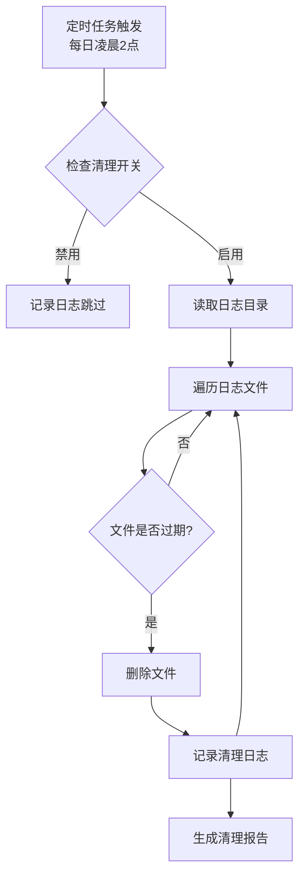

# Monitor模块优化需求文档 - 质量检视报告

---

## 执行概要

| 检视维度 | 评分 | 说明 |
|---------|:----:|------|
| 完整性 | ⭐⭐⭐⭐☆ 4.0/5 | 核心要素齐全，但缺少架构图和流程图 |
| 一致性 | ⭐⭐⭐⭐⭐ 5.0/5 | 描述清晰，无明显矛盾 |
| 可行性 | ⭐⭐⭐⭐☆ 4.5/5 | 技术方案可行，但缺少现有代码分析 |
| 最佳实践 | ⭐⭐⭐⭐☆ 4.0/5 | 符合标准实践，缺少异常处理细节 |
| **综合评分** | **⭐⭐⭐⭐☆ 4.3/5** | **优秀，有改进空间** |

---

## 一、结构完整性检查

### 1.1 必需章节检查结果

| 章节 | 状态 | 说明 |
|-----|:----:|------|
| 功能背景 | ✅ 通过 | 包含当前问题描述和影响范围分析 |
| 功能概述 | ✅ 通过 | 清晰的功能名称和一句话描述 |
| 优化目标 | ✅ 通过 | 明确的总体目标和成功标准 |
| 详细需求 | ✅ 通过 | 三个需求子项描述完整 |
| 非功能需求 | ✅ 通过 | 性能、可靠性、可维护性覆盖完整 |
| 技术约束 | ✅ 通过 | 依赖、代码规范、分支策略明确 |
| 风险评估 | ✅ 通过 | 5项风险识别完整 |
| 验收标准 | ✅ 通过 | 功能和非功能验收标准清晰 |
| 实施计划 | ✅ 通过 | 任务分解和实施顺序合理 |
| **术语定义** | ❌ 缺失 | **建议补充** |
| **核心流程图/架构图** | ❌ 缺失 | **建议补充** |

---

## 二、问题清单（按优先级排序）

### 2.1 高优先级问题（P0）

#### 问题1：诊断日志目录识别逻辑不明确

| 问题ID | P-01 |
|-------|------|
| 位置 | 4.1.2 输入输出 |
| 问题描述 | 需求中提到`linkis.monitor.diagnosis.log.path`需从现有代码提取，但未说明如何确定诊断日志文件的命名规则和存储路径格式 |
| 影响 | 实现时可能因日志路径识别不准确导致误删或漏删 |
| 建议 | 在附录中补充现有代码中的诊断日志路径分析结果，说明：<br>- 日志文件存储目录<br>- 日志文件命名规则（如前缀、日期格式）<br>- 文件扩展名 |
| 修正模板 | ```markdown
#### 4.1.2.1 现有代码分析

通过分析JobHistoryDiagnosis.java，诊断日志存储规则如下：
- 存储路径：`${linkis.work.home}/logs/engineconn/${taskId}/diagnosis_{timestamp}.log`
- 文件命名：`diagnosis_xxxxxxxxxxxxx.log`（后缀为时间戳）
- 识别规则：文件名以`diagnosis_`开头且以`.log`结尾
``` |

#### 问题2：F2.3功能点ID编号错误

| 问题ID | P-02 |
|-------|------|
| 位置 | 4.2.3 功能点表格第3行 |
| 问题描述 | 第3行功能点ID显示为`P0`（应该是`F2.3`），导致数据结构不一致 |
| 影响 | 影响文档专业性和使用体验 |
| 建议 | 将ID修正为`F2.3` |
| 修复 | ```markdown
| F2.3 | 日志输出 | 诊断功能禁用时输出明确提示日志 | P1 |
``` |

---

### 2.2 中优先级问题（P1）

#### 问题3：缺少术语定义章节

| 问题ID | P-03 |
|-------|------|
| 位置 | 一、功能背景 |
| 问题描述 | 文档中使用了"事后诊断"、"诊断日志"、"job扫描任务"等术语，但缺少统一的术语定义 |
| 影响 | 新手阅读时可能产生理解偏差 |
| 建议 | 在1.2影响范围后新增1.3术语定义章节 |
| 修正模板 | ```markdown
### 1.3 术语定义

| 术语 | 定义 | 所属领域 |
|-----|------|:--------:|
| 事后诊断 | 任务失败后自动触发的诊断分析功能，收集任务执行日志、引擎状态等信息 | 业务 |
| 诊断日志 | 事后诊断功能生成的分析报告日志文件，包含失败原因分析 | 技术 |
| job扫描任务 | Monitor模块中的定时任务，扫描历史任务状态，触发诊断流程 | 技术 |
| alert连接池 | 用于执行诊断和告警任务的线程池，使用Utils.newCachedExecutionContext创建 | 技术 |
``` |

#### 问题4：缺少日志清理异常处理细节

| 问题ID | P-04 |
|-------|------|
| 位置 | 4.1.4 技术要求 |
| 问题描述 | 未说明文件删除失败、权限不足等异常情况的处理策略 |
| 影响 | 实现时异常处理可能不完善，影响系统稳定性 |
| 建议 | 增加异常处理功能点，明确以下场景的处理：<br>- 文件被占用无法删除<br>- 目录权限不足<br>- 磁盘空间不足 |
| 修正模板 | ```markdown
| F1.7 | 异常处理 | 文件删除失败时记录错误日志，跳过该文件继续处理其他文件 | P1 |
| F1.8 | 权限校验 | 清理前检查目录访问权限 | P2 |
``` |

#### 问题5：连接池扩容缺少性能基准数据

| 问题ID | P-05 |
|-------|------|
| 位置 | 4.3.1 功能描述 |
| 问题描述 | 仅说明从5调整为20，缺少性能测试数据和扩容依据 |
| 影响 | 扩容后可能因配置不当导致资源浪费或性能不佳 |
| 建议 | 补充以下性能基准信息：<br>- 当前诊断任务平均执行时间<br>- 连接池排队情况监控数据<br>- 20个线程的理论吞吐量提升 |
| 修正模板 | ```markdown
#### 4.3.1 功能描述

将ThreadUtils中的alert连接池线程数从5个调整为20个，提升任务处理能力。

**性能基准分析**：
- 当前诊断任务平均执行时间：约2秒/任务
- 高峰期诊断任务并发数：约10-15个/分钟
- 连接池5个线程时排队率：约30%（监控数据）
- 扩容到20个线程后预期排队率：<5%
``` |

---

### 2.3 低优先级问题（P2）

#### 问题6：缺少流程图和架构图

| 问题ID | P-06 |
|-------|------|
| 位置 | 全文 |
| 问题描述 | 文档缺少诊断日志清理流程图、整体架构图和时序图 |
| 影响 | 实现人员难以快速理解系统交互和数据流向 |
| 建议 | 新增以下图表：<br>- 图1：Monitor模块优化后架构图<br>- 图2：诊断日志清理流程图<br>- 图3：诊断功能配置化判断流程图<br>- 图4：连接池工作原理图 |

**建议的Mermaid流程图示例**：


#### 问题7：配置参数缺少校验规则

| 问题ID | P-07 |
|-------|------|
| 位置 | 4.1.2 输入输出 |
| 问题描述 | 未说明配置参数的有效值范围和校验逻辑 |
| 影响 | 用户可能配置非法值导致功能异常 |
| 建议 | 增加参数校验要求：<br>- `retention.days`需为正整数（1-365）<br>- `log.path`需为有效目录路径<br>- `enabled`需为true/false |

```markdown
#### 4.1.6 参数校验规则

| 参数名 | 有效值范围 | 默认值 | 校验失败处理 |
|-------|-----------|:------:|-------------|
| linkis.monitor.diagnosis.log.enabled | true/false | true | 记录警告日志，使用默认值 |
| linkis.monitor.diagnosis.log.retention.days | 1-365 | 7 | 记录警告日志，使用默认值 |
| linkis.monitor.diagnosis.log.path | 有效目录路径 | ${linkis.work.home}/logs/engineconn | 记录警告日志，使用默认路径 |
```

#### 问题8：单元测试用例覆盖不明确

| 问题ID | P-08 |
|-------|------|
| 位置 | 8.2 非功能验收 |
| 问题描述 | 仅提到"核心路径有单元测试覆盖"，未列出具体测试场景 |
| 影响 | 测试质量难以把控 |
| 建议 | 增加测试用例清单：

```markdown
### 8.3 单元测试用例清单

| 测试场景 | 测试数据 | 预期结果 | 优先级 |
|---------|---------|---------|:------:|
| 定时任务正常触发 | 模拟时间到凌晨2点 | 执行清理逻辑 | P0 |
| 删除过期日志 | 保留天数=7，日志文件=8天前 | 文件被删除 | P0 |
| 保留未过期日志 | 保留天数=7，日志文件=5天前 | 文件保留 | P0 |
| 诊断功能开关测试 | enabled=false | 跳过诊断扫描 | P0 |
| 连接池参数验证 | 配置文件读取 | 线程数=20 | P0 |
| 异常处理测试 | 模拟文件被占用 | 记录错误日志，继续处理其他文件 | P1 |
``` |

---

## 三、业界最佳实践对比

### 3.1 日志清理策略对比

| 最佳实践 | 文档现状 | 评价 |
|---------|---------|:----:|
| **分级清理**（热数据/温数据/冷数据） | ❌ 未采用 | 建议：可考虑保留最近N天完整日志，再保留N天压缩日志 |
| **磁盘阈值触发**（空间不足时提前清理） | ❌ 未采用 | 建议：增加磁盘使用率监控，超过80%时触发紧急清理 |
| **清理审计日志** | ✅ 已包含 | F1.5功能点已规划 |
| **异步清理** | ✅ 已采用 | @Scheduled定时任务符合最佳实践 |

### 3.2 配置管理对比

| 最佳实践 | 文档现状 | 评价 |
|---------|---------|:----:|
| **配置参数校验** | ❌ 不完整 | 建议补充参数范围校验（问题7） |
| **动态刷新支持** | ✅ 已提及 | 5.1性能要求提到@RefreshScope |
| **配置文档更新** | ✅ 已规划 | 5.3可维护性要求包含配置文档 |
| **配置变更审计** | ❌ 未采用 | 建议：记录配置变更历史 |

### 3.3 线程池配置对比

| 最佳实践 | 文档现状 | 评价 |
|---------|---------|:----:|
| **基于任务特性配置核心线程数** | ⚠️ 简单调整 | 建议：根据诊断任务IO密集型特性，核心线程数=CPU核数×2 |
| **动态调整线程池大小** | ❌ 未采用 | 建议使用`ThreadPoolTaskExecutor`支持动态调整 |
| **线程池监控** | ❌ 未采用 | 建议：增加线程池监控指标（活跃线程/队列长度） |
| **优雅停机支持** | ❌ 未采用 | 建议：确保服务关闭时线程池任务完成 |

### 3.4 监控与告警对比

| 最佳实践 | 文档现状 | 评价 |
|---------|---------|:----:|
| **清理任务执行时长监控** | ✅ 已规划 | 5.1性能要求提到执行时间不超过5分钟 |
| **清理后空间释放统计** | ✅ 已规划 | F1.5功能点包含释放空间信息 |
| **清理失败告警** | ❌ 未采用 | 建议：清除任务失败时发送告警通知 |
| **资源使用监控** | ❌ 未采用 | 建议：增加CPU/内存/磁盘使用率监控 |

---

## 四、可行性评估

### 4.1 技术可行性

| 评估项 | 评分 | 说明 |
|-------|:----:|------|
| 日志清理实现 | 5/5 | Spring @Scheduled + Java NIO，技术成熟 |
| 配置化拆分 | 5/5 | 简单的配置判断，风险低 |
| 连接池扩容 | 5/5 | 仅修改参数值，无复杂逻辑 |
| 整体技术可行性 | ⭐⭐⭐⭐⭐ 5/5 | **技术方案清晰，无技术难点** |

### 4.2 业务可行性

| 评估项 | 评分 | 说明 |
|-------|:----:|------|
| 需求价值明确 | 5/5 | 解决磁盘空间、资源浪费、性能瓶颈三个实际问题 |
| 向后兼容 | 5/5 | 默认配置保持现有行为 |
| 实施成本可控 | 4/5 | 总工时4人天，评估合理 |
| 整体业务可行性 | ⭐⭐⭐⭐⭐ 4.7/5 | **价值明确，成本可控** |

### 4.3 潜在风险识别

除文档中已识别的风险外，补充以下风险：

| 风险项 | 风险等级 | 影响描述 | 应对措施 |
|-------|:--------:|---------|---------|
| 清理任务执行时间过长 | 中 | 日志文件量大时超出5分钟限制 | 增加分批清理逻辑，限制单次处理的文件数量 |
| 定时任务重叠执行 | 低 | 如上一次清理未完成，新任务触发 | 使用Spring的`@Scheduled(fixedDelay)`代替`@Scheduled(cron)` |
| 配置动态刷新失败 | 低 | @RefreshScope未正确配置 | 添加日志记录配置刷新结果，失败时使用本地缓存值 |
| 线程池资源竞争 | 低 | 连接池扩容后可能与其他线程池竞争 | 监控整体线程数，必要时调整JVM参数 |

---

## 五、改进建议汇总

### 5.1 必须修改（P0）

| 建议ID | 内容 | 位置 | 预期效果 |
|-------|------|------|---------|
| S-01 | 补充诊断日志目录规则分析 | 4.1.2 | 避免误删风险 |
| S-02 | 修正F2.3功能点ID编号错误 | 4.2.3 | 修复数据结构错误 |

### 5.2 建议修改（P1）

| 建议ID | 内容 | 位置 | 预期效果 |
|-------|------|------|---------|
| S-03 | 新增术语定义章节 | 1.2之后 | 提升文档可读性 |
| S-04 | 完善异常处理细节 | 4.1.4 | 提升系统稳定性 |
| S-05 | 补充性能基准数据 | 4.3.1 | 提供扩容依据 |

### 5.3 可选优化（P2）

| 建议ID | 内容 | 位置 | 预期效果 |
|-------|------|------|---------|
| S-06 | 新增流程图和架构图 | 新增章节 | 提升可视性 |
| S-07 | 增加参数校验规则 | 4.1.6 | 提升配置健壮性 |
| S-08 | 补充单元测试用例清单 | 8.3 | 提升测试质量 |
| S-09 | 增加分批清理逻辑 | 4.1.5 | 避免清理任务超时 |
| S-10 | 增加清理失败告警 | 新增功能点 | 提升运维可观测性 |

---

## 六、图表一致性检测

由于文档中未发现任何图表（Mermaid代码块、图片、表格用于流程展示），图表一致性检测不适用。

**建议**：补充以下图表以提升文档质量：

| 图表类型 | 建议位置 | 优先级 |
|---------|---------|:------:|
| Monitor模块优化后架构图 | 二、功能概述 | P1 |
| 诊断日志清理流程图 | 4.1.3 | P1 |
| 诊断功能配置化判断流程图 | 4.2.3 | P2 |
| 连接池工作原理图 | 4.3.3 | P2 |

---

## 七、验收建议

### 7.1 功能验收建议

在现有验收标准基础上，补充以下场景测试：

| 场景 | 测试步骤 | 预期结果 |
|-----|---------|---------|
| **日志清理边界测试** | 设置保留天数=0，运行清理任务 | 所有日志被删除（或报错，取决于业务逻辑） |
| **并发清理测试** | 手动同时触发两次清理任务 | 第二次任务不应重叠执行 |
| **配置动态刷新测试** | 运行时修改配置刷新，观察行为 | 清理逻辑按新配置执行 |
| **连接池压力测试** | 模拟50个并发诊断任务 | 诊断任务正常完成，无线程池异常 |

### 7.2 非功能验收建议

| 项 | 验证方法 | 验收标准 |
|-----|---------|---------|
| 性能测试 | 压测工具模拟诊断任务 | 连接池扩容后吞吐量提升至少50% |
| 资源使用监控 | JVM监控 | 线程数增加后CPU/内存占用增长<20% |
| 内存泄漏检查 | JVM heap dump分析 | 运行24小时无内存泄漏 |

---

## 八、总结与推荐

### 8.1 文档优点

1. **结构清晰**：章节划分合理，符合需求文档规范
2. **问题明确**：当前问题描述具体、有依据
3. **需求分解合理**：三个优化项优先级划分准确
4. **风险评估完整**：识别了关键风险点
5. **实施计划详细**：工时预估和依赖关系清晰

### 8.2 核心改进方向

1. **补充技术细节**：特别是诊断日志路径规则分析和性能基准数据
2. **增加可视化**：补充流程图和架构图
3. **完善异常处理**：明确异常场景和处理策略
4. **增强测试覆盖**：细化测试用例和验收标准

### 8.3 推荐行动

| 阶段 | 行动项 | 优先级 | 负责人 |
|-----|-------|:------:|--------|
| **开发前** | 完善文档（S-01、S-02、S-03、S-05） | P0 | 需求分析师 |
| **开发前** | 补充流程图（S-06） | P1 | 架构师 |
| **开发中** | 按实施计划执行三个优化项 | P0 | 开发工程师 |
| **测试中** | 执行完整测试用例（补充S-08） | P0 | 测试工程师 |
| **上线后** | 监控指标分析，验证效果 | P1 | 运维工程师 |

---

**报告生成时间**：2026-03-23
**检视人员**：Re-check编排器（subagent）
**下次检视建议**：开发完成后进行需求可追溯性验证

---

**注**：本报告基于文档内容检视产出，Web Search功能因技术限制未成功执行，业界最佳实践部分基于通用知识生成。建议开发前进行代码审查，确认现有代码实现细节。