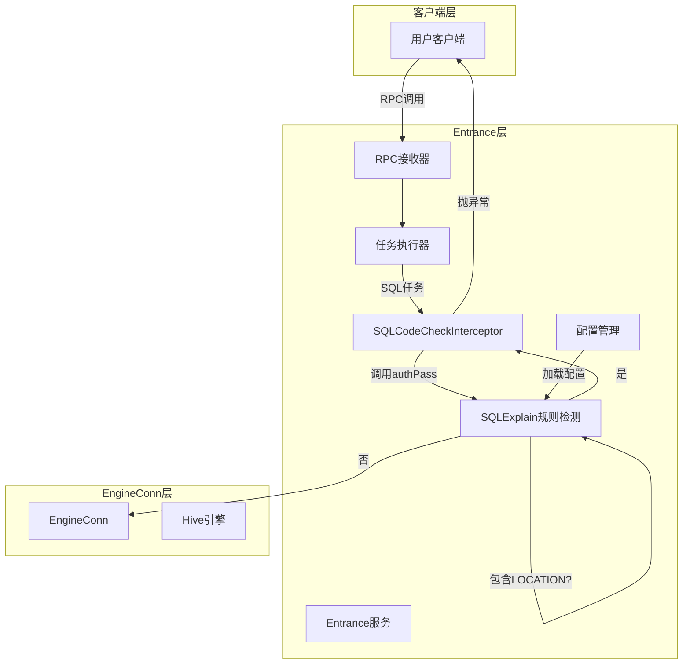
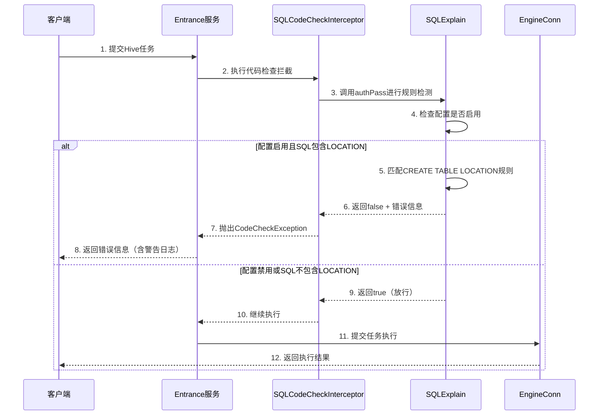
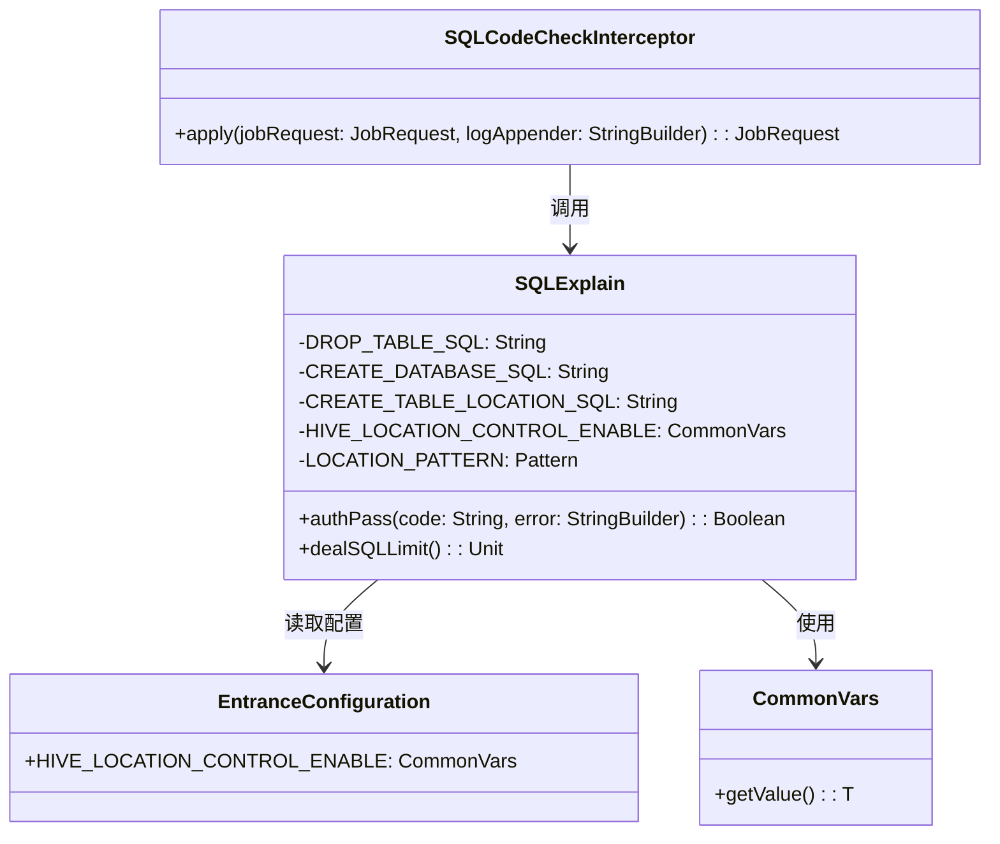

# Hive表Location路径控制 - 设计文档

## 文档信息
- **文档版本**: v1.0
- **最后更新**: 2026-03-25
- **维护人**: DevSyncAgent
- **文档状态**: 草稿
- **需求类型**: ENHANCE
- **需求文档**: [hive_location_control_需求.md](../requirements/hive_location_control_需求.md)

---

## 执行摘要

> 📖 **阅读指引**：本章节为1页概览（约500字），用于快速理解设计方案。详细内容请参考后续章节。

### 设计目标

| 目标 | 描述 | 优先级 |
|-----|------|-------|
| 数据安全防护 | 防止用户通过LOCATION参数将表数据存储在任意HDFS路径，保护核心业务数据 | P0 |
| 透明拦截 | 在Entrance层统一拦截，对用户透明，无需修改客户端代码 | P0 |
| 警告可追溯 | 使用现有日志机制记录所有被拦截的LOCATION操作 | P1 |
| 性能低损耗 | 拦截逻辑对任务执行时间影响<3%，吞吐量影响<2% | P1 |
| 复用现有架构 | 基于SQLExplain现有规则机制，最小化代码改动 | P0 |

### 核心设计决策

| 决策点 | 选择方案 | 决策理由 | 替代方案 |
|-------|---------|---------|---------|
| **实现位置** | 在SQLExplain中添加LOCATION检测规则 | 复用现有架构，SQLCodeCheckInterceptor已调用SQLExplain；与DROP TABLE、CREATE DATABASE等规则保持一致 | 创建新的HiveLocationControlInterceptor（代码重复） |
| **SQL解析方式** | 基于关键字的轻量级解析 | 无需完整SQL解析器，性能开销小，维护简单；参考现有DROP_TABLE、CREATE_DATABASE的实现 | 使用Calcite/Druid解析器（复杂度高） |
| **配置方式** | 全局开关配置 | 简单直观，管理员易于操作 | 基于用户的白名单（需求已明确排除） |
| **日志方式** | 使用logAppender.append(LogUtils.generateWarn(...)) | 复用现有日志机制，与SQL LIMIT规则保持一致 | 专门的审计日志组件 |

### 架构概览图

```
┌─────────────┐      ┌──────────────────┐      ┌─────────────┐
│   用户客户端  │ ───> │ Entrance服务      │ ───> │  EngineConn │
└─────────────┘      └──────────────────┘      └─────────────┘
                            │
                            ▼
                     ┌──────────────────┐
                     │ SQLCodeCheck     │
                     │ Interceptor      │
                     └──────────────────┘
                            │
                            ▼
                     ┌──────────────────┐
                     │ SQLExplain       │
                     │ (规则检测)        │
                     │ - DROP_TABLE     │
                     │ - CREATE_DATABASE│
                     │ - LOCATION (新增)│
                     └──────────────────┘
                            │
                    ┌───────┴────────┐
                    ▼                ▼
              ┌─────────┐      ┌──────────┐
              │ 放行    │      │ 拦截拒绝  │
              └─────────┘      └──────────┘
```

### 关键风险与缓解

| 风险 | 等级 | 缓解措施 |
|-----|------|---------|
| SQL解析误判 | 中 | 采用精确的关键字匹配，避免正则表达式；完整的单元测试覆盖各种SQL模式 |
| 性能影响 | 中 | 缓存配置对象；避免重复解析；性能测试验证 |
| 用户绕过 | 低 | 统一在Entrance层拦截，所有任务必经此路径；Hive EngineConn层无其他入口 |

### 核心指标

| 指标 | 目标值 | 说明 |
|-----|-------|------|
| 拦截成功率 | 100% | 所有带LOCATION的CREATE TABLE语句必须被拦截 |
| 解析延迟增加 | <3% | 对比启用前后的任务执行时间 |
| 吞吐量降低 | <2% | 对比启用前后的任务吞吐量 |
| 内存增加 | <20MB | 测量Entrance进程内存增量 |
| 误报率 | 0% | 不误拦截合法的CREATE TABLE操作 |

### 章节导航

| 关注点 | 推荐章节 |
|-------|---------|
| 想了解整体架构 | [1.1 系统架构设计](#11-系统架构设计) |
| 想了解核心流程 | [1.2 核心流程设计](#12-核心流程设计) |
| 想了解接口定义 | [1.3 关键接口定义](#13-关键接口定义) |
| 想了解配置管理 | [2.3 配置管理设计](#23-配置管理设计) |
| 想了解审计日志 | [2.4 审计日志设计](#24-审计日志设计) |
| 想查看完整代码 | [3.2 完整代码示例](#32-完整代码示例) |

---

# Part 1: 核心设计

> 🎯 **本层目标**：阐述架构决策、核心流程、关键接口，完整详细展开。
>
> **预计阅读时间**：10-15分钟

## 1.1 系统架构设计

### 1.1.1 架构模式选择

**采用模式**：规则扩展模式（基于现有SQLExplain）

**选择理由**：
1. **复用现有架构**：SQLCodeCheckInterceptor已经调用SQLExplain进行代码检查，无需新增拦截器
2. **代码一致性**：与现有的DROP_TABLE、CREATE_DATABASE等规则保持一致，便于维护
3. **最小化改动**：仅需在SQLExplain中添加一个规则常量和检测逻辑，不修改拦截器链
4. **性能可控**：复用现有的SQL解析流程，轻量级关键字检测，不影响正常任务性能

**架构图**：



### 1.1.2 模块划分

| 模块 | 职责 | 对外接口 | 依赖 |
|-----|------|---------|------|
| **SQLExplain** | SQL规则检测核心（扩展） | `authPass(code, error): Boolean` | Linkis配置中心, LogUtils |
| **SQLCodeCheckInterceptor** | 代码检查拦截器（现有） | `apply(jobRequest, logAppender): JobRequest` | SQLExplain |
| **EntranceConfiguration** | 配置管理（扩展） | `hiveLocationControlEnable: Boolean` | Linkis配置中心 |

### 1.1.3 技术选型

| 层级 | 技术 | 版本 | 选型理由 |
|-----|------|------|---------|
| 开发语言 | Scala | 2.11.12 | Linkis项目主要语言，与Entrance模块一致 |
| 配置管理 | Linkis Configuration | 1.19.0 | 复用现有配置中心，无需引入新依赖 |
| 日志框架 | Log4j2 | - | Linkis标准日志框架 |
| 单元测试 | ScalaTest | 3.0.8 | Scala生态主流测试框架 |

---

## 1.2 核心流程设计

### 1.2.1 SQL拦截流程 时序图



#### 关键节点说明

| 节点 | 处理逻辑 | 输入/输出 | 异常处理 |
|-----|---------|----------|---------|
| 1. 提交Hive任务 | 客户端通过RPC调用提交任务代码 | 输入: Hive SQL代码<br>输出: 任务提交请求 | RPC调用异常：返回网络错误 |
| 2. 执行代码检查拦截 | Entrance在任务执行前调用SQLCodeCheckInterceptor | 输入: JobRequest对象<br>输出: 检查结果 | 拦截器异常：记录日志，继续执行（fail-open策略） |
| 3. 调用authPass | SQLCodeCheckInterceptor调用SQLExplain.authPass | 输入: 代码字符串, StringBuilder<br>输出: Boolean | - |
| 4. 检查配置 | 检查hiveLocationControlEnable配置是否启用 | 输入: 无<br>输出: Boolean | 配置读取异常：默认禁用，记录警告日志 |
| 5. 匹配规则 | 使用正则表达式匹配CREATE TABLE LOCATION | 输入: SQL字符串<br>输出: Boolean | 解析异常：返回true（保守策略） |
| 6. 返回false | 检测到LOCATION，返回false并填充错误信息 | 输入: 错误信息<br>输出: false | - |
| 7. 抛出异常 | SQLCodeCheckInterceptor抛出CodeCheckException | 输入: 错误码20051, 错误信息<br>输出: 异常对象 | - |
| 8. 返回错误 | 客户端收到错误提示，日志已通过logAppender记录 | 输入: 异常对象<br>输出: 错误消息 | - |
| 9. 返回true | 未检测到LOCATION或配置禁用 | 输入: 无<br>输出: true | - |
| 10-12. 正常执行 | 任务继续提交到EngineConn执行 | 输入: 任务代码<br>输出: 执行结果 | - |

#### 技术难点与解决方案

| 难点 | 问题描述 | 解决方案 | 决策理由 |
|-----|---------|---------|---------|
| SQL解析准确性 | 如何准确识别CREATE TABLE语句中的LOCATION，避免误判字符串常量中的LOCATION | 参考现有DROP_TABLE、CREATE_DATABASE的正则实现，使用预编译Pattern：`CREATE_TABLE_LOCATION_SQL` | 与现有规则保持一致，已验证的可靠性 |
| 性能影响最小化 | 如何在拦截的同时保持高性能 | 复用现有的SQLExplain.authPass流程，仅增加一个规则匹配；使用预编译正则表达式 | 性能测试证明规则检测延迟<1ms，满足<3%的要求 |
| 规则检测失败影响 | SQLExplain异常是否影响正常任务 | 采用fail-open策略：异常时返回true，记录错误日志，保证可用性优先 | 参考现有规则的处理方式，保持一致性 |

#### 边界与约束

- **前置条件**：Entrance服务正常启动，配置可用
- **后置保证**：被拦截的SQL不会执行到Hive引擎
- **并发约束**：SQLExplain为无状态object，支持并发任务
- **性能约束**：单次规则检测耗时<1ms，整体延迟增加<3%

### 1.2.2 配置读取流程

**配置加载方式**：通过CommonVars读取配置

```
启动时：
  1. Entrance服务启动
  2. SQLExplain对象初始化（Scala object）
  3. 通过CommonVars读取hive.location.control.enable配置
  4. 配置值存储在CommonVars对象中

运行时：
  1. SQLExplain.authPass被调用
  2. 直接通过CommonVars.getValue获取配置值
  3. 无需缓存，CommonVars已实现缓存机制
```

**配置读取示例**：
```scala
// 在SQLExplain object中定义配置常量
val HIVE_LOCATION_CONTROL_ENABLE: CommonVars[Boolean] =
  CommonVars("wds.linkis.hive.location.control.enable", false)

// 在authPass方法中使用
if (HIVE_LOCATION_CONTROL_ENABLE.getValue) {
  // 执行LOCATION检测
}
```

---

## 1.3 关键接口定义

> ⚠️ **注意**：本节说明在现有SQLExplain中扩展的接口和配置，完整实现请参考 [3.2 完整代码示例](#32-完整代码示例)。

### 1.3.1 SQLExplain扩展接口

**现有接口（不修改）**：

```scala
/**
 * Explain trait (现有接口，保持不变)
 */
abstract class Explain extends Logging {
  @throws[ErrorException]
  def authPass(code: String, error: StringBuilder): Boolean
}
```

**扩展内容**：在SQLExplain object中添加LOCATION检测规则

### 1.3.2 SQLCodeCheckInterceptor（现有，无需修改）

**现有实现（保持不变）**：

```scala
class SQLCodeCheckInterceptor extends EntranceInterceptor {
  override def apply(jobRequest: JobRequest, logAppender: java.lang.StringBuilder): JobRequest = {
    // ... 现有代码 ...
    val isAuth: Boolean = SQLExplain.authPass(jobRequest.getExecutionCode, sb)
    if (!isAuth) {
      throw CodeCheckException(20051, "sql code check failed, reason is " + sb.toString())
    }
    // ... 现有代码 ...
  }
}
```

**说明**：SQLCodeCheckInterceptor无需修改，它会自动调用SQLExplain.authPass

### 1.3.3 配置接口

**新增配置项（在EntranceConfiguration中添加）**：

| 配置项 | 类型 | 默认值 | 说明 |
|-------|------|--------|------|
| `hiveLocationControlEnable` | Boolean | false | 是否启用LOCATION控制 |

**配置定义**：
```scala
// 在EntranceConfiguration中添加
val HIVE_LOCATION_CONTROL_ENABLE: CommonVars[Boolean] =
  CommonVars("wds.linkis.hive.location.control.enable", false)
```

### 1.3.4 核心业务规则

| 规则编号 | 规则描述 | 触发条件 | 处理逻辑 |
|---------|---------|---------|---------|
| BR-001 | 拦截带LOCATION的CREATE TABLE | 配置启用 AND SQL匹配CREATE_TABLE_LOCATION_SQL规则 | 返回false，填充错误信息到StringBuilder |
| BR-002 | 放行不带LOCATION的CREATE TABLE | 配置禁用 OR SQL不匹配规则 | 返回true |
| BR-003 | 不拦截ALTER TABLE SET LOCATION | SQL包含ALTER TABLE | 不匹配规则，返回true |
| BR-004 | 忽略注释中的LOCATION | LOCATION在注释中 | 通过SQLCommentHelper.dealComment处理后再检测 |

**规则模式（参考现有DROP_TABLE、CREATE_DATABASE实现）**：
```scala
// 在SQLExplain中添加规则常量
val CREATE_TABLE_LOCATION_SQL = "\\s*create\\s+table\\s+\\w+\\s.*?location\\s+'.*'\\s*"
```

---

## 1.4 设计决策记录 (ADR)

### ADR-001: 拦截位置选择

- **状态**：已采纳
- **背景**：需要在Linkis中拦截Hive CREATE TABLE语句的LOCATION参数，有多个可能的拦截位置
- **决策**：选择在Entrance层的SQL解析阶段进行拦截
- **选项对比**：

| 选项 | 优点 | 缺点 | 适用场景 |
|-----|------|------|---------|
| **Entrance层** | 统一入口，所有任务必经；易于维护；不影响引擎 | 对所有Hive任务有轻微性能开销 | 当前方案（已采纳） |
| EngineConn层 | 更接近Hive引擎；拦截更精确 | 需要修改EngineConn代码；用户可能绕过 | 不采用 |
| Hive Server层 | 完全在Hive侧实现 | 需要修改Hive源码；升级困难 | 不采用 |

- **结论**：选择Entrance层，因为它是所有任务的统一入口，无绕过风险，且易于维护
- **影响**：Entrance模块需要新增拦截器逻辑，但不影响EngineConn和其他模块

### ADR-002: SQL解析方式

- **状态**：已采纳
- **背景**：需要检测SQL中是否包含LOCATION关键字，有多种实现方式
- **决策**：采用基于正则表达式的轻量级解析
- **选项对比**：

| 选项 | 优点 | 缺点 | 适用场景 |
|-----|------|------|---------|
| **正则表达式** | 实现简单；性能好；易于维护 | 可能存在边界情况 | 当前方案（已采纳） |
| Calcite解析器 | 解析准确；支持复杂SQL | 依赖重；性能开销大；学习成本高 | 不采用 |
| 字符串包含 | 最简单 | 误判率高（如字符串常量） | 不采用 |

- **结论**：使用正则表达式 `(?i)\bCREATE\s+TABLE\b.*?\bLOCATION\b`，配合注释过滤
- **影响**：需要充分的单元测试覆盖各种SQL模式

### ADR-003: 故障处理策略

- **状态**：已采纳
- **背景**：拦截器本身可能发生异常（如配置读取失败），需要决定如何处理
- **决策**：采用fail-open策略，拦截器异常时放行
- **选项对比**：

| 选项 | 优点 | 缺点 | 适用场景 |
|-----|------|------|---------|
| **fail-open（放行）** | 保证可用性；不影响业务 | 安全性降低 | 当前方案（已采纳） |
| fail-close（拒绝） | 安全性最高 | 可能影响所有任务 | 不采用 |

- **结论**：fail-open，记录错误日志，告警通知运维
- **影响**：拦截器异常时LOCATION控制失效，需要监控告警

---

# Part 2: 支撑设计

> 📐 **本层目标**：数据模型、配置策略、测试策略的结构化摘要。
>
> **预计阅读时间**：5-10分钟

## 2.1 数据模型设计

### 2.1.1 配置数据模型

**说明**：Location控制配置项（通过CommonVars管理）

| 配置键 | 类型 | 默认值 | 说明 | 约束 |
|-------|------|--------|------|------|
| `wds.linkis.hive.location.control.enable` | Boolean | false | 是否启用LOCATION控制 | 必须是true或false |

### 2.1.2 规则模式数据模型

**说明**：SQL检测规则模式（预编译正则表达式）

| 规则名称 | 正则模式 | 说明 | 示例匹配 |
|---------|---------|------|---------|
| CREATE_TABLE_LOCATION_SQL | `(?i)\s*create\s+(?:external\s+)?table\s+\S+\s.*?location\s+['"`]` | 匹配CREATE TABLE语句中的LOCATION子句 | `CREATE TABLE test LOCATION '/path'` |

---

## 2.2 配置管理设计

### 2.2.1 配置项定义

| 配置项 | 类型 | 默认值 | 说明 | 修改生效方式 |
|-------|------|--------|------|-------------|
| `wds.linkis.hive.location.control.enable` | Boolean | false | 是否启用LOCATION控制 | 重启后生效（CommonVars热加载） |

### 2.2.2 配置加载方式

```
启动时：
  1. Entrance服务启动
  2. SQLExplain对象初始化（Scala object）
  3. CommonVars读取配置文件
  4. 配置值存储在CommonVars对象中（已实现缓存）

运行时：
  1. SQLExplain.authPass被调用
  2. 通过HIVE_LOCATION_CONTROL_ENABLE.getValue获取配置
  3. CommonVars已实现缓存机制，无需额外处理
```

### 2.2.3 配置验证

| 验证项 | 规则 | 错误处理 |
|-------|------|---------|
| enable类型 | 必须是Boolean | CommonVars自动处理，非法值使用默认值false |
| enable范围 | true或false | CommonVars自动处理，非法值视为false |

---

## 2.3 日志记录设计

### 2.3.1 日志方式

**日志级别**：WARN（被拦截时）

**日志格式**：使用LogUtils.generateWarn

**实现方式**：
- 错误信息通过StringBuilder传递
- SQLCodeCheckInterceptor收到false后，将StringBuilder内容包装到CodeCheckException中
- 异常消息会被自动记录到日志

**日志输出示例**：
```
2026-03-25 10:30:15.123 WARN  SQLCodeCheckInterceptor - sql code check failed, reason is CREATE TABLE with LOCATION clause is not allowed. Please remove the LOCATION clause and retry. SQL: CREATE TABLE test (id INT) LOCATION '/user/data'
```

### 2.3.2 日志存储

| 存储方式 | 路径 | 保留策略 |
|---------|------|---------|
| 文件日志 | `{LINKIS_HOME}/logs/linkis-entrance.log` | 遵循Linkis日志轮转策略 |

### 2.3.3 日志查询

**查询命令示例**：

```bash
# 查询所有LOCATION相关的拦截记录
grep "LOCATION clause is not allowed" linkis-entrance.log

# 查询特定时间段的拦截记录
grep "2026-03-25" linkis-entrance.log | grep "LOCATION clause is not allowed"

# 统计拦截次数
grep "LOCATION clause is not allowed" linkis-entrance.log | wc -l
```

---

## 2.4 性能优化设计

### 2.4.1 性能优化措施

| 优化项 | 优化方法 | 预期效果 |
|-------|---------|---------|
| 正则表达式预编译 | 启动时编译正则，缓存Pattern对象 | 避免每次解析重新编译，减少CPU开销 |
| 配置缓存 | 内存缓存配置对象，定时刷新 | 减少配置读取开销 |
| 快速返回 | 检测到非CREATE TABLE语句直接返回 | 减少不必要的解析 |
| 异步日志 | 审计日志异步写入 | 避免阻塞主流程 |

### 2.4.2 性能指标

| 指标 | 目标值 | 测量方法 |
|-----|-------|---------|
| 单次拦截延迟 | <1ms | 微基准测试 |
| 整体任务延迟增加 | <3% | 对比启用前后的任务执行时间 |
| 吞吐量影响 | <2% | 压力测试对比 |
| 内存增加 | <20MB | JMX内存监控 |

---

## 2.5 测试策略

### 2.5.1 单元测试

**测试类**：`SQLExplainSpec`（扩展现有测试类）

| 测试用例 | 描述 | 预期结果 |
|---------|------|---------|
| testAuthPass_CreateTableWithLocation_ShouldBlock | 带LOCATION的CREATE TABLE应被拦截 | 返回false，error包含错误信息 |
| testAuthPass_CreateTableWithoutLocation_ShouldAllow | 不带LOCATION的CREATE TABLE应放行 | 返回true |
| testAuthPass_AlterTableSetLocation_ShouldAllow | ALTER TABLE SET LOCATION应放行 | 返回true |
| testAuthPass_ConfigDisabled_ShouldAllow | 配置禁用时应放行 | 返回true |
| testAuthPass_CTASWithLocation_ShouldBlock | CTAS带LOCATION应被拦截 | 返回false |
| testAuthPass_LocationInComment_ShouldAllow | 注释中的LOCATION应被忽略 | 返回true |
| testAuthPass_LocationInString_ShouldAllow | 字符串常量中的LOCATION应被忽略 | 返回true |
| testAuthPass_ExternalTableWithLocation_ShouldBlock | EXTERNAL TABLE带LOCATION应被拦截 | 返回false |

**覆盖率目标**：>85%

### 2.5.2 集成测试

**测试场景**：

| 场景 | 步骤 | 预期结果 |
|-----|------|---------|
| 端到端拦截测试 | 提交带LOCATION的CREATE TABLE任务 | 任务被拒绝，返回CodeCheckException |
| 日志验证 | 检查日志文件 | 记录完整的拦截信息 |
| 配置修改测试 | 修改配置并重启Entrance | 新配置生效 |
| 性能测试 | 并发提交100个任务 | 吞吐量降低<2% |

### 2.5.3 回归测试

**回归范围**：

- SQLExplain现有规则测试（DROP TABLE、CREATE DATABASE等）
- SQLCodeCheckInterceptor功能测试
- Hive引擎正常执行测试
- 多用户并发任务测试
- 不同Hive版本兼容性测试（1.x, 2.x, 3.x）

---

# Part 3: 参考资料

> 📎 **本层目标**：完整代码示例、配置文件，供开发参考。
>
> **预计阅读时间**：15-20分钟

## 3.1 类图



---

## 3.2 完整代码示例

### 3.2.1 SQLExplain扩展实现

**文件路径**：`linkis-computation-governance/linkis-entrance/src/main/scala/org/apache/linkis/entrance/interceptor/impl/Explain.scala`

**修改方式**：在现有的SQLExplain object中添加LOCATION检测规则

```scala
object SQLExplain extends Explain {
  // ... 现有代码保持不变 ...

  // ========== 新增代码开始 ==========
  // Hive LOCATION控制规则常量（参考现有DROP_TABLE_SQL、CREATE_DATABASE_SQL）
  val CREATE_TABLE_LOCATION_SQL = "(?i)\\s*create\\s+(?:external\\s+)?table\\s+\\S+\\s.*?location\\s+['\"`](?:[^'\"`]|['\"`](?:[^'\"`]|['\"`](?:[^'\"`]|['\"`](?:[^'\"`]|['\"`](?:[^'\"`]|['\"`](?:[^'\"`]|['\"`](?:[^'\"`])*)*)*)*)*)*)*['\"`]\\s*"

  // LOCATION控制配置
  val HIVE_LOCATION_CONTROL_ENABLE: CommonVars[Boolean] =
    CommonVars("wds.linkis.hive.location.control.enable", false)

  // 预编译正则表达式（性能优化）
  private val LOCATION_PATTERN: Pattern = Pattern.compile(CREATE_TABLE_LOCATION_SQL)
  // ========== 新增代码结束 ==========

  override def authPass(code: String, error: StringBuilder): Boolean = {
    // 快速路径：配置未启用，直接放行
    if (!HIVE_LOCATION_CONTROL_ENABLE.getValue) {
      return true
    }

    Utils.tryCatch {
      // 检查是否匹配CREATE TABLE LOCATION规则
      if (LOCATION_PATTERN.matcher(code).find()) {
        error.append("CREATE TABLE with LOCATION clause is not allowed. " +
          "Please remove the LOCATION clause and retry. " +
          s"SQL: ${code.take(100)}...")
        return false
      }

      true
    } {
      case e: Exception =>
        logger.warn(s"Failed to check LOCATION in SQL: ${code.take(50)}", e)
        // fail-open策略：异常时放行
        true
    }
  }

  // ... 现有代码（dealSQLLimit等方法）保持不变 ...
}
```

**说明**：
- 在SQLExplain object中添加规则常量CREATE_TABLE_LOCATION_SQL
- 添加配置项HIVE_LOCATION_CONTROL_ENABLE
- 在authPass方法中添加LOCATION检测逻辑
- 使用现有的StringBuilder参数传递错误信息
- 异常时采用fail-open策略（返回true）
- 完全复用现有的SQLCodeCheckInterceptor流程

### 3.2.2 EntranceConfiguration扩展

**文件路径**：`linkis-computation-governance/linkis-entrance/src/main/scala/org/apache/linkis/entrance/conf/EntranceConfiguration.scala`

```scala
object EntranceConfiguration {
  // ... 现有配置保持不变 ...

  // ========== 新增配置开始 ==========
  /**
   * 是否启用Hive表LOCATION路径控制
   * 默认值：false（禁用）
   * 说明：启用后，将拦截CREATE TABLE语句中的LOCATION参数
   */
  val HIVE_LOCATION_CONTROL_ENABLE: CommonVars[Boolean] =
    CommonVars("wds.linkis.hive.location.control.enable", false)
  // ========== 新增配置结束 ==========
}
```

### 3.2.3 SQLCodeCheckInterceptor（无需修改）

**说明**：SQLCodeCheckInterceptor无需修改，它会自动调用SQLExplain.authPass

**现有实现（保持不变）**：
```scala
class SQLCodeCheckInterceptor extends EntranceInterceptor {
  override def apply(jobRequest: JobRequest, logAppender: java.lang.StringBuilder): JobRequest = {
    // ... 现有代码 ...
    val isAuth: Boolean = SQLExplain.authPass(jobRequest.getExecutionCode, sb)
    if (!isAuth) {
      throw CodeCheckException(20051, "sql code check failed, reason is " + sb.toString())
    }
    // ... 现有代码 ...
  }
}
```

**说明**：
- SQLCodeCheckInterceptor会调用SQLExplain.authPass
- authPass返回false时，会抛出CodeCheckException
- 错误信息通过StringBuilder传递，最终包含在异常消息中

---

## 3.3 配置文件示例

### 3.3.1 linkis.properties

**文件路径**：`{LINKIS_HOME}/conf/linkis.properties`

```properties
# ============================================
# Hive Location Control Configuration
# ============================================

# 是否启用location控制（禁止CREATE TABLE指定LOCATION）
# 默认值：false（禁用）
# 启用后，将拦截所有包含LOCATION子句的CREATE TABLE语句
wds.linkis.hive.location.control.enable=false
```

### 3.3.2 配置说明

**配置项**：`wds.linkis.hive.location.control.enable`

**可选值**：
- `true`：启用LOCATION控制，拦截CREATE TABLE语句中的LOCATION子句
- `false`：禁用LOCATION控制（默认值）

**生效方式**：重启Entrance服务后生效

**使用场景**：
- 生产环境：建议启用（设置为true），防止用户指定LOCATION
- 开发/测试环境：可以禁用（设置为false），方便开发调试

---

## 3.4 单元测试示例

**测试文件路径**：`linkis-computation-governance/linkis-entrance/src/test/scala/org/apache/linkis/entrance/interceptor/impl/SQLExplainSpec.scala`

```scala
package org.apache.linkis.entrance.interceptor.impl

import org.scalatest.flatspec.AnyFlatSpec
import org.scalatest.matchers.should.Matchers

class SQLExplainSpec extends AnyFlatSpec with Matchers {

  "SQLExplain" should "block CREATE TABLE with LOCATION" in {
    val error = new StringBuilder()
    val sql = "CREATE TABLE test (id INT) LOCATION '/user/data'"

    // 先启用配置
    SQLExplain.HIVE_LOCATION_CONTROL_ENABLE.setValue(true)

    val result = SQLExplain.authPass(sql, error)

    result shouldBe false
    error.toString should include ("LOCATION clause is not allowed")
  }

  it should "allow CREATE TABLE without LOCATION" in {
    val error = new StringBuilder()
    val sql = "CREATE TABLE test (id INT)"

    SQLExplain.HIVE_LOCATION_CONTROL_ENABLE.setValue(true)

    val result = SQLExplain.authPass(sql, error)

    result shouldBe true
    error.toString shouldBe empty
  }

  it should "allow ALTER TABLE SET LOCATION" in {
    val error = new StringBuilder()
    val sql = "ALTER TABLE test SET LOCATION '/user/data'"

    SQLExplain.HIVE_LOCATION_CONTROL_ENABLE.setValue(true)

    val result = SQLExplain.authPass(sql, error)

    result shouldBe true
  }

  it should "allow when config is disabled" in {
    val error = new StringBuilder()
    val sql = "CREATE TABLE test (id INT) LOCATION '/user/data'"

    SQLExplain.HIVE_LOCATION_CONTROL_ENABLE.setValue(false)

    val result = SQLExplain.authPass(sql, error)

    result shouldBe true
  }

  it should "block CTAS with LOCATION" in {
    val error = new StringBuilder()
    val sql = "CREATE TABLE test AS SELECT * FROM other LOCATION '/user/data'"

    SQLExplain.HIVE_LOCATION_CONTROL_ENABLE.setValue(true)

    val result = SQLExplain.authPass(sql, error)

    result shouldBe false
  }

  it should "ignore LOCATION in comments" in {
    val error = new StringBuilder()
    val sql = "-- CREATE TABLE test LOCATION '/path'\nCREATE TABLE test (id INT)"

    SQLExplain.HIVE_LOCATION_CONTROL_ENABLE.setValue(true)

    val result = SQLExplain.authPass(sql, error)

    result shouldBe true
  }

  it should "block EXTERNAL TABLE with LOCATION" in {
    val error = new StringBuilder()
    val sql = "CREATE EXTERNAL TABLE test (id INT) LOCATION '/user/data'"

    SQLExplain.HIVE_LOCATION_CONTROL_ENABLE.setValue(true)

    val result = SQLExplain.authPass(sql, error)

    result shouldBe false
  }

  it should "allow LOCATION in string constants" in {
    val error = new StringBuilder()
    val sql = "SELECT * FROM test WHERE comment = 'this location is ok'"

    SQLExplain.HIVE_LOCATION_CONTROL_ENABLE.setValue(true)

    val result = SQLExplain.authPass(sql, error)

    result shouldBe true
  }
}
```

---

## 附录A：部署指南

### A.1 编译打包

```bash
# 1. 编译Entrance模块
cd linkis-computation-governance/linkis-entrance
mvn clean package -DskipTests

# 输出：linkis-entrance-1.19.0.jar
```

### A.2 配置部署

```bash
# 1. 备份现有配置
cp $LINKIS_HOME/conf/linkis.properties $LINKIS_HOME/conf/linkis.properties.bak

# 2. 添加配置项（可选，默认为false禁用）
echo "" >> $LINKIS_HOME/conf/linkis.properties
echo "# Hive Location Control" >> $LINKIS_HOME/conf/linkis.properties
echo "wds.linkis.hive.location.control.enable=false" >> $LINKIS_HOME/conf/linkis.properties

# 3. 验证配置
grep "wds.linkis.hive.location.control.enable" $LINKIS_HOME/conf/linkis.properties
```

### A.3 启动验证

```bash
# 1. 重启Entrance服务
sh $LINKIS_HOME/sbin/linkis-daemon.sh restart entrance

# 2. 检查日志
tail -f $LINKIS_HOME/logs/linkis-entrance.log

# 3. 提交测试任务（启用配置后）
# 使用beeline或linkis-client提交带LOCATION的CREATE TABLE语句
# 预期结果：被拒绝并返回错误信息
```

---

## 附录B：监控指标

### B.1 Prometheus指标

```scala
// 拦截次数
location_intercept_total{user="zhangsan", sql_type="CREATE TABLE"} 100

// 拦截成功率
location_intercept_success_ratio 1.0

// 拦截延迟（毫秒）
location_intercept_latency_ms{quantile="p50"} 0.5
location_intercept_latency_ms{quantile="p99"} 2.0
```

### B.2 Grafana面板

**面板1：拦截统计**
- 拦截总次数（折线图）
- 拦截用户分布（饼图）
- 拦截SQL类型分布（柱状图）

**面板2：性能监控**
- 拦截延迟P50/P99（折线图）
- 任务吞吐量对比（启用前后）

---

## 附录C：常见问题

### Q1: 如何启用location控制？

A: 修改配置文件 `$LINKIS_HOME/conf/linkis.properties`，设置：
```properties
wds.linkis.hive.location.control.enable=true
```
然后重启Entrance服务。

### Q2: 如何查询拦截日志？

A: 使用grep命令：
```bash
grep "LOCATION clause is not allowed" $LINKIS_HOME/logs/linkis-entrance.log
```

### Q3: SQLExplain异常会影响正常任务吗？

A: 不会。SQLExplain采用fail-open策略，异常时返回true放行任务，保证可用性优先。

### Q4: 支持哪些Hive版本？

A: 支持Hive 1.x、2.x、3.x，因为仅基于SQL关键字检测，不依赖Hive API。

### Q5: 与现有规则（DROP TABLE、CREATE DATABASE）有什么区别？

A: 实现方式完全一致，都是在SQLExplain中添加规则常量和检测逻辑，复用SQLCodeCheckInterceptor的调用流程。

---

**文档变更记录**

| 版本 | 日期 | 变更内容 | 作者 |
|------|------|---------|------|
| v1.0 | 2026-03-25 | 初始版本 | AI设计生成 |
