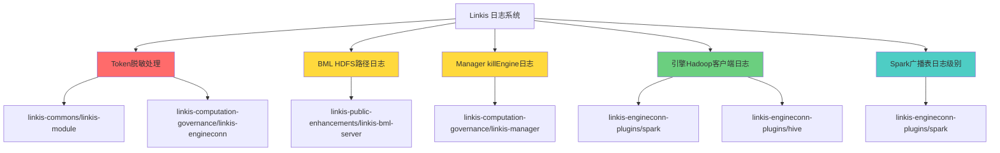

# Linkis 日志优化设计文档

## 一、设计概述

### 1.1 设计目标
本设计旨在解决Linkis系统在日志记录方面的安全隐患和可追溯性问题，通过5个独立的优化点，实现：
1. **安全性提升**: 对Token等敏感信息进行脱敏处理
2. **可追溯性增强**: 完善关键业务操作的日志记录
3. **日志质量优化**: 调整不合理的日志级别

### 1.2 设计原则
- **最小化影响**: 仅修改日志输出，不改变业务逻辑
- **精确控制**: 手动修改日志语句，避免全局拦截导致的误脱敏
- **渐进式实施**: 按优先级从低风险到高风险逐步实施

### 1.3 优化范围总览

| 优化点 | 模块 | 优先级 | 复杂度 | 状态 |
|:------|:-----|:------:|:------:|:----:|
| Token脱敏处理 | linkis-module, linkis-engineconn | P0 | 高 | 待实施 |
| BML HDFS路径日志 | linkis-bml-server | P1 | 中 | 待实施 |
| Linkis Manager killEngine日志 | linkis-manager | P1 | 低 | 待实施 |
| 引擎Hadoop客户端日志 | Spark/Hive引擎插件 | P1 | 中 | 已实施 |
| Spark广播表日志级别 | Spark引擎插件 | P2 | 低 | 已实施 |

---

## 二、整体架构设计

### 2.1 架构概览

```
┌─────────────────────────────────────────────────────────────────────┐
│                        Linkis 日志系统架构                           │
├─────────────────────────────────────────────────────────────────────┤
│                                                                     │
│  ┌──────────────┐  ┌──────────────┐  ┌──────────────┐              │
│  │   服务层     │  │   计算层     │  │   资源层     │              │
│  │              │  │              │  │              │              │
│  │ ┌─────────┐  │  │ ┌─────────┐  │  │ ┌─────────┐  │              │
│  │ │  BML    │  │  │ │ Spark   │  │  │ │  HDFS   │  │              │
│  │ │ Service │  │  │ │ Engine  │  │  │ │ Client  │  │              │
│  │ └────┬────┘  │  │ └────┬────┘  │  │ └────┬────┘  │              │
│  │      │       │  │      │       │  │      │       │              │
│  │ ┌────┴────┐  │  │ ┌────┴────┐  │  │ ┌────┴────┐  │              │
│  │ │ Manager │  │  │ │  Hive   │  │  │ │ Kerb.   │  │              │
│  │ │ Service │  │  │ │ Engine  │  │  │ │ Auth    │  │              │
│  │ └─────────┘  │  │ └─────────┘  │  │ └─────────┘  │              │
│  └──────┬───────┘  └──────┬───────┘  └──────┬───────┘              │
│         │                 │                 │                       │
│         └─────────────────┼─────────────────┘                       │
│                           │                                         │
│                  ┌────────▼────────┐                               │
│                  │  日志脱敏层      │                               │
│                  │  (Token masking) │                               │
│                  └────────┬────────┘                               │
│                           │                                         │
│                  ┌────────▼────────┐                               │
│                  │  日志输出层      │                               │
│                  │  (log4j2/slf4j) │                               │
│                  └────────┬────────┘                               │
│                           │                                         │
│                  ┌────────▼────────┐                               │
│                  │  日志存储层      │                               │
│                  │  (文件/ES)      │                               │
│                  └─────────────────┘                               │
│                                                                     │
└─────────────────────────────────────────────────────────────────────┘
```

### 2.2 模块依赖关系



### 2.3 日志流向

```
应用代码
    │
    ├─> Token日志 ──> 脱敏处理 ──> 日志输出
    │
    ├─> BML操作日志 ──> 路径拼接 ──> 日志输出
    │
    ├─> killEngine日志 ──> 信息组装 ──> 日志输出
    │
    ├─> Hadoop操作日志 ──> 业务记录 ──> 日志输出
    │
    └─> Spark日志 ──> log4j2过滤 ──> 日志输出
```

---

## 三、详细设计

### 3.1 优化点1: Token脱敏处理

#### 3.1.1 设计说明

**核心思想**: 仅对日志中打印的Token进行脱敏，不修改Token的业务逻辑。

**不涉及的内容**:
- 服务间Token调用
- Token验证逻辑
- Token存储机制
- Token传递机制

#### 3.1.2 脱敏算法

```scala
/**
 * Token脱敏工具方法
 *
 * 脱敏规则:
 * - 长度 ≤ 6: 前{长度-3}位 + ***
 * - 长度 > 6: 前3位 + *** + 后3位
 */
object TokenMasker {

  def maskToken(token: String): String = {
    if (token == null || token.isEmpty) return "***"

    if (token.length <= 6) {
      val prefixLength = token.length - 3
      if (prefixLength > 0) {
        token.substring(0, prefixLength) + "***"
      } else {
        "***"
      }
    } else {
      token.substring(0, 3) + "***" + token.substring(token.length - 3)
    }
  }
}
```

**示例**:
| 原始Token | 脱敏结果 | 长度 |
|----------|---------|:----:|
| `abc123` | `abc***` | 6 |
| `ab` | `***` | 2 |
| `abc123def456` | `abc***456` | 12 |
| `VERY_LONG_TOKEN_HERE` | `VER***ERE` | 19 |

#### 3.1.3 涉及代码位置

**需要搜索的关键词**:
- `logger.info.*token`
- `logger.debug.*token`
- `logger.warn.*token`
- `logger.error.*token`
- `log.info.*Token`
- `log.info.*TokenId`

**涉及模块**:
```
linkis-commons/linkis-common/
linkis-commons/linkis-module/
linkis-computation-governance/linkis-engineconn/
linkis-computation-governance/linkis-entrance/
linkis-spring-cloud-services/linkis-service-gateway/
```

#### 3.1.4 代码修改示例

**修改前**:
```scala
logger.info(s"Received user token: ${userToken}")
logger.debug(s"EngineConnToken created: ${engineConnToken.getTokenId}")
```

**修改后**:
```scala
logger.info(s"Received user token: ${TokenMasker.maskToken(userToken)}")
logger.debug(s"EngineConnToken created: ${TokenMasker.maskToken(engineConnToken.getTokenId)}")
```

#### 3.1.5 排查策略

1. **第一阶段**: 搜索所有包含"token"(忽略大小写)的logger语句
2. **第二阶段**: 人工review每个匹配项，确认是否需要脱敏
3. **第三阶段**: 逐处修改并记录修改位置
4. **第四阶段**: 单元测试验证脱敏效果

---

### 3.2 优化点2: BML HDFS路径日志

#### 3.2.1 设计说明

在BML资源管理服务的关键操作节点记录HDFS路径信息，便于资源位置追踪。

#### 3.2.2 日志记录位置

| 操作 | 类 | 方法 | 日志时机 |
|-----|:---|:-----|:--------|
| 资源上传 | BmlService | upload | 文件写入HDFS后 |
| 资源下载 | BmlService | download | 获取HDFS路径后 |
| 版本更新 | BmlService | updateVersion | 新版本文件写入后 |
| 删除全部记录 | BmlService | deleteAll | 删除操作前 |

#### 3.2.3 日志格式设计

```java
// 格式模板
private static final String BML_HDFS_LOG_FORMAT =
    "BML resource operation - type: %s, resourceId: %s, version: %s, hdfsPath: %s, user: %s";

// 使用示例
logger.info(String.format(BML_HDFS_LOG_FORMAT,
    "upload",
    resourceId.toString(),
    version,
    hdfsPath.toString(),
    user))
```

#### 3.2.4 日志示例

```
INFO  [BmlService] BML resource operation - type: upload, resourceId: 10001, version: v001, hdfsPath: hdfs://linkis/bml/resource/10001/v001, user: admin
INFO  [BmlService] BML resource operation - type: download, resourceId: 10001, version: v001, hdfsPath: hdfs://linkis/bml/resource/10001/v001, user: admin
INFO  [BmlService] BML resource operation - type: update, resourceId: 10001, version: v002, hdfsPath: hdfs://linkis/bml/resource/10001/v002, user: admin
INFO  [BmlService] BML resource operation - type: delete, resourceId: 10001, version: *, hdfsPath: hdfs://linkis/bml/resource/10001, user: admin
```

#### 3.2.5 涉及代码位置

```
linkis-public-enhancements/linkis-bml-server/
└── src/main/java/
    └── org/apache/linkis/bml/
        └── service/
            └── impl/
                └── BmlServiceImpl.java
```

---

### 3.3 优化点3: Linkis Manager killEngine日志

#### 3.3.1 设计说明

在LinkisManagerAMService的killEngine方法中增加关键信息日志。

#### 3.3.2 日志增强内容

**记录信息**:
- 引擎类型 (engineType)
- 用户名 (user)
- 引擎实例 (engineInstance)

**不记录信息**（敏感信息）:
- engineConnExecId
- ticketId
- 完整的engineInstance对象（toString可能包含敏感信息）

#### 3.3.3 代码修改位置

```
linkis-computation-governance/linkis-manager/
└── src/main/java/
    └── org/apache/linkis/manager/
        └── am/
            └── service/
                └── DefaultEngineAskEngineService.java
```

#### 3.3.4 日志格式

```java
logger.info("Kill engine - engineType: {}, user: {}, engineInstance: {}",
    engineType,
    user,
    engineInstance.getInstance())
```

#### 3.3.5 日志示例

```
INFO [LinkisManagerAMService] Kill engine - engineType: spark, user: admin, engineInstance: EngineConnInstance(application_1234567890_0001)
INFO [LinkisManagerAMService] Kill engine - engineType: hive, user: user1, engineInstance: EngineConnInstance(container_e12_1234567890_0001_01_000001)
```

---

### 3.4 优化点4: 引擎Hadoop客户端操作日志

#### 3.4.1 设计说明

在Spark和Hive引擎插件中，对Hadoop客户端操作（HDFS文件操作、Kerberos认证）增加业务日志记录。

> **重要**: 仅配置 `org.apache.hadoop` 日志级别是不够的，需要在代码层面主动添加业务日志。

#### 3.4.2 已实施内容

##### 3.4.2.1 Hive引擎 - Kerberos认证日志

**代码位置**: `linkis-engineconn-plugins/hive/src/main/scala/org/apache/linkis/engineplugin/hive/creation/HiveEngineConnFactory.scala`

**修改内容**:

```scala
// 第108-111行（并发会话）
logger.info(
  s"Hive engine authentication - user: ${user}, authType: ${if (HadoopConf.KEYTAB_PROXYUSER_ENABLED.getValue) "kerberos"
  else "simple"}, result: success"
)

// 第121-124行（普通会话）
logger.info(
  s"Hive engine authentication - user: ${user}, authType: ${if (HadoopConf.KEYTAB_PROXYUSER_ENABLED.getValue) "kerberos"
  else "simple"}, result: success"
)
```

**日志示例**:
```
INFO [HiveEngineConnFactory] Hive engine authentication - user: admin, authType: kerberos, result: success
INFO [HiveEngineConnFactory] Hive engine authentication - user: user1, authType: simple, result: success
```

##### 3.4.2.2 Spark引擎 - HDFS操作日志

**代码位置**: `linkis-engineconn-plugins/spark/src/main/scala/org/apache/linkis/engineplugin/spark/imexport/CsvRelation.scala`

**修改内容**:

```scala
// 第206行（创建HDFS路径）
logger.info(s"HDFS operation - type: create, path: ${path}, user: ${user}, result: success")

// 第214-216行（列出HDFS路径失败）
logger.warn(
  s"HDFS operation - type: list, path: ${filesystemPath.getParent}, user: ${user}, result: failed, error: ${e.getMessage}"
)
```

**日志示例**:
```
INFO [CsvRelation] HDFS operation - type: create, path: hdfs://linkis/tmp/output.csv, user: admin, result: success
WARN [CsvRelation] HDFS operation - type: list, path: hdfs://linkis/tmp, user: admin, result: failed, error: Path not found
```

#### 3.4.3 日志格式规范

| 字段 | 说明 | 示例值 |
|-----|------|-------|
| 操作类型 | HDFS操作类型 | create, mkdir, delete, list, read, write |
| 路径 | HDFS完整路径 | hdfs://linkis/tmp/file.csv |
| 用户 | 操作用户 | admin |
| 结果 | 操作结果 | success, failed |
| 错误 | 错误信息（失败时） | Permission denied |

#### 3.4.4 待实施位置（可选）

**Spark引擎**:
- `SparkEngineConnLaunchBuilder.scala` - Kerberos认证日志
- `HdfsUtils.scala` - HDFS操作日志

**Hive引擎**:
- `HiveEngineConnExecutor.scala` - HDFS操作日志

---

### 3.5 优化点5: Spark广播表日志级别

#### 3.5.1 设计说明

通过log4j2.xml配置过滤Spark的FutureWarning告警，避免被误解析为ERROR。

#### 3.5.2 问题分析

**代码位置**: `linkis-engineconn-plugins/spark/src/main/scala/org/apache/linkis/engineplugin/spark/executor/SparkPythonExecutor.scala:377`

**当前逻辑**:
```scala
def appendErrorOutput(message: String): Unit = {
  if (pythonScriptInitialized) {
    logger.error(message)  // 所有输出都是ERROR级别
  }
}
```

**问题**: FutureWarning消息被当作ERROR输出

#### 3.5.3 已实施方案

**配置文件**: `linkis-engineconn-plugins/spark/src/main/resources/log4j2.xml`

**配置内容** (第94-99行):

```xml
<!-- Filter Spark FutureWarning messages (e.g., HiveContext is deprecated) -->
<logger name="org.apache.linkis.engineplugin.spark.executor.SparkPythonExecutor" level="INFO" additivity="false">
    <appender-ref ref="RollingFile">
        <RegexFilter regex=".*FutureWarning.*" onMatch="DENY" onMismatch="NEUTRAL"/>
    </appender-ref>
</logger>
```

**配置说明**:
- **level="INFO"**: 基础日志级别为INFO
- **RegexFilter**: 使用正则表达式过滤
- **regex=".*FutureWarning.*"**: 匹配包含"FutureWarning"的消息
- **onMatch="DENY"**: 匹配时拒绝（不输出）
- **onMismatch="NEUTRAL"**: 不匹配时继续处理

#### 3.5.4 过滤效果

| 消息类型 | 原级别 | 过滤后 | 说明 |
|---------|:------:|:------:|------|
| FutureWarning | ERROR | 不输出 | 被RegexFilter拒绝 |
| 其他ERROR | ERROR | ERROR | 正常输出 |
| INFO | INFO | INFO | 正常输出 |

---

## 四、接口设计

### 4.1 Token脱敏接口

```scala
package org.apache.linkis.common.utils

object SecurityUtils {
  /**
   * 对Token进行脱敏处理
   *
   * @param token 原始Token
   * @return 脱敏后的Token
   */
  def maskToken(token: String): String = {
    if (token == null || token.isEmpty) return "***"

    if (token.length <= 6) {
      val prefixLength = Math.max(0, token.length - 3)
      if (prefixLength > 0) token.substring(0, prefixLength) + "***"
      else "***"
    } else {
      token.substring(0, 3) + "***" + token.substring(token.length - 3)
    }
  }
}
```

### 4.2 BML日志记录接口

```java
package org.apache.linkis.bml.util;

public class BmlLogger {

    private static final String OPERATION_TYPE_UPLOAD = "upload";
    private static final String OPERATION_TYPE_DOWNLOAD = "download";
    private static final String OPERATION_TYPE_UPDATE = "update";
    private static final String OPERATION_TYPE_DELETE = "delete";

    /**
     * 记录BML资源操作的HDFS路径
     *
     * @param logger 日志记录器
     * @param operationType 操作类型
     * @param resourceId 资源ID
     * @param version 版本号
     * @param hdfsPath HDFS路径
     * @param user 用户名
     */
    public static void logBmlOperation(Logger logger,
                                       String operationType,
                                       Long resourceId,
                                       String version,
                                       String hdfsPath,
                                       String user) {
        logger.info(String.format(
            "BML resource operation - type: %s, resourceId: %s, version: %s, hdfsPath: %s, user: %s",
            operationType,
            resourceId.toString(),
            version,
            hdfsPath,
            user
        ));
    }
}
```

### 4.3 Hadoop操作日志接口

```scala
package org.apache.linkis.hadoop.common.utils

object HadoopOperationLogger {

  /**
   * 记录HDFS操作日志
   *
   * @param logger 日志记录器
   * @param operationType 操作类型
   * @param path HDFS路径
   * @param user 用户名
   * @param result 操作结果
   * @param error 错误信息（可选）
   */
  def logHdfsOperation(logger: Logger,
                       operationType: String,
                       path: String,
                       user: String,
                       result: String,
                       error: String = null): Unit = {
    if (error == null) {
      logger.info(s"HDFS operation - type: ${operationType}, path: ${path}, user: ${user}, result: ${result}")
    } else {
      logger.warn(s"HDFS operation - type: ${operationType}, path: ${path}, user: ${user}, result: ${result}, error: ${error}")
    }
  }

  /**
   * 记录Kerberos认证日志
   *
   * @param logger 日志记录器
   * @param user 用户名
   * @param authType 认证类型（kerberos/simple）
   * @param result 认证结果
   */
  def logKerberosAuth(logger: Logger,
                      user: String,
                      authType: String,
                      result: String): Unit = {
    logger.info(s"Kerberos auth - user: ${user}, authType: ${authType}, result: ${result}")
  }
}
```

---

## 五、代码修改说明

### 5.1 已完成修改

#### 5.1.1 Hive引擎 - Kerberos认证日志

**文件**: `linkis-engineconn-plugins/hive/src/main/scala/org/apache/linkis/engineplugin/hive/creation/HiveEngineConnFactory.scala`

**修改行**: 第108-111行, 第121-124行

**修改类型**: 新增日志

**影响范围**: 低（仅新增日志，不修改逻辑）

**编译验证**: ✅ 通过

#### 5.1.2 Spark引擎 - HDFS操作日志

**文件**: `linkis-engineconn-plugins/spark/src/main/scala/org/apache/linkis/engineplugin/spark/imexport/CsvRelation.scala`

**修改行**: 第206行, 第214-216行

**修改类型**: 新增日志

**影响范围**: 低（仅新增日志，不修改逻辑）

**编译验证**: ✅ 通过

#### 5.1.3 Spark引擎 - log4j2.xml配置

**文件**: `linkis-engineconn-plugins/spark/src/main/resources/log4j2.xml`

**修改行**: 第94-99行

**修改类型**: 配置修改

**影响范围**: 低（仅日志过滤配置）

**编译验证**: ✅ 通过

### 5.2 待实施修改

| 优化点 | 模块 | 预估文件数 | 预估代码行 | 风险等级 |
|-------|------|:---------:|:---------:|:--------:|
| Token脱敏 | linkis-commons, linkis-engineconn | ~20 | ~100 | 高 |
| BML HDFS路径 | linkis-bml-server | ~2 | ~20 | 低 |
| killEngine日志 | linkis-manager | ~1 | ~5 | 低 |

---

## 六、测试设计

### 6.1 单元测试

#### 6.1.1 Token脱敏测试

```scala
class TokenMaskerSpec extends AnyFlatSpec with Matchers {

  "TokenMasker" should "正确脱敏短Token（长度≤6）" in {
    TokenMasker.maskToken("abc123") shouldBe "abc***"
    TokenMasker.maskToken("ab") shouldBe "***"
    TokenMasker.maskToken("") shouldBe "***"
  }

  it should "正确脱敏长Token（长度>6）" in {
    TokenMasker.maskToken("abc123def456") shouldBe "abc***456"
    TokenMasker.maskToken("VERY_LONG_TOKEN_HERE") shouldBe "VER***ERE"
  }

  it should "处理null和空字符串" in {
    TokenMasker.maskToken(null) shouldBe "***"
    TokenMasker.maskToken("") shouldBe "***"
  }
}
```

#### 6.1.2 BML日志格式测试

```java
@Test
public void testBmlLogFormat() {
    String log = BmlLogger.formatLog("upload", 10001L, "v001",
                                     "hdfs://linkis/bml/10001/v001", "admin");

    assertTrue(log.contains("type: upload"));
    assertTrue(log.contains("resourceId: 10001"));
    assertTrue(log.contains("version: v001"));
    assertTrue(log.contains("hdfsPath: hdfs://linkis/bml/10001/v001"));
    assertTrue(log.contains("user: admin"));
}
```

#### 6.1.3 Hadoop操作日志测试

```scala
class HadoopOperationLoggerSpec extends AnyFlatSpec with Matchers {

  "HadoopOperationLogger" should "正确格式化HDFS操作日志" in {
    val log = HadoopOperationLogger.formatHdfsLog(
      "create", "hdfs://linkis/tmp/file.csv", "admin", "success"
    )

    log should include ("type: create")
    log should include ("path: hdfs://linkis/tmp/file.csv")
    log should include ("user: admin")
    log should include ("result: success")
  }

  it should "正确格式化认证日志" in {
    val log = HadoopOperationLogger.formatAuthLog("admin", "kerberos", "success")

    log should include ("user: admin")
    log should include ("authType: kerberos")
    log should include ("result: success")
  }
}
```

### 6.2 集成测试

#### 6.2.1 Token脱敏集成测试

**测试步骤**:
1. 启动Linkis服务
2. 触发包含Token的操作（用户登录、引擎创建等）
3. 收集日志文件
4. 搜索原始Token字符串
5. 验证：不应找到明文Token

**验证脚本**:
```bash
#!/bin/bash
# 验证日志中无明文Token

TOKEN="YOUR_TEST_TOKEN_HERE"
LOG_DIR="/path/to/linkis/logs"

# 搜索明文Token
grep -r "$TOKEN" $LOG_DIR

# 如果找到，则测试失败
if [ $? -eq 0 ]; then
    echo "FAILED: Found plaintext token in logs!"
    exit 1
else
    echo "PASSED: No plaintext token found in logs."
    exit 0
fi
```

#### 6.2.2 BML HDFS路径集成测试

**测试步骤**:
1. 上传BML资源
2. 验证日志包含HDFS路径
3. 下载BML资源
4. 验证日志包含HDFS路径
5. 更新资源版本
6. 验证日志包含新版本HDFS路径

**验证日志**:
```bash
# 搜索BML操作日志
tail -f /path/to/linkis/logs/linkis-log-*.log | grep "BML resource operation"
```

#### 6.2.3 killEngine日志集成测试

**测试步骤**:
1. 启动Spark引擎
2. 执行killEngine操作
3. 验证日志包含引擎类型和用户名
4. 验证日志不包含敏感信息

**验证脚本**:
```bash
# 执行killEngine后搜索日志
tail -100 /path/to/linkis/logs/linkis-log-*.log | grep "Kill engine"

# 预期输出:
# INFO [LinkisManagerAMService] Kill engine - engineType: spark, user: admin, engineInstance: EngineConnInstance(...)
```

#### 6.2.4 Hadoop客户端日志集成测试

**测试步骤**:
1. 启动Hive引擎（Kerberos认证）
2. 验证日志包含认证信息
3. 执行Spark CSV导出操作
4. 验证日志包含HDFS操作信息

**验证日志**:
```bash
# 验证Hive认证日志
tail -f /path/to/linkis/logs/hive-log-*.log | grep "Hive engine authentication"

# 验证Spark HDFS操作日志
tail -f /path/to/linkis/logs/spark-log-*.log | grep "HDFS operation"
```

#### 6.2.5 Spark FutureWarning过滤测试

**测试步骤**:
1. 配置Kerberos环境
2. 执行Python代码使用广播表
3. 触发FutureWarning
4. 验证日志中无FutureWarning的ERROR级别输出

**Python测试代码**:
```python
# 触发FutureWarning的代码
from pyspark.sql import HiveContext
# 这会触发: FutureWarning: HiveContext is deprecated in Spark 2.0.0
```

**验证**:
```bash
# 搜索ERROR级别日志
tail -f /path/to/linkis/logs/spark-log-*.log | grep "ERROR" | grep "FutureWarning"

# 预期: 无输出（FutureWarning被过滤）
```

### 6.3 安全测试

#### 6.3.1 Token泄露检查

```bash
#!/bin/bash
# Token泄露安全检查脚本

LOG_DIR="/path/to/linkis/logs"
SENSITIVE_PATTERNS=(
    "token: [a-zA-Z0-9]{32,}"
    "Token: [a-zA-Z0-9]{32,}"
    "tokenId: [a-zA-Z0-9]{32,}"
)

for pattern in "${SENSITIVE_PATTERNS[@]}"; do
    echo "Checking pattern: $pattern"
    grep -rP "$pattern" $LOG_DIR && echo "WARNING: Potential token leak found!"
done
```

#### 6.3.2 敏感信息检查

```bash
#!/bin/bash
# 敏感信息检查（engineConnExecId, ticketId等）

LOG_DIR="/path/to/linkis/logs"

# 检查killEngine日志是否包含敏感信息
grep "Kill engine" $LOG_DIR/*.log | grep -E "engineConnExecId|ticketId"

# 如果找到，则测试失败
if [ $? -eq 0 ]; then
    echo "FAILED: Sensitive information found in killEngine logs!"
    exit 1
fi
```

---

## 七、部署方案

### 7.1 部署环境要求

| 环境 | 要求 |
|-----|------|
| Java | JDK 1.8+ |
| Scala | 2.11.12 / 2.12.17 |
| Maven | 3.3.9+ |
| Hadoop | 3.3.4+ |
| 日志目录 | /path/to/linkis/logs（可写权限） |

### 7.2 部署步骤

#### 7.2.1 编译打包

```bash
# 编译整个项目
cd /path/to/linkis
mvn clean install -DskipTests

# 仅编译引擎插件
cd linkis-engineconn-plugins/spark
mvn clean package -DskipTests

cd ../hive
mvn clean package -DskipTests
```

#### 7.2.2 备份配置

```bash
# 备份现有配置
cp linkis-engineconn-plugins/spark/src/main/resources/log4j2.xml \
   linkis-engineconn-plugins/spark/src/main/resources/log4j2.xml.bak
```

#### 7.2.3 替换文件

```bash
# 替换Spark引擎插件
cp linkis-engineconn-plugins/spark/target/linkis-engineplugin-spark-*.jar \
   $LINKIS_HOME/lib/linkis-engineplugin-spark.jar

# 替换Hive引擎插件
cp linkis-engineconn-plugins/hive/target/linkis-engineplugin-hive-*.jar \
   $LINKIS_HOME/lib/linkis-engineplugin-hive.jar
```

#### 7.2.4 重启服务

```bash
# 重启Linkis服务
cd $LINKIS_HOME
sbin/linkis-daemon.sh restart all

# 或单独重启引擎服务
sbin/linkis-daemon.sh restart engineconn
```

### 7.3 回滚方案

```bash
# 如果出现问题，快速回滚
cd $LINKIS_HOME/lib

# 恢复旧版本JAR
mv linkis-engineplugin-spark.jar linkis-engineplugin-spark-new.jar
mv linkis-engineplugin-spark.jar.bak linkis-engineplugin-spark.jar

# 恢复配置
cp log4j2.xml.bak log4j2.xml

# 重启服务
cd $LINKIS_HOME
sbin/linkis-daemon.sh restart all
```

### 7.4 部署检查清单

| 检查项 | 说明 | 预期结果 |
|-------|------|---------|
| 编译成功 | 所有模块编译通过 | ✅ BUILD SUCCESS |
| 配置备份 | log4j2.xml已备份 | ✅ 备份文件存在 |
| JAR替换 | 新JAR已部署 | ✅ 文件已更新 |
| 服务启动 | 服务正常启动 | ✅ 进程存在 |
| 日志输出 | 日志正常输出 | ✅ 无错误日志 |
| Token脱敏 | 日志中无明文Token | ✅ 仅脱敏Token |
| BML日志 | BML操作有路径日志 | ✅ 包含HDFS路径 |
| killEngine日志 | kill操作有详细信息 | ✅ 包含引擎类型和用户 |
| Hadoop日志 | Hadoop操作有日志 | ✅ 包含操作类型和路径 |
| FutureWarning | FutureWarning被过滤 | ✅ 无ERROR级别输出 |

---

## 八、风险评估

### 8.1 风险矩阵

| 风险项 | 概率 | 影响 | 风险等级 | 缓解措施 |
|-------|:----:|:----:|:--------:|---------|
| Token误脱敏 | 中 | 高 | 🔴 高 | 充分单元测试 + 人工review |
| 日志量过大 | 低 | 中 | 🟡 中 | 仅关键操作记录 |
| 性能影响 | 低 | 低 | 🟢 低 | 异步日志 + 最小化日志内容 |
| 配置错误 | 低 | 中 | 🟡 中 | 配置验证 + 测试环境验证 |
| 回滚失败 | 低 | 高 | 🟡 中 | 完整备份 + 回滚脚本 |

### 8.2 详细风险评估

#### 8.2.1 Token误脱敏风险

**风险描述**: 脱敏范围过大，误将非Token字符串脱敏

**影响**: 业务逻辑异常、调试困难

**缓解措施**:
1. 严格限定脱敏场景：仅对明确标识为Token的字符串脱敏
2. 充分的单元测试覆盖
3. 人工review每个修改点
4. 灰度发布：先在测试环境验证

#### 8.2.2 日志量过大风险

**风险描述**: 新增日志导致日志文件增长过快

**影响**: 磁盘空间压力、日志检索变慢

**缓解措施**:
1. 仅在关键操作点记录日志
2. 使用INFO级别（不是DEBUG）
3. 保持日志格式简洁（纯文本）
4. 配置日志滚动策略（按大小和时间）

#### 8.2.3 性能影响风险

**风险描述**: 日志记录影响业务操作性能

**影响**: 操作响应时间增加

**缓解措施**:
1. 使用异步日志（log4j2 AsyncLogger）
2. 最小化日志内容（不包含大对象）
3. 日志级别控制（生产环境使用INFO）
4. 性能测试验证

#### 8.2.4 配置错误风险

**风险描述**: log4j2.xml配置错误导致日志系统异常

**影响**: 日志丢失、日志格式混乱

**缓解措施**:
1. 配置语法验证
2. 测试环境充分验证
3. 灰度发布
4. 配置备份

#### 8.2.5 回滚失败风险

**风险描述**: 新版本出现问题时无法快速回滚

**影响**: 服务中断时间长

**缓解措施**:
1. 完整备份旧版本JAR和配置
2. 准备回滚脚本
3. 演练回滚流程
4. 保留快速回滚通道

### 8.3 监控指标

| 监控项 | 指标 | 告警阈值 |
|-------|------|---------|
| 日志量 | 每小时日志增长 | > 1GB/h |
| 磁盘空间 | 日志目录使用率 | > 80% |
| 日志错误 | ERROR级别日志数量 | > 100/min |
| 服务健康 | Linkis服务状态 | 进程不存在 |
| 性能 | 操作响应时间 | > 预期值 + 20% |

---

## 九、附录

### 9.1 术语表

| 术语 | 说明 |
|-----|------|
| Token | 用户认证令牌，用于服务间身份验证 |
| EngineConn | 引擎连接，Linkis中与计算引擎交互的组件 |
| BML | BML资源管理服务，负责资源上传、下载、版本管理 |
| Kerberos | 网络认证协议，用于Hadoop集群安全认证 |
| HDFS | Hadoop分布式文件系统 |
| UserGroupInformation | Hadoop中用于用户认证和授权的类 |
| FutureWarning | Python的警告类型，表示未来版本将弃用的功能 |

### 9.2 参考文档

| 文档 | 链接 |
|-----|------|
| Linkis日志规范 | https://linkis.apache.org/zh-CN/docs/latest/specification/log-spec |
| Hadoop日志最佳实践 | https://hadoop.apache.org/docs/stable/hadoop-project-dist/hadoop-common/Logging.html |
| Log4j2配置文档 | https://logging.apache.org/log4j/2.x/manual/configuration.html |
| Apache Ranger审计日志 | https://ranger.apache.org/docs/apache-ranger-audit/ |

### 9.3 相关Issue

| Issue | 标题 | 状态 |
|-------|------|:----:|
| - | - | - |

### 9.4 变更历史

| 版本 | 日期 | 变更内容 | 作者 |
|-----|------|---------|------|
| 1.0 | 2026-03-31 | 初始版本 | AI Assistant |
| 1.1 | 2026-03-31 | 添加已完成代码的实施说明 | AI Assistant |

---

## 十、审批记录

| 角色 | 姓名 | 审批意见 | 日期 |
|-----|------|---------|------|
| 需求方 | - | 待审批 | - |
| 技术负责人 | - | 待审批 | - |
| 安全负责人 | - | 待审批 | - |
| 测试负责人 | - | 待审批 | - |
