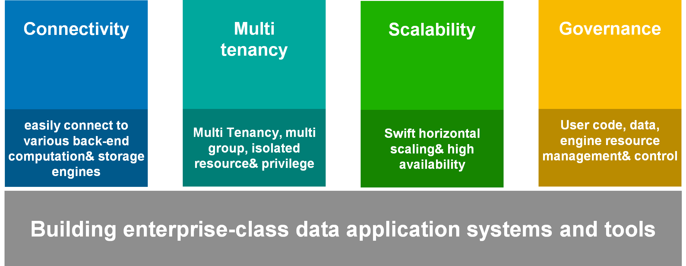

# Linkis Introduction

## 1. Summary

Linkis is the data middleware as a part of [WeDataSphere](https://github.com/WeBankFinTech/WeDataSphere), the big data suitcase of WeBank.

----

## 2. Background

With the widely spreading usage of big data technology, the open-source community has breeded out a variety of concrete applications and underlying computation engines.

Currently, it is the common solution for all the enterprises to introduce multiple open-source components for different business requirements, keeping their big data platform architecture refreshed and affluent.

As shown in the below diagram, with the increased number of concrete applications, tooling systems and underlying computation/storage engines, the whole data platform turns to a reticulation structure.
 

 
At the same time of introducing new open-source components to solve the pain points, those new components must be adapted with different functional applications or underlying computation/storage engines, leading to more pain points:

1. The bussiness requirements are keep changing, but every open-source component is distinguished in its features. Therefore, users may feel fragile and expensive both to learn and to use.
2. The diversity in big data types increases the difficulty of computation and storage. To keep up with those emerging computation/storage engines, developers must have sufficient technology stack.
3. Introducing new open-source components will inevitably cause compatibility issues with the existing data platform in multi-tenant isolation, user resource management and development management. And it is a heavy work to do top-to-bottom customized development, with problems of "re-inventing the wheel" and long development cycles.
4. Most data platform connects the functional applications with the underlying engines so directly that once exceptions occur, those unpredictable strange problems have negative effects on the user experience. It is also hard to gain any sediment on operation & maintenance.

----

## 3. Our Exploration

To construct a enterprise-level big data platform with sufficient & powerful functional tools and application systems, below questions should be taken into concern:
 

 

1. How to immediately gain the enterprise-level capabilities of multi-tenant isolation, elastic scaling and resource governance?
2. How to reuse those platform level capabilities and achieve the fast adaption with newly introduced components?
3. How to simplify the adaption with functional applications in a convenient and standardized style? No more tolerance with a bunch of Maven dependencies about Hadoop, Hive and Spark together with solving environment and argument issues.
4. How to solve the problem of application islet and data islet? How to quickly publish and schedule the execution of the code developed by IDE tools? How to make data consanguinity service one-stop fully covered?

We redefined the "connection" layer of data platforms and provided our exclusive solution based on above pain points.

----

### 4. Solution

Linkis connects with computation/storage engines(Spark, Flink, Hive, Python and HBase), exposes REST/WebSocket/JDBC interface, and executes multi-language jobs(SQL, Pyspark, HiveQL and Scala), as a data middleware.

 
Linkis provides below common modules to abstract, analyze and solve most problems on big data platform layer:
 

Linkis, the edge-cutting tool to build up a finance and enterprise level big data platforms!
