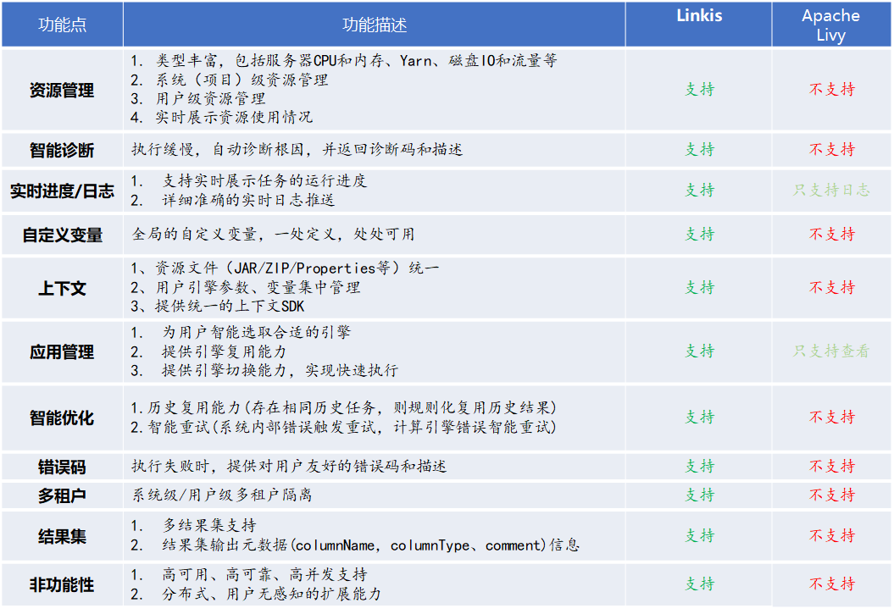
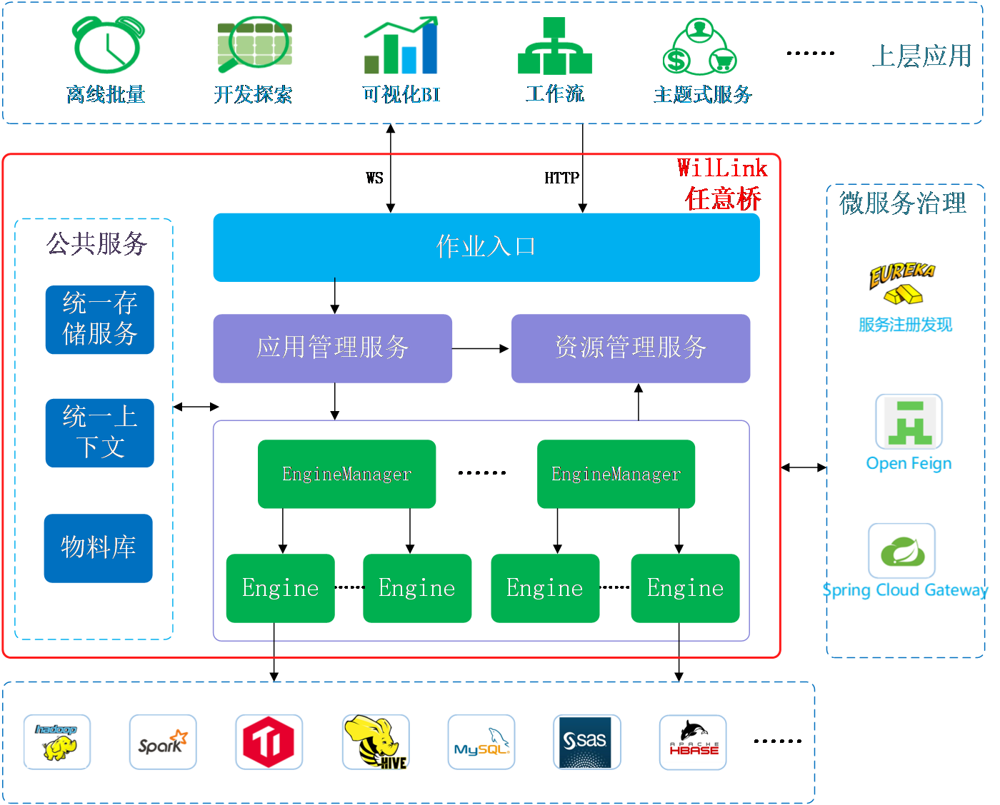

Linkis
============

[English](docs/en_US/README.md) | [Chinese](docs/zh_CN/README.md)

# 引言：

Linkis是一个打通了多个计算存储引擎如：Spark、Flink、Hive、Python和HBase等，对外提供统一REST/WS/JDBC接口，提交执行SQL、Pyspark、HiveQL、Scala等脚本的数据中间件。

Linkis基于微服务架构，提供了金融级多租户隔离、资源管控、权限隔离等企业级特性，支持统一变量、UDF、函数、用户资源文件管理，具备高并发、高性能、高可用的大数据作业/请求全生命周期管理能力。

----

# 核心特点：

**统一作业执行服务**：一个分布式的REST/WebSocket服务，用于接收用户提交的各种脚本请求。

**目前支持的计算引擎有**：Spark、Python、TiSpark、Hive和Shell等。

**支持的脚本语言有**：SparkSQL、Spark Scala、Pyspark、R、Python、HQL和Shell等；

**资源管理服务**： 支持实时管控每个系统和用户的资源使用情况，限制系统和用户的资源使用量和并发数，并提供实时的资源动态图表，方便查看和管理系统和用户的资源；

**目前已支持的资源类型**：Yarn队列资源、服务器（CPU和内存）、用户并发个数等。

**应用管理服务**：管理所有系统的所有用户应用，包括离线批量应用、交互式查询应用和实时流式应用，为离线和交互式应用提供强大的复用能力，并提供应用全生命周期管理，自动释放用户多余的空闲应用；

**统一存储服务**：通用的IO架构，能快速对接各种存储系统，提供统一调用入口，支持所有常用格式数据，集成度高，简单易用；

**统一上下文服务**：统一用户和系统资源文件（JAR、ZIP、Properties等），用户、系统、计算引擎的参数和变量统一管理，一处设置，处处自动引用；

**物料库**：系统和用户级物料管理，可分享和流转，支持全生命周期自动管理；

**元数据服务**：实时的库表结构和分区情况展示。

## 与类似系统的对比：

----
# QuickStart：

Read the [Quick Start.](ch2/deploy.md)

----

# Quick Use:

Read the [Quick Use](ch3/linkis快速使用文档.md)

----

# Architecture：

----

# Communication

如果您想得到最快的响应，请给我们提issue；或者您也可以扫码进群：

**QQ group:**
 

**License：Linkis is under the Apache 2.0 license. See the [LICENSE](/LICENSE) file for details.**

