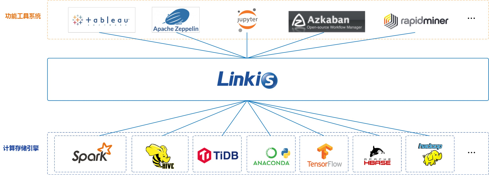
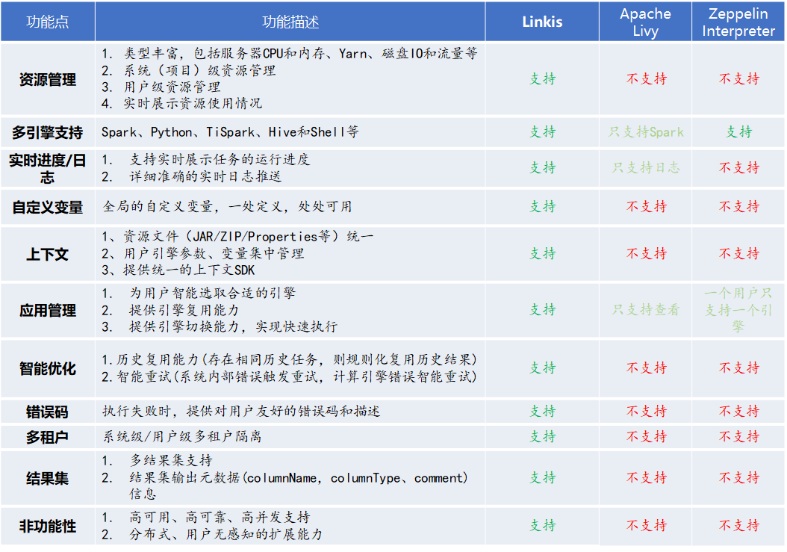
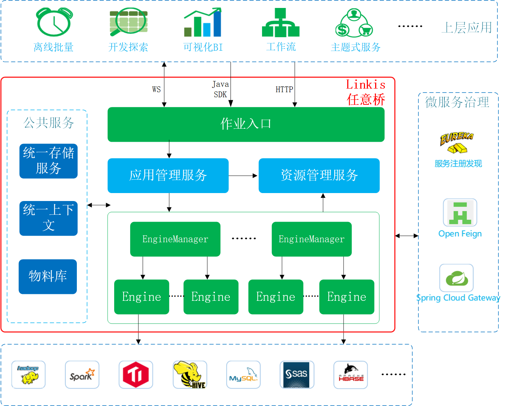

Linkis
============

[English](../../README.md) | 中文

# 引言：

Linkis是一个打通了多个计算存储引擎如：Spark、TiSpark、Hive、Python和HBase等，对外提供统一REST/WebSocket/JDBC接口，提交执行SQL、Pyspark、HiveQL、Scala等脚本的计算中间件。

Linkis基于微服务架构，提供了金融级多租户隔离、资源管控、权限隔离等企业级特性，支持统一变量、UDF、函数、用户资源文件管理，具备高并发、高性能、高可用的大数据作业/请求全生命周期管理能力。

 
 

基于Linkis计算中间件的架构设计理念，我们在上层构建了很多的应用系统。目前已开源的有：
- [**DataSphere Studio - 数据应用开发管理门户**](https://github.com/WeBankFinTech/DataSphereStudio)
- [**Qualitis - 数据质量工具**](https://github.com/WeBankFinTech/Qualitis)
- [**Scriptis - 数据研发IDE工具**](https://github.com/WeBankFinTech/Scriptis)
- [**Visualis - 数据可视化工具**](https://github.com/WeBankFinTech/Visualis)

更多工具准备开源中，敬请期待！

----

# 核心特点：

- **统一作业执行服务**：一个分布式的REST/WebSocket服务，用于接收用户提交的各种脚本请求。

    **目前支持的计算引擎有**：Spark、Python、TiSpark、Hive和Shell等。

    **支持的脚本语言有**：SparkSQL、Spark Scala、Pyspark、R、Python、HQL和Shell等；

- **资源管理服务**： 支持实时管控每个系统和用户的资源使用情况，限制系统和用户的资源使用量和并发数，并提供实时的资源动态图表，方便查看和管理系统和用户的资源；

    **目前已支持的资源类型**：Yarn队列资源、服务器（CPU和内存）、用户并发个数等。

- **应用管理服务**：管理所有系统的所有用户应用，包括离线批量应用、交互式查询应用和实时流式应用，为离线和交互式应用提供强大的复用能力，并提供应用全生命周期管理，自动释放用户多余的空闲应用；

- **统一存储服务**：通用的IO架构，能快速对接各种存储系统，提供统一调用入口，支持所有常用格式数据，集成度高，简单易用；

- **统一上下文服务**：统一用户和系统资源文件（JAR、ZIP、Properties等），用户、系统、计算引擎的参数和变量统一管理，一处设置，处处自动引用；

- **物料库**：系统和用户级物料管理，可分享和流转，支持全生命周期自动管理；

- **元数据服务**：实时的库表结构和分区情况展示。

## 与类似系统的对比：

Linkis跟Apache Livy和Apache Zeppelin Interpreter的定位不一样，但是由于开源社区目前尚没有同类竞品，所以这里做一个简单对比供大家参考。

----

# 文档列表

[Linkis快速安装使用文档](https://github.com/WeBankFinTech/Linkis/wiki/%E5%A6%82%E4%BD%95%E5%BF%AB%E9%80%9F%E5%AE%89%E8%A3%85%E4%BD%BF%E7%94%A8Linkis)

[上层前端应用的HTTP接入文档](https://github.com/WeBankFinTech/Linkis/wiki/%E4%B8%8A%E5%B1%82%E5%89%8D%E7%AB%AF%E5%BA%94%E7%94%A8HTTP%E6%8E%A5%E5%85%A5%E6%96%87%E6%A1%A3)

[上层前端应用的WebSocket接入文档](https://github.com/WeBankFinTech/Linkis/wiki/%E4%B8%8A%E5%B1%82%E5%89%8D%E7%AB%AF%E5%BA%94%E7%94%A8WebSocket%E6%8E%A5%E5%85%A5%E6%96%87%E6%A1%A3)

[Linkis架构文档](https://github.com/WeBankFinTech/Linkis/wiki/%E6%80%BB%E4%BD%93%E6%9E%B6%E6%9E%84%E8%AE%BE%E8%AE%A1%E4%BB%8B%E7%BB%8D)

**更多文档，请[点我访问](https://github.com/WeBankFinTech/Linkis/wiki)**

----

# Architecture：

----

# RoadMap

### 1. Linkis管理台

- 用户可以查看和管理自己的Job
- 用户可以查看和管理自己的引擎
- 用户可以查看Yarn的资源使用情况和用户资源使用排名
- 用户可以配置引擎的启动参数
- 用户可以设置变量

### 2. 支持标签功能

- 支持给EngineManager打标签
- 启动引擎时，支持为引擎打标签
- 支持通过标签访问目标引擎

### 3. AppGovernance应用治理实现

- 系统级、用户级应用全生命周期管理，包括离线批量、交互式查询和实时流式应用
- 为离线和交互式应用提供复用能力和智能切换能力
- 智能限流、应用智能保护

### 4. 支持Flink和Spark Structured Streaming

 

**如果您有任何需求，欢迎给我们提issue，我们将会及时给您回复。**

----

# Contributing

非常欢迎广大的社区伙伴给我们贡献新引擎和代码！

----

# Communication

如果您想得到最快的响应，请给我们提issue，或者您也可以扫码进群：

----

# License

**Linkis is under the Apache 2.0 license. See the [LICENSE](/LICENSE) file for details.**
