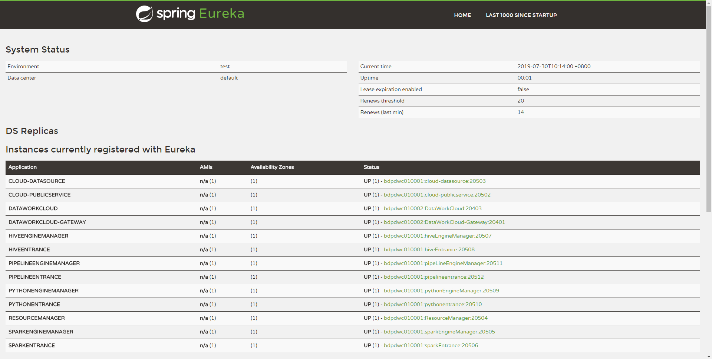

## 1、准备工作

### (1) 基础软件安装(必装项请自行安装)

- Mysql (5.5+) : 必装
- JDK (1.8.0_141) : 必装
- Hadoop(**社区版3.0以下都支持，CDH版可能存在兼容性问题**) ：选装，如需使用hive\spark引擎功能则需要安装Hadoop，只使用Python无需安装 
- Hive(1.2.1，**内部没有测过2.0和2.0以上版本，可能存在兼容性问题**) : 选装，hive引擎节点需要安装
- Spark(**只支持2.2.0以下，暂不支持Spark2.2以上的版本**) : 选装，Spark引擎节点需要安装
- Python(2.x和3.x都支持)：选装，使用python引擎时需要安装

  **如果您在安装过程中，发现存在兼容性问题，请您微信联系我们，我们将立马对兼容性问题进行修复。**

  **注意：Linkis本身不依赖Hive、Spark、python等服务，只有您需要用到hive、spark和python时，才需要在对应的节点进行安装。**
 
### (2) 创建用户

   例如: **部署用户是hadoop账号**

1. 在所有需要部署的机器上创建部署用户，用于安装
   
         sudo useradd hadoop  
        

2. 因为Linkis的服务是以 sudo -u ${linux-user} 方式来切换引擎，从而执行作业，所以部署用户需要有 sudo 权限，而且是免密的。

         vi /etc/sudoers

         hadoop  ALL=(ALL)       NOPASSWD: NOPASSWD: ALL
         
3. **如果您需要使用Spark和Hive，还需在每台安装节点设置如下的全局环境变量**，
  
    修改安装用户的.bash_rc，命令如下：
        
           vim /home/hadoop/.bash_rc
        
    下方为环境变量示例：

          export JAVA_HOME=/nemo/jdk1.8.0_141
          #HADOOP  
          export HADOOP_HOME=/appcom/Install/hadoop
          export HADOOP_CONF_DIR=/appcom/config/hadoop-config    
          #Spark
          export SPARK_HOME=/appcom/Install/spark
          export SPARK_CONF_DIR=/appcom/config/spark-config/spark-submit
          #Hive
          export HIVE_HOME=/appcom/Install/hive
          export HIVE_CONF_DIR=/appcom/config/hive-config


### (3) ssh免密配置


在部署机器和其他安装机器上配置ssh免密登录，如果要在部署机上安装，需要将主机器和各个其它机器SSH打通


## 2、编译打包（可跳过）：

   ### 如果用户不想自己编译，可以直接在release页面下载安装包，本步骤可以直接跳过。
   
   从git获取项目代码后，使用maven打包项目安装包。   

   （1） **如果您是本地第一次使用，必须在最外层工程pom.xml所在目录先执行以下命令**：
   
         mvn -N  install
         
   （2） 在最外层工程pom.xml所在目录执行以下命令
      
         mvn clean install
         
   （3） 获取安装包，在工程的assembly->target目录下：
   
         wedatasphere-linkis-x.x.x-dist.tar.gz
          
## 3、安装：

   先解压安装包到安装目录，并对解压后文件进行配置修改。
   
      tar -xvf  wedatasphere-linkis-x.x.x-dist.tar.gz
      
   （1）修改基础配置  
   
       vi /conf/config.sh   
        
   ```
    deployUser=hadoop      #指定部署用户
    LINKIS_INSTALL_HOME=/appcom/Install/Linkis    # 指定安装目录
    WORKSPACE_USER_ROOT_PATH=/tmp/hadoop    # 指定用户根目录，一般用于存储用户的脚本文件和日志文件等，是用户的工作空间。
    HDFS_USER_ROOT_PATH=hdfs:///tmp/linkis   # 指定用户的HDFS根目录，一般用于存储Job的结果集文件
    
   ```
        
   （2）修改数据库配置 
   
       vi ./conf/db.sh 
            
   ```         
    # 设置数据库的连接信息
    # 包括IP地址、数据库名称、用户名、端口
    # 主要用于存储用户的自定义变量、配置参数、UDF和小函数，以及提供JobHistory的底层存储
    MYSQL_HOST=
    MYSQL_PORT=
    MYSQL_DB=
    MYSQL_USER=
    MYSQL_PASSWORD=
   ```
   
   (3) 导入相关表到数据库
    
   因为担心用户重复执行install.sh脚本，把数据库中的用户数据清空，所以在install.sh中注释掉了以下的两行导入表元数据代码。
    
   如果您确定是**第一次**部署，可以手动修改install.sh脚本，将注释去掉。
   
   ```shell
    mysql -h$MYSQL_HOST -P$MYSQL_PORT -u$MYSQL_USER -p$MYSQL_PASSWORD -D$MYSQL_DB -e "source ${workDir}/db/linkis_ddl.sql"
    mysql -h$MYSQL_HOST -P$MYSQL_PORT -u$MYSQL_USER -p$MYSQL_PASSWORD -D$MYSQL_DB -e "source ${workDir}/db/linkis_dml.sql"
   ```

   （4）执行安装脚本：
   
        sh ./bin/install.sh       

## 4、启动服务：
        sh  ./bin/start-all.sh
        
## 5、查看服务
    可以在Eureka界面查看服务启动成功情况，查看方法：
    
    使用http://${EUREKA_INSTALL_IP}:${EUREKA_PORT}, 在浏览器中打开，查看服务是否注册成功。
    
    如果您没有在config.sh指定EUREKA_INSTALL_IP和EUREKA_INSTALL_IP，则HTTP地址为：http://127.0.0.1:20303
    
    如下图，如您的Eureka主页出现以下微服务，则表示服务都启动成功，可以正常对外提供服务了：
    
   
       
