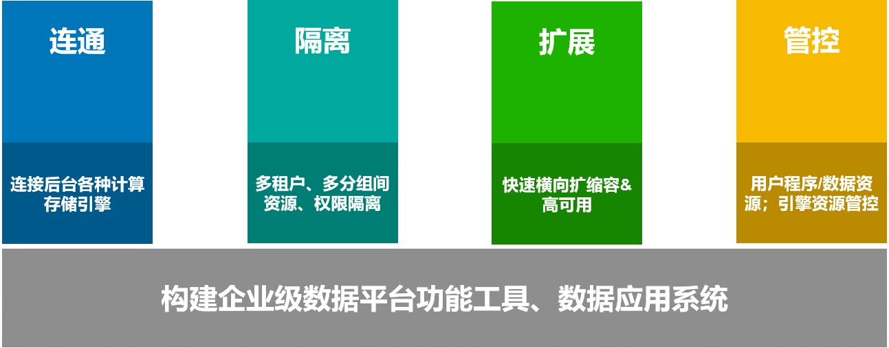
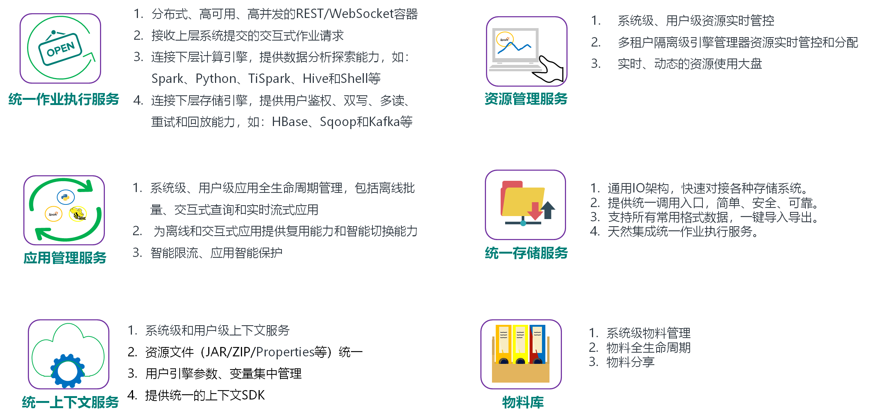

# Linkis介绍文档

## 1. 概述

Linkis是微众银行大数据平台套件[WeDataSphere](https://github.com/WeBankFinTech/WeDataSphere)的数据中间件。

----

## 2. 背景

随着大数据技术的广泛应用，开源社区催生出层出不穷的上层应用和下层计算引擎。

通过引入多个开源组件来满足不同的业务需求，不断更新和丰富大数据平台架构，几乎是现阶段所有企业的通用做法。

如下图所示，当我们的上层应用、工具系统，和底层的计算存储组件越来越多时，整个数据平台的情况就会变成如上图的网状结构。
 

 
不断引入新开源组件来解决痛点的同时，新的组件都要去对接不同的上层功能工具或底层计算存储引擎，越来越多的痛点也随之产生：

1. 业务需求变化多端，而上层开源组件各具特色，用户使用起来割裂感强烈，且学习成本高昂。
2. 大数据种类繁多，存储、计算起来非常复杂，而底层的存储和计算引擎层出不穷，开发人员必须具备完善的技术栈。
3. 新开源组件的引入必然在多租户隔离、用户资源管理、用户开发管理等方面无法兼容原有数据平台，自上而下的定制化开发工作，不仅工程量大，而且存在重复造轮子现象，开发周期长。
4. 很多数据平台的上层应用直接对接了底层的计算、存储引擎，一旦出现异常，问题千奇百怪，用户体验非常差，也没有办法进行运维沉淀。

----

## 3. 我们的探索

构建企业级大数据平台，提供丰富且强大的功能工具、数据应用系统，通常需要考虑如下的几个问题：
 

 

1. 如何快速具备多租户隔离、弹性扩缩容和资源管控等企业级能力？
2. 如何复用已有的平台层能力，新引入的组件能快速扩展对接？
2. 如何简化上层应用的接入，提供标准快捷的接入方式，不用再去引入一堆Hadoop、Hive和Spark的maven依赖，解决一大堆环境和参数问题？
3. 如何解决应用孤岛和数据孤岛问题？在IDE开发工具开发的代码如何快速发布调度？数据血缘如何做到一站式全覆盖？

我们重新定义了数据平台的“连接”层的问题，同时基于以上的痛点，给出了我们独有的解决方案。

----

### 4. 解决方案

Linkis，一个打通了多个计算存储引擎（如：Spark、Flink、Hive、Python和HBase等），对外提供统一REST/WebSocket/JDBC接口，提供提交执行SQL、Pyspark、HiveQL、Scala等脚本能力的数据平台中间件。

 
Linkis提供以下几个通用的模块组件，用于解决抽象和拆解几乎绝大部分的大数据平台层问题：
 

Linkis，构建金融级和企业级大数据平台的利器！