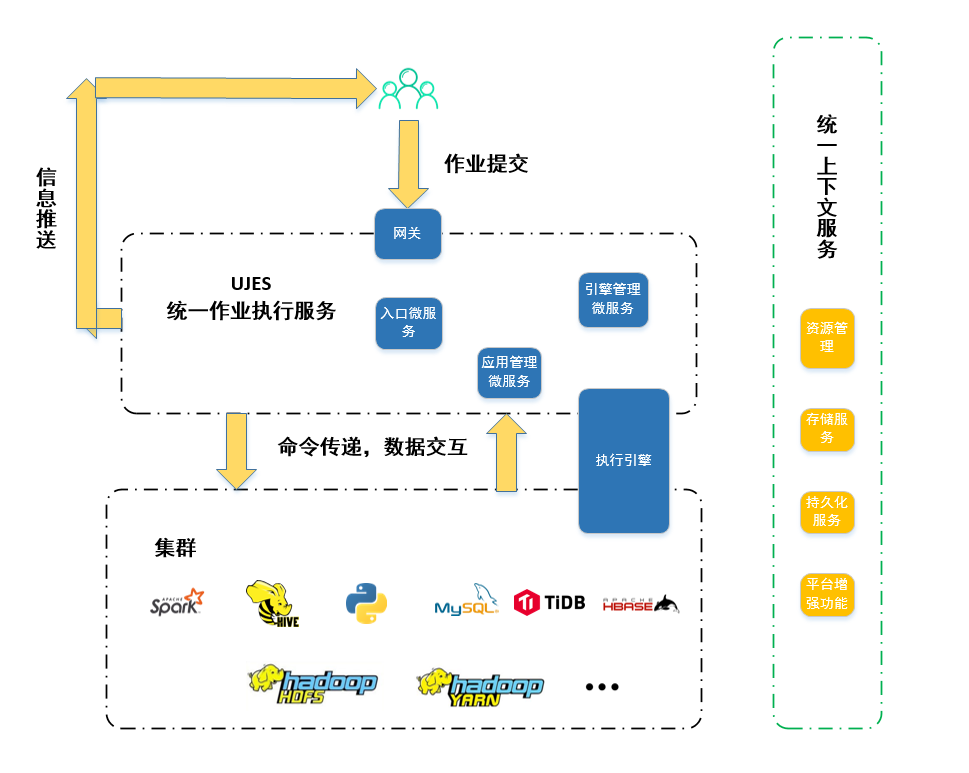
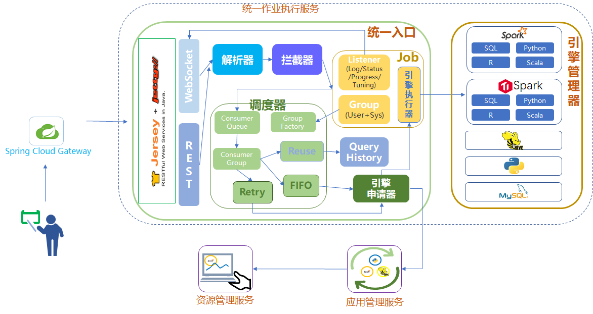
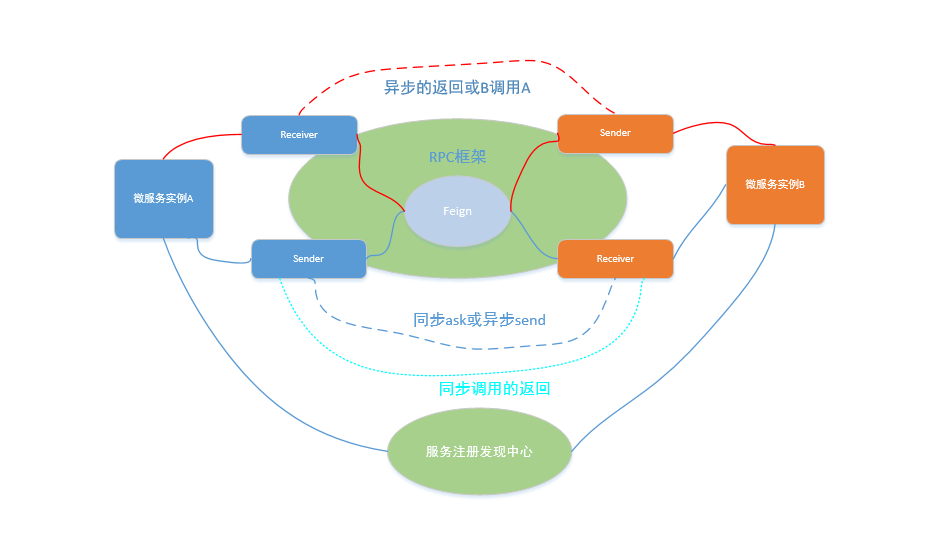

### UJES设计文档
#### 1.文档概述
##### 1.1项目背景
UJES(Unified Job Execution Service)，统一作业执行服务是Linkis的核心组件之一。项目以微服务架构的实现方式，为大数据生态圈提供了一种大数据作业提交的全新通用框架方案，同时解决现有市面上同类开源项目的一些使用上的痛点。 
本文档适合于对大数据功能平台，特别是hadoop大数据生态圈，有一定工作经验或有学习兴趣的人士阅读。
##### 1.2名词解释
文档会在后文使用到一些项目中的专有名词，在本节中对这些名词进行解释。

1) 网关:
UJES的网关，基于Spring Cloud Gateway进行了插件化功能增强，新增了WebSocket一对多能力的网关服务，主要用于转发用户请求到指定的微服务。

2) 入口微服务:UJES的入口微服务是用户某一类作业全程的管理者。从作业生成到提交到执行引擎，再到作业信息反馈给用户和作业关闭，入口微服务管理了一个作业的生命周期。

3) 引擎管理器:UJES的引擎管理器是处理启动引擎请求的微服务，同时也监控引擎的生命状态。
4) 执行引擎:UJES的执行引擎是真正执行用户作业的微服务，它由引擎管理器启动，并和提交给它作业的入口进行交互，将作业正确执行，并反馈用户需要的各种信息。
5) 应用管理器:UJES的应用管理微服务是集群中执行引擎实例信息的维系者，入口微服务想要执行作业，总是需要这些信息来获取一个可以使用的执行引擎。

#### 2.整体架构
正确、安全地连接用户和数据，并为用户提供强大且易用的数据作业提交方式是UJES项目的目标。UJES的定位是连接用户和数据及集群的桥梁。用户只需要将自己的大数据作业提交到UJES，UJES会将作业提交到集群上进行执行，作业在集群上运行产生的日志、状态、进度、结果等都会由UJES实时返回给用户。 
UJES的整体架构如图2.1所示。如图所示，UJES框架位于用户与集群之间，是用户作业的管理角色，它将大数据集群的数据存储、计算等功能进行封装，提供了一种统一的作业提交框架，用户不再需要区分作业是spark还是hive等类型，只需要提交给UJES，就可以正确地让集群为自己服务，节省了用户极大的学习成本。

 

图2.1 UJES整体架构图

#### 3.逻辑架构
UJES的逻辑架构是基于现今流行的微服务架构模式进行设计。微服务架构提倡将后台服务划分成一组小的服务，各个微服务之间相互协调、互相配合。微服务和微服务之间采用轻量级的通信机制相互沟通（通常是基于HTTP的Restful API)。这种架构模式具有逻辑清晰、部署简单、扩展性强、技术异构、高可靠等优势。UJES的逻辑架构如图3.1所示。

 

图3.1 UJES逻辑架构图总览

##### 3.1 UJES作业执行主流程
下面将用一个完整的例子来详细阐述介绍UJES项目运行的主流程，并对图中微服务组件的功能进行介绍，更多细节会在主流程之后进行阐述。
- **1.用户提交作业，网关转发**

  用户A通过Restful或者Websocket等方式提交自己的大数据作业到UJES的网关微服务，网关根据指定的作业类型，转发用户请求到指定的入口微服务，如用户提交了一段spark-sql代码，网关会将该作业提交到Spark的入口微服务中。由于入口微服务可以是多实例部署的，网关是按照负载均衡的策略进行转发到合适的微服务实例。
- **2.入口程序进行解析、检查**

  用户的作业被转发到Spark的入口微服务之后，入口中的解析器会将用户提交的作业解析成一个可用于运行的任务，持久器会将任务持久化到数据库。同时预设置的拦截器也会进行脚本的自定义变量替换，恶意代码检查等操作。如果用户的请求被拦截，那么他的代码将不会被提交到集群进行执行。
- **3.监听器的设置**

  任务运行产生的日志、进度、状态、结果等信息产生之后需要进行处理，例如展现给用户或持久化到数据库等，一般这种处理需要采用事件总线和监听器的方式，所以需要为任务设置各类监听器。
- **4.任务进入调度器**

  任务生成之后，会进入调度器中等待调度执行。调度器中的核心概念是消费队列，消费队列是以消费组作为标识的，消费组一般是以用户所在的系统和用户两者共同确定，如用户Anna在系统Test中向UJES提交了任务，那么消费组可以标记为Test_Anna。任务进入调度器之后，会根据组的标识，放置到不同的消费队列等待调度。消费队列的线程一般采用单线程的方式实现。
- **5.应用管理微服务的工作——提供执行引擎**

  任务一旦被调度，入口微服务就需要通过引擎申请器向应用管理微服务进行申请执行引擎用于执行。
应用管理微服务会根据用户的消费组信息查看集群中是否有用户可以使用的引擎，如果有可以用于消费组使用的执行引擎，会将该引擎的信息返回给入口微服务，入口微服务会将任务提交到该执行引擎进行执行。
如果应用管理微服务发现在集群中没有该消费组可以使用的引擎，就会向引擎管理器微服务为该消费组申请一个新的执行引擎。入口微服务的消费线程会一直等待直到应用管理微服务返回引擎启动成功、失败或者超时的信息。
- **6.引擎管理器微服务——启动并管理引擎**

  引擎管理器微服务是用于启动并管理执行引擎的微服务。当引擎管理器收到应用管理微服务启动一个新引擎的请求，请求会携带用户的消费组信息，引擎管理器根据消费组信息去向资源管理器申请资源，如果用户仍然有足够的资源，资源管理器就会允许引擎管理器为用户启动一个新的引擎，并广播到应用管理服务微服务。
- **7.入口微服务提交任务到执行引擎进行执行**

  步骤7之后，应用管理微服务已经获取到了新启动的引擎的信息，应用管理微服务会将这个引擎的信息返回给入口微服务，入口微服务获取到这个引擎信息之后，就将任务提交到改引擎去执行。
- **8.入口与引擎的交互**

  任务提交到执行引擎之后，任务在运行的时候，会产生日志、进度、结果等信息，这些信息会通过RPC的方式进行返回到入口微服务中，返回信息都会携带任务的唯一标识信息，根据任务的标识信息，入口微服务将这些信息正确地进行处理。
- **9.任务的完成**

  任务在执行引擎上运行完毕之后，会将运行成功或者失败的状态信息返回给入口微服务，入口微服务中的任务状态翻转之后，消费队列会继续消费在队列中的任务。
##### 3.2 架构的细节以及优化
除3.1小节中描述的主流程之外，UJES在集群管理和性能提优方面也有自己的处理流程。
- **1. 任务分类与多样的消费方式**

  任务可以按照自身的特点可以分类成以下几类:全新任务、重试任务、重复任务等。全新任务是指用户新提交的任务，重试任务是指在某些特定情况下运行失败需要进行重试的任务，重复任务是指与以前提交任务是一致的任务。
任务进入调度器的消费队列之后，如果是全新任务，就会进入FIFO的消费器(Consumer)进行消费，如果是重复任务，则会进入ReUse的消费器进行消费，ReUse的消费器所做的事情就会比FIFO简单很多，只需要将原来一样的任务的结果返回给用户就行。
- **2. 引擎并发数的控制**

  UJES中，一个用户可以启动的引擎是受到控制的，例如一个用户最多可以启动3个Spark引擎。并发数的控制是在入口微服务和资源管理器微服务两者双重保证进行控制的。入口微服务中，每个用户的消费线程至多只有3个处于运行中的任务，这样最多就只会使用三个引擎。资源管理微服务也做了这样的保证，如果一个用户要启动第四个引擎，引擎管理器需要为这个用户去向资源管理微服务请求资源，资源管理微服务会以引擎数量超过限制为由拒绝为该用户提供资源，第四个引擎就会启动失败。
- **3. 执行引擎的心跳维系与不健康引擎**

  应用管理微服务在获取到引擎信息之后，需要和引擎进行心跳的维系，以确保引擎的进程是仍然存在的。如果引擎一段时间内没有心跳返回，就会将该引擎加入不健康引擎里面，这样入口请求引擎的时候，这些不健康引擎将不会被使用。
- **4.引擎的自然消亡与用户主动杀死**

  引擎的存在是会占用集群资源的，特别是Spark引擎会占用较多的队列资源，所以如果引擎管理器检测到一个执行引擎长时间没有被使用，那么需要将该引擎进行杀死，释放集群的资源，正确杀死引擎之后需要向应用管理器进行广播。用户在使用UJES的时候也会有主动kill引擎的意愿，用户提交杀死引擎的Restful请求到网关，网关转发到引擎管理器，引擎管理器对引擎进行杀死。
- **5. 多租户隔离**

  多租户隔离是大数据功能平台的一个重要功能,UJES配合hadoop生态圈组件的权限管理从架构上就天然支持多租户隔离。用户作业是在执行引擎上进行执行，UJES的资源管理微服务在启动一个新的执行引擎的时候，会切换到该用户去执行系统命令，这样执行引擎进程的权限就是该用户的权限，与其他用户启动的引擎是完全隔离的，这样就实现了多租户隔离的功能。
- **6. 智能诊断**

  智能诊断是UJES的一个调优模块，大数据作业在执行的时候往往会用到大量数据做计算，同时也会需要集群中大量的资源，一个作业的执行时间会需要较长的时间。用户总是希望能够得到集群的反馈，比如数据是否是倾斜，队列资源是否是足够等。智能诊断就是为这种需求所设定的，诊断模块可以在作业运行时对用户作业的资源和数据进行分析，并把分析的内容实时推送给用户。
#### 4.接口设计
##### 4.1 对外接口设计
UJES对外接口是指与用户使用和与集群的接口。
- **1 用户接口**

  UJES的使用用户接入UJES的方式一般有Restful、WebSocket两种方式。用户需要将自己的请求按照规定的格式封装成Json，然后通过post的方式提交自己的请求。推荐用户使用采用基于web的方式接入UJES。数据交换的规范会在文后给出。
- **2 集群接口**

  UJES与集群的交互方式是根据引擎类型决定的。如图2.1所示，UJES的执行引擎是横跨了UJES和集群两个层面。举一个例子，Spark执行引擎是通过Spark提供的Driver API与集群进行交互。用户在使用UJES框架的时候，可以根据自身的需求和特点进行对集群或者是其他服务器资源进行接口接入。

##### 4.2 框架接入接口设计
UJES作为一个框架，框架开发用户可以根据自己的需求进行接入开发。框架的接入一般采用SDK的方式，用户通过maven或gradle等依赖管理引入UJES的SDK之后，需要实现以下几个接口就可以使用UJES框架。

1) 入口微服务接入接口
2) 引擎管理器接入接口
3) 引擎接入接口

具体可以查看UJES的接入文档。
##### 4.3 内部功能模块接口设计
UJES内部功能模块之间的交互采用了自研的基于Feign的RPC方式。RPC框架将服务调用方和服务提供方抽象成了Sender和Receiver，服务和服务之间采用Sender通过异步的send方法或者同步的ask方法进行调用。send和ask方法传参是希望Receiver进行处理的类实例。类实例json序列化之后，传到服务提供方，服务提供方的Receiver一般是单例实现，Receiver类有接收异步请求的receive方法和接收同步请求的receiveAndReply方法。Receiver在接收到请求之后，会通过scala的match case语法进行相应的操作。熟悉spark的用户可能比较熟悉这一个处理逻辑，这套API的设计方法也有借鉴Spark的RPC的实现。RPC框架的逻辑如图4.1所示。 
举个例子，微服务A需要调用微服务B的持久化功能，首先微服务A需要获取微服务B在服务注册中心的应用名，通过应用名可以通过RPC框架获取一个Sender，然后将想要持久化的类实例通过send或ask的方式发送到微服务B。微服务B 接收到这个请求之后，通过实例的类信息推断出是一个持久化的请求，根据请求进行后续的操作。如果是同步的请求，操作完成之后需要返回一个消息给调用方。

 

图4.1 UJES RPC框架描述

#### 5.部署架构
##### 5.1传统部署方式
请查看[快速部署文档](../ch1/deploy.md)。
##### 5.2 容器化部署
暂无。
