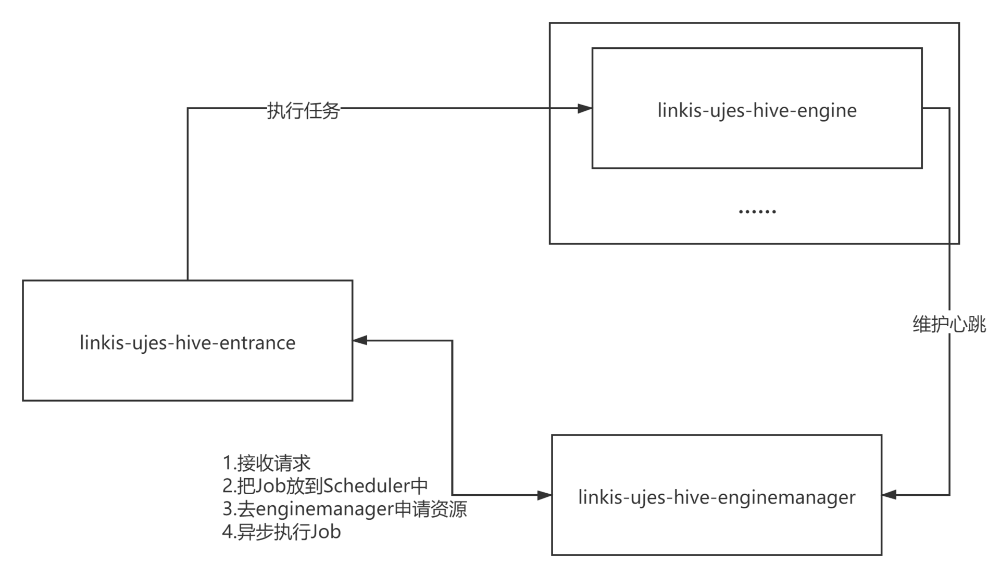
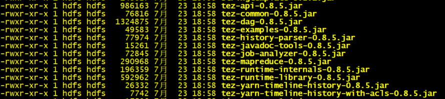
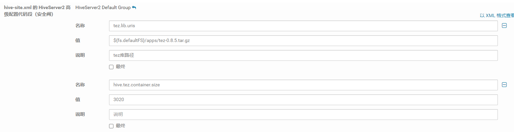
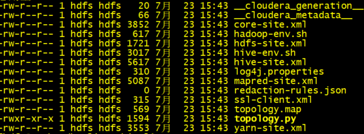

## 一.简介

### 1.1 背景

Linkis是为了解决计算治理的中间件，用Hive常常会用到tez引擎，本文介绍如何基于Linkis打通Hive on Tez 。

### 1.2 架构



Linkis的Hive引擎执行任务流程

HiveEngine中用到org.apache.hadoop.hive.ql.Driver 去调用Hql，这里面涉及到Hive的执行流程。

* 由编译器解析查询语句并从AST中生成一个Calcite逻辑计划。
* 优化逻辑计划。
* 优化逻辑计划转换物理计划。
* 向量化的执行计划。
* 生成具体的task，可以是mr或者Spark、Tez，并通过Driver提交任务到YARN。
* 执行结束后将结果返回给用户。

从执行逻辑角度上看，基于Linkis去操作Hive on Tez不需要更改源码，之所以不能用Tez因为Hive引擎中缺失依赖，所以无法去执行。

## 二.部署

以CDH-5.16.2环境为例，假设大数据集群已经配置好Tez。

1.linkis-ujes-hive-enginemanager目录下，lib文件夹，添加Tez依赖。把/opt/cloudera/parcels/CDH/lib/tez 目录下，tez-*前缀的jar都放到linkis-ujes-hive-enginemanager/lib目录下。



2.CDH Hive配置tez依赖。



3.因为CDH配置的变量存储在元数据库中，所以把/etc/hive/conf配置独立出来，在linkis-ujes-hive-enginemanager conf文件夹下，把linkis-engine.properties和linkis.properties

的hive.config.dir都配置独立出来的Hive相关的配置文件。

独立出来Hive配置文件，Hive-site.xml中追加属性（重点）：

```plain
 <property>
    <name>tez.lib.uris</name>
    <value>hdfs:///apps/tez/tez-0.8.5.tar.gz</value>
  </property>
   <property>
    <name>hive.tez.container.size</name>
    <value>10240</value>
  </property>
```
linkis-ujes-hive-enginemanager/conf/linkis.properties 内容：

```plain
wds.linkis.server.restful.scan.packages=com.webank.wedatasphere.linkis.entrance.restful
wds.linkis.engine.application.name=hiveEngine
wds.linkis.server.component.exclude.packages=com.webank.wedatasphere.linkis.engine.,com.webank.wedatasphere.linkis.udf.
wds.linkis.server.version=v1
#sudo script
wds.linkis.enginemanager.sudo.script=/home/hdfs/linkis/linkis-ujes-hive-enginemanager/bin/rootScript.sh
#hadoop config
hadoop.config.dir=/etc/hadoop/conf
#hive config
hive.config.dir=/home/hdfs/etc/hive
```
linkis-ujes-hive-enginemanager/conf/linkis-engine.properties 内容：

```plain
wds.linkis.server.restful.scan.packages=com.webank.wedatasphere.linkis.engine.restful
wds.linkis.engine.application.name=hiveEngine
wds.linkis.server.component.exclude.packages=com.webank.wedatasphere.linkis.enginemanager.,com.webank.wedatasphere.linkis.udf.
wds.linkis.server.component.exclude.classes=com.webank.wedatasphere.linkis.resourcemanager.service.annotation.RMAnnotationParser
wds.linkis.server.version=v1
#hadoop config
hadoop.config.dir=/etc/hadoop/conf
#hive config
hive.config.dir=/home/hdfs/etc/hive
```
/home/hdfs/etc/hive文件夹内容：



