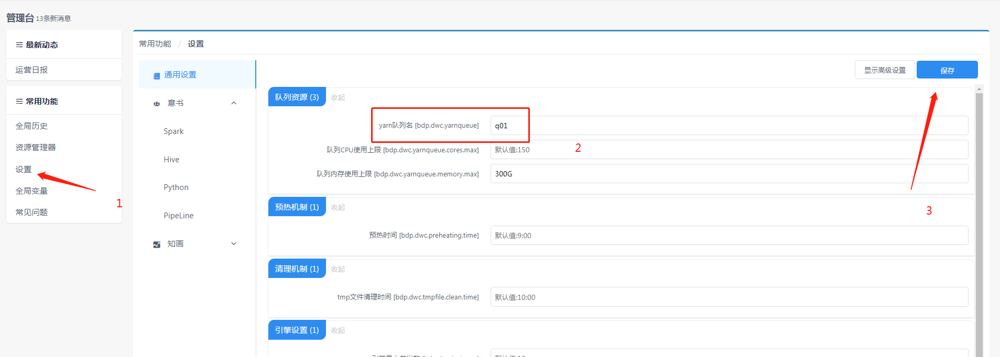
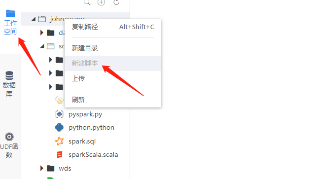
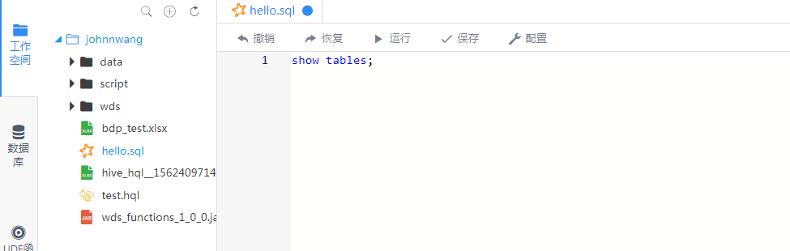
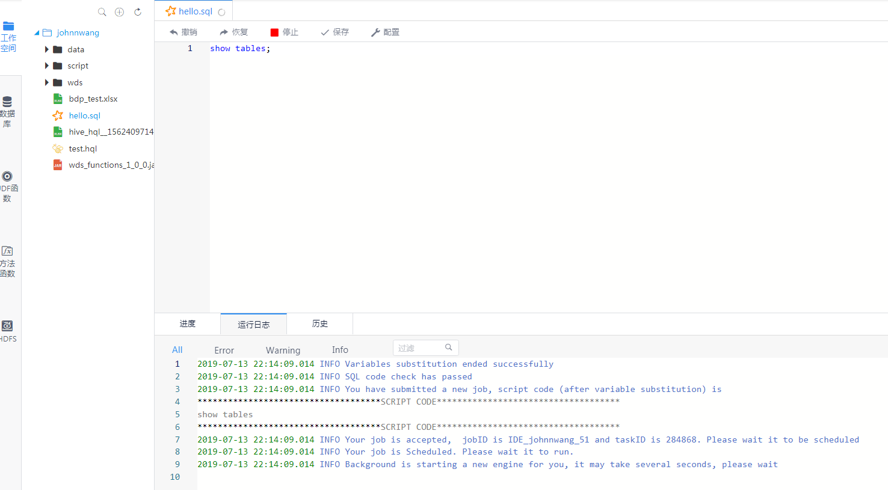

## Quick Login
&nbsp;&nbsp;&nbsp;&nbsp;&nbsp;To be convenient to users，the default login username is consistent with the Linux user which is used for deployment. For example, if user 'hadoop' is used for deployment linkis, the user can use 'hadoop' as the username, and 'hadoop' as the password to login. Note that the password is the same with the username.
First enter the address of the front-end container: 192.168.xx.xx:8888, and then enter the username/password:hadoop/hadoop

__Hint：__ Other users must use their configured LDAP passwords to login.

## Queue Configuration
&nbsp;&nbsp;&nbsp;&nbsp;&nbsp;scriptis is backed by Spark running on yarn. To use Spark properly, users must declare an available queue in their configurations. Click Control Panel --> Settings --> Yarn Queue, and then enter the name of the yarn queue to which you have the permission.

## Create New Script
&nbsp;&nbsp;&nbsp;&nbsp;&nbsp;
Finished with queue configuration, you may try to create a SQL script snippet for data query. Click WorkSpace --> Personal Directory, and then right-click to create a new SQL script.
1. Create

2. Create SQL script

3. Type SQL code snippet

## Click & Run
&nbsp;&nbsp;&nbsp;&nbsp;&nbsp;
Click the 'Run' button above the script area to execute the script. The status of the execution can be monitored by logs.

## Result Display
&nbsp;&nbsp;&nbsp;&nbsp;&nbsp;
For the first-time execution, please wait for a slightly long time after clicking the 'Run' button, as the background service is firing a new Engine for you. Result sets will be displayed after successful executions. Users can download or export the result sets.

For more detailed manual please see：[Scriptis Manual](../ch4/Scriptis_Manual.md)

