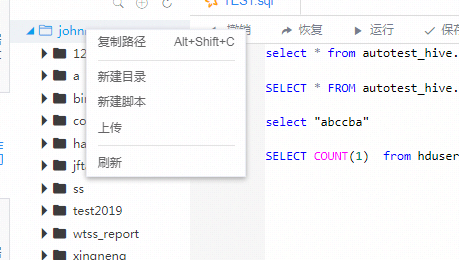
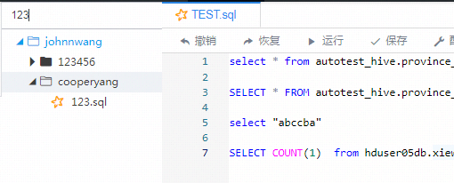
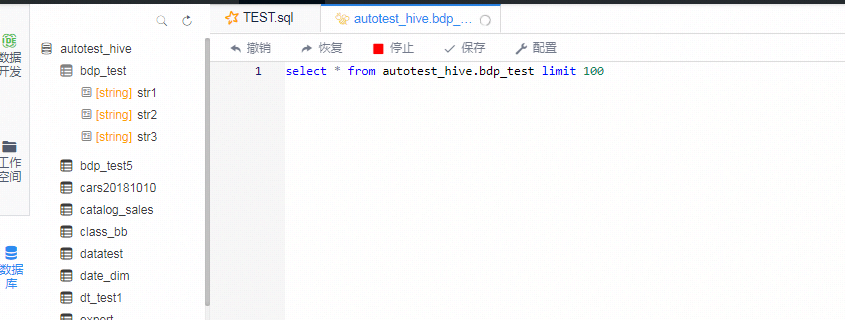
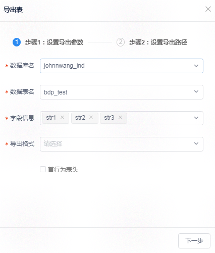
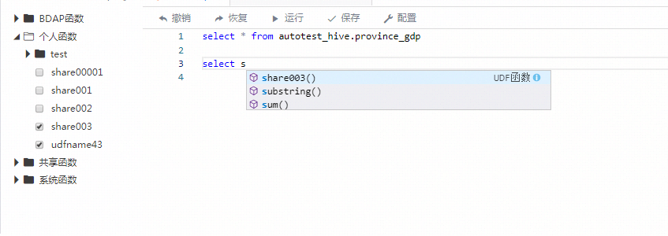
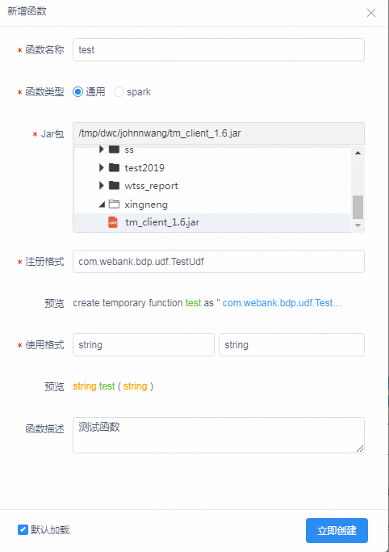
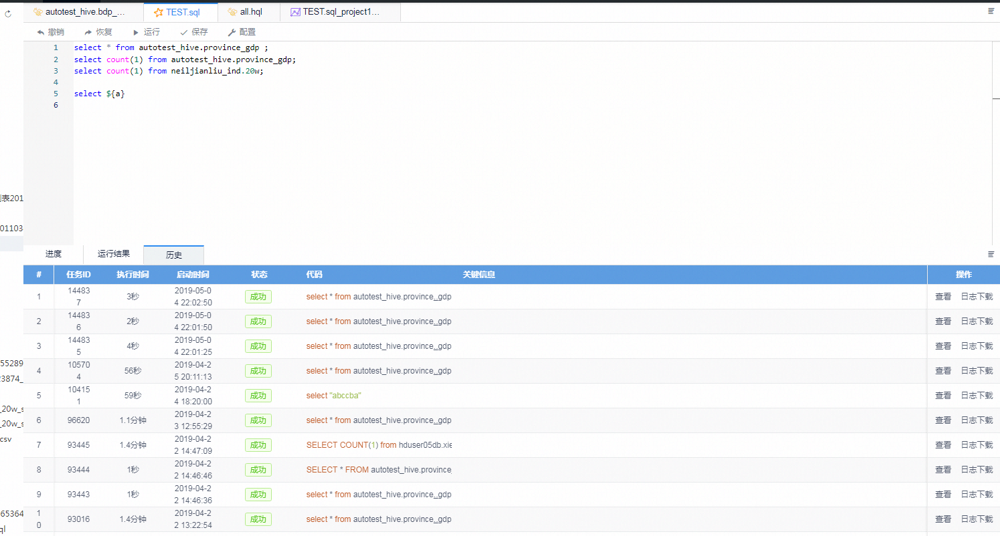
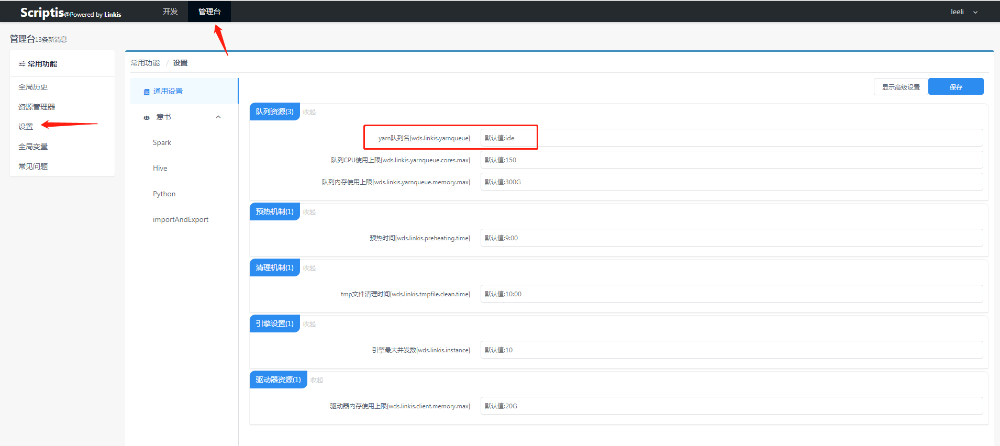

## 1 Functions

Scriptis mainly has the following features:

1. Workspace: Used to store scripts, data and log files. Support creating sql, hive, scala, python, pyspark scripts. 
2. Dataset Module:  Display datasets and tables based on user permission.
3. UDF Module: UDF are functions that can be used in sql and hql scripts. This module has the capability of managing, sharing and loading functions.
4. Function Module: Composed of personal, system and shared user-define functions. These functions can be used in python, pyspark, scala scripts. 
5. HDFS Module: Personal directory of user's HDFS (distributed filesystem),  used to store large files. 
6. Script Module: Capable of editing, running and stopping scripts. Customizing variable configurations and shortcut keys are also supported.
7. Results: Include displaying, downloading and exporting the results. 
8. Script History:  Displaying the running history of the scripts.
9. Console: Users can access settings, global history, resource manager,  global variables and FAQs here. 
10. Bottom right pop up box: Include task, engine and queue managers.

These functions are described in detail below.

## 2 Workspace

Workspace is a file directory that a user have full permission to. At here, a user could do various operations such as managing files.  The recommending directory structure is: script, data, log and res, since it is quite clear and thus easy for users to check and manage. The major functions of workspace are listed below:

1. Right-clicks on workspace, a user can select copying path, creating a directory, creating a script or refreshing. 



2. Locates on the top of this module, there is a search box for quick searching.



3. Support creating following kinds of scripts:

- sql: Correspond to SparkSQL in Spark engine, syntax guide:  https://docs.databricks.com/spark/latest/spark-sql/index.html

- hql: Correspond to Hive engine: syntax guide:  https://cwiki.apache.org/confluence/display/Hive/LanguageManual

- Scala: Correspond to scala in Spark engine, syntax guide:  https://docs.databricks.com/spark/latest/dataframes-datasets/introduction-to-dataframes-scala.html

- JDBC: sql standard syntax, not supported yet.

- Python:  Standalone python engine, compatible with python

- PythonSpark: Correspond to python  in Spark engine, syntax guide:  https://docs.databricks.com/spark/latest/dataframes-datasets/introduction-to-dataframes-python.html

  

4. Right-click on script folder and files under it, users can choose to rename it, delete it, open it on the right side or export to hive (csv, txt, excel files) and hdfs. 

  

## 3 Dataset Module

Dataset module has the following functions.

1. Get the information of datasets, tables and fields.


2. Right-click on a table and select query table option can quickly generate a temporary hive script for data lookup. 



3. Right-click on a table and select describe table option can display the detailed information of this table and its corresponding fields and partitions.


4. Right-click on a table, select export table option can generate a corresponding csv or excel file. 



## 4 UDF Module

This module not only makes it easy for user to classify and display UDF,  but also enables users to manage and share UDF. The major functions are listed below:

#### 4.1 Displaying and loading functions

Default top-level directory:

- BDAP function: Provided by platform and can be used in sql, pyspark, scala and hive (written with sql) scripts.

- System function: Functions that system provides and loaded by default. Can be used in sql, pyspark, scala and hive (written with sql) scripts.

- Individual function: Self-define functions, include general functions and Spark exclusive functions.  

- Sharing function: Functions created by administrator and then shared to other users. 

- Apart from system functions, other types of functions must be loaded before using and a user must kill the started session after checking the functions. 

  In addition, if a function is checked and loaded, it would correspondingly shown in auto-complete options.

  

#### 4.2  Creating a new UDF

It is quite easy to create a new UDF as long as you've finished the code. The steps are as follows:

1. To create a general UDF,  a user needs to compile the corresponding Jar package first. General means either hql in Hive or sql in Spark applies here. 

2. To create a Spark exclusive UDF, a user needs to create a corresponding python or scala script. Besides, to ensure the correctness, it is better to test the scripts.

3. Add this UDF to Scriptis:

   General UDF: Choose general then select the path in workspace for its Jar package. Next, fill in the full class path of UDF and add formatting as well as description:



   Spark exclusive UDF -- written in scala: Check Spark then select the corresponding scala script and fill in the registration format. (Function name in script):


   Spark exclusive UDF -- written in scala: Check Spark then select the corresponding python script and fill in the registration format. (Function name in script):


#### 4.3 Way to write Scala and Python functions:

For a PythonUDF, a user only needs to define a function, and the scripts have to correspond with this function.

```
def hello(id):
	return str(id)  +  ":hello"	
```

The way to create a ScalaUDF is quite similar to creating a Python UDF, a user only needs to define a function:

```
def helloWord(str:	String):  String  =  "hello, "  +  str
```

Note: Python UDF and Scala UDF can only applied in scripts that corresponding to the Spark engine. 

## 5 Function Module

Function module is similar to UDF module, the only difference between them is that one is UDF and the other is self-defined function.  Also notes that, functions defined by python can only be used in python and pyspark. Similarly, functions defined by scala can only be used in scala. 

## 6 Script Module

The functions of this module are mainly integrated in the script edit box:

1. Script editing:  Support basic keyword highlighting, code formatting,  code merging, auto-completion and shortcuts etc. 

2. Running and stopping: Users can choose to run only a segment of code or the entire script. By clicking stop button, users can terminate the running scripts whenever they want. 

3. Script edit box has configuration options for defining user-define functions that take effects within the script.


## 7 Results

This module has the following functions:

1. For now, it supports showing results in a table, clicking the header to sort, double-clicking to copy the field name and all these functions are restricted to showing up to 5000 lines of records. More functions would be supported in future, such as displaying the selected columns and filed types.

2. Visual analysis:  Click on visual analysis button to visualize the result through VSBI.  (Soon to be released)

3. Downloading:  Users can directly download the results as csv and excel files to local browser. Only support downloading 5000 lines for now. 

4. Exporting:  Results can be exported to the workspace (shared directory of BDAP) in either csv or excel format and would not be restricted to 5000 lines if you choose full export at first. To use full export, add a comment in front of sql: `--set wds.linkis.engine.no.limit.allow=true`

5. Go to Console--Configuration--Pipeline--Import and Export settings--Result export type to choose whether export results in csv format or excel format.  

## 8 Script History 

Script history shows all the running information of the script. A user can quickly find the log and running results of a script that was run before and therefore, avoid running the same script repeatedly. 



## 9 Console

Console has the following functions:

1. Settings: Include general settings (such as setting up queues) and data development related engine settings: spark, hive, python, pipeline, etc.



2. Global variables: A global variable is a custom variable that can be applied to all scripts. If its name is same as the name of a variable in a script, that variable would take effect. 

3. Other functions: Global history, resource manager, FAQs.

## 10 Bottom right pop up box

Similar to the Windows task manager, users can quickly view and manage tasks, engines and queue resources here. 

