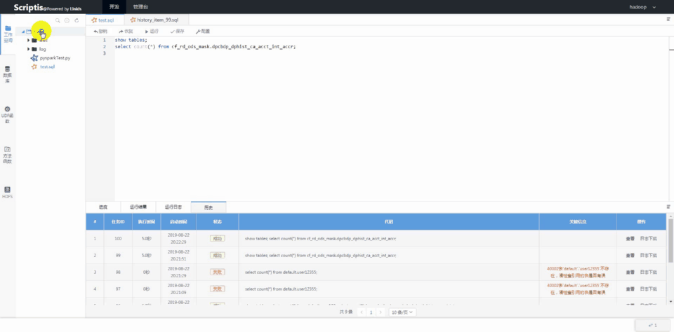
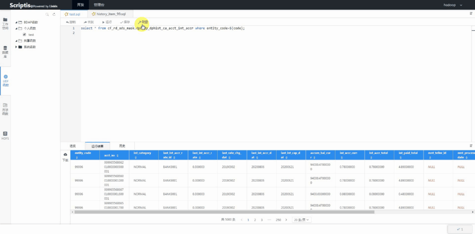
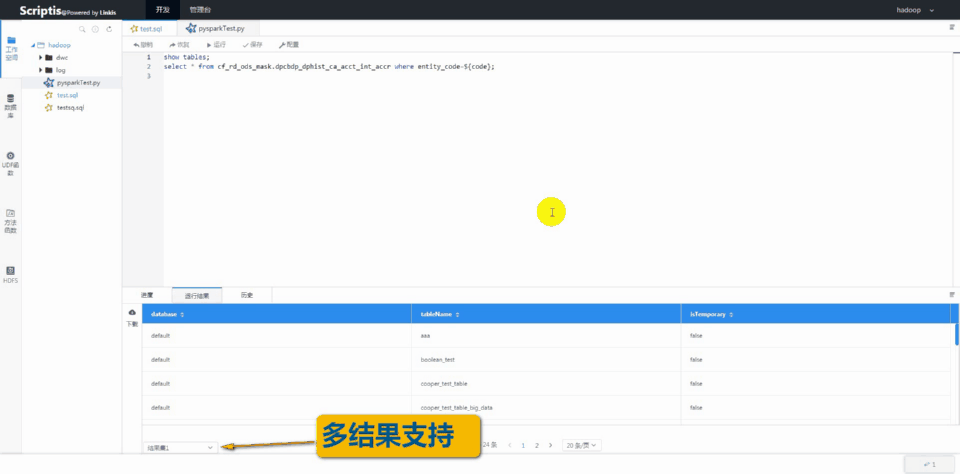
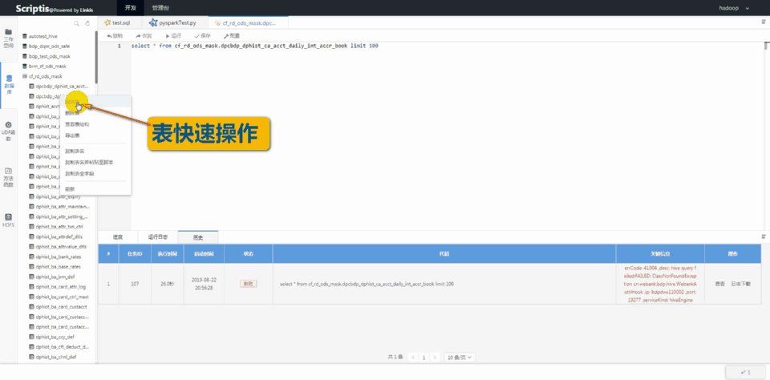
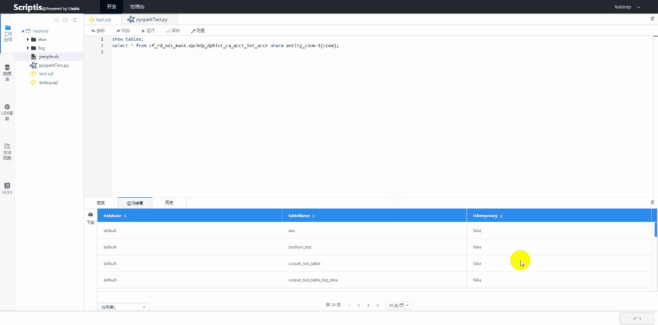

Scriptis
============

[English](../../README.md) | Chinese

## 引言：

Scriptis是一款支持在线写SQL、Pyspark、HiveQL等脚本，提交给**Linkis**（Linkis是什么？[点我了解](https://github.com/WeBankFinTech/Linkis/blob/master/docs/zh_CN/README.md)）执行的数据分析Web工具，且支持UDF、函数、资源管控和智能诊断等企业级特性。

----

## 核心特点：

**脚本编辑**：多语言、自动补全、语法高亮、SQL语法纠错；

**计算引擎**：基于Linkis对接多计算引擎：Spark、Hive、TiSpark等；

**运行时功能**：Job全生命周期展示、错误码；

**上下文**：UDF和函数管理、函数共享、自定义变量；

**结果集**：多结果集支持、结果集别名自定义、结果集一键发布到报表系统；

**数据库**：数据库管理功能、文件（CSV/Excel）快速导入导出到表；

**管理台**：多租户资源管控、引擎参数个性化配置、任务和会话管理。

----

### 同类系统对比：

## 社区
如果您想得到最快的响应，请给我们提issue，或者您也可以扫码进群：

### 文档：
* [部署手册](ch1/前台部署文档.md)
* [前台编译手册](ch2/编译文档.md)
* [快速使用手册](ch3/scriptis快速使用文档.md)
* [使用手册](ch4/Scriptis使用手册.md)
