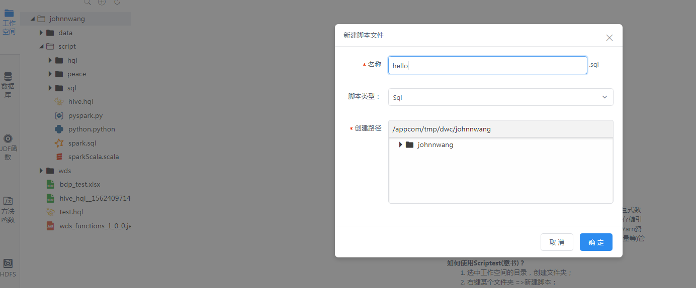
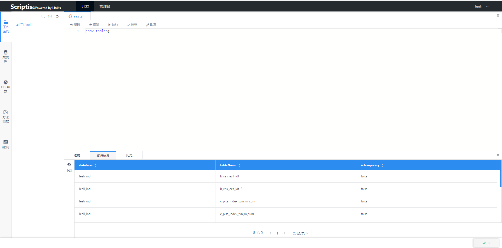

Scriptis快速使用文档
============

## 快速登录
&nbsp;&nbsp;&nbsp;&nbsp;&nbsp;为了方便用户使用，系统默认通过使用Linkis的部署用户名进行登录，比如是hadoop部署的可以直接通过 用户：hadoop，密码：hadoop(密码就是用户名)来进行登录。
首先输入前端容器地址：192.168.xx.xx:8888 接着输入用户名密码：hadoop/hadoop

__备注：__ 其他用户登录必须使用配置的LDAP的密码进行登录

## 设置队列
&nbsp;&nbsp;&nbsp;&nbsp;&nbsp;scriptis的Spark引擎是通过开发-->设置-->yarn队列名-->输入有权限的yarn 队列名

## 创建脚本
&nbsp;&nbsp;&nbsp;&nbsp;&nbsp;设置完队列后，就可以建立一个sql脚本使用SparkSQL进行数据查询，用户只需要输入sql。点击工作空间-个人目录-右键创建sql脚本

1. 创建

2. 建立sql脚本

3. 输入sql脚本

## 点击运行
&nbsp;&nbsp;&nbsp;&nbsp;&nbsp;点击脚本的运行按钮则可以运行脚本，并可以通过日志获悉运行状况

## 结果展示
&nbsp;&nbsp;&nbsp;&nbsp;&nbsp;点击运行后，等待一段时间，第一次运行可能会稍微久点，因为需要启动引擎。运行完成后会将结果进行展示，用户可以对结果进行下载，导出等操作

__详细的使用手册见：__ [使用手册文档](../ch4/Scriptis使用手册.md)

