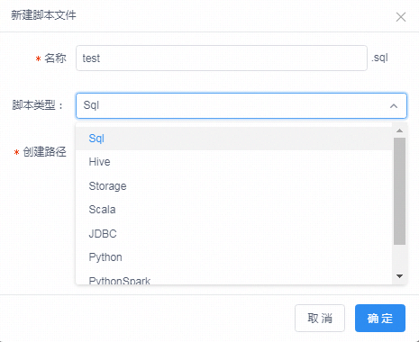
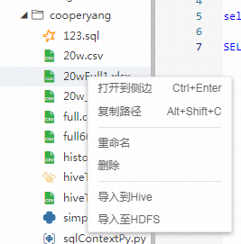
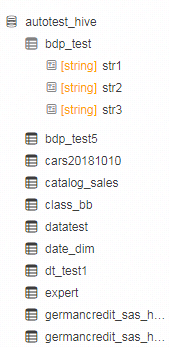
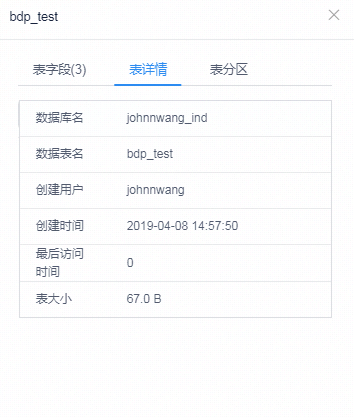
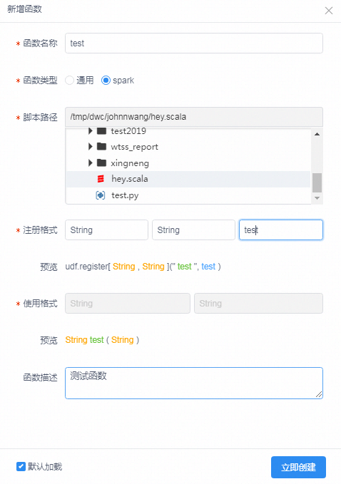
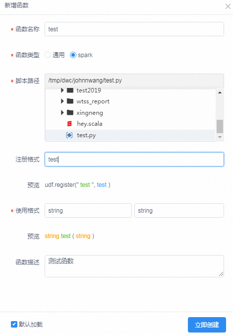
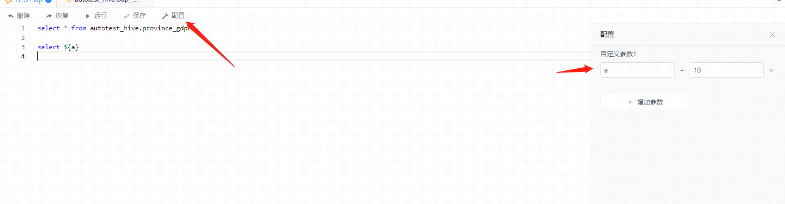
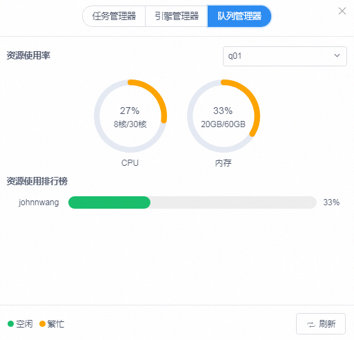

## 1 功能简介


scirptis主要拆分为一下功能：
1. 工作空间：用户存储用户的脚本，数据，日志等文件；支持建立：sql，hive，scala，python，pyspark等类型的脚本；
2. 数据库模块：展示用户拥有权限的数据库和表信息，以及表导入导出；
3. UDF模块：UDF是可以在sql和hql脚本中使用的函数，包括函数管理，勾选加载，共享等；
4. 方法模块：方法是用户自己，系统，共享的自定义函数，支持在python，pyspark，scala脚本中使用；
5. HDFS模块：用户的HDFS（分布式文件系统）个人目录，用于存放大数据文件；
6. 脚本模块：包括脚本编辑，运行，停止，自定义变量配置，快捷键；
7. 运行结果：包括结果展示，下载，导出；
8. 脚本历史：脚本历史展示了该脚本历史运行信息；
9. 管理台：主要包含设置，全局历史，资源管理器，全局变量，常见问题；
10. 右下角弹出框：包含任务管理器，引擎管理器，队列管理器；
下面对这些功能进行详细介绍。

## 2 工作空间

工作空间是一个文件目录，用户对该目录拥有所有的权限可以进行文件管理操作等。建议的目录结构是：script,data,log,res四个目录，目录结构清晰方便用户进行查看和管理。工作空间主要功能如下：
1. 工作空间右键主要包含复制路径，新建目录，新建脚本，刷新

2. 顶上搜索功能，支持对文件快速定位

3. 新建脚本功能支持建立以下脚本

* sql:对应Spark引擎的SparkSQL，语法指导手册：[sql语法指导手册](https://docs.databricks.com/spark/latest/spark-sql/index.html)
* hql：对应的是Hive引擎，Hive语法指导手册：[Hive语法指导手册](https://cwiki.apache.org/confluence/display/Hive/LanguageManual)
* Scala：对应的是Spark引擎的Scala语法，语法指导手册：[Spark Scala指导手册](https://docs.databricks.com/spark/latest/dataframes-datasets/introduction-to-dataframes-scala.html)
* Python：单机Python引擎，兼容Python语法
* PythonSpark：对应的是Spark引擎的Python语法，语法指导手册：[pySpark指导手册](https://docs.databricks.com/spark/latest/dataframes-datasets/introduction-to-dataframes-python.html)
  
* 脚本右键功能，脚本右键主要有打卡到侧边，复制路径，重命名，删除，导入到hive（csv,txt,excel类型文件），导入到hdfs等功能
  

## 3 数据库模块

数据库模块主要有以下功能：
1. 刷库，刷表，刷字段信息

2. 表右键功能--查询表：快捷生产临时hive脚本进行数据查看

3. 表右键功能--查看表结构：展示表的字段详细信息，表详情信息，表分区信息等：

4. 表右键功能--导出表：可以导出为csv和excel等文件


## 4 UDF模块

UDF功能是方便用户对UDF进行分类展示，以及用户可以对个人函数进行管理，共享等。主要包含以下功能：

#### 4.1UDF展示和加载功能

默认顶层目录是：

* 平台函数：平台提供的UDF函数，可以在sql，pysaprk，scala，hive脚本的sql语言里面进行使用
* 系统函数：系统默认已经提供并自动加载了的函数，可以在sql，pysaprk，scala，hive脚本的sql语言里面进行使用
* 个人函数：个人自己新建立的UDF，包含通用函数，Spark专用函数。
* 共享函数：科室管理员建立的UDF函数，并共享给其他人使用
  除了系统函数外，其他类别的函数都必须点击加载后才能进行使用，而且点击勾选后一定要先kill掉已经启动的会话。
  另外勾选加载的UDF，在脚本中也会进行自动补全提示：
  

#### 4.2UDF新增函数功能：

创建一个UDF很简单，主要在于做好前期的UDF代码的准备。步骤主要如下：
1. 建立通用UDF，需要先编译好相应的Jar包。这里的通用是指Hive的hql和Spark的sql都可以用
2. 建立Spark专用的UDF，需要先建立好相应的py脚本或者scala脚本，为了使用的正确性，最好测试下相应的脚本
3. 在开发建立该UDF:
通用UDF：需要勾选通用，并选择对应的jar包路径，填写UDF的全类路径，填写使用格式和描述：

Spark专用--scala脚本：需要勾选Spark，并选择对应的scala脚本，填写注册格式（填写相应脚本中的函数名）：

Spark专用--Python脚本：需要勾选Spark，并选择对应的python脚本，填写注册格式（填写相应脚本中的函数名）：


#### 4.3Scala和Python函数写法：

PythonUDF建立方式，只需要定义一个方法即可，对应的脚本只能与该方法有关的内容：

```
def hello(id):
    return str(id)  +  ":hello"
```

ScalaUDF 建立方式和Python类似，定义一个方法即可：

```
def helloWorld(str:  String):  String  =  "hello, "  + str
```

注意：PythonUDF和ScalaUDF只能在Spark引擎对应的脚本中使用

## 5 方法模块：

方法模块和UDF模块功能类似，只是一个是UDF一个自定义函数。另外需要注意的是：python脚本定义的函数只能在python和pysaprk中使用，scala脚本定义的函数只能在scala中进行使用。

## 6 脚本模块

脚本模块就是脚本编辑框包含的功能，主要有：
1. 脚本编辑：基础的关键字高亮功能，代码格式化，代码合并，自动补全，快捷健等功能。
2. 运行和停止：用户可以选择代码进行执行，也可以直接点击执行运行整个脚本。脚本运行起来后可以通过停止按钮进行停止。
3. 脚本编辑框有配置选项用于定义用户的自定义变量，该脚本内生效


## 7 运行结果

运行结果包括以下功能：
1. 表格结果展示，点击表头可以进行排序，双击复制字段名等，功能会继续丰富，包括选择列展示，展示字段类型。只支持展示5000行
2. 可视化分析：点击可视化分析，可以通过VSBI对产生的结果集进行可视化展示（待开源）
3. 下载：结果集支持直接下载到浏览器本地，支持CSV和excel，只支持下载5000行
4. 导出：结果集导出可以支持导出到工作空间（BDAP的共享目录），结果集导出也支持CSV和Excel格式，并且通过打开全量导出，可以超过5000行的限制。全量导出开关，在执行的sql前面加上注释：`--set wds.linkis.engine.no.limit.allow=true`

## 8 脚本历史

脚本历史展示了该脚本文件的历史运行信息，可以快速找到之前运行的脚本的日志，结果。可以有效减少多次运行相同的脚本：


## 9 管理台

管理台主要包含一下功能：
1. 设置：包含通用设置（如设置队列），数据开发相关引擎的设置：spark，hive，python，pipeline等

2. 全局变量：全局变量是可以用于所有脚本的自定义变量，如果变量重名则脚本中配置的生效。
3. 其他功能：全局历史，资源管理器，常见问题

## 10 右下角弹出框

右下角弹出框点击后是类似于Windows的任务管理器类似的功能，用户可以快速的对任务管，引擎，队列资源进行查看和管理：


